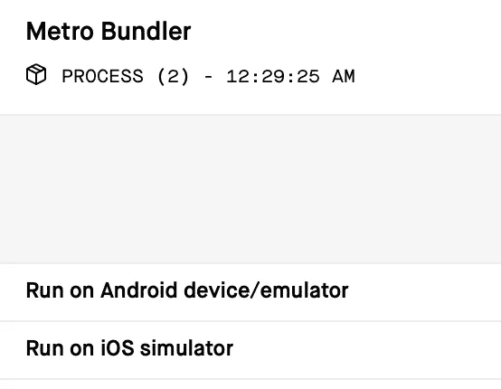

# 用 TypeScript 和 Jest 创建一个最小的 Expo React 本地项目

> 原文：<https://levelup.gitconnected.com/creating-a-minimal-expo-react-native-project-with-typescript-and-jest-5979ab8d7c15>

Expo 现在支持 TypeScript，但是添加 Jest 仍然很棘手。


本文展示了创建一个最小的 Expo 项目的步骤。该项目使用 TypeScript 和 Jest。请注意，此程序基于 Expo SDK31，将来可能会失效。

## 安装 Expo CLI

如[官方文档](https://docs.expo.io/versions/v31.0.0/introduction/installation)所述，让我们安装 CLI 工具。

```
$ npm install -g expo-cli
```

> 注意:我更喜欢使用`npx`，我在我的项目中使用了`npx`，但是`expo-cli`依赖于`@expo/dev-tools`，而`@expo/dev-tools`依赖于老`graphql`。除非您知道可能出现的问题，否则进行全局安装会更安全。

## 初始化项目

首先，简单地使用 Expo CLI 初始化一个项目。

```
$ expo init my-expo-project
```

选择“空白”作为模板。如果完成了，就进入目录。

```
$ cd my-expo-project
```

## 最小化项目

如果你看[关于 app.json](https://docs.expo.io/versions/v31.0.0/workflow/configuration) 的 doc，必填字段是“name”、“slug”、“sdkVersion”，但是我发现“Version”也是必填的。您可以安全地删除开始的其他字段。产生的`app.json`如下。

```
{
  "expo": {
    "name": "my-expo-project",
    "slug": "my-expo-project",
    "sdkVersion": "31.0.0",
    "version": "1.0.0"
  } 
}
```

既然用 TypeScript，就不需要 babel。以下命令将删除它。

```
$ rm babel.config.js
$ npm uninstall -D babel-preset-expo
```

我们还删除了`App.js`(通过`rm App.js`)并创建了`App.ts`。我们希望将文件存储在`src`目录中，而`App.ts`只是一个入口点。

```
import App from './src/App';
export default App;
```

最后，创建`src`目录(通过`mkdir src`)并创建`App.tsx`。最简单的是这样的:

```
import * as React from 'react';
import { Text, View } from 'react-native';

export default () => (
  <View style={{ marginTop: 50 }}>
    <Text>Hello Expo!</Text>
  </View>
);
```

还有一件事。我们需要为 TypeScript 创建配置文件。这些可能会因要求而异，但我希望有一些基于[手册](https://www.typescriptlang.org/docs/handbook/tsconfig-json.html)的最小的东西。本项目的`tsconfig.json`文件为:

```
{
  "compilerOptions": {
    "target": "es5",
    "lib": ["es2015", "esnext.asynciterable"],
    "jsx": "react-native",
    "strict": true,
    "noUnusedLocals": true,
    "noUnusedParameters": true,
    "types": [
      "jest"
    ]
  }
}
```

我们还使用了 [tslint](https://palantir.github.io/tslint/) 并且这个项目的`tslint.json`文件是:

```
{
  "extends": [
    "tslint:recommended",
    "tslint-config-airbnb"
  ],
  "rules": {
    "no-any": true,
    "prefer-array-literal": [true, { "allow-type-parameters": true }],
    "variable-name": [true, "ban-keywords", "check-format", "allow-pascal-case", "allow-leading-underscore"]
  }
}
```

> 这里面包括了我的一些喜好，尤其是`no-any`。想怎么改就怎么改吧。

为了让它工作，我们需要安装 TypeScript 依赖项。

```
$ npm install -D typescript tslint tslint-config-airbnb @types/expo @types/react
```

## 运行应用程序

现在，我们可以通过下面的命令运行应用程序。

```
$ npm start
```

这将在您的浏览器中打开 Expo 开发工具。(如果控制台没有打开，请在控制台中键入“d”。)



Expo 开发工具截图

点击“在仿真器/模拟器上运行”或使用 Expo App 在手机中打开它。你会看到这样的东西。


iOS 模拟器截图

这看起来很小，不是吗？

## 添加笑话

然后我们添加 [Jest](https://jestjs.io) 用于写作测试。让我们安装依赖项。

```
$ npm install -D jest jest-expo ts-jest react-test-renderer @types/jest @types/react-test-renderer
```

棘手的是 jest 配置。到目前为止,“package.json”文件中的以下配置似乎是有效的。

```
 "jest": {
    "preset": "jest-expo",
    "transform": {
      "^.+\\.js$": "<rootDir>/node_modules/react-native/jest/preprocessor.js",
      "^.+\\.tsx?$": "ts-jest"
    },
    "testMatch": [
      "**/__tests__/**/*.ts?(x)",
      "**/?(*.)+(spec|test).ts?(x)"
    ],
    "moduleFileExtensions": [
      "js",
      "ts",
      "tsx"
    ],
    "globals": {
      "ts-jest": {
        "tsConfig": {
          "jsx": "react"
        }
      }
    }
  }
```

这看起来不是最小的，也不是很令人满意。希望能有所改进。至于“全局”部分，请参见[文档](https://kulshekhar.github.io/ts-jest/user/config/#ts-jest-options)了解更多信息。

让我们为 App.tsx 写一个快照测试，这是`src`中的文件`App.spec.tsx`。

```
import * as React from 'react';
import * as renderer from 'react-test-renderer';

import App from './App';

describe('App', () => {
  it('snapshot test', () => {
    const tree = renderer.create(
      <App />,
    ).toJSON();
    expect(tree).toMatchSnapshot();
  });
});
```

我们添加 npm 脚本来简化运行测试，包括类型脚本测试。

```
 "scripts": {
    "start": "expo start",
    "android": "expo start --android",
    "ios": "expo start --ios",
    "test": "npm run tslint && npm run tsc-test && npm run jest",
    "tslint": "tslint --project .",
    "tsc-test": "tsc --project . --noEmit",
    "jest": "jest"
  },
```

这样，我们可以简单地通过以下方式运行测试:

```
$ npm test
```

结果会是这样的:

```
... PASS  src/App.spec.tsx
  App
    ✓ snapshot test (445ms)

 › 1 snapshot written.
Snapshot Summary
 › 1 snapshot written from 1 test suite.

Test Suites: 1 passed, 1 total
Tests:       1 passed, 1 total
Snapshots:   1 written, 1 total
Time:        4.707s
Ran all test suites.
```

## 真实工作示例

在本文中，我们解释了创建一个最小 Expo 应用程序的大致过程。该过程的某些部分可能描述得不够详细，您可能会发现重现它有些困难。下面的存储库是我基于本文所描述的内容的项目。

[](https://github.com/dai-shi/typescript-expo-apollo-boilerplate) [## 戴式/打字稿-博览会-阿波罗-样板

### 为 TypeScript+Expo(React Native)+React Apollo(graph QL)清理样板文件…

github.com](https://github.com/dai-shi/typescript-expo-apollo-boilerplate) 

如果你想尝试一个真实的工作示例，请检查一下。注意，除了 TypeScript 和 Jest 之外，这个样板文件的目标是支持 React Apollo GraphQL 的使用。

[](https://gitconnected.com/learn/react-native) [## 学习 React Native -最佳 React Native 教程(2019) | gitconnected

### 十大 React Native 教程-免费学习 React Native。课程由开发者提交并投票…

gitconnected.com](https://gitconnected.com/learn/react-native)