# 创建模块化加电系统

> 原文：<https://levelup.gitconnected.com/creating-a-modular-powerup-system-b523ec15aed9>

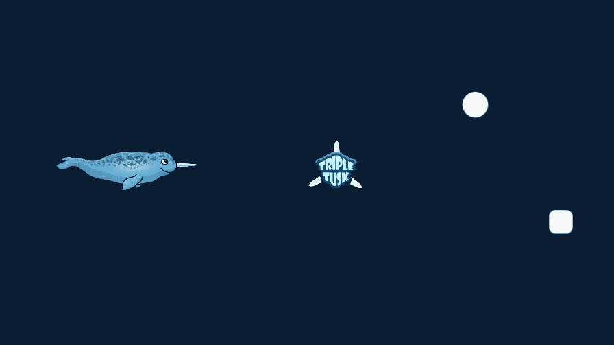

在我之前的文章中，我给我的游戏增加了一个能量，给玩家五秒钟的三次射击能力。我知道我至少会在游戏中加入一些新的技能，比如速度提升和盾牌。随着我在游戏开发中的深入，我可能会决定增加大量的能量。让**单独的**脚本用于每次加电是没有意义的，因为它们都有一个**共享的**动作和死亡碰撞行为。我所需要做的就是**区分**不同的能量赋予玩家什么能力。这可以通过使加电系统**模块化**来实现。这是一条有效的路线，所以让我们开始吧。

我将会用一些简单的游戏对象和调试命令来制作这些新功能的原型，以便在我带来最终的游戏资产之前进行测试。我想准备新的速度和护盾增强，所以我创建了两个新的**空的**游戏对象，并将**精灵渲染器**组件附加到这两个对象上。我选择左边图片上的**旋钮**默认为 2D **圆形**形状，右边图片上的 **UI 精灵**为圆角**方形**形状。这些只是像 3D 图元一样的虚拟资产，所以我真的只是在寻找一些东西来直观地告诉这些对象之间的区别。颜色的变化也会一样好。我还在检查器中增加了这些物体的尺寸，因为这些精灵在默认情况下很小。

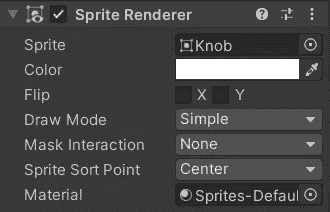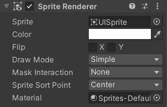

两个精灵都需要一个**盒子碰撞器 2D** 和一个**刚性体 2D** 才能与玩家正确互动。现有的加电**脚本**组件也被添加以完成设置。

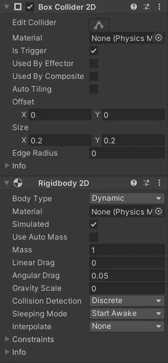

为了使这个加电系统模块化，我打开我的加电**脚本**，并从一个 **int** 变量开始保存我的**加电**，并将其命名为**加电 ID** 。之后的注释作为**引用**存在，表示哪些功率将由哪些数字表示。计数从**零**开始，这是**三连拍**被分配的位置。然后**一个**用于**增速**，两个**用于**护罩**。现在三个电源中的每一个都将有一个 ID 号，可以用来分别引用它们**！****

**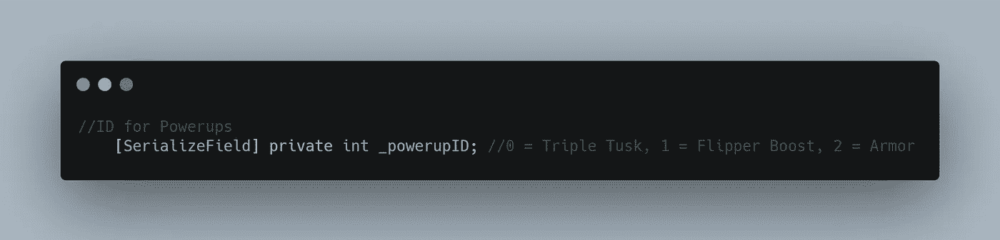**

**在**序列化**字段**和**保存之后，检查器中的每个加电脚本组件将有一个地方**分配**其各自的 ID 号。我在检查器中改变了三倍拍摄的速度，这就是为什么它的速度是 2，而其他的是 3。这里重要的方面是加电 ID 分配号**引用**。**

**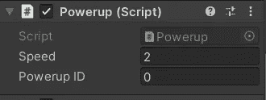****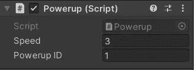****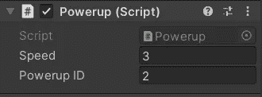

三连击(左)，速度提升(中)，盾牌(右)** 

**我把这些虚拟道具做成**预置**，因为我想让我的产卵管理器在我的最终艺术资产之前玩玩它们。**

**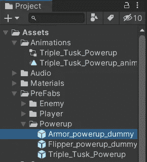**

**在我的更新方法中，所有加电**共享**相同的移动和边界行为。它们都在与玩家碰撞后被摧毁。这就是模块化的意义所在。一个脚本就能统治所有人！**

**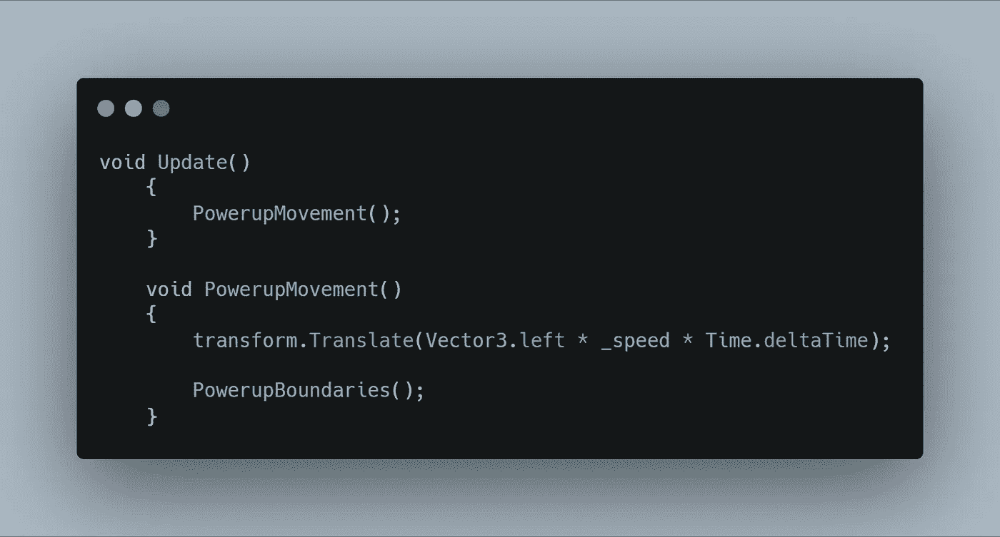**

**在这里，我将第一个 ID 添加到我的三连击中，这是目前我游戏中一个完整且功能齐全的加电。在这两次加电之间最主要的变化是**脚本与**玩家**的通信**，以及它的作用。这些都可以在玩家脚本中处理，所以这里重要的事情是确保我发送了三个消息，每个都来自**正确的**加电。**

**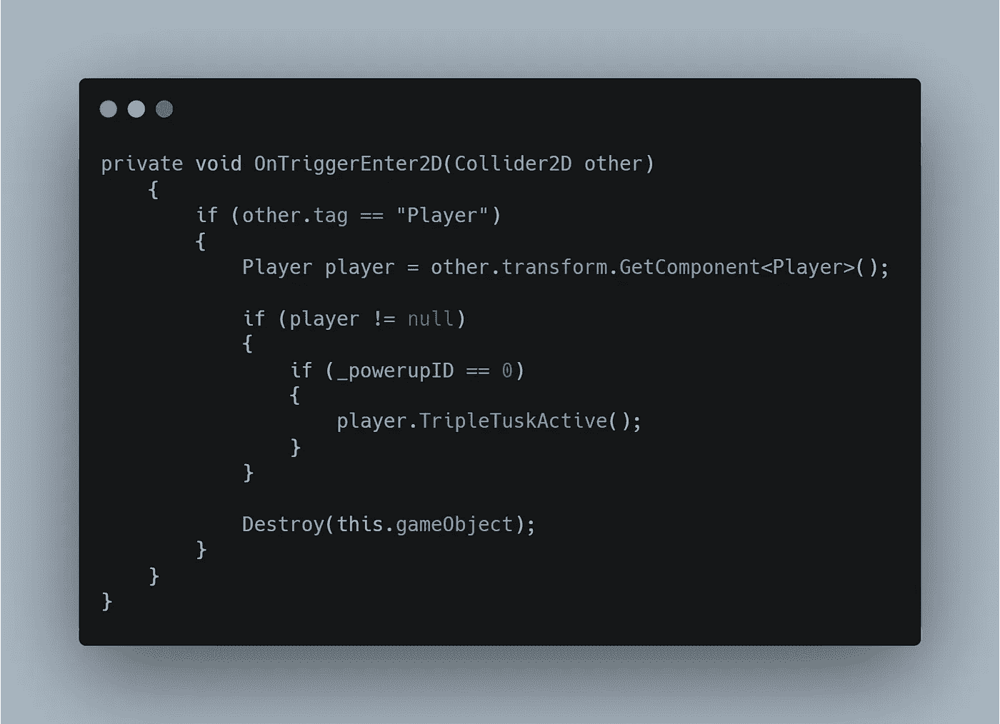**

**这最初是在一个小系列的' **if else** '语句中处理的，我将在下一篇文章中将其整理成一个更精简的 **switch** 语句。这里说的是，如果新分配的加电**等于** (==)零，调用玩家脚本**激活**三连拍。如果**不是**零，而是 1，**激活**加速。由于我还没有在我的玩家脚本中设置这方面的东西，我将使用一个 **Debug** 命令向控制台发送一个**消息**，让我知道一切都**正常工作**。我对三的 powerup ID 也是这样做的，属于盾 powerup。**

**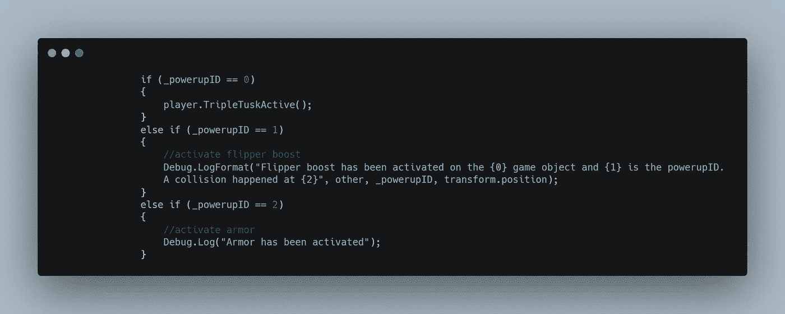**

**我已经有了一个全功能的三重射击，所以我**把预置分配给我的产卵管理器，这样我就可以**像我的敌人一样定期实例化**。****

**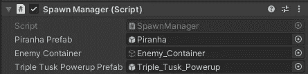**

**这里的问题是，我只是**实例化了三重镜头。在我的下一篇文章中，我将介绍如何转换我的实例化方法，以匹配加电系统的新模块化。我只是先**测试**加电脚本，以确保**功能正常**，所以现在没问题。****

**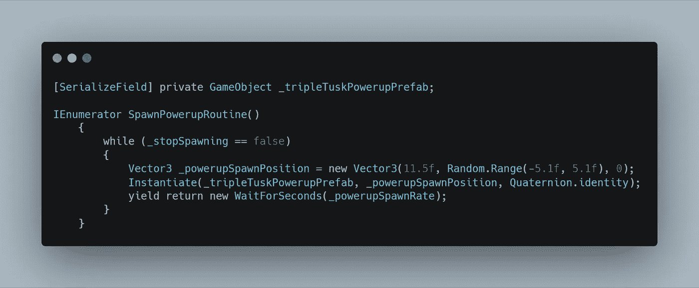**

**我将每个新的虚拟加电拖到我的场景视图中，以测试我的加电 ID 分配和发送的调试消息。**

**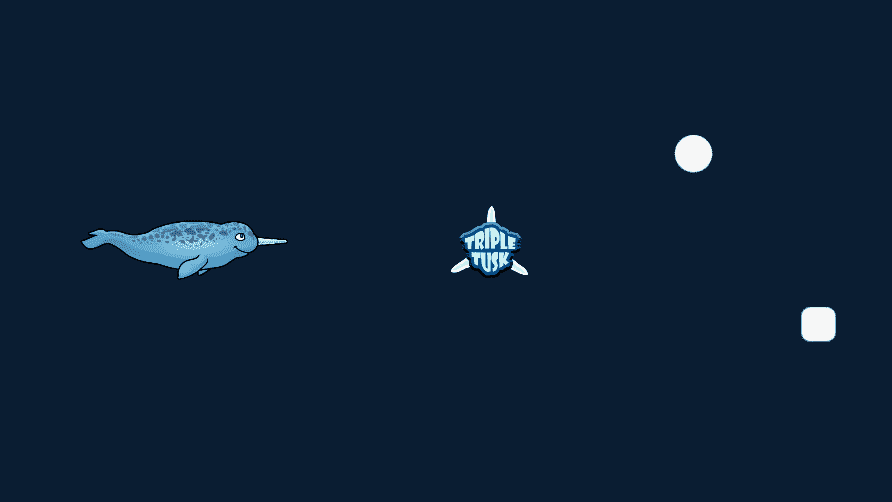**

**如下图所示，玩家激活了脚蹼助推。我还包括了一些其他信息，只是为了好玩，来展示通过碰撞器从另一个对象获取数据是多么容易。看来盔甲也被激活了，所以这是我开始实施下一步的绿灯！在我的下一篇文章中再见，我将完成这些增强并优化脚本。感谢阅读！**

**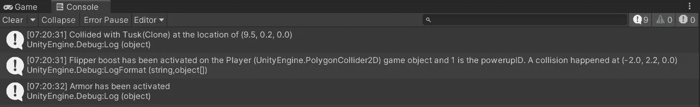**