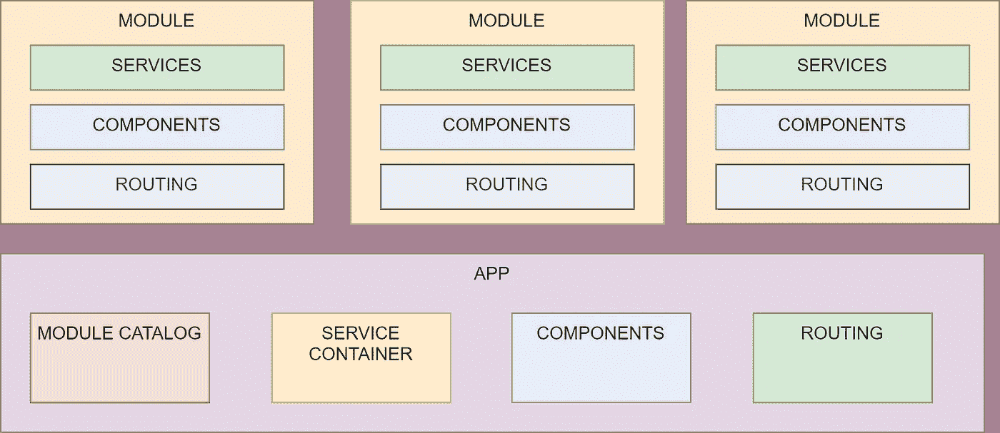

# 使用 Vue.js 创建模块化 SPA

> 原文：<https://levelup.gitconnected.com/creating-a-modular-spa-with-vue-js-e11e200634d2>

## 动态扩展你的应用程序是可能的。学习如何。

SPA 上的开发工作流程相当标准。您将文件添加到代码库中，构建它们，然后在某个地方发布静态输出。这非常简单，但是非常单一(您可以在同一个应用程序中拥有多个模块，但是您基本上是将它们都放在一个不可变的工件中)。

无论如何，如果你想到我们在微前端方面的重大变革，像这样的应用程序很难维护(对于这个概念的新手来说，只要想想在前端应用后端的微服务会发生什么)。许多微前端框架仍然从编译嵌入到单个容器中的多个 SPA 开始，或者以混合所有单个组件然后将它们构建在一起的方式开始。

在本文中，我将展示另一种方法。我将使用动态组件在运行时包含特性，不需要编译步骤。当然，这种方式不能提供完全编译的一些特性(例如输出优化)，但是在一些非性能关键的应用程序中是一个很好的解决方案。


由[格雷森·乔拉蒙](https://unsplash.com/@greysonjoralemon?utm_source=medium&utm_medium=referral)在 [Unsplash](https://unsplash.com?utm_source=medium&utm_medium=referral) 上拍摄

# 建筑

这个应用程序的架构非常简单。我希望有一个分成模块的应用程序，其中每个模块都可以通过一个 HTTP URL 使用(也在不同于主应用程序的服务器中)。每个模块可以包含多个组件，这些组件可以相互交互，发送消息。这些需求可以转化为下一个架构:



主应用程序有一个包，用于托管所有服务并将它们分发到所有模块。同样，它保存模块中定义的所有组件和路由规则。因此，预期的行为是很容易的。应用程序启动，激活模块目录中定义的所有模块，然后从模块中获取所有服务定义，将服务注入到模块中。最后，它加载所有组件和路由定义，以便主应用程序可以将所有特性混合在一起。

# 动态组件

app engine 的核心部分是从文件中动态加载 Vue 组件。我期望的最终结果是能够调用类似于

```
export default  extend("login",{
//..component definition
template: "/path/to/template"})
```

在前面的代码片段中，我有机会指定一个定制的模板路径或者简单地使用一个基于规则的命名约定(template 应该在`/templates/<name of the component>.vue`中)。

下一个代码片段包含了`extend`方法的实现。

既然我们能够激活动态组件，我们只需创建一个模块系统和一个引导机制。让我们在下一节看到它。

# 模块定义

javascript 的模块定义是为我们的动态系统创建模块的良好起点。唯一的问题是每个模块都必须动态加载，即使是通过 HTTP 资源。这可以通过使用关键字`import`作为函数来完成，因此调用类似于`let modulet=await import('path to file')`的东西。这很容易，如果我们给模块一些约定，我们可以调用一些特殊的方法来与模块交互。我说的是注入服务、获取服务定义或者简单地获取模块的路径。下一个代码片段展示了模块原型。

模块引导只不过是 URL 集合和一系列方法调用上的 for-each 循环。请看下一个片段。

```
loadModules =async() =>    {           
  for (const [key, value] of Object.entries(this.config.modules)){
  let module=await import(value);
  this.modules[key]=module.default;         
  }    
};
```

那么很容易想象模块原型上的每个 API 都会有一个调用。在下一个片段中，有一个服务注入的例子。

```
registerServices= async ()=>   {
  for (const [key, value] of Object.entries(this.modules) ){
     if (typeof value.registerServices !== "undefined") {
      await value.registerServices(this.services,this);
     }
  };
};
```

总结模块步骤，我们可以创建任意多的模块，我们可以将它们部署在不同的服务器上，然后，主应用程序将动态地加载它们，而不需要重新编译任何东西。这将允许您的用户在浏览器上点击 CTRL+F5，并立即获得网站的更新版本。由于模块加载是完全动态的，您还可以为每个用户或配置文件定制一个应用程序版本。

# 带什么回家

制作一个模块化的应用程序在很多方面都是可能的。这个手工解决方案加上 Vue.js 和几行代码就是我用来构建 [Api Farm](https://github.com/zeppaman/api-farm) 的，这个无头的低代码平台。

正如您在本教程中了解到的，由于 Vue.js 的灵活性，我们可以在运行时集成模块，并根据功能轻松扩展我们的应用程序。