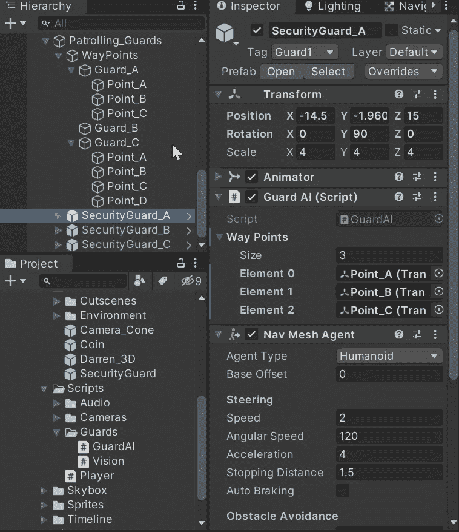
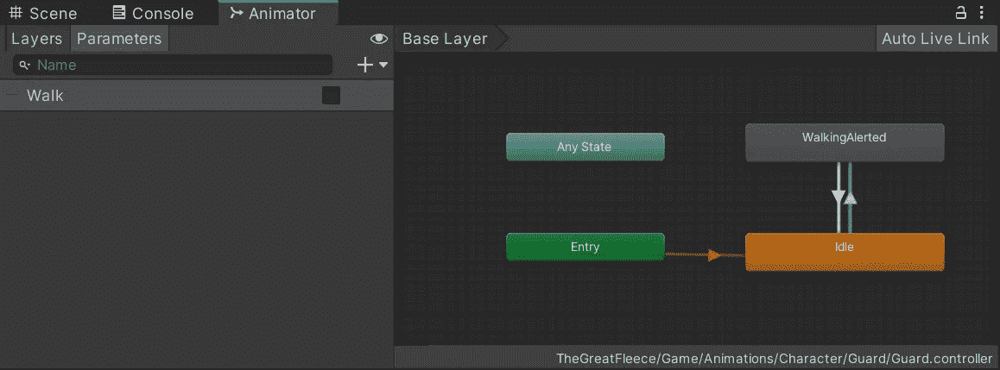
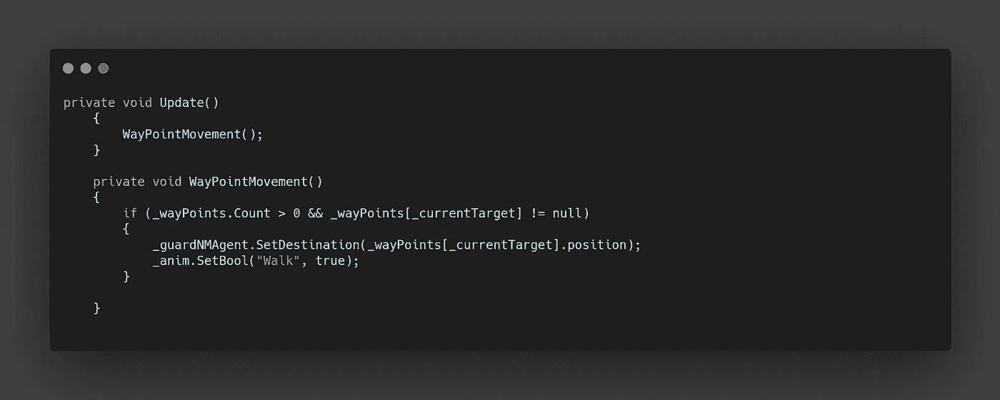
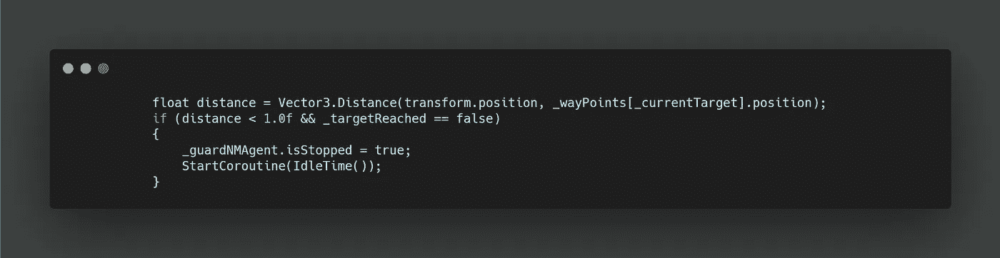
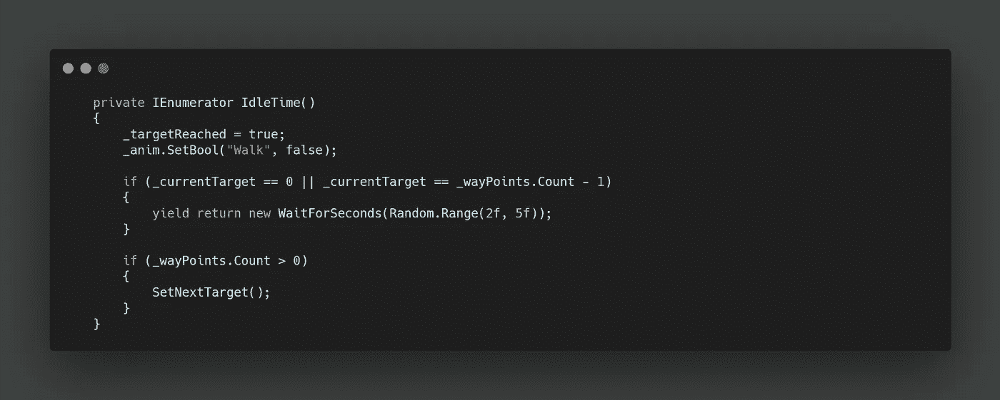
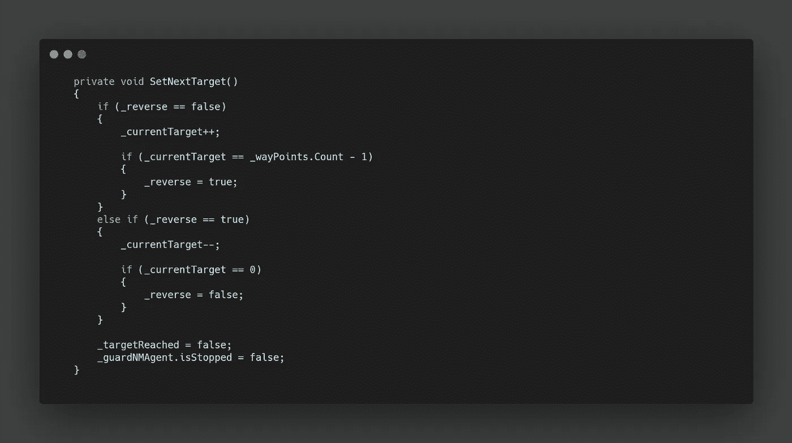
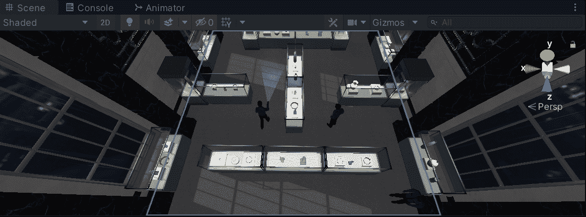
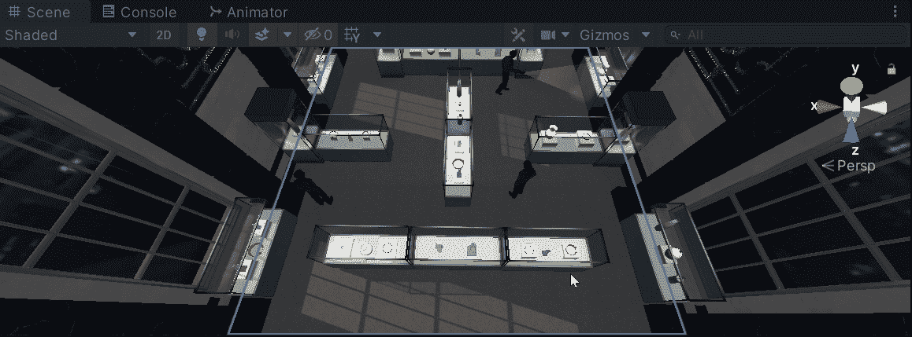

# 在 Unity 中为 AI 创建一个模块化的航点系统

> 原文：<https://levelup.gitconnected.com/creating-a-modular-waypoint-system-for-ai-in-unity-78ecc1c567d2>

在我们的游戏中，我们有 3 个守卫可以偷偷溜过去。目前他们是静止的，让我们写一个模块化的脚本来创建巡逻路线。

给我们的每个守卫增加**导航代理组件**，将允许他们像玩家穿越**设定的目的地一样穿越环境。**不同之处在于，它们不会离开用户输入。

为了创建“路点”，我们可以创建空的**游戏对象**，并将它们的**变换**存储在一个**列表中。**每个保护对象现在可以包含不同大小的**列表**和各种空的**变换**目标，或者根本没有。我们使用一个**列表**而不是一个**数组**来给我们机会在需要的时候通过代码动态地更新路点。

随着每个守卫和他们各自的路点的建立，我们也可以创建一个**动画树**，类似于**玩家的**，在**空闲**和**行走之间通过 **bool** 设置过渡。**

现在说说代码。我们首先需要引用我们的 **NavMeshAgent** 和我们的 **Animator。**然后在**更新中，**我连续调用一个名为 **WayPointMovement 的方法。**

在该方法中，我们首先需要检查航路点列表**是否包含任何转换。这可以防止警卫出现任何错误，因为他们可能还没有航路点，或者只是保持静止。**

然后我们有一个 **int** 值，存储我们当前想要访问的**列表**的编号，如果这是访问一个存在的**转换**，我们可以**将目的地**设置为那个**转换。**然后我们也可以设置**动画师行走布尔**为真。

为了检测何时到达目的地，我们可以使用 **Vector3 模仿我们的**玩家代码**。距离**

如果距离小于 1 个单位，我们可以停止**导航代理**，然后启动一个**协同程序**以在选择下一个目标之前启用一些空闲时间。

在这个**协程**中，我们可以将 target reached bool 设置为 true，以防止上面的代码多次调用它。接下来，我们将 **Walk bool** 设置为 false。

我只希望我的守卫在第一个和最后一个航路点空闲，因此，我们可以在等待随机的秒数之前检查是否有这种情况。接下来，我们调用一个方法来**设置****的下一个目标。**

为了设置下一个目标，我们需要能够双向遍历**列表**，因此，可以使用名为 reverse 的 bool 来检查和设置方向。我们根据这个布尔值来增加或减少**列表**的 **int 值**。然后，我们做一个检查，看看我们是在开始还是结束，并翻转布尔。

最后，我们可以将**目标达成布尔**设置为假，以便让**距离计算**和**空闲协程**重新运行，并另外将**导航代理**的**停止**功能设置为假。

