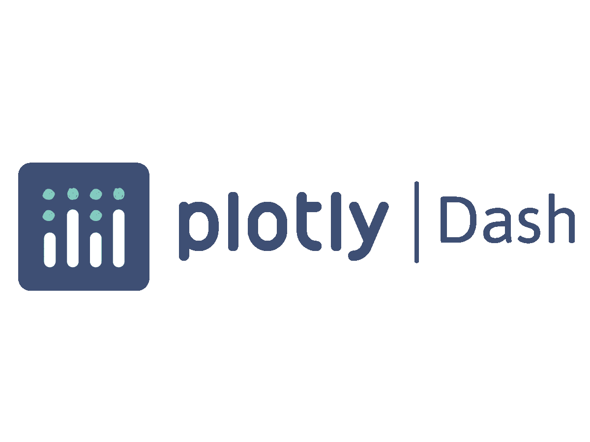
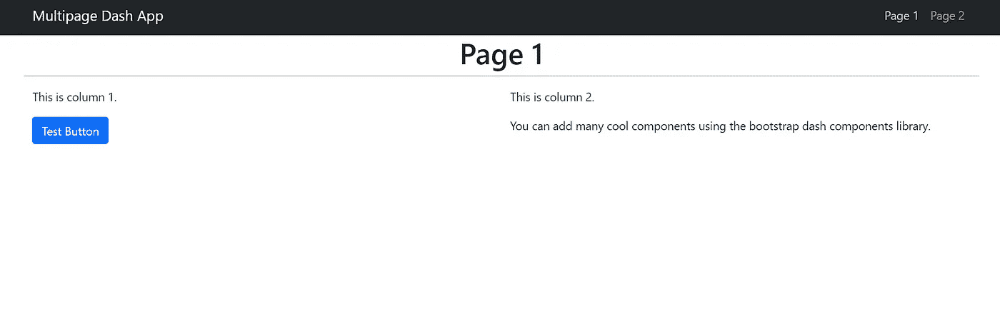
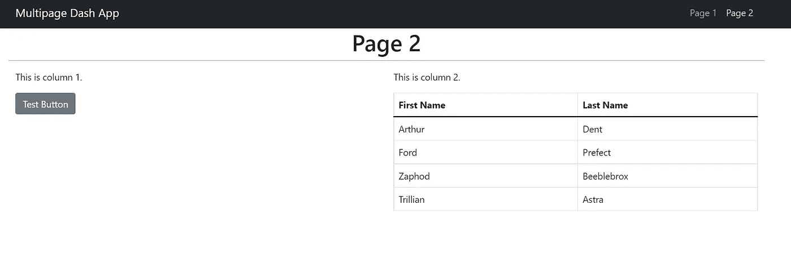
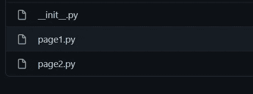
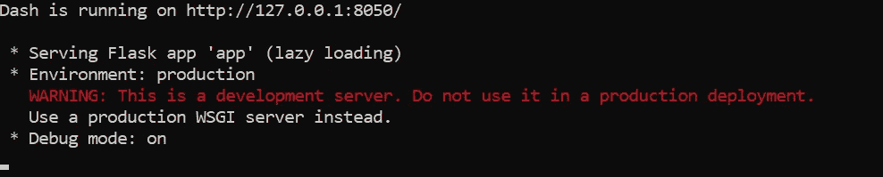

# 创建多页 Dash 应用程序

> 原文：<https://levelup.gitconnected.com/creating-a-multi-page-dash-application-ab38b4b91bf5>


在 [Unsplash](https://unsplash.com?utm_source=medium&utm_medium=referral) 上由 [Carlos Muza](https://unsplash.com/@kmuza?utm_source=medium&utm_medium=referral) 拍摄的照片

## 通过几个简单的步骤构建和部署多页面 Python webapp

在收到我的[上一篇关于使用 Streamlit 创建多页面 webapp 的文章](https://towardsdatascience.com/creating-multipage-applications-using-streamlit-efficiently-b58a58134030)之后，我决定写另一篇关于使用不同框架 **Dash 构建类似 web app 的文章。**

本文将向您介绍 Dash 应用程序，并提供一种使用分页在 Dash 中创建多页应用程序的方法。

# 破折号—简介

[Dash](https://dash.plotly.com/introduction) 是由 [Plotly](https://plotly.com/) 创建的开源 Python 框架，用于构建低代码数据 app。它建立在 Plotly.js、React.js 和 Flask 的基础上，允许用户在没有 HTML、CSS 或 Javascript 知识的情况下创建交互式数据应用和仪表板。这是一个非常有用的工具，特别是对于那些希望在不了解任何 web 开发技术的情况下构建机器学习应用程序的数据科学家来说。



Plotly Dash Logo —图片由 [Rapids AI](https://www.google.com/url?sa=i&url=https%3A%2F%2Frapids.ai%2Fplotly.html&psig=AOvVaw0j8HzA_yRErsSyG-SPbaJ9&ust=1652788995193000&source=images&cd=vfe&ved=0CA0QjhxqFwoTCPiju9H94_cCFQAAAAAdAAAAABAD) 提供

以下部分希望您对 Dash 有所了解，但不会从头开始讲授它的组件。如果你想了解更多关于 Dash 的基础知识，这里有一个[好的教程](https://towardsdatascience.com/dash-for-beginners-create-interactive-python-dashboards-338bfcb6ffa4)可以开始学习。本文将关注分页和部署。我们开始吧！

# 构建应用程序

接下来，这里是包含本教程所有代码的 [Github 库。](https://github.com/prakharrathi25/multipage-dash-app)

## 安装所需的库

对于这个项目，我们将需要`dash`和`[dash_bootstrap_components](https://dash-bootstrap-components.opensource.faculty.ai/).`后者是 Dash 的*引导*组件库，这使得构建具有复杂、响应性布局的风格一致的应用程序更加容易。

```
**pip install dash****pip install dash_bootstrap_components**
```

## 创建导航栏

因为我们正在构建一个多页面应用程序，所以需要一个导航栏来在我们创建的不同页面之间导航。我使用`Bootstrap`通过`dash_bootstrap_components.`构建导航条。`navbar`组件定义在`components`目录中，可以在任何页面中重用。

创建包含两个页面的导航栏

上面代码的输出看起来会像这样。


导航条输出(图片由作者提供)

这个导航栏有两个页面`Page 1`和`Page 2`。它们分别重定向到在`href`参数中定义的`/page1`和`/page2`。

## 定义页面结构

在我们制作了导航栏之后，让我们继续制作我们的页面。`Page1`和`Page2`都位于`pages`文件夹中。在`page1.py`和`page2.py`文件中，我们将定义页面布局，然后在主应用程序中使用。

page1.py 文件的结构



第 1 页的输出(图片由作者提供)

第二页也可以以类似的方式定义。这是它看起来的样子。该页面的代码可以在这里找到[。](https://github.com/prakharrathi25/multipage-dash-app/blob/main/pages/page2.py)



第二页的输出(图片由作者提供)

这些页面可以根据需要进行定制。创建 pages 文件夹并将页面添加到其中后，将一个空的`__init__.py`文件添加到目录中，以将其转换为一个模块，如下所示。



`pages` 目录结构

## 创建 Dash 应用程序

我们还需要定义 Dash main 应用程序，应用程序和其他属性的设置驻留在该应用程序中。因此，我们将创建一个`app.py`文件，并在那里定义 Dash `app`对象。

创建 dash 应用程序

## 将所有内容汇集在一起— index.py

这是所有奇迹发生的地方。我们定义页面结构以及分页，并导入`app`。

索引文件中的这段代码管理我们应用程序的各个页面，并导入运行 Dash 应用程序的`app`。

最后，在本地服务器上运行应用程序

```
**python index.py** 
```

因此，如果您遵循了所有这些步骤，您的应用程序应该可以成功运行，您将会看到类似这样的内容。



成功的应用程序运行(图片由作者提供)

# 结论

本教程结束时，您将拥有一个运行中的多页 Dash 应用程序。你也可以使用像 [Heroku](https://www.heroku.com/) 或 [PythonAnywhere](http://pythonanywhere.com) 这样的工具将它部署到云上。

我在这里写 Python、数据科学和金融。

[](https://towardsdatascience.com/7-must-read-books-for-data-scientists-in-2022-aa87c0f9bffb) [## 2022 年数据科学家必读的 7 本书

### 帮助你成为更好的数据科学家的技术和非技术书籍

towardsdatascience.com](https://towardsdatascience.com/7-must-read-books-for-data-scientists-in-2022-aa87c0f9bffb) [](https://towardsdatascience.com/a-novel-approach-to-feature-importance-shapley-additive-explanations-d18af30fc21b) [## 特征重要性的一种新方法——Shapley 附加解释

### 最先进的功能重要性

towardsdatascience.com](https://towardsdatascience.com/a-novel-approach-to-feature-importance-shapley-additive-explanations-d18af30fc21b) [](/5-new-features-in-python-3-11-that-makes-it-the-coolest-new-release-in-2022-c9df658ef813) [## Python 3.11 中的 5 个新特性使其成为 2022 年最酷的新版本

### 讨论 Python 3.11 中的新特性和更新，以及如何安装 3.11 Alpha 版本

levelup.gitconnected.com](/5-new-features-in-python-3-11-that-makes-it-the-coolest-new-release-in-2022-c9df658ef813)