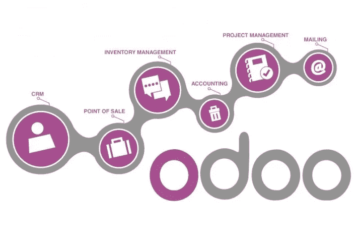

# 在 Odoo 12 中创建新的应用程序

> 原文：<https://levelup.gitconnected.com/creating-a-new-application-in-odoo-12-d05991bf05b0>



在本文中，您将在 Odoo 中创建新的库应用程序。一些 Odoo 模块创建新的应用程序，另一些模块添加功能或修改现有的应用程序。虽然涉及的技术组件大致相同，但一个应用程序应该包含一些特征元素。由于我们正在创建一个新的图书馆应用程序，我们应该将它们包含在我们的模块中。

一款应用应该具备:

*   一个图标，显示在应用程序列表中。
*   一个顶级菜单项，应用程序的所有菜单项都将放在它的下面。
*   应用程序的安全组，以便只为需要它的用户启用它，并在其中设置访问安全性。

要添加图标，我们只需要在模块的`static/description/ subdirectory`中放置一个`icon.png`文件。接下来，我们将处理应用程序的顶层菜单。

# 添加应用程序的顶部菜单项

由于我们正在创建一个新的应用程序，它应该有一个主菜单项。在 CE 上，这在左上角的下拉菜单中显示为一个新条目。在 EE 上，它作为一个附加图标显示在`**App Switcher**`主菜单中。

菜单项是使用 XML 数据文件添加的视图组件。创建`views/library_menu.xml`文件来定义菜单项:

```
<?xml version="1.0"?> 
<odoo> 
  <!-- Library App Menu -->
  <menuitem id="menu_library" 
            name="Library" /> 
</odoo>
```

用户界面(包括菜单选项和操作)存储在数据库表中。前面的代码是一个 Odoo 数据文件，描述了要加载到 Odoo 数据库中的记录。`<menuitem>`元素是在`ir.ui.menu`模型上写记录的指令。

`id`属性也称为 **XML ID** ，用于唯一标识每个数据元素，为其他元素提供一种引用它的方式。例如，在添加库子菜单项时，我们将需要引用它们的父菜单项的 XML ID，应该是`menu_library`。

这里添加的菜单项很简单，唯一使用的属性是`name`。这里不使用其他常用的属性。我们没有设置`parent`菜单项，因为这是一个顶层菜单，我们也没有设置`action`，因为这个菜单项不会做任何事情——它只是子菜单项稍后将被放置的顶层元素。

我们的模块还不知道这个新的 XML 数据文件。为此，需要使用`data`属性在`__manifest__.py`文件中声明它。它是模块在安装或升级时要加载的数据文件列表。将此属性添加到清单的字典中:

```
'data': [
    'views/library_menu.xml',
],
```

为了将这些菜单配置加载到我们的 Odoo 数据库中，我们需要升级该模块。此时这样做不会有任何明显的效果。该菜单项还没有可操作的子菜单，因此不会显示。一旦我们添加了一个，并添加了适当的访问控制权限，以后就可以看到它了。

> **注**
> 
> 只有当有任何可见的子菜单项时，才会显示菜单树中的菜单项。只有当用户有权访问底层模型时，具有打开视图的窗口操作的较低级别的菜单项才是可见的。

# 添加安全组

在普通用户可以使用功能之前，必须授予他们访问权限。在 Odoo 中，这是通过使用安全组来完成的——访问权限被授予组，用户被分配到安全组。

Odoo 应用程序通常提供两个组，一个用户级别，供普通用户使用，一个经理级别，可以访问应用程序配置。

因此，我们现在将添加这两个安全组。与访问安全相关的文件通常保存在`/security`模块子目录中，所以我们应该为这些定义创建`security/library_security.xml`文件。安全组使用类别来更好地组织相关应用程序。因此，我们将从在`ir.module.category`模型中为我们的图书馆应用程序创建一个类别开始:

```
<?xml version="1.0" ?>
<odoo> <record id="module_library_category" model="ir.module.category">
    <field name="name">Library</field>
  </record></odoo>
```

接下来，我们将添加两个安全组，从用户组开始。在`<odoo>`元素中，就在`</odoo>`结束标记之前添加以下 XML 块:

```
**<!-- Library User Group -->**
  <record id="library_group_user" model="res.groups">
    <field name="name">User</field>
    <field name="category_id" 
           ref="module_library_category"/>
    <field name="implied_ids" 
           eval="[(4, ref('base.group_user'))]"/>
  </record>
```

在`res.groups`模型中创建记录，并为三个字段给出值:

*   `name`是群标题。
*   `category_id`是相关 app。它是一个关系字段，所以使用了一个 XML ID 将属性`ref`链接到我们已经创建的类别。
*   `implied_ids`是一对多的关系字段，包含一个组列表，该列表也适用于属于该组的用户。在这种情况下，我们使用代码`4`添加一个到`base.group_user`的链接，这是一个基本的内部用户组。

接下来，我们将创建经理组。它应该给我们授予用户组的所有权限，加上为应用程序管理器保留的一些额外的访问权限:

```
**<!-- Library Manager Group -->**
  <record id="library_group_manager" model="res.groups">
    <field name="name">Manager</field>
    <field name="category_id" 
           ref="module_library_category"/>
    <field name="implied_ids" 
           eval="[(4, ref('library_group_user'))]"/>
    <field name="users" 
           eval="[(4, ref('base.user_root')),
                  (4, ref('base.user_admin'))]"/>
  </record>
```

这里，我们还可以看到`name`、`category_id`和`implied_ids`字段，和以前一样。`implied_ids`设置有链接的图书馆用户组，继承其权限。

我们还设置了`users`字段的值，这样管理员和内部根用户就自动成为应用程序管理员。

> **注**
> 
> 在以前的 Odoo 版本中，`admin`管理员用户也是内部 root 用户。在 Odoo 12 中，我们有一个系统根用户，它没有显示在用户列表中，在需要提升权限时由框架内部使用(`sudo`)。`admin`用户可以登录到服务器，应该可以完全访问所有特性，但是不能像系统根用户那样绕过访问安全性。

我们还需要将这个新的 XML 文件添加到模块的`manifest`文件中:

```
'data': [
 **'security/library_security.xml',**
    'views/library_menu.xml',
],
```

注意，`library_security.xml`文件是在`library_menu.xml`之前添加的。数据文件的加载顺序很重要，因为您只能使用已经定义的标识符引用。菜单项引用安全组是很常见的，因此在菜单和视图定义之前添加安全定义是一种很好的做法。

希望你喜欢阅读这篇文章。如果你想了解更多关于 Odoo 12 的细节，你必须查看 [*Odoo 12 开发要点*](https://www.amazon.com/Odoo-Development-Essentials-development-applications-ebook/dp/B07JPLZVVL?utm_source=https://levelup.gitconnected.com/&utm_medium=referral&utm_campaign=ThirdPartyPromotions) *。* [*Odoo 12 开发要点*](https://www.packtpub.com/business/odoo-12-development-essentials-fourth-edition?utm_source=https://levelup.gitconnected.com/&utm_medium=referral&utm_campaign=ThirdPartyPromotions) *是一个快节奏的指南，探索 Odoo 12 为构建和定制业务应用程序提供的所有新功能。这将帮助您发展技能，在您选择的每个领域中构建高度复杂、性能更高的业务应用程序。*

[](https://gitconnected.com) [## 面向开发人员的编码新闻| gitconnected

### 开发者主页-从 gitconnected 加入编程社区。发现和分享编码新闻，与…

gitconnected.com](https://gitconnected.com)