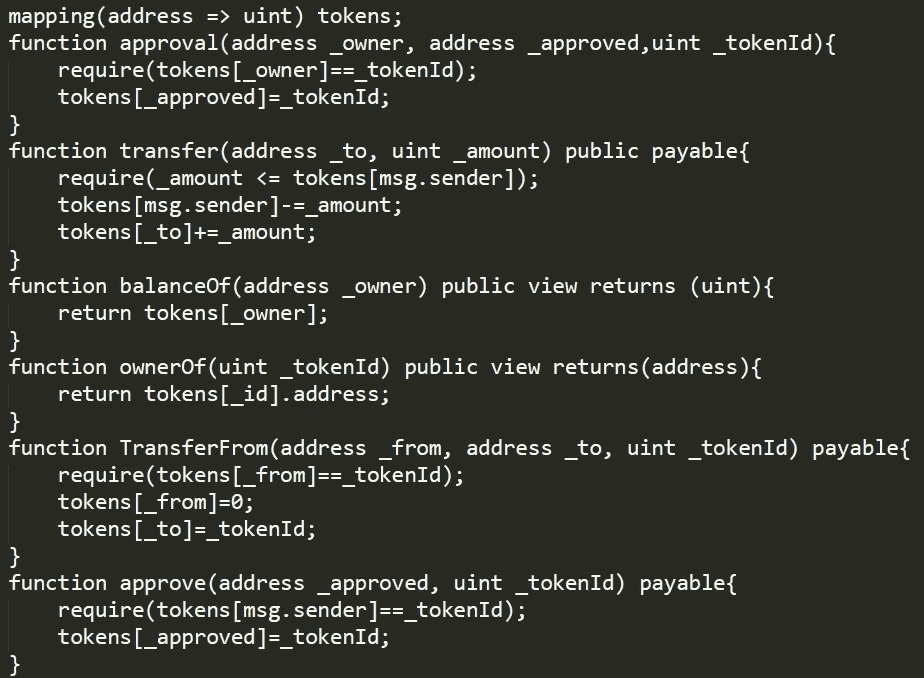
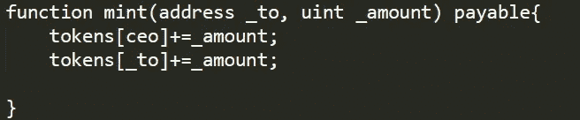
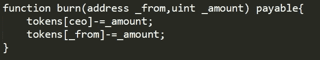
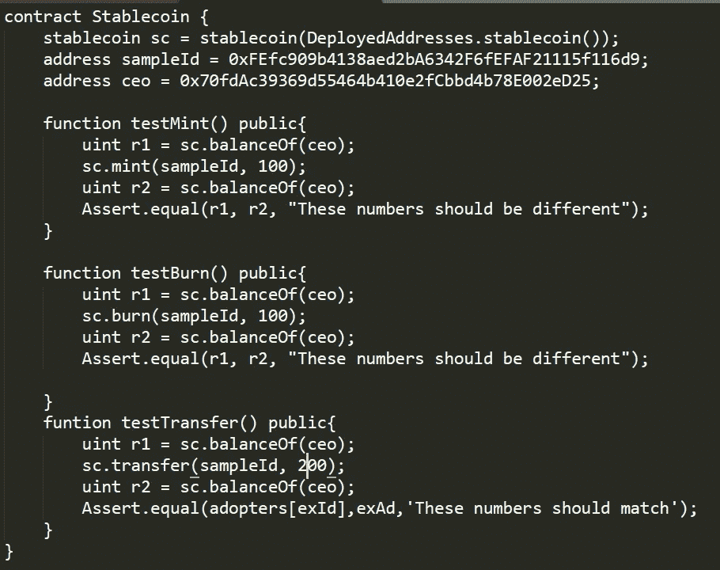

# 创建非抵押稳定币

> 原文：<https://levelup.gitconnected.com/creating-a-non-collateralized-stablecoin-82fb1258647e>

## 用纯数学来支持稳定的货币。

稳定货币是加密货币环境中最重要的组成部分之一。它们对于法定货币和各种加密货币的兑换的稳定性和可获得性至关重要。这意味着，如果人们不愿意，他们不必用比特币等硬币在市场动荡的 10%波动中冒险投资。

有三种主要类型的稳定点:

1.  中央稳定货币，由法定货币如美元或金属如黄金支持。
2.  加密抵押债券，由比特币或以太坊等加密货币支持。
3.  无抵押稳定债券，基本上只有数学支持。

稳定币的一个常见例子是 Tether，它与美元挂钩，这意味着它是一种集中的稳定币。当然，稳定货币带来的唯一不稳定性是如果固定货币的价值下降(例如美元本身的价值下降)。

正如我之前所说，我们将重点关注无抵押稳定债券，以及如何创建我们自己的债券。无抵押稳定债券依赖于智能合约，该合约使用一种叫做*高级股份*的概念来维持 1 的稳定性。

为了实现这一点，除了基本的硬币功能之外，智能合约还有两个主要职责。第一种是在需求减少，硬币价值降到 1 以下的时候烧掉硬币。第二种是在需求增加，硬币价值升至 1 以上时发行新硬币。通过维护这些规则，智能合约确保硬币的价值始终为 1。

出于学习的目的，我们将在以太坊区块链上测试和部署它，所以从技术上讲，它是一个 ERC 令牌，只是因为它易于初学者理解，但主要部分是理解智能合约。我们需要做的第一件事是建立开发环境，这意味着我们需要下载 Node.js、truffle、ganache 和一个好的 IDE——我建议使用 solidity。或者，为了理解智能合约的目的，你可以去 ethereum.remix.org 打开一个 remix IDE。

标准函数示例。

接下来，我们将开始实现硬币的基本功能
，这意味着我们需要几个标准功能，包括`BalanceOf`、`Transfer`、`Approve`等。这些标准并不新，我在我的另一篇文章“创建 ERC721 令牌”中定义了它们，您可以阅读这篇文章。或者你可以看看我的 Github 中这个项目的代码，看看它们是如何工作的，因为它们很容易理解。

现在我们可以开始实现老年人共享功能。为此，我们需要几样东西，一个充当银行的集中账户。
该地址持有所有已发行的硬币，并且是唯一有权焚烧或发行硬币的账户——该地址是智能合约的地址。

接下来我们需要定义两个函数，你可以在以后给它们取更合适的名字，但是为了这篇文章的缘故，我将称它们为`mint`和`burn`。
`mint`功能发行新硬币，看起来像这样:

样本薄荷功能。

`burn`功能销毁硬币，看起来像这样:

样本刻录功能。

样本测试脚本。

在这之后，如果你正在使用 truffle 工具，你可以将它们迁移到本地的区块链，并测试合同，看看它是否真的有效，这是最重要的部分。对于测试，您可以复制这个脚本并执行“truffle test ”,应该会出现所有三个复选标记。

关于如何迁移智能合约并将其部署到以太坊区块链的概述(如果您愿意)，您可以阅读我关于创建 ERC721 令牌的另一篇文章。然而，Stablecoins 并不意味着在其他区块链上运行，因为为了稳定，必须控制整个区块链(除非有其他加密货币支持)。

该测试首先通过购买大量硬币开始，然后调用合约的价值，以查看它是否发行了更多的硬币用于供应，此处的复选标记表明它确实发行了更多的硬币。下一个复选标记表示该合约在出售时也可以燃烧硬币。最后一个检查，以确保硬币转移到不同的地址也不会增加或减少价值。

在此之后，你有一个非抵押稳定币！如果你把它放在一个真正的区块链上，你现在可以随意购买、交易和出售这枚硬币。

这个项目的所有代码都可以在我的 Github 中找到。

[https://github.com/alisyakainth/stablecoin](https://github.com/alisyakainth/stablecoin)