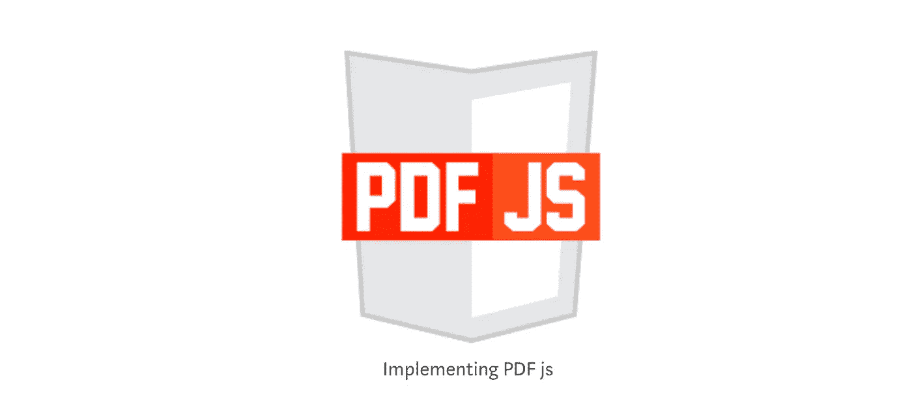

# 用 JavaScript 创建 PDF 查看器

> 原文：<https://levelup.gitconnected.com/creating-a-pdf-viewer-in-javascript-9b988b5ec163>

## 了解如何使用 PDF.js 用 Javascript 创建 PDF 查看器

PDF.js 是由 Mozilla 维护的 JavaScript 库，旨在用 JavaScript 处理 PDF。

实施 PDF js

我们将创建一个具有以下功能的 PDF 查看器:

1.  查看 PDF
2.  转到下一页
3.  转到上一页
4.  转到特定页码

先从[这里](https://mozilla.github.io/pdf.js/)下载 PDF.js 文件。

## 用于呈现 PDF 的 HTML 文件

创建一个新`index.html`文件，在创建过程中:

*   `canvas`→pdf 将在哪里呈现。
*   上一页`button` →转到上一页。
*   下一页`button` →进入下一页。
*   `input`框→输入页码。
*   转到页面`button` →按钮转到特定页面。
*   2 span 元素→显示 PDF 的当前页码和总页数

# 初始化用于呈现 PDF 的 JavaScript 文件

除了`index.html`文件，创建一个`script.js`文件，我们在其中编写 JavaScript 代码来创建一个 PDF 查看器。

首先初始化变量:

现在添加事件侦听器，以便在页面加载后处理 PDF 呈现器:

# initPDFRenderer 函数

*   我们需要用一个源 PDF 初始化 PDF.js
*   我们可以使用`getDocument`方法得到一个承诺，该承诺可以分解为`pdfData`
*   PDF 数据有一个功能`getPage`
*   `getPage`将返回承诺
*   一旦承诺得到解决，我们就得到页面数据
*   然后我们可以使用页面数据中的 render 方法在`canvas`中对其进行渲染

现在当我们调用`initPdfRenderer`时，这会将`pdfData`赋给`pdf`变量。

# 为分页按钮添加事件

为`previousButton`、`nextButton`和`goToPage`按钮添加事件。

# renderPage 函数

现在让我们创建一个`renderPage`函数来将 PDF 页面呈现到画布上:

我们有一个获取`pdfData`和渲染`page`的方法。让我们写我们的`pageRenderingQueue`。

如果用户点击下一页/上一页，它将对`currentPageNum`加/减 1，并将其传递给`renderPageQueue`方法。这将检查`pageRenderingQueue`是否为`null`。如果是`null`，那么我们调用`renderPage`方法，否则把要渲染的页码分配给队列。一旦页面渲染完成，它将检查`pageQueue`是否为空，并在需要时执行相应的操作。

让我们创建一个`renderNextPage`和`renderPreviousPage`方法。
如果用户点击“下一页”，做`currentPageNum + 1`调用`renderPage`。类似地，对于“上一页”，执行`currentPageNum — 1`并调用`renderPage`。我们还需要检查`currentPageNum`是第一页还是最后一页。

现在让我们实现“转到页码”功能。

从输入框中获取页码，然后检查该数字是否是有效数字，并调用`renderPage`方法。

所以最后的代码是:

感谢阅读📖。我希望你喜欢这篇文章。如果你发现任何错别字或错误，给我发一封私信📝谢谢🙏 😊。

关注我 [JavaScript Jeep🚙💨](https://medium.com/u/f9ffc26e7e69?source=post_page-----98efbae5e8aa----------------------)。

**请捐款** [**这里**](https://www.paypal.com/paypalme2/jagathishSaravanan) **。你捐款的 98%都捐给了需要食物的人🥘。提前感谢。**