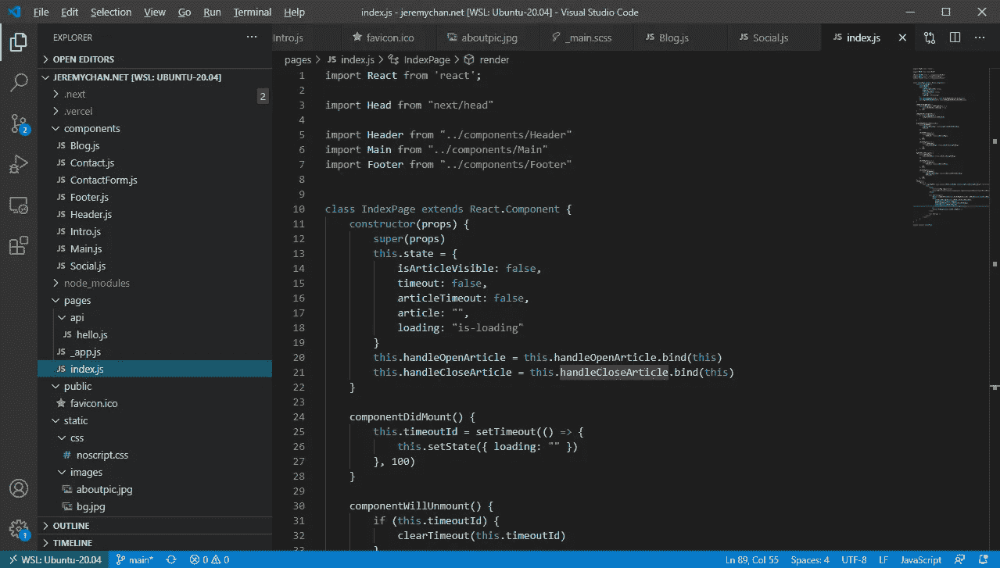

# 几个小时后的 Next.js +无服务器个人网页——开发环境设置(第 1 部分)

> 原文：<https://levelup.gitconnected.com/creating-a-personal-webpage-from-scratch-in-2021-development-environment-part-1-b0b45396da00>

我已经退出个人网页游戏好几年了。以前，我在我的大学网络上主持我的博客。部署是通过 SSH 进行的，很难进行更改。

现在是 2021 年，我的新年决心是开始写博客，并重新创建我的相关个人网页。这几年事情发生了很大的变化。虽然免费将代码部署到互联网上变得越来越容易，但要了解所有这些框架、服务集成和无服务器，以部署像 hello world 这样简单的东西，还需要一个学习过程。在这个系列中，我将记录我在几个小时内从零开始建立[jeremychan.net](https://jeremychan.net/)T2 的所有学习和步骤。

开始之前，我心中有几个目标:
1。我要在这个 max 上花一个晚上的时间(不包括策划内容的时间)
2。我还不准备在主机上花钱，所以将寻找一个免费的解决方案。我希望能够快速进行更改、测试和部署

在晚会结束时，我会说我实现了所有的目标。这确实是一次令人大开眼界的经历，让你知道在 2021 年的生产环境中，你能以多快的速度让某样东西投入运行。

所有系列博客文章的概述:

第 1 部分:开发环境设置(📍你在这里)
[第 2 部分:购买自己的域名并设置邮件转发](https://jeremy-chan.medium.com/creating-a-personal-webpage-from-scratch-in-a-couple-of-hours-getting-a-domain-name-and-email-73a462a4c183) [第 3 部分:使用 Next.js](https://jeremy-chan.medium.com/next-js-serverless-personal-webpage-in-a-couple-of-hours-bootstrapping-the-app-with-next-js-b87d468f9cdc) [引导应用程序第 4 部分:使用 Vercel](https://jeremy-chan.medium.com/next-js-serverless-personal-webpage-in-a-couple-of-hours-deploying-to-production-with-vercel-b35fe5daeaa7) [部署到生产第 5 部分:将您的联系人表单与 Formspree](https://jeremy-chan.medium.com/next-js-serverless-personal-webpage-in-a-couple-of-hours-create-contact-form-with-formspree-5-cb6419f86917) [集成第 6 部分:使用无服务器功能从媒体中提取博客文章](https://jeremy-chan.medium.com/next-js-serverless-personal-webpage-in-a-couple-of-hours-pull-medium-posts-w-serverless-func-6-65855599509d)

# **启动并运行您的开发环境(20 分钟)**

我使用 Windows 已经很多年了，比起 Mac，我仍然更喜欢用它来处理日常事务(稍后会详细介绍)。虽然这些年来事情有了很大的改善(例如 Powershell、Windows 终端等。)Windows 环境对开发者来说仍然不是很友好。

对于 Linux 的 Windows 子系统，这不再是真的。我非常喜欢 WSL2。

如果你使用的是 Mac 或 Linux，你可以跳过这篇文章。

**安装 WSL2】**

为了能够使用 WSL2，您的计算机需要支持 Hyper-V 虚拟化。如果您使用的是较旧的机器，您可能能够使用 WSL 而不是 WSL2，您仍然能够遵循本教程中的所有步骤。

不幸的是，WSL2 的安装步骤并不简单。我不知道为什么微软做了这么好用的东西，却没有提供更友好的用户体验🤷。

https://docs.microsoft.com/en-us/windows/wsl/install-win10[的文档不必要的复杂，我发现](https://docs.microsoft.com/en-us/windows/wsl/install-win10)[的另一个教程](https://www.omgubuntu.co.uk/how-to-install-wsl2-on-windows-10)有更好的后续步骤。

你可以选择你的 Linux 发行版。我选了 Ubuntu。

首先安装一些必要的工具:

```
sudo apt update
sudo apt install git nodejs npm npx vercel
```

**用 WSL 扩展设置 VS 代码**

虽然您可以在 WSL shell 中直接使用 vim 或 emacs，但是您通常希望使用 Windows 主机上的 IDE 来编辑代码。

我通常更喜欢 Jetbrains IDEs，但是 VS Code 提供了与 WSL 更好的集成。对于其他 ide，您必须将项目放在 WSL 内的/mnt/c 中，以便可以在 Windows 中访问它，并且您会遇到路径问题和其他跨操作系统的挑战。VS 代码+ WSL 扩展提供了更加无缝的体验。

按照[https://docs . Microsoft . com/en-us/windows/wsl/tutorials/wsl-VS Code](https://docs.microsoft.com/en-us/windows/wsl/tutorials/wsl-vscode)安装 VS 代码和远程开发扩展包。

一旦一切都设置好了，您就可以将项目目录放在任何地方，只需在项目根目录下运行即可

```
code .
```

在 Windows 宿主中启动 VS 代码并开始编辑。



游戏开始。

在第 2 部分，我们将处理购买域名和设置电子邮件转发的后勤工作。

其他职位:

第一部分:开发环境设置(📍你在这里)
[第 2 部分:购买自己的域名并设置邮件转发](https://jeremy-chan.medium.com/creating-a-personal-webpage-from-scratch-in-a-couple-of-hours-getting-a-domain-name-and-email-73a462a4c183) [第 3 部分:用 Next.js](https://jeremy-chan.medium.com/next-js-serverless-personal-webpage-in-a-couple-of-hours-bootstrapping-the-app-with-next-js-b87d468f9cdc) [引导应用程序第 4 部分:用 Vercel](https://jeremy-chan.medium.com/next-js-serverless-personal-webpage-in-a-couple-of-hours-deploying-to-production-with-vercel-b35fe5daeaa7) [部署到生产第 5 部分:将你的联系人表单与 Formspree](https://jeremy-chan.medium.com/next-js-serverless-personal-webpage-in-a-couple-of-hours-create-contact-form-with-formspree-5-cb6419f86917) [集成第 6 部分:用无服务器功能从媒体中提取博客文章](https://jeremy-chan.medium.com/next-js-serverless-personal-webpage-in-a-couple-of-hours-pull-medium-posts-w-serverless-func-6-65855599509d)