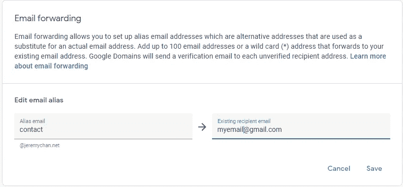
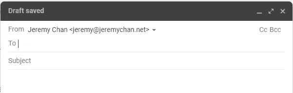

# Next.js +几个小时后的无服务器个人网页——域名和邮件转发(第二部分)

> 原文：<https://levelup.gitconnected.com/creating-a-personal-webpage-from-scratch-in-a-couple-of-hours-getting-a-domain-name-and-email-73a462a4c183>

在所有的事情中，获得域名是这 20 年来没有太大变化的部分。

这是我对整个网页的唯一支出(每年 10 英镑)。

这是我为记录我在一个晚上建立个人网页的旅程而写的一系列文章的第二部分:

[第一部分:开发环境设置](https://jeremy-chan.medium.com/creating-a-personal-webpage-from-scratch-in-2021-development-environment-part-1-b0b45396da00)
[第二部分:购买自己的域名并设置邮件转发](https://jeremy-chan.medium.com/creating-a-personal-webpage-from-scratch-in-a-couple-of-hours-getting-a-domain-name-and-email-73a462a4c183)(📍你在这里)  [第 3 部分:用 Next.js](https://jeremy-chan.medium.com/next-js-serverless-personal-webpage-in-a-couple-of-hours-bootstrapping-the-app-with-next-js-b87d468f9cdc) [引导应用程序第 4 部分:用 Vercel](https://jeremy-chan.medium.com/next-js-serverless-personal-webpage-in-a-couple-of-hours-deploying-to-production-with-vercel-b35fe5daeaa7) [部署到生产第 5 部分:将你的联系人表单与 Formspree](https://jeremy-chan.medium.com/next-js-serverless-personal-webpage-in-a-couple-of-hours-create-contact-form-with-formspree-5-cb6419f86917) [集成第 6 部分:用无服务器功能从媒体中提取博客文章](https://jeremy-chan.medium.com/next-js-serverless-personal-webpage-in-a-couple-of-hours-pull-medium-posts-w-serverless-func-6-65855599509d)

# 设置您的域名(20 分钟)

购买域名时，主要有两点需要考虑:

1.  挑选域名
2.  选择域提供商

**挑选域名**

虽然大多数人使用*的名字*和*的姓氏*的组合，但你可以用这个来创造。如果你的。您也可以查看您所在国家的顶级域名(例如。英国)，或个人网页的通用顶级域名(如。我，。在线)。有一些较新的顶级域名，如。戴夫和。io 在开发人员中越来越受欢迎，并且有更多可用的名称。你可以在[谷歌域名](https://domains.google/)上查看可用的域名。

请注意，如果你决定去一个“书呆子”TLD 喜欢。古鲁还是。dev，有些人可能没有意识到这些都是可能的，你可能会在电话上很难读到你的网址或电子邮件地址。

> 它的姓是点聋，不，它的拼写是 d-e-v，是的，就是它，是的，我确定

**选择域名提供商**

一旦你决定了一个域名，你必须向提供商注册。流行的选择是[谷歌域名](https://domains.google/)、 [Namecheap](https://www.namecheap.com/) 、[甘地](https://www.gandi.net/en-GB)，这些你都不会错。我的经验是，Namecheap 通常在第一年稍微便宜一些，但我更喜欢谷歌域名的界面，定价透明，我相信他们的域名服务器在谷歌基础设施上应该更可靠。

过去，您还必须检查提供商是否对隐私包收取额外费用，以模糊您在 Whois 注册中心的详细信息。在 GDPR 之后，大多数域名提供商都免费提供这项服务，但是在注册之前一定要检查一下。

在附加服务上还有其他细微的区别。例如，一些提供商给你一个免费的登陆页面(我们不需要，因为我们正在建立自己的)或一个电子邮件帐户(通常空间有限，用户界面糟糕)。你真正想找的是免费的电子邮件别名，这样人们就可以在 contact@lastname.com 联系到你，而不必为电子邮件服务付费。谷歌域名、廉价域名和甘地都提供免费的电子邮件别名。

如果你碰巧使用了不提供电子邮件别名的服务，你可以使用第三方转发服务，比如[https://improvmx.com/](https://improvmx.com/)(同样免费)。

**将发送到@yourdomain.com 的邮件转发到您的个人邮箱**

有两种方法可以接收电子邮件。你可以购买支持自定义域名的电子邮件服务(如 Google Workspace、Zoho 等。)，或者您可以将电子邮件转发到您已经有地址的第三方电子邮件服务(例如 Gmail、Hotmail 等)。).

为了省钱，我选择后者。在 Google 域中，你可以通过进入域设置来轻松设置邮件转发，并添加多达 100 个别名。

如果您愿意，您可以使用通配符(*)地址设置并忘记。这基本上会把[anything]@yourdomain.com 转发到你的个人邮箱。

我通常会为不同的目的设置几个别名:

> contact@yourdomain.com->普通信件
> admin@yourdomain.com->网络管理事务(如注册服务)
> inquiries@yourdomain.com->通过联系表单联系您的人

**通过 Gmail 以@yourdomain.com 发送电子邮件**

当人们在*contact@yourdomain.com*联系到你时，如果他们看到回复也来自同一个地址*contact@yourdomain.com*，会显得更专业。如果你为支持自定义域名的电子邮件服务付费，你就不需要担心这个问题。但是，如果你使用的是 Gmail 这样的免费服务。你必须要求 Gmail 的 SMTP 用你的别名发送邮件。

要将 Gmail 配置为从不同的地址发送邮件，您可以按步骤操作[这里](https://support.google.com/domains/answer/9437157?hl=en)。这包括为您的 Gmail 帐户生成一个应用程序密码，并使用它来验证 Gmail 的 SMTP 服务器。完成后，您可以在 Gmail web 界面和移动应用程序中切换别名。

其他提供商可能会提供类似的支持，但你必须检查。

**结论**

现在我们已经准备好了我们的炊具(开发环境)和配料(域名)。在第三部分，是时候做饭了。

[第 1 部分:开发环境设置](https://jeremy-chan.medium.com/creating-a-personal-webpage-from-scratch-in-2021-development-environment-part-1-b0b45396da00)
[第 2 部分:购买自己的域名并设置邮件转发](https://jeremy-chan.medium.com/creating-a-personal-webpage-from-scratch-in-a-couple-of-hours-getting-a-domain-name-and-email-73a462a4c183)(📍你在这里)  [第 3 部分:用 Next.js](https://jeremy-chan.medium.com/next-js-serverless-personal-webpage-in-a-couple-of-hours-bootstrapping-the-app-with-next-js-b87d468f9cdc) [引导 app 第 4 部分:用 Vercel](https://jeremy-chan.medium.com/next-js-serverless-personal-webpage-in-a-couple-of-hours-deploying-to-production-with-vercel-b35fe5daeaa7) [部署到生产第 5 部分:将你的联系人表单与 Formspree](https://jeremy-chan.medium.com/next-js-serverless-personal-webpage-in-a-couple-of-hours-create-contact-form-with-formspree-5-cb6419f86917) [整合第 6 部分:用无服务器功能从介质中提取博客文章](https://jeremy-chan.medium.com/next-js-serverless-personal-webpage-in-a-couple-of-hours-pull-medium-posts-w-serverless-func-6-65855599509d)