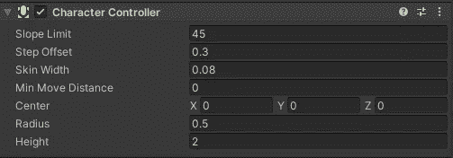
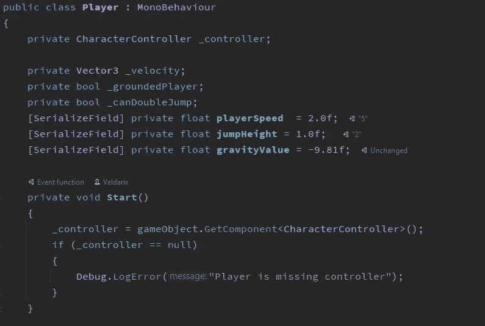
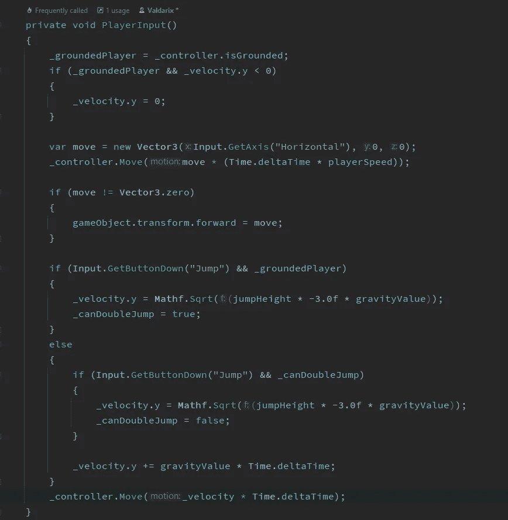

# 在 Unity 中创建基于物理的角色控制器

> 原文：<https://levelup.gitconnected.com/creating-a-physics-based-character-controller-in-unity-61b3830dc042>

扔掉刚体！

内置控制器组件。

谁真的想从头开始编写自己的角色控制器，除非他们也有？我很确定我不知道。我们在游戏中首先要做的事情之一就是让我们的玩家移动起来。对于任何有抱负的开发人员来说，这都是第一个里程碑时刻。那么一个像样的角色控制者需要什么呢？

显然，我们需要它来移动玩家，但我们也需要一些东西来确保玩家可以与他们周围的物理世界互动。我们可以从添加刚体组件和碰撞器开始，然后进入代码让一切工作。但是当 Unity 为我们提供了一个现成的角色控制器时，为什么要重新创建轮子呢？

我们可以将角色控制器组件添加到玩家对象中，并添加一个球体碰撞器。它还有几个我们可以在检查器中调整的属性，三个最重要的是**皮肤宽度、高度和半径**。**最小移动距离**是 Unity 建议离开 0 的另一个设置。您也可以使用**步长偏移**和**斜率限制**来进一步微调控制器。

 [## 字符控制器

### 切换到脚本角色控制器主要用于第三人称或第一人称玩家控制

docs.unity3d.com](https://docs.unity3d.com/2021.2/Documentation/Manual/class-CharacterController.html) 

角色控制器组件附带了两个现成的移动方法[**simple Move()**](https://docs.unity3d.com/2021.2/Documentation/ScriptReference/CharacterController.SimpleMove.html)**和 **Move()** 简单移动方法只需要速度。SimpleMove() 为我们处理了大部分物理问题，所以这不是我们想要的。我们希望 **Move()** 这样我们就可以控制播放器控制器上的物理属性。**

** [## 角色控制器。移动

### 建议更改感谢您帮助我们提高 Unity 文档的质量。虽然我们不能接受所有的…

docs.unity3d.com](https://docs.unity3d.com/2021.2/Documentation/ScriptReference/CharacterController.Move.html)  [## 角色控制器。简单移动

### 建议更改感谢您帮助我们提高 Unity 文档的质量。虽然我们不能接受所有的…

docs.unity3d.com](https://docs.unity3d.com/2021.2/Documentation/ScriptReference/CharacterController.SimpleMove.html) 

使用控制器的玩家移动的示例脚本。

变量

变量和 Start()方法

实际移动代码。

PlayerInput()处理实际的移动

这段代码几乎一字不差地遵循了 Unity 示例代码，它有一点额外的处理跳转。**