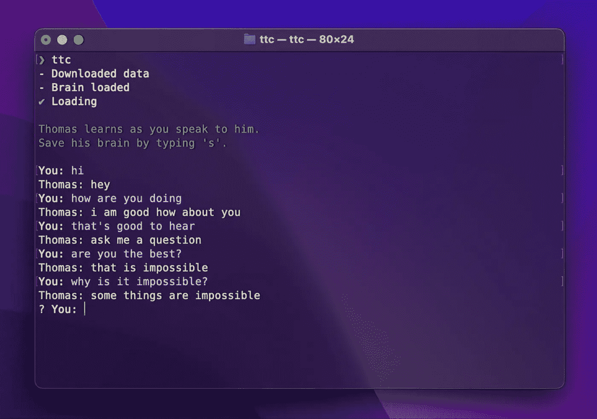
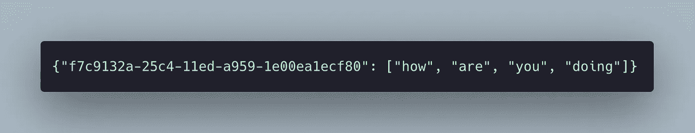
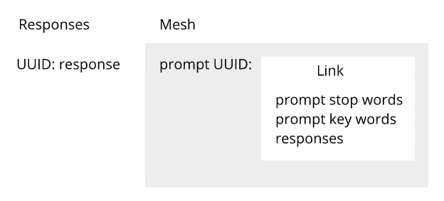
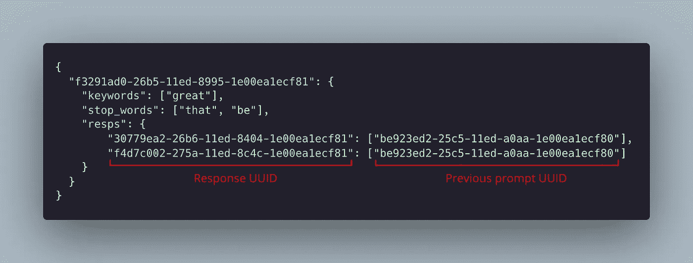
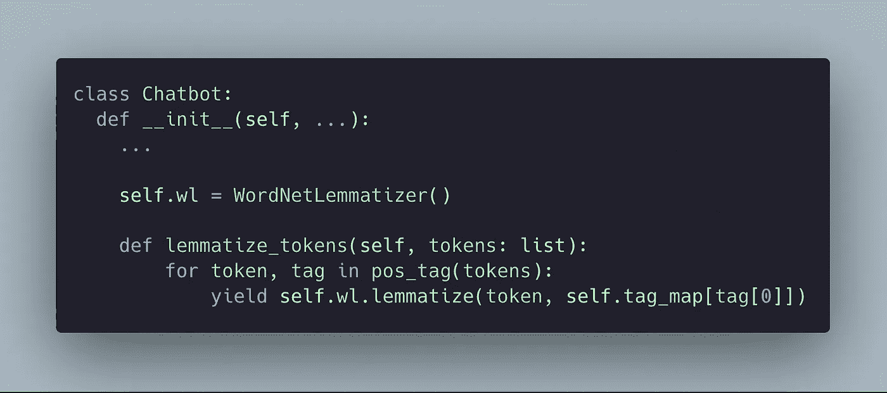

# 创建一个 Python 聊天机器人，当你对它说话时，它会学习

> 原文：<https://levelup.gitconnected.com/creating-a-python-chatbot-that-learns-as-you-speak-to-it-60b305d8f68f>

与聊天机器人托马斯的对话

在过去的两周里，我一直在开发一个名为 Thomas 的开源聊天机器人。正如托马斯在上面的图片中所承认的，这不是“最好”的方法，而是我自己想出来的方法。

你可以在这里 找到 Github 库 [**。**](https://github.com/principle105/thomasthechatbot)

大约两年前，我就有了这个想法。我的目标是创建一个聊天机器人，与我的 [Discord 服务器](https://discord.gg/BehbQbPPzD)的成员进行交互。几天后，我能够拼凑出一个半功能的聊天机器人，可以回复信息——尽管不是很准确。它通过查询类似于从提示到答案的映射中输入的提示来做到这一点。这个系统的主要限制是它只能对类似于映射中的提示做出响应。我不能从词汇上解释或推导句子的意思——两个同义词被视为完全不同的词。

那么，新托马斯是如何工作的？

# 数据存储

托马斯没有硬编码的回应，他被设计成从他的对话中“学习”。因此，他只有他所看到的那么多独特的反应。

## 反应

如前所述，托马斯从他以前看到的反应中学习。以前的响应存储在一个 JSON 文件(`resps.json`)中，作为一个字典，其中的键是一个惟一的 [UUID](https://docs.python.org/3/library/uuid.html) ，值是标记化的响应(稍后将详细介绍)。

**“你好吗”**的响应存储

## 网状物

那么，这和我以前的方法有什么不同呢？好吧，不同于从提示到答案的直接映射的查询，单词模式通过一个“网格”与响应相关联。

让我解释一下:

响应和网格的一般结构

网格由一个字典组成，其中的键是提示的 UUID，值是一个“链接”。链接仅用于将提示的单词模式与一组响应相关联，它具有以下属性:

> `*stop_words: set*` *提示的停止字* `*keywords: set*` *提示的关键字* `*resps: dict[str, set]*` *对提示的响应，其中关键字是响应 UUID，值是来自前一个提示的一组网格 ID。*

网目提示 ***【太好了】***

## 标记和停用词

在标记化之前，文本被小写，缩写被扩展，标点被删除。这个过程有助于提高查询的一致性和准确性，因为减少了不必要的信息。

提示由 word 标记，可以分为两部分:

**停用词**:英语中的常用词
**关键词**:所有其他词按其词性进行词条化

响应存储为令牌列表，而不是拆分为停止和关键字。

## 词汇化

词汇化用于根据单词的含义和上下文来规范化单词。这一过程有助于消除句子中单词含义的任何歧义，从而提高聊天机器人的准确性。

例如:

单词 **"car"** 和 **"cars"** 将被归入同一个基本单词，而 **"studies"** 和**" studies "**将被转换为不同的基本单词，因为它们具有不同的含义。

处理词汇化的代码

# 查询响应

## 忽略响应

用户的提示和聊天机器人之前的响应将被忽略，作为防止聊天机器人出现重复的响应。

## 初始查询

网格最初通过其分数从提示中查询，分数可以通过以下公式计算:

> `*(ss / 2 + sk) / (ts / 2 + tk - ss / 2 - sk + 1)*`
> 
> `*ss*` *=共享停用词* `*sk*` *=共享关键词* `*ts*` *=总停用词* `*tk*` *=总关键词*

通过将`ss`和`sk`除以 2，该公式对共享关键词的权重是停用词的 2 倍。它还考虑了单词的总数，从而得到更精确的网格。

## 丢弃

> ***首先丢弃*** *得分低于阈值的网格(* `*min_score*` *)被丢弃。*
> 
> ***无结果查询*** *如果无结果剩余，网格改为按共享停止字的数量查询。使用共享停用字词的数量来重新计算分数。*
> 
> ***第二次丢弃*** *对剩余网格进行排序，丢弃低于最佳分数的百分比阈值(* `*score_threshold*` *)的网格。考虑多个网格增加了响应的多样性。*
> 
> *如果没有剩余的网格，随机选择一个。*

## 网格关联

网格通过共享响应的百分比彼此关联(`mesh_association`)。找到每个查询网格的关联网格，并将其添加到列表中。该过程防止训练较少的提示具有较小的响应池。

## 选择回应

如果发现响应共享与提示相同的先前消息 [UUID](https://docs.python.org/3/library/uuid.html) ，则所有非共享响应将被忽略。通过这样做，在查询响应时会考虑之前的提示。这使得聊天机器人更加精确，因为它可以解释这样一个事实，即根据上下文的不同，相同的提示可能会引起不同的响应。

> 托马斯:你好吗？
> **你:**好。T21 托马斯:我很高兴你过得很好

从上面和下面的例子中可以看出，Thomas 根据他之前的问题对提示“Good”的回答是不同的。

> 托马斯:你今天的足球比赛怎么样？
> **你:**好。
> **托马斯:**赢了吗？

从剩余的回答中随机选择回答。随机选择使聊天机器人不可预测。

# 结论

正如我之前所说，这远不是创建对话聊天机器人的“完美”方法。尽管如此，我相信这种方法在开发精确的功能聊天机器人方面是有效的，而不需要大量的数据集——仅从对话中学习。

[**Github 库**](https://github.com/principle105/thomasthechatbot)