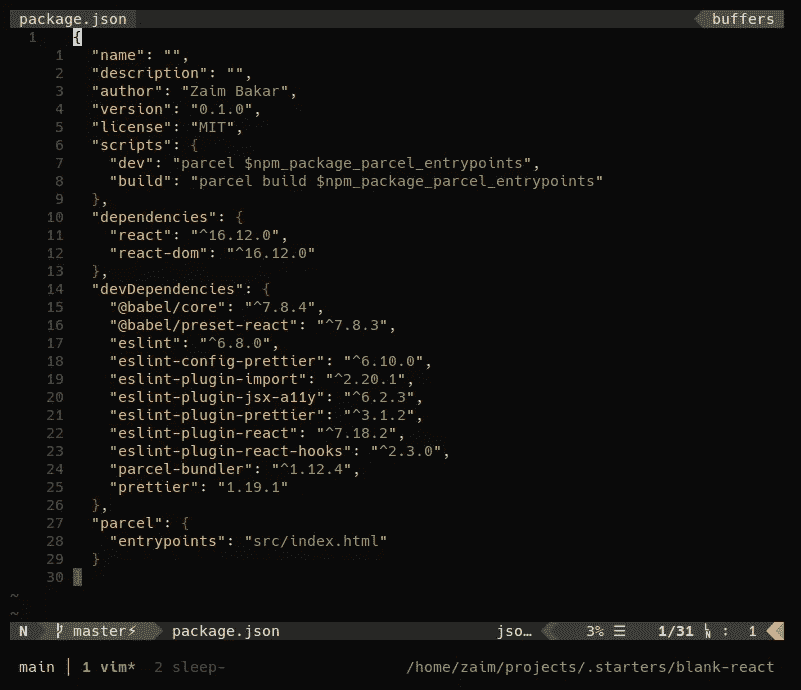

# 使用 Parcel 从头开始创建 React 应用程序

> 原文：<https://levelup.gitconnected.com/creating-a-react-app-from-scratch-with-parcel-a35da9b36086>


菲利贝托·桑蒂兰在 [Unsplash](https://unsplash.com/s/photos/javascript?utm_source=unsplash&utm_medium=referral&utm_content=creditCopyText) 上拍摄的照片

> 这篇文章的灵感来自于 React 官方文档中引用的[编写的【从头开始】React 应用](https://blog.usejournal.com/creating-a-react-app-from-scratch-f3c693b84658)文章 [Jedai 破坏者](https://twitter.com/JedaiSaboteur)。



使用 Parcel 的一个基本 React 开发工具链的整个包。

使用 React 开发应用需要相对复杂的工具链。你需要设置一个编译器，捆绑器，linter 和格式化器。 [create-react-app](https://github.com/facebook/create-react-app) 工具为您简化和抽象了所有这些东西。但这是一种抽象，意味着许多配置和定制选项被隐藏起来或为您处理。有很多原因可以解开这个抽象并自己完成:完全控制配置、学习工具链、OCD 等等。

本文试图概述如何从头开始建立这样的工具链。对于工具链中的每一步，都有几种不同的工具可用，选择哪一种通常取决于您自己的偏好和意见。我在这里选择的工具是我自己的偏好，即:让事情尽可能简单。

我主要扩展 React 官方文档中的[从头开始创建工具链](https://reactjs.org/docs/create-a-new-react-app.html#creating-a-toolchain-from-scratch)一节，这表明一个 JavaScript 工具链通常包括:

*   一个**包管理器**，如[纱](https://yarnpkg.com/)或 [npm](https://www.npmjs.com/) 。它让你可以利用第三方软件包的庞大生态系统，并轻松地安装或更新它们。
*   一个**捆扎机**，比如[网袋](https://webpack.js.org/)或者[包裹](https://parceljs.org/)。它允许你编写模块化的代码，并把它们打包成小的包来优化加载时间。
*   一个**编译器**比如[巴别塔](https://babeljs.io/)。它允许您编写现代的 JavaScript 代码，这些代码仍然可以在旧的浏览器中工作。

我增加了第四个工具:

*   一个**棉绒/格式器**，例如 [ESLint](https://eslint.org) 和[更漂亮的](https://prettier.io)。linter 检查您的 JavaScript 代码的语法或风格错误。然后，格式化程序会自动将您的代码格式化为标准的编码样式。

# 00 | Node.js

首先，不用说，你需要安装 [Node.js](https://nodejs.org) 。从他们的网站下载 Node.js，或者咨询您的操作系统以找到特定于操作系统的软件包。我在这里写的所有命令行示例都使用 Bash(即在类似 unix 的操作系统上，如 Linux 或 MacOS)

# 01 |包管理器

> 一个**软件包管理器**可以让你利用第三方软件包的巨大生态系统，并轻松安装或更新它们。

这里的选择不是 [npm](https://npmjs.com/) 就是[纱线](https://yarnpkg.org)。Npm 是 Node.js 本身捆绑的包管理器。Yarn 是一个软件包管理器，它声称是一个更快、更稳定的选择。让我们保持简单，使用 npm。

## 初始化您的项目

创建一个项目文件夹并在其中运行`npm init`。这将启动几个交互式提示，您可以在其中输入项目名称、描述、版本、作者等。并生成一个`package.json`文件。

```
$ mkdir blank-react
$ cd blank-react
$ npm init
```

此外，创建一个`src`目录，你把你的源文件:

```
$ mkdir src
```

# 02 | Bundler

> 一个**捆绑器**可以让你编写模块化代码，并把它们捆绑成小的包来优化加载时间。

不是[网袋](https://webpack.js.org/)就是[包裹](https://parceljs.org/)。**包裹**看起来是更简单的工具。根据他们的网站，这是一个“极快的，零配置的网络应用捆绑器。”零配置可能是一个误称(在我看来),因为你的`package.json`文件需要增加一点。

```
$ npm install --save-dev parcel-bundler
```

打开您的`package.json`文件，并添加这个字段:

```
{
  ...
  "scripts": {
    "dev": "parcel src/index.html",
    "build": "parcel build src/index.html"
  }
}
```

# 03 |编译器

> 一个**编译器**让你写现代的 JavaScript 代码，它仍然可以在旧的浏览器中工作。

这里只有一个选择，那就是[巴别塔](https://babeljs.io/)。Babel 将您的现代 JavaScript 代码转换成与“旧”浏览器兼容的形式。幸运的是，package 内置了一个默认的 Babel 配置，它使用了 [babel-env](https://babeljs.io/docs/en/next/babel-preset-env.html) 和 [browserslist](https://github.com/browserslist/browserslist) 。

browserlist 目标默认为:`> 0.25%`(意思是，支持每一个拥有总活跃 web 用户量 0.25%或以上的浏览器)。

唯一缺少的是编译 React 特有的东西的配置，比如 JSX。为此，我们只需要安装两个包:

```
$ npm install --save-dev @babel/core @babel/preset-react
```

并添加一个`.babelrc.json`文件:

```
{
  "presets": ["@babel/preset-react"]
}
```

# 04 |棉绒和格式化程序

对于林挺，您可以选择语言级别的静态类型检查(比如 TypeScript 或 Flow)，或者静态分析 linter ( [ESLint](https://eslint.org) )。让我们从更简单的选项开始:用 ESLint 编写普通的旧 JavaScript。

对于代码格式，我选择了[更漂亮的](https://prettier.io/)，因为它有一套开箱即用的默认规则。此外，它还可以格式化许多其他文件类型，如 HTML、CSS 和 JSON。

## 林挺与埃斯林

React 官方文档没有关于如何为 React 开发配置 ESLint 的指南或建议。主要是因为(我猜)create-react-app 工具内置了所有需要的配置。阅读他们的自述文件并浏览他们的源代码，这是我收集到的用普通 JavaScript 和 JSX 编写的林挺 React 应用程序的最基本设置，仅使用内置的推荐设置。

安装这些软件包:

*   ESLint linter 命令行界面。
*   `eslint-plugin-jsx-a11y`:检查 JSX 元素的可访问性规则。
*   `eslint-plugin-import`:检查导入/导出语法，防止文件路径和导入名称拼写错误。
*   `eslint-plugin-react`:反应特定的林挺规则。
*   `eslint-plugin-react-hooks`:当你使用 React 的钩子特性时，执行 React 的钩子规则。

```
$ npm install --save-dev eslint eslint-plugin-jsx-a11y eslint-plugin-import eslint-plugin-react eslint-plugin-react-hooks
```

添加`.eslintrc.js`配置文件:

```
module.exports = {
  env: {
    browser: true,
    es6: true,
    node: true
  },
  extends: [
    "plugin:react/recommended",
    "plugin:jsx-a11y/recommended",
    "plugin:import/recommended"
  ],
  plugins: ["react-hooks"],
  globals: {
    Atomics: "readonly",
    SharedArrayBuffer: "readonly"
  },
  parserOptions: {
    ecmaVersion: 2018,
    sourceType: "module"
  },
  rules: {
    "react-hooks/rules-of-hooks": "error",
    "react-hooks/exhaustive-deps": "warn"
  },
  settings: {
    react: {
      version: "detect"
    }
  }
};
```

## 用更漂亮的代码格式化

对于格式，我们使用[更漂亮的](https://prettier.io/docs/en/index.html)。它是一个独立的 CLI 工具，用于自动将源代码格式化为一致的风格。现在，因为 ESLint 也可以用于代码格式化，我们需要正确地集成 ESLint 和 Prettier，这样它们的规则就不会冲突。

阅读 prettle 关于这个的[文档，设置它是非常简单的。首先，安装更漂亮的和它的 ESLint 插件:](https://prettier.io/docs/en/integrating-with-linters.html)

```
$ npm install --save-dev prettier eslint-config-prettier eslint-plugin-prettier
```

并在`.eslintrc.js`中增加了更漂亮的推荐配置:

```
module.exports = {
  ...
  extends: [
    "plugin:react/recommended",
    "plugin:jsx-a11y/recommended",
    "plugin:import/recommended",
    "plugin:prettier/recommended"    // <-- add this last
  ],
  ...
}
```

现在，要格式化您的代码，使用命令`eslint --fix`，而不是使用 Prettier 的 CLI(下一节将详细介绍)。

# 05 |您的工作流程

典型的编辑-保存-刷新工作流如下所示:

1.  在 Bash 终端中运行命令`npm run dev`。这将启动 package 的开发服务器和热模块更换。
2.  在浏览器中打开您的本地站点(默认为 [http://localhost:1234)](http://localhost:1234)) 。
3.  使用您的编辑器/IDE 添加、编辑`src`文件夹中的源文件。
4.  当您更改和保存文件时，Parcel 将自动刷新浏览器。

## 将林挺/格式与您的 IDE 集成

对于林挺和格式化，您可以在单独的 Bash 终端中手动运行`eslint`和`eslint --fix`。但是这很麻烦，所以有很多 ESLint 和 Prettier 的 IDE 插件可以自动帮你做到这一点。

*   VS 代码:ESL [int](https://marketplace.visualstudio.com/items?itemName=dbaeumer.vscode-eslint) ，[beautiful](https://marketplace.visualstudio.com/items?itemName=esbenp.prettier-vscode)
*   VIM:使用一体化的语法检查器，如 [Syntastic](https://github.com/vim-syntastic/syntastic) 或 [ALE](https://github.com/dense-analysis/ale) 。

## 生产建筑

当您准备好为生产构建项目时，运行命令`npm run build`。你完了！

# 06 |回购

我已经将以上所有内容开源到一个 GitHub [库](https://github.com/zzzaim/blank-parcel-react)。要在您的开发周期中使用这个工具链，我建议不要直接克隆我的 repo，而是使用以下工作流程:

1.  **叉**GitHub 上的回购。
2.  将分叉回购克隆到您的开发计算机中:
    `git clone YOUR_REPO_URL`。
3.  更改任何必要的配置(例如我在`package.json`和`LICENSE.md`文件中的名字)。
4.  每当您想要启动一个新 React 项目时，克隆本地 repo:
    `git clone blank-react my-new-react-app`。

👉**在:**[zzzaim/blank-parcel-react](https://github.com/zzzaim/blank-parcel-react)查看回购

🐦**在推特上打招呼:** [@zzaim](https://twitter.com/zzzaim)