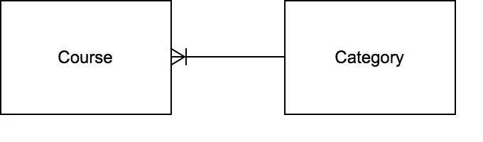

# 用 Spring Boot 创建反应式 Restful APIs

> 原文：<https://levelup.gitconnected.com/creating-a-reactive-restful-api-with-spring-boot-e706954f0633>

在这个故事中，我们想用 Spring Webflux 构建一个反应式 API


马克西米利安·魏斯贝克尔在 [Unsplash](https://unsplash.com?utm_source=medium&utm_medium=referral) 上的照片

# 概观

在这篇文章中，我想展示用 Spring Boot 创建一个反应式 REST API 是多么容易。我想用一个简单的用例来展示用 Spring Boot 创建一个“主动的”非阻塞 REST API 有多快。

在过去的几个月和几个星期里，我一直在开发两个不同的现代移动应用/网络应用。我很快意识到，如果你不得不一直从客户端询问 API 是否有变化，这会非常不方便。你肯定知道你可以通过投票来做到这一点。但是我觉得这样不太雅观。也造成了很多不必要的流量。

一个技术上更好的解决方案是，如果 API 的消费者可以订阅一个端点，这个端点将通知客户端有关更改的信息。

为此，我想使用所谓的服务器发送事件(简称:SSE)。服务器发送事件是一种 HTTP 标准。它允许应用程序处理单向事件流，并在服务器发送数据时接收更新。在这里，我想简单解释一下为什么我选择 SSE 而不是 WebSockets。WebSockets 提供客户端和服务器之间的双向通信，SSE 提供单向通信。然而，WebSockets 不是 HTTP 协议，不像 SSE 那样提供错误处理标准。

# 方案

在我目前自己的项目中，涉及训练者和锻炼平台的实现，我已经实现了一个负责训练课程的微服务。从这个服务中，我以一个场景为例。要考虑的场景非常简单明了。

这个想法是，*用户 A* 可以创建一个新的课程，而*用户 B* 将在不重新加载页面的情况下获得可用课程的更新列表。客户端组件不应该经常轮询服务。

为此，我们需要提供以下端点:客户端可以在其中创建新课程的端点(POST)，允许客户端检索所有现有课程的端点(GET)。当然，最有趣的是:已经讨论过的 SSE 端点，它允许消费者流式传输事件。

> HTTP GET/course
> HTTP GET/course/SSE
> HTTP POST/course

对我来说同样重要的是，我们可以用任何数据库实现这个场景。在另一个服务中，我使用了一个 MongoDB，它已经通过 *ReactiveMongoRepository* 提供了一个反应流实现。这意味着库已经返回了*Mono<T>或*Flux<T>而不是 *T* 或*List<T>。我将在另一篇文章中报告我使用*react memo repository*的经历。***

在目前的服务中，我希望能够使用任何关系数据库，如 MySQL、SQL Server 或 PostgreSQL。在我目前的项目中，我使用 PostgreSQL 数据库和嵌入式 H2 数据库进行测试。为了简单起见，在这个例子中我使用了一个嵌入式 H2 内存数据库。但是如前所述，数据库技术不应该在这里发挥作用。基本上任何 SQL 数据库都可以使用。

在本文中，我们想更深入地了解如何使用 Spring WebFlux 让 RestController 发布反应流。

# 准备项目

本文的整个项目可以在 [GitHub](https://github.com/bluvolve-dev/reactive-course-service) 上获得。

为了使用 Publisher 实现— *Flux* 和 *Mono* ，我们需要为 Spring WebFlux 添加依赖项。这个框架在内部使用项目反应器。

```
<dependency>
    <groupId>org.springframework.boot</groupId>
    <artifactId>spring-boot-starter-webflux</artifactId>
</dependency>
```

它支持两种编程模型“基于注释的反应式组件”和“功能路由和处理”。

让我们从依赖 spring-boot-starter-webflux 开始，它包括了所有其他必要的依赖。

我还在项目中使用了以下 Spring Boot 入门包:

```
spring-boot-starter-web
spring-boot-starter-validation
spring-boot-starter-data-jpa
```

以及以下依赖关系:

```
<dependency>
  <groupId>com.h2database</groupId>
  <artifactId>h2</artifactId>
  <scope>runtime</scope>
  <version>1.4.199</version>
</dependency>
<dependency>
  <groupId>org.modelmapper</groupId>
  <artifactId>modelmapper</artifactId>
  <version>2.3.8</version>
</dependency>
 <dependency>
    <groupId>org.projectlombok</groupId>
    <artifactId>lombok</artifactId>
    <optional>true</optional>
</dependency>
```

因此，项目应该已经基本准备就绪，可以运行了。

在项目结构中，我喜欢遵循领域驱动设计的原则。这意味着项目的结构应该由领域驱动，而不是由技术方面驱动。如上所述，我们希望在这个微服务中，或者如用例中所描述的那样，关注聚合*过程*。这意味着我们需要一揽子“课程”。

我为什么要这么做？嗯，我把“课程”包看作是一个集合。这些包中的所有实体、值对象和域服务都是具有精心设计的一致性边界的集合。

现在，我不会在这里用*领域驱动设计*来深入领域驱动项目结构的话题。我将为这个主题专门写一篇文章。

所以让我们创建一个新包“course”和一个名为“CourseController”的 RestController。

首先，我们实现一个简单的测试端点，它给我们一个字符串来检查应用程序是否正在运行。

```
@RestController
public class CourseController {
    @GetMapping("/")
    public ResponseEntity<String> get(){
        return ResponseEntity.*ok*().body("Course Service is running.");
    }
}
```

现在启动服务。默认情况下，它运行在端口 8080 上。curl 命令应该返回字符串“课程服务正在运行”。

```
curl http://localhost:8080
```

# 实施课程汇总

现在，让我们首先为课程聚合创建所有必要的实体和域服务。我们需要一个课程实体，包含几个属性，如标题，描述，持续时间等。每门课程必须归入一个类别。因此我们也需要范畴实体。领域服务提供方法并封装对知识库的访问，包含领域逻辑，例如如何创建课程实体的知识。



让我们最终开始编码。在包 *course* 中创建一个 Java 类“Category”和相应的 JpaRepository 接口，如下例所示。

类别实体和持久性作为课程聚合的一部分。

…然后当然是在同一个包中的 Java 类“课程”和相应的存储库。

作为课程集合一部分的课程实体和持久性。

将创建实体，并通过 JpaRepositories 澄清数据的持久性。现在让我们来关注一下域服务，它基本上包含了关于实体的知识，并且是逻辑层次上的一部分。

首先，我们希望创建 CategoryService。

这个服务实现包含两个方法。通过目录的 ID 返回目录实例的人。另一个以 dto 的形式返回所有类别的列表。第一个是我们稍后从 CreateCourse 命令创建新课程时需要的。

因为在创建课程时必须指定类别，所以我们现在负责创建初始类别。我们在应用程序准备就绪时这样做，并用 *ApplicationListener* 对事件 *ApplicationReadyEvent* 做出反应。

只有在不存在条目的情况下，我们才会这样做。因此，我们创建了一个实现 *CategoryInitializer* ，我将它放在一个名为 *utils* 的新包中。

如果我们现在启动应用程序，如果还不存在条目，那么在启动时会自动创建条目。在当前使用嵌入式 H2 In-Mem DB 的配置中，每次重新运行应用程序时都会发生这种情况。

现在让我们创建 *CourseService* ，它包含一个创建新课程的方法。在我们的例子中，这个方法本身并不引人注意。接受 *CreateCourse* 命令，创建并保存一个新的课程实例。为了将给定的命令转换成实体，我使用了一个映射器来保持代码的干净和清晰，并避免在方法中使用许多*设置器*。映射器的实现(不是很壮观)可以在 [GitHub](https://github.com/bluvolve-dev/reactive-course-service) 库中看到。
有趣的是第 33 行，这里使用*application event publisher*创建并发布了一个名为 *CourseCreated* 的 *ApplicationEvent* 。作为源对象，我用 even persisted *Course* 对象初始化事件。此时，也可以只添加*课程* ID，稍后在监听器实现中检索对象。

课程服务实现—创建课程发布应用程序事件

为了保持聚合的清晰，我通常在聚合中构造一些东西。对于命令、事件、事件处理程序和处理器，我在聚合中创建自己的包。命令是通常由客户端通过外部边界(即 REST 控制器)发送的数据类。该类的名称总是遵循相同的语法，例如 CreateCourse。对象本身包含客户端发送创建实体的请求所需的所有信息。

我们现在创建我们的第一个命令。为此，我们在 package course 中创建另一个命令包，并在里面创建一个新的命令类 *CreateCourse* 。

如 *CourseService* 实现所示，方法 *createCourse* 接收并处理命令。如果处理成功，则创建并发布一个事件。

这里*课程的实现创建了*。事件的命名也遵循定义的语法。对于事件，我在课程聚合下面创建了一个名为 *events* 的新包。

# 创建静止控制器

在包课程中，我们现在创建我们的端点，这允许客户端从外部访问我们的域。从技术上来说，我们认为这是 REST 控制器。控制器提供不同的 HTTP 操作。请注意，没有域对象越过此边界。输出数据对象被映射到所谓的数据传输对象(简称:d to)。这些都是没有逻辑的简单对象，它们只包含数据，从 REST 的角度来看基本上代表资源。现在我们使用那篇文章开头已经创建的控制器 *CourseController* 。
我们添加了一个新的 POST 操作，它提供了新课程的创建:

```
@CrossOrigin
@PostMapping("/course")
ResponseEntity<UUID> addCourse(@RequestBody @Valid CreateCourse command){
    *log*.info("Create new course request received. [title: {}]", command.getTitle());

    try{
        Course course = this.courseService.createCourse(command);
        return ResponseEntity.*created*(URI.*create*("/course/" + course.getId().toString())).body(course.getId());
    }catch(Exception e){
        *log*.error(e.getMessage());
        return new ResponseEntity<>(HttpStatus.*INTERNAL_SERVER_ERROR*);
    }
}
```

这个端点接受一个与 CreateCourse 命令中定义的结构相匹配的 JSON。

{
"title": "Outdoor Bootcamp "、
"description ":"高强度户外体重训练"、
" categoryId ":" d443c 190-dc4b-47e 8–8490-c 8011844 C7 aa "、
" createdByUserId ":" 02065 d66–8f 85–4892-af53-a 09163 a 466 a 6 "、
"duration": 60

为了测试这个命令，可以使用 cURL 完成下面的调用，例如。当然你也可以使用像 [Postman](https://www.postman.com/) 这样的 UI 工具。

$ curl-H " Content-Type:application/JSON "-X POST-d ' { " title ":" Outdoor boot camp "，" description": "My description "，" categoryId ":" 17d 928 Fe-ac2c-4817–84fd-0830766 fefb 1 "，" createdByUserId ":" 02065d 66–8f 85–4892-af53-a 09163 a 466 a6 "，" duration": 60 }' [http](http://localhost:4500/course)

在下一篇文章中，我们将在 Next.js 客户机中使用这个 API。

请注意，回复正文中提供的类别 ID 必须确实存在于可以创建课程的数据库中。
要么从应用程序日志中复制 ID。我们记得我们在启动时创建类别。或者为控制器提供另一个类别 GET 端点。您可以在本文的 [GitHub 资源库](https://github.com/bluvolve-dev/reactive-course-service)中找到这个端点的代码。

让我们简要总结一下我们迄今为止所做的工作。我们已经构建了课程集合，实现了域对象和持久性，以及端点作为我们的域的入口点。
我们现在可以使用 REST API 创建新的课程，如果成功，我们的服务实现将发布一个应用程序事件。

那么我们还遗漏了什么？正确！事件监听器和 SSE 端点的实现允许客户端订阅课程事件流。

# 实现服务器发送的事件端点

我们需要一个处理器来接收和处理 *CourseCreated* 事件。为此我们创建了一个名为*CourseCreatedEventProcessor*的类，它实现了*application listener<T>、*和*Consumer<flux sink<T>>*。 *ApplicationListener* 要求实现 ApplicationEvent 上的方法*。消费者需要实现 *accept()* 方法，该方法执行注入的执行器。*

请记住，我们已经在开始时添加了依赖关系*spring-boot-starter-web flux*，我们现在将使用它。

我们将与通量一起工作。我们使用 *create()* 方法创建一个非阻塞流。create 方法接受一个*flux sink<T>消费者。每个用户现在接收一个 *FluxSink* 的实例来发射元素。这意味着，只要调用了 *sink.next()* ，就会发出一个新元素。*

现在让我们看看控制器的实现。Flux.create()初始化是控制器构造函数的一部分。我们还需要注入一个用于创建 Flux 实例的 *CourseCreatedEventProcessor，*实例。

```
private final Flux<CourseCreated> events;

public CourseController(CourseService courseService,
                        CategoryService categoryService,
                        CourseCreatedEventProcessor processor,
                        CourseMapper mapper) {

    this.events = Flux.*create*(processor).share();
    ...}
```

在*CourseCreatedEventProcessor*中，当接收到 *CourseCreated* 事件时，监听器的 *accept()* 方法的调用被启动。处理器实现本身负责将事件推送到调用*接收器*的流。*下一个()*。

唯一缺少的是我们的服务器发送的事件端点。在这里。

这里我们唯一要做的就是使用映射器将 CourseCreated event 映射到 DTO。如果您愿意，也可以将事件发送给客户端，而不是 DTO。

```
@CrossOrigin()
@GetMapping(value = "/course/sse", produces = "text/event-stream;charset=UTF-8")
public Flux<CourseDto> stream() {
    *log*.info("Start listening to the course collection.");
    return this.events.map(event -> {
        CourseDto dto = this.mapper.entityToDto((Course) event.getSource());
        return dto;
    });
}
```

因此，订阅客户端能够在新数据可用时立即对通知做出反应，而不会造成阻塞。

为了测试它现在是如何工作的，必须执行服务。
打开两个端子。其中一个将调用端点[http://localhost:8080/course/SSE](http://localhost:8080/course/sse)。现在客户端基本上已经订阅了流。
如果在第二个控制台中发出上面显示的创建新课程的命令，输出将在第一个控制台中。

也可以看演示短片。

尽情体验吧！

在下一期，我将把这个 API 连接到 Next.js UI 客户机。那么从用户的角度来看，该效果将是可见的。

请同时阅读如何在 SSR Next.js 页面上使用[该端点。](/reactive-spring-boot-api-with-next-js-client-b08147ae5712)

你可以在 GitHub 上找到完整的项目。欢迎反馈！