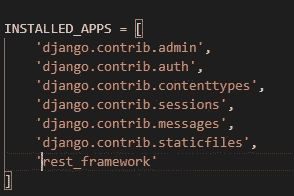
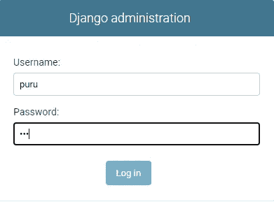

# 用 Django Rest 框架创建食谱 API。

> 原文：<https://levelup.gitconnected.com/creating-a-recipe-api-with-django-rest-framework-6c2512d71d5b>

## 如何借助 Django 和 Python 创建一个简单的 Recipe API？


费萨尔·米在 [Unsplash](https://unsplash.com?utm_source=medium&utm_medium=referral) 上的照片

拥有一个跨平台无缝执行 CRUD 的 API 非常重要。在这个时代，为应用程序和网站等各种平台提供单一数据源是必不可少的。

Django 让我们能够在最短的时间内创建 API，同时保留 Python 的通用性。我们可以在几分钟内创建带有全功能仪表板的 API。最重要的是，它有一个带有管理员登录的 GUI，如已经内置的身份验证添加用户。

在这篇文章中，我们将能够创建一个简单的食谱应用程序，可以通过 POSTMAN 或任何其他 URL 调用来使用。

* *详细信息和实际文档的免责声明。[姜戈文件](https://docs.djangoproject.com/en/3.1/topics/)

## 创造环境

创建 API 需要的东西:

1.  [Python 3+](http://.https://www.python.org/downloads/)
2.  Git Bash (或者 Powershell)
3.  [Visual Studio 代码](https://code.visualstudio.com/)或任何你喜欢的文本编辑器

但首先，我们需要创建一个隔离的虚拟环境。

虚拟环境是一种工具，通过为不同项目创建隔离的 Python 虚拟环境，有助于保持不同项目所需的依赖关系分离。这是大多数 Python 开发人员使用的最重要的工具之一。

以下命令用于设置和激活。

在您的任何首选驱动器中为此环境创建目录。

```
mkdir /C/”your project”cd /C/”project”
```


现在您在项目目录中。是时候建立虚拟环境了。

如果你正在使用 Python 2，尽管这并不是你的首选。

```
python -m virtualenv djangoapi
```

否则，如果在 Python 3 中，使用。

```
python -m venv djangoapi
```

现在激活虚拟环境。

```
**In Windows****Source venv/scripts/activate****in Mac** **source bin/activate**
```

您可以看到安装在环境内部的包。您可以使用 **pip 冻结进行检查。**到目前为止，您不会看到任何已添加的包列表。


接下来，我们安装我们需要的所有依赖项。然后您应该运行 pip freeze 来查看更改。

```
pip install Djangopip install Djangorestapi
```

一旦您成功安装了所有的依赖项，它应该看起来像这样。


# 开始项目

一旦我们成功安装了 Django，就该创建我们的 recipe 项目了。Django 通过给出一系列预定义的命令，让我们的生活变得更加轻松。您可以使用“启动项目”命令来

```
django-admin.py startproject djangoapiproject
```

现在点击 **ls** 查看目录。


现在我们的项目目录已经创建好了。

我们现在可以转移到文本编辑器，我的偏好是 Visual Studio 代码。

选择您的指定文件夹在我的情况下，这是

C/Djangoapi/Djangoapi 项目

在我们可以迁移所有的依赖项之前，我们需要首先查看它们是否都列在 settings.py 中。



既然我们已经添加了应用程序列表，现在我们可以迁移依赖项了。

```
winpty python manage.py migrate
```

您将看到所有的管理依赖项都被迁移到 manage.py 中


现在，manage.py 文件将成为我们项目的焦点。
查看修改成功安装。

```
python manage.py runserver
```

您可以通过转到 localhost:8000 来观察下面的活动项目


现在我们准备创建我们自己的第一个 API。

# 用 Startapp 制作我们的食谱 API。

我们要做的下一件事是创建一个新的应用程序，使用启动应用程序模块。运行命令:

```
python manage.py Startapp recipe.
```

这将创建您自己的 Django 应用程序。


现在我们有了这个应用程序设置，然后我们可以继续为我们的 API 创建 URL。我们的目录中没有 urls.py 文件，请从 Djangoapiproject 目录中复制它。

一旦您复制了文件，您还需要修改 Djangoapiproject 中的 urls.py 文件。它需要指向配方文件夹中的那个。

添加**路径:path(')，include('recipe/urls.py ')。**

这一行命令 URL 重定向到我们在根文件夹被调用时创建的 URL。为此，您必须随路径一起导入 include。如下图。


现在返回到菜谱中的 urls.py 文件，进行相应的修改。删除 URL 模式，我们将在以后为我们的 API 添加我们自己的 URL。


# 管理和数据库

为了创建数据库和存储数据，我们需要登录到我们创建的 Django 应用程序的管理面板。要创建可以登录并创建数据库的用户，我们可以运行:

```
 winpty python manage.py createsuperuser
```


它会带你通过一个表格，你可以提交一个用户名和密码。然后启动服务器并登录到 localhost:8000/admin。



您将看到各种东西，如您创建的用户配置文件和您管理的数据库。

## 建立模型。

然后我们需要修复我们的数据库。最好是像配方名称、创建过程、花费时间等字段。

Django 通过使用模型来实现这一点。

模型的定义。

创建一个模型

创建一个文件 model.py，并为模型声明一个类。在这里，我们将它声明为一个食谱。

```
from django.db import modelsclass recipe(models.Model)://declaration of class //diffeerent fields name = models.CharField(max_length=400) ingriedient = models.CharField(max_length=1000) time=models.IntegerField() process= models.CharField(max_length=2000)//function to return the name of record as name def __str__(self): return self.name
```

一旦你创建了这个模型。您将需要以数据库架构的形式迁移您的更改。在 Django，我们使用 SQL。

对于此迁移，运行以下命令。

```
python manage.py makemigrations recipepython manage.py migrate
```

现在，这些迁移更改将在您的管理面板中可用。你将会看到 Django 的美妙之处，因为你可以执行 CRUD 操作而不用编写任何代码。


我添加了一个虚拟数据来测试你可以添加任何你喜欢的对象的逻辑。


# 传送数据和添加视图。

在高质量的 Web 应用程序中，干净、优雅的 URL 方案是一个重要的细节。Django 允许你随心所欲地设计 URL，没有框架限制。

Views.py 文件控制 Django 中的数据流。我们需要调用模型，并将其数据准备为 JSON。为了将模型数据转换成 JSON，我们使用了一个叫做序列化器的概念。欲了解更多详情，请访问文档。

若要创建序列化程序，请创建单独的文件 serializer.py

```
from rest_framework import serializersfrom .models import recipeclass RecipeSerializer(serializers.ModelSerializer): class Meta://to create the JSON fields model = recipe fields = ('id','name','ingriedient ','time','process')
```

现在我们有了 JSON 格式的 DB 字段。我们只需要创建一个视图来输出数据。把路线加到这里。

## 创建视图

view 函数，或简称为 *view* ，是一个接受 Web 请求并返回 Web 响应的 Python 函数。这个响应可以是网页的 HTML 内容、重定向、404 错误、XML 文档或图像。。。或者别的什么，真的。视图本身包含返回响应所需的任意逻辑。这段代码可以放在任何你想放的地方，只要它在你的 Python 路径上。

转到 View.py 并根据需要修改代码。您需要调用序列化程序。

```
from django.shortcuts import renderfrom rest_framework import viewsetsfrom .models import recipefrom .serializer import RecipeSerializerclass RecipeView(viewsets.ModelViewSet): queryset= recipe.objects.all()//spit out all the fields serializer_class= RecipeSerializer
```

既然我们已经有了自己的观点。我们可以把我们的路线加进去。添加 routed 将决定当用户从 API 请求时必须检索视图的 URL。

为此，我们转到 views.py 并添加 URL_pattern 的路径。

我们需要创建一个默认路由器，然后注册我们将要定义的路由。

```
from django.urls import path,includefrom . import viewsfrom rest_framework import routersrouter = routers.DefaultRouter()router.register('recipe',views.RecipeView)//registering routers.urlpatterns = [ path('',include(router.urls)),]
```

现在我们已经为视图设置了路径，让我们运行服务器来查看我们所做的实时更改。

前往 **localhost/8000/recipe。**你将默认显示它一个 get 请求的数据。


在选项菜单中，您可以看到我们可以执行的所有 CRUD 操作。如果您需要选择特定的数据，您可以只输入 URL 并添加一个斜杠 id 号来检索单个记录。

您现在将能够执行各种请求操作。对于添加操作，您只需构建视图的所有链接。您可以进一步修改以充分发挥其潜力，例如通过表单添加帖子信息、删除单个记录等。

有兴趣查看完整代码吗？

[](https://github.com/purushottambanerjee/FoodRecipeAPI_with_DJango) [## purushottambanerjee/FoodRecipeAPI _ with _ DJango

### 创建一个跨平台无缝执行 CRUD 的 API 非常重要。拥有单一数据来源…

github.com](https://github.com/purushottambanerjee/FoodRecipeAPI_with_DJango) 

编码快乐！！