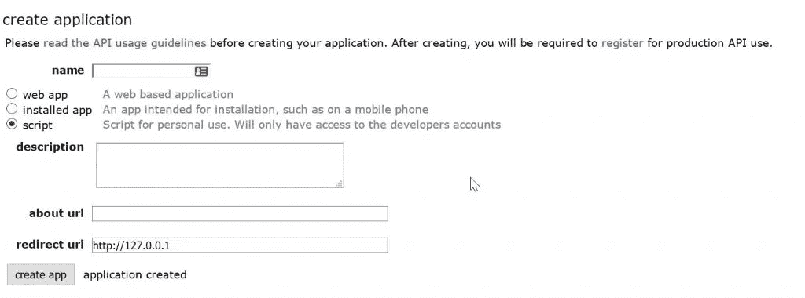

# 使用 Python 创建 Reddit 机器人

> 原文：<https://levelup.gitconnected.com/creating-a-reddit-bot-using-python-5464d4a5dff2>


我们将浏览 API 文档，看看我们可以用它做什么，以及如何制作一个 Reddit 机器人。Python 提供了一个解析器模块来处理名为 Praw 的 Reddit API。首先，安装 python 的最新版本，如果你没有的话，你需要 Reddit API。转到这个网址[https://www.reddit.com/prefs/apps/](https://www.reddit.com/prefs/apps/)并选择创建应用程序



给它起个名字。你必须选择一个重定向 URI(出于一些愚蠢的原因，愚蠢的是因为我正在建立一个机器人，而不是一个 web 应用程序，但无论如何)。我选择`[http://127.0.0.1](http://127.0.0.1)`你现在会得到一个客户端 id(下面的红框)和一个秘密(下面的蓝框)。记下来，但要保密。最后，在 python 中安装下面的模块，只需复制下面的命令并粘贴到您的命令提示符中，python Pip 模块将为您下载并安装它。

`pip install praw`

# 编码

用任何名称创建一个 py 文件，并在代码编辑器中打开它。第一步，我们将初始化我的 Reddit 帐户的身份验证细节。

在第 2 行，我导入了 Praw 模块，从第 5 行到第 9 行，我们将添加我们的用户和 API 细节。`client_id`将是我们在 API 创建期间获得的 id，`client_secret`是您在创建 API 应用程序时获得的 API 密钥，用户名和密码是您的 Reddit 帐户的登录详细信息。第 12 行显示我们将这些细节作为参数传递给`praw.Reddit()`类，从那里它将登录到你的 Reddit 帐户并访问他们的数据库。我们已经成功地设置了我们的认证，我们的下一个目标是看看我们能用 API 做什么。

# 访问子编辑:

在 Reddit 中，有多个被称为 subreddits 的社区。我们可以使用方法`subreddit`获得一个 subreddit 实例。为了使用 API 找到 subreddit 中最顶层的提交，我们可以使用`subreddit.top()`方法。在 subreddit 中，有多个 post 提交，我们可以遍历每个提交来使用该方法，Reddit API 为我们提供了以下命令来访问提交。

**1:** 上升的
**2:** 新的
**3:** 火热的
**4:** 镀金的
**5:** 争议的
**6:** 顶

在代码的第 2 行，我们已经定义了 subreddit 名称，inline 21 我们必须使用 python `for loop`来迭代提交，在循环条件中，我们使用`submission.top()`通过传递 limit 参数，这将告诉 API 我们需要多少个顶级提交。我手动添加了 1，但你可以添加任何数字，可能是 3，5，通常是 10。在接下来的几行中，我们使用了`submission.title`、`submission.url`、`submission.Id`来获取我们得到的循环中每个提交的详细信息，并且`submission.score`将显示提交的投票数。

# 评论:

在这一节中，我们将查看 API 的文档，了解如何访问帖子的评论、作者姓名等。

在第 17 行，我们通过传递 subreddit 的名称使用了 get_subreddit()，在下一行使用 get_comment()将删除 subreddit 帖子上的所有评论。在第 19 到 21 行，我们使用 for 循环来迭代我们的注释，并显示内容和它们的 id。如果您想要删除特定数量的注释，只需在 get_comment()中添加 limit=10 或您想要的任何数字。

从第 19 行到第 20 行，我们使用了`submission`函数，将 Reddit 帖子的 URL 作为参数传递，在下一行，我们调用了`reply()`函数，它接受一个文本参数，这可以是你想在 Reddit 帖子上发布的评论。如果您执行代码并检查帖子的 URL，您可以看到评论已成功发布。

现在，我们将使用 API 获取特定评论的信息，我们需要做的第一件事是获取评论 id，如果你看过代码，我获得了一个 post 评论 Id，它是`fvib7aw` Inline 22，我们通过将 comment_id 作为参数传递给`praw`类的函数来使用`reddit.comment()`， 然后在第 25 行到第 28 行，我们获取评论信息，比如`comment.body`获取评论的文本，`comment.permalink`是评论的 URL，`comment.score` 将获取评论的总投票数，包括向上投票和向下投票，`comment.author`将显示评论作者的姓名。

# 向上投票和向下投票:

对特定评论的向下投票可以通过获取 comment_id 并将其传入`reddit.comment()` 来完成，然后调用`comment.downvote()`一个将向下投票评论分数的函数，检查输出以查看其如何工作，同样，在向上投票的情况下，我们使用`comment.upvote()`。

## 输出:

```
Score before downvoting: 25
Score after downvoting: 24
```

# 在 Reddit 上提交:

好了，我们已经看到了如何在 subreddit 中获得顶部和最新的 subreddit 帖子，并获得评论、回复评论、投票赞成和投票反对评论，现在我们将学习如何使用他们的 API 在 reddit 上发送提交内容。

正如您在代码中看到的，我们已经向 Praw 模块提供了我们的登录和 API 详细信息，然后在第 17 到 19 行，我们定义了 post_title 和 pos_body 变量来保存文章的标题和内容，在下一行，我们选择了 subreddit，并通过将标题和正文作为参数传递来使用 submit()函数。这将提交我们的文章到我们选择的子编辑。

# 结论:

我们已经介绍了 Reddit 可以做的大部分基本事情，但是在文档中你可以发现更多关于如何在评论中找到文本的信息，等等。你可以通过访问这个`[documentation URL](https://praw.readthedocs.io/)`来了解更多关于这个 API 的信息。你已经学会了制造机器人所需的所有基础知识。希望这篇文章对你以后有所帮助，也可以随意分享你的回应。