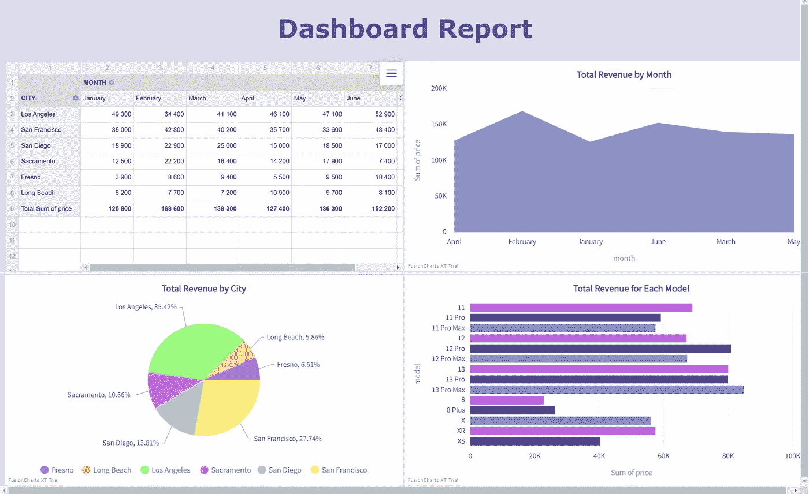

# 使用 JavaScript 创建报告仪表板

> 原文：<https://levelup.gitconnected.com/creating-a-reporting-dashboard-using-javascript-fe1376d2af7f>


现在已经是仲夏了，也就意味着每个公司都到了回顾和分析自己半年度进展的时候了。但是呈现信息的最佳方式是什么呢？这就把我们带到了数据可视化的话题上。

可视化地呈现信息会使信息更容易获取和理解。创建一个包含所有必要统计数据的仪表板报告可以提供基本业务洞察的一目了然的视图。

在这里，你可以找到一个关于使用 JavaScript 创建交互式 web 仪表板的分步指南。

# **选择什么设计？**

在开始工作之前，你必须选择最适合你的项目的视觉表现。图表、图形、数据透视表和地图是最常用的。哪些包括在仪表板中取决于分析的目的。

以我的数据集为例。对于本教程，我生成了一个在加利福尼亚某家虚构公司的不同商店购买 iPhone 的列表。

首先，我想分别研究每个城市每个月的数据。数据透视表是这项任务的最佳选择，因为它允许您对大量数据进行汇总、排序、分组和计数。但是要查看总体趋势或比较不同的指标，图表要方便得多。我决定使用面积图和条形图进行比较，并使用饼图来查看组成和百分比。

# **可视化工具**

当使用 JavaScript 进行数据可视化时，通常需要合并某些外部库。为了创建一个交互式的数据透视表，我决定使用 [WebDataRocks](https://www.webdatarocks.com/doc/intro/) ，一个完全免费的网络报告工具。它还与 [FusionCharts](https://www.fusioncharts.com/dev/getting-started/plain-javascript/your-first-chart-using-plain-javascript) 集成得很好，我将在余下的可视化中使用它。

如果你不觉得这些工具是你的最佳选择，那么请随意搜索更适合你需求的工具。为此，我推荐查看 Tate Galbraith 的文章[Beautiful JavaScript Data Visualization Libraries](/beautiful-javascript-data-visualization-libraries-1d3b66d6c318)，或者 Yuliia Nikitina 的文章[完整的 JavaScript 数据可视化工具列表](https://github.com/YuliiaNikitina/Complete-list-of-JavaScript-data-visualisation-components)。

# **数据格式**

对于本教程，您需要将数据存储为 JSON 或 CSV 格式。有两种方法可以将它用作仪表板的数据源:通过指定存储它的文件的 URL，或者，正如我在这里将要做的，通过创建一个返回它的函数:

```
function getJSONData() {
    return [
        {
            "month": "January",
            "model": "11 Pro Max",
            "city": "Los Angeles",
            "price": 1000
        },
        //...
    ]
}
```

# **第一步。定义页面布局**

首先，定义您的仪表板的结构。我希望我的表格有 4 个部分:一部分用于数据透视表，其余部分用于图表，所以我用 HTML 创建了一个 2×2 的表格。

```
<table style="width: 100%;height: 400px">
    <tr style="width: 50%; height: 400px">
        <td style>
            <div id="wdr-component"></div>
        </td>
        <td style>
            <div id="fusionChartArea"></div>
        </td>
        <td></td>
    </tr>
    <tr>
        <td style="width: 50%;">
            <div id="fusionChartPie" style="height:200px;"></div>
        </td>
        <td style="width: 50%;">
            <div id="fusionChartBar" style="height:200px;"></div>
        </td>
    </tr>
</table>
```

# **第二步。包括库。**

现在我们需要连接数据可视化工具。为此，请将 WebDataRocks 和 FusionCharts 库包含在一个 HTML 文件中，如下所示:

```
<! -- WebDataRocks -->
<link href="https://cdn.webdatarocks.com/latest/webdatarocks.min.css" rel="stylesheet"/>
<script src="https://cdn.webdatarocks.com/latest/webdatarocks.toolbar.min.js"></script>
<script src="https://cdn.webdatarocks.com/latest/webdatarocks.js"></script>
<! -- FusionCharts -->
<script src="https://static.fusioncharts.com/code/latest/fusioncharts.js"></script>
<script src="https://static.fusioncharts.com/code/latest/themes/fusioncharts.theme.fusion.js"></script>
<! -- WebDataRocks connector for FusionCharts -->
<script src="https://cdn.webdatarocks.com/latest/webdatarocks.fusioncharts.js"></script>
```

# **第三步。创建数据透视表**

让我们开始形成一个数据透视表。首先，指定将在其中呈现它的容器，是否需要工具栏，以及大小参数。

```
var ***pivot*** = new WebDataRocks({
    container: "#wdr-component",
    toolbar: false,
    "height": 400,
});
```

然后，添加一个报告，这是一个包含数据信息的对象:数据存储在哪里以及如何聚合数据。

在这里，我设置行来显示不同的城市，设置列来显示月份:

```
report: {
    "dataSource": {
        "dataSourceType": "json",
        "data": getJSONData()
    },
    "slice": {
         "rows": [{
             "uniqueName": "city"
         },
         {
        "uniqueName": "Measures"
        }],
        "columns": [{
            "uniqueName": "month"
        }],
        "measures": [{
            "uniqueName": "price",
            "aggregation": "sum"
        }]
    }
}
```

最后，添加一个处理程序，一旦数据加载到数据透视表中，它将调用图表函数。

```
reportcomplete: function() {
    ***pivot***.off("reportcomplete");
    createAreaChart();
    createBarChart();
    createPieChart();
}
```

# **第四步。创建图表**

所有图表类型都是以相同的方式创建的:通过定义一个绘制和填充图表的函数。首先，调用 FusionCharts 构造函数:指定图表类型以及它将在哪里呈现。

```
var chart = new FusionCharts({
    type: "bar2d",
    renderAt: "fusionchartBar",
    width: "100%",
    height: 400
});
```

然后使用方法`fusioncharts.getData()`将数据从数据透视表绘制到图表中。您还可以通过像我在这里所做的那样配置切片来定义要包括哪些信息:

```
***pivot***.fusioncharts.getData({
   type: chart.chartType(), "slice": {
       "rows": [
           {
               "uniqueName": "[Measures]"
           }
       ],
       "columns": [
           {
               "uniqueName": "model"
           }
       ],
       "measures": [
           {
               "uniqueName": "price",
               "aggregation": "sum"
           }
       ]
   }
}
```

最后，添加一个设置渲染、数据和图表属性的函数，您可以在 Fusioncharts 的网站上看到[的完整列表。](https://www.fusioncharts.com/dev/chart-attributes/area2d)

```
function(data) {
       chart.setJSONData(data);
       chart.setChartAttribute("theme", "fusion");
       chart.setChartAttribute("caption", "Total Revenue for Each Model");
       chart.setChartAttribute("paletteColors", "#bc5cdb, #493999, #8790a8");
       chart.render();
   }
```

对每个要创建的图表重复此过程。您使用的不同类型越多，仪表板看起来就越有趣。

最后，将所有图表添加到处理程序中，这样就完成了。

为了获得最佳视觉效果，我建议尝试不同的设计，让仪表盘看起来更美观。在这个报告中，我添加了一个标题并更改了颜色。最终的结果你可以在下面看到:



这个仪表盘的代码也上传到了 [GitHub](https://github.com/tomenkoNatalia/Dashboard-Reporting-Using-JavaScript) 上，所以如果还有任何问题，你可以下载看看。

# 分级编码

感谢您成为我们社区的一员！更多内容见[级编码出版物](https://levelup.gitconnected.com/)。
跟随:[推特](https://twitter.com/gitconnected)，[领英](https://www.linkedin.com/company/gitconnected)，[通迅](https://newsletter.levelup.dev/)
**升一级正在改造理工大招聘➡️** [**加入我们的人才集体**](https://jobs.levelup.dev/talent/welcome?referral=true)