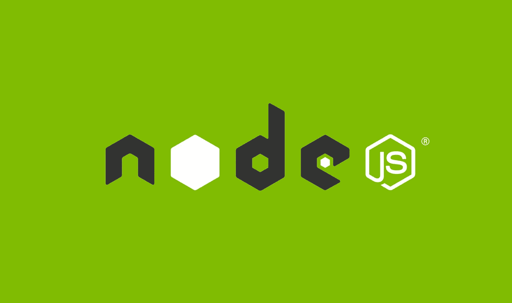

# 使用 Node.js 和 Express 创建 REST API:分步指南

> 原文：<https://levelup.gitconnected.com/creating-a-rest-api-with-node-js-and-express-a-step-by-step-guide-3bd7188fa219>

# 介绍

欢迎来到我们用 Node.js 和 Express 构建 REST API 的教程！在本文中，我们将指导您使用 Node.js 和 Express 库从头开始创建 REST API。在本教程结束时，您将拥有一个全功能的 API，可以用来构建强大的数据驱动的应用程序。

但是首先，让我们后退一步，讨论什么是 REST API，以及为什么您可能想要构建一个 REST API。

REST API(表述性状态转移 API 的缩写)是一个允许您通过互联网访问和操作数据的接口。它被称为“代表性的”API，因为它被设计成以一种易于客户理解和使用的方式来表示底层数据。REST APIs 通常用于提供对存储在数据库中的数据的访问，或者支持不同系统和应用程序之间的通信。

例如，假设您有一个需要从服务器获取最新帖子的社交媒体应用程序。您可以构建一个 REST API 来处理这项任务，允许应用程序向 API 发送请求，并接收包含最新帖子的响应。通过这种方式，应用程序可以保持最新的内容，并且您可以将数据保存在一个可供多个客户端访问的中心位置。

在本教程中，我们将使用 Node.js 和 Express 库来构建我们的 REST API。Node.js 是一个强大的 JavaScript 运行时，允许您使用 JavaScript 构建服务器端应用程序，而 Express 是一个流行的库，用于使用 Node.js 构建 API 和 web 应用程序。这些工具结合在一起，可以轻松构建快速、可伸缩的 API，从而处理各种请求和工作负载。



# 设置项目

既然我们已经很好地理解了什么是 REST API，以及为什么我们可能想要构建一个 REST API，那么是时候开始着手建立我们的项目了。

我们需要做的第一件事是在我们的机器上安装 Node.js。Node.js 是一个 JavaScript 运行时，它允许我们在服务器端运行 JavaScript，这是构建我们的 API 所必需的。可以从官网([https://nodejs.org/](https://nodejs.org/))下载安装 Node.js 的最新版本。


一旦安装了 Node.js，就可以通过打开终端并导航到要存储项目的目录来创建一个新项目。然后，运行以下命令创建一个新的 Node.js 项目:

```
npm init
```

该命令将提示您输入一些关于项目的信息，例如名称、版本和描述。您可以通过按 Enter 键接受默认值，也可以根据自己的喜好进行自定义。完成后，您应该会在项目目录中看到一个名为“package.json”的新文件。该文件包含关于您的项目的元数据，包括您需要安装的依赖项(即库和框架)。

接下来，我们将安装 Express 库，我们将使用它来构建我们的 API。要安装 Express，请在终端中运行以下命令:

```
npm install express
```

这将下载并安装最新版本的 Express，并将其添加到 package.json 文件的“dependencies”部分。

现在我们已经设置了 Node.js 和 Express，我们可以开始构建 API 的基本结构了。在项目目录的根目录下，创建一个名为“app.js”的新文件。这将是我们的 API 的入口点，我们将在这里设置 Express 应用程序并配置路线。

在 app.js 文件中，添加以下代码以导入 Express 库并创建新的 Express 应用程序:

```
const express = require('express');
const app = express();
```

接下来，我们将设置一个简单的路由来处理对 API 根路径的 GET 请求。将以下代码添加到 app.js 中:

```
app.get('/', (req, res) => {
  res.send('Hello, World!');
});
```

这段代码定义了一个路由，该路由监听到 API 根路径的 GET 请求，并发送一个带有消息“Hello，World！”的响应。

最后，我们需要启动服务器并使 API 对客户机可用。将以下代码添加到 app.js 中:

```
const port = process.env.PORT || 3000;
app.listen(port, () => {
  console.log(`API server listening on port ${port}`);
});
```

这段代码设置 API 将监听的端口。我们在这里使用`process.env.PORT`变量来允许将 API 部署到像 AWS 或 Azure 这样的云平台，这将自动设置端口。如果没有设置`process.env.PORT`变量，我们将使用端口 3000。

就是这样！现在，您已经有了一个使用 Node.js 和 Express 设置的基本 API。您可以通过在终端中运行以下命令来启动 API:

```
node app.js
```

这将启动 API 服务器，您应该在终端中看到消息“API 服务器监听端口[port]”。

现在，如果你打开网络浏览器，导航到`http://localhost:[port]`，你应该会看到“你好，世界！”显示在浏览器中。恭喜你，你有了一个工作的 REST API！

# 定义路由和处理 HTTP 请求

在上一节中，我们使用 Node.js 和 Express 设置了一个基本的 API，并处理了对 API 根路径的 GET 请求。在这一节中，我们将更深入地定义路由和处理不同类型的 HTTP 请求。

路由是客户端可以访问以检索或操作数据的 API 的端点。在 Express 中，您可以使用`app.METHOD()`函数定义路由，其中`METHOD`是路由将处理的 HTTP 方法(例如，GET、POST、PUT、DELETE)。例如，下面是如何定义一个路由来处理对`/posts`路径的 GET 请求:

```
app.get('/posts', (req, res) => {
  // Code to handle the request and send a response
});
```

`req` (request)对象包含关于传入请求的信息，比如 HTTP 方法、URL、请求头和请求体(如果是 POST 或 PUT 请求)。`res` (response)对象包含可以用来向客户端发送响应的方法，例如`res.send()`、`res.json()`和`res.render()`。

下面是一个例子，说明如何使用`req`和`res`对象来处理对`/posts`路由的 GET 请求，并发送一个带有帖子列表的 JSON 响应:

```
app.get('/posts', (req, res) => {
  const posts = [
    { id: 1, title: 'Post 1' },
    { id: 2, title: 'Post 2' },
    { id: 3, title: 'Post 3' }
  ];
  res.json(posts);
});
```

除了 GET 之外，您还可以分别使用`app.post()`、`app.put()`和`app.delete()`函数处理其他 HTTP 方法，比如 POST、PUT 和 DELETE。下面是一个例子，说明如何处理对`/posts`路由的 post 请求，以创建一个新的 POST:

```
app.post('/posts', (req, res) => {
  const newPost = {
    id: 4,
    title: req.body.title
  };
  // Add the new post to the list of posts
  res.json(newPost);
});
```

在这个例子中，我们使用`req.body`属性来访问 post 请求的主体，它应该包含新 POST 的数据。根据 API 的需要，您可以使用类似的技术来处理 PUT 和 DELETE 请求。

# 使用数据和数据库

在前面的章节中，我们学习了如何在我们的 API 中定义路由和处理 HTTP 请求。在这一节中，我们将深入研究使用数据和数据库在我们的 API 中存储和检索数据的细节。

根据您的需求和应用程序的复杂性，在 API 中存储数据有许多不同的方式。一种简单的方法是使用变量或数组将数据存储在内存中。例如，您可以将帖子列表存储在一个变量中，如下所示:

```
let posts = [
  { id: 1, title: 'Post 1' },
  { id: 2, title: 'Post 2' },
  { id: 3, title: 'Post 3' }
];
```

这种方法对于测试和原型开发很有用，但是它有一些缺点。首先，数据不会在 API 重新启动时保持不变，所以每次停止和启动服务器时都会丢失所有数据。此外，随着数据集的增长，内存中的数据存储可能会变得缓慢和低效，并且它们不能很好地扩展以支持多个客户端。

更可靠的解决方案是使用数据库来存储您的数据。您可以使用许多不同的数据库，比如 MongoDB、MySQL、PostgreSQL 和 SQLite。每个数据库都有自己的优点和缺点，最佳选择将取决于您的特定需求和要求。


在本教程中，我们将以 MongoDB 为例。要在 API 中使用 MongoDB，您需要为 Node.js 安装 MongoDB 驱动程序，并连接到 MongoDB 数据库。这里有一个你可以如何做的例子:

```
const mongoose = require('mongoose');

mongoose.connect('mongodb://localhost/myapi', {
  useNewUrlParser: true,
  useUnifiedTopology: true
});

const db = mongoose.connection;
db.on('error', console.error.bind(console, 'connection error:'));
db.once('open', () => {
  console.log('Connected to MongoDB!');
});
```

这段代码使用`mongoose`库连接到本地机器上运行的 MongoDB 数据库。`db`变量代表与数据库的连接，我们使用`db.on()`和`db.once()`函数来处理连接错误，并在连接成功时记录一条消息。

一旦建立了数据库连接，就可以开始定义模式和模型来表示数据。模式定义数据的结构，模型用于创建和操作数据的实例。下面是一个如何定义文章模式和模型的例子:

```
const postSchema = new mongoose.Schema({
  title: String,
  body: String
});

const Post = mongoose.model('Post', postSchema);
```

定义了模式和模型后，您可以使用 Mongoose 的方法创建、读取、更新和删除数据库中的数据。下面是一个示例，说明如何使用`Post`模型从数据库中检索所有帖子，并向客户端发送 JSON 响应:

```
app.get('/posts', (req, res) => {
  Post.find((err, posts) => {
    if (err) return res.status(500).send(err);
    res.json(posts);
  });
});
```

除了处理数据和数据库，在 API 中处理数据验证和错误处理也很重要。数据验证确保提交给 API 的数据格式正确，并且符合您定义的任何业务规则。错误处理确保您的 API 优雅地处理和响应请求处理过程中可能出现的任何错误。

有许多不同的方法可以在 API 中实现数据验证和错误处理。一种简单的方法是使用`joi`库进行数据验证，使用`express-async-errors`库处理异步错误。下面是一个示例，说明如何使用这些库来验证 POST 请求的主体并处理可能出现的任何错误:

```
const Joi = require('joi');

app.post('/posts', async (req, res) => {
  const schema = Joi.object().keys({
    title: Joi.string().min(3).max(255).required(),
    body: Joi.string().min(3).required()
  });
  const { error } = Joi.validate(req.body, schema);
  if (error) return res.status(400).send(error.details[0].message);

  try {
    const post = new Post(req.body);
    await post.save();
    res.send(post);
  } catch (error) {
    res.status(500).send(error);
  }
});
```

在这个例子中，我们使用`joi`库为 POST 请求的主体定义一个模式，并根据这个模式验证请求主体。如果数据无效，我们将发送一个状态代码为 400(错误请求)的响应和错误消息。如果数据有效，我们将使用`Post`模型创建一个新帖子，并将其保存到数据库中。如果在保存操作过程中出现任何错误，我们将捕获错误并发送一个状态代码为 500(内部服务器错误)的响应。

# 测试 API

在前面的章节中，我们学习了如何定义路由和处理 HTTP 请求，以及如何使用数据和数据库在我们的 API 中存储和检索数据。在这最后一节，我们将看看如何测试我们的 API，以确保它按预期工作。

测试是软件开发过程中的一个重要部分，因为它可以帮助您在 bug 和错误进入生产之前捕捉它们。有两种主要的测试类型:单元测试和集成测试。单元测试包括单独测试代码的单个单元或组件，而集成测试包括测试代码的不同单元如何协同工作。

在本教程中，我们将关注集成测试，因为它允许我们测试 API 的全部功能。要为我们的 API 编写集成测试，我们将使用 Mocha 和 Chai 库。Mocha 是一个测试运行器，它使设置和运行测试变得容易，Chai 是一个断言库，它为测试提供了丰富的断言集。

要安装 Mocha 和 Chai，请在您的终端中运行以下命令:

```
npm install --save-dev mocha chai
```

安装了 Mocha 和 Chai 之后，您就可以开始为您的 API 路由编写测试用例了。测试用例是测试代码特定方面的一组步骤，通常由三部分组成:测试描述、测试设置和测试断言。下面是测试响应状态代码和响应主体的`/posts`路由的测试用例示例:

```
describe('GET /posts', () => {
  it('should return all posts', (done) => {
    chai.request(app)
      .get('/posts')
      .end((err, res) => {
        should.not.exist(err);
        res.status.should.equal(200);
        res.type.should.equal('application/json');
        res.body.should.be.an('array');
        res.body.length.should.equal(3);
        done();
      });
  });
});
```

在这个测试用例中，我们使用`chai.request()`函数向`/posts`路由发送 GET 请求，使用`end()`函数处理响应。`done`回调用于告诉 Mocha 测试何时完成。在`end()`函数中，我们使用 Chai 提供的`should`语法来断言响应状态代码、响应类型、响应主体和响应主体的长度。

要运行测试，您可以在终端中使用`mocha`命令。默认情况下，Mocha 会在`test`目录中查找测试文件，所以您需要创建一个`test`目录，并将测试文件放在那里。下面是一个如何从终端运行测试的示例:

```
mocha
```

如果所有测试都通过了，您应该会看到一条消息，表明所有测试都通过了。如果有任何测试失败，您将会看到一条详细的错误消息，指出哪里出错了。

# 部署 API

既然您已经有了功能齐全且经过测试的 API，那么是时候让用户使用它了。根据您的需求和预算，部署 API 有许多不同的选择。一些常见的选择包括部署到云平台，如亚马逊网络服务(AWS)或微软 Azure，或使用 Heroku 或 Zeit 等托管服务。

在本教程中，我们将了解如何使用 Amazon 弹性容器服务(ECS)将 API 部署到 AWS。AWS ECS 是一个完全托管的容器编排服务，使其易于运行、扩展和监控容器化的应用程序。要将 API 部署到 ECS，您需要创建一个 AWS 帐户并设置一个 ECS 集群。

## 创建 AWS 帐户

要创建 AWS 帐户，请转到 AWS 主页并单击“创建免费帐户”按钮。按照提示输入您的联系和帐单信息，并选择一个支持计划。一旦您的帐户设置完毕，您将被带到 AWS 管理控制台。

## 创建 ECS 群集

要创建 ECS 群集，请单击顶部导航栏中的“服务”下拉列表，并从列表中选择“ECS”。在 ECS 控制面板上，单击“Create cluster”按钮。选择“EC2 Linux + Networking”作为集群模板，并为集群命名。

单击“创建”按钮创建集群。创建群集可能需要几分钟时间。一旦集群准备就绪，您会在集群名称旁边看到一个绿色的勾号。

要将您的 API 部署到 ECS 集群，您需要创建您的 API 的 Docker 映像，并将其推送到 Docker 注册中心。Docker 是一个容器化平台，允许您将应用程序及其依赖项打包到一个自包含的单元中，该单元可以在任何安装了 Docker 的机器上轻松部署和运行。

## 创建 Docker 图像

要创建 API 的 Docker 映像，您需要在项目的根目录下创建一个`Dockerfile`。`Dockerfile`是一个文本文件，包含构建 Docker 映像的指令。下面是一个 Node.js API 的`Dockerfile`的例子:

```
FROM node:14
WORKDIR /usr/src/app
COPY package*.json ./
RUN npm install
COPY . .
EXPOSE 3000
CMD ["npm", "start"]
```

该`Dockerfile`使用`node:14`图像作为基础图像，并将工作目录设置为`/usr/src/app`。然后，它将`package.json`和`package-lock.json`文件复制到工作目录，并运行`npm install`来安装依赖项。它将剩余的文件复制到工作目录，公开端口 3000，并运行`npm start`命令来启动 API。

要构建 Docker 映像，请在终端中运行以下命令:

```
docker build -t my-api .
```

这个命令将构建 Docker 映像，并用名称`my-api`标记它。要将图像推送到 Docker 注册中心，您需要登录注册中心，然后运行

```
docker push my-api
```

你可以使用许多不同的 Docker 注册中心，但是最流行的是 Docker Hub。要将您的图像推送到 Docker Hub，您需要创建一个帐户，然后使用`docker login`命令登录。

将 Docker 映像推送到注册表后，现在就可以将其部署到 ECS 集群了。为此，您需要创建一个任务定义和一个服务。任务定义是描述如何运行容器化应用程序的蓝图，而服务是一个长期运行的任务，代表在集群上运行的一组相同的任务。

## 创建任务定义

要创建任务定义，请转到 ECS 控制面板，然后单击左侧导航栏中的“任务定义”链接。单击“创建新任务定义”按钮，并选择“Fargate”作为启动类型。为您的任务定义命名，然后单击“添加容器”按钮将容器添加到任务中。

在容器定义表单中，输入容器的名称、Docker 映像的映像 URI 和端口映射。端口映射应该将主机端口映射到容器端口。例如，如果您的 API 监听端口 3000，您可以将主机端口 3000 映射到容器端口 3000。单击“添加”按钮将容器添加到任务定义中，然后单击“创建”按钮创建任务定义。

## 创建服务

要创建服务，请单击左侧导航栏中的“服务”链接，然后单击“创建服务”按钮。选择您之前创建的集群，并选择您刚刚创建的任务定义。为您的服务命名，然后单击“创建”按钮创建服务。

创建服务和启动任务可能需要几分钟时间。任务运行后，您将看到服务的状态变为“活动”。您可以单击“查看服务”按钮来查看有关服务的更多详细信息，包括任务状态、正在运行的任务数量以及任务的公共 IP 地址。

## 访问您的 API

要从互联网访问您的 API，您需要为您的任务分配一个公共 IP 地址。为此，请单击“任务”选项卡，然后单击要更新的任务旁边的“编辑”按钮。在“网络”部分，选择“分配公共 IP ”,并从下拉列表中选择“启用”。单击“更新”按钮保存更改。

为您的任务分配一个公共 IP 地址后，您现在可以使用公共 IP 地址和您在端口映射中指定的端口从互联网访问您的 API。例如，如果您的 API 监听端口 3000，并且有一个公共 IP 地址`1.2.3.4`，您可以在`[http://1.2.3.4:3000](http://1.2.3.4:3000.)` [访问它。](http://1.2.3.4:3000.)

# 结论

在本教程中，我们讨论了以下主题:

*   什么是 REST API，为什么您可能想要构建一个
*   使用 Node.js 和 Express 设置项目
*   定义路由和处理 HTTP 请求
*   使用数据和数据库
*   测试 API
*   将 API 部署到 AWS ECS

我希望本教程对您有所帮助，并且您现在有信心构建自己的 REST APIs。如果您希望在 API 的基础上进行构建并添加额外的功能，这里有一些想法可以考虑:

*   认证和授权:您可以使用像 Passport 或 JWT 这样的库来向您的 API 添加用户认证和授权。
*   缓存:您可以使用像`node-cache`或`redis`这样的缓存库，通过在内存中存储频繁访问的数据来提高 API 的性能。
*   负载平衡:如果您希望您的 API 接收大量流量，您可以使用类似 NGINX 或 Amazon Elastic Load Balancer 这样的负载平衡器来将负载分布到多个任务或实例中。
*   监控和日志记录:您可以使用 AWS CloudWatch 或 Loggly 等工具来监控 API 的性能和日志，并在出现问题时接收警报。

**不要错过我即将发布的内容和技术指南:**

[](https://medium.com/@nicchong/subscribe) [## 每当 Nic Chong 发布时收到电子邮件。

### 每当 Nic Chong 发布时收到电子邮件。通过注册，您将创建一个中型帐户，如果您还没有…

medium.com](https://medium.com/@nicchong/subscribe) 

如果你有什么问题，我在这里帮忙，在评论区等你:)