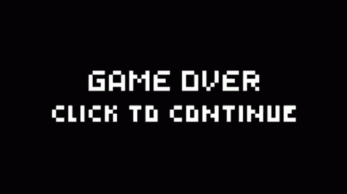
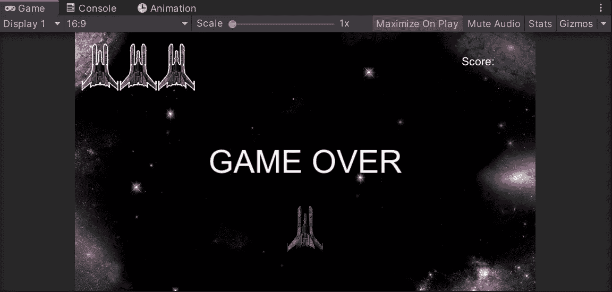
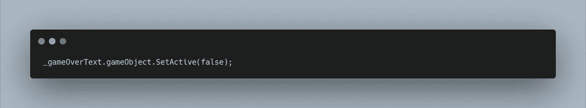
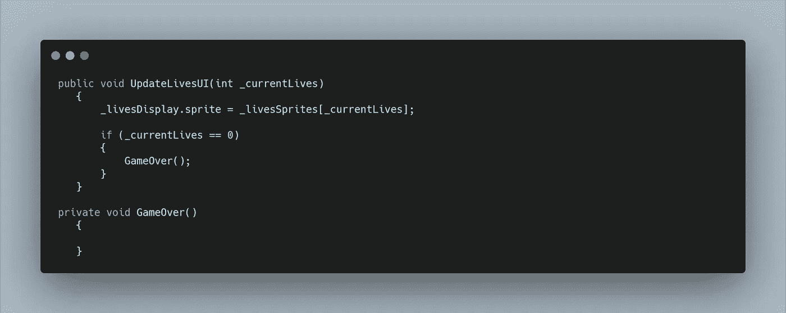
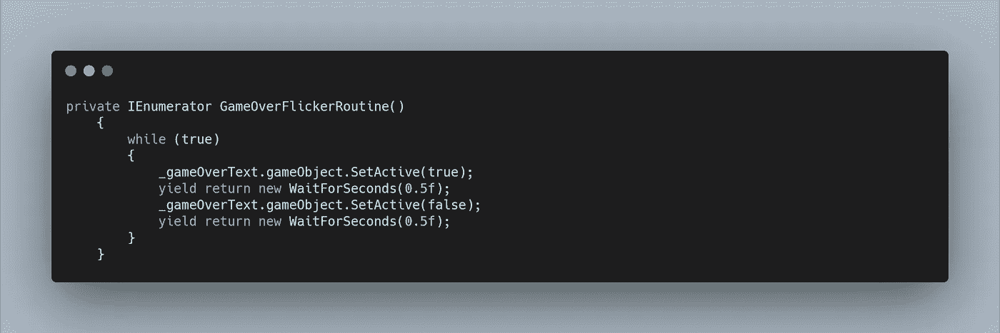
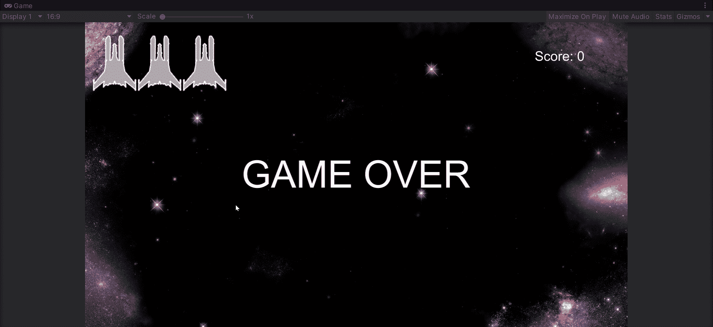

# 创造一个关于行为的复古游戏

> 原文：<https://levelup.gitconnected.com/creating-a-retro-game-over-behavior-446e124eaccc>

三个活的，一切都结束了…但目前，我们的产卵经理停止，我们的球员被摧毁。让我们只能望向太空。让我们创建更多的用户界面来更好地显示游戏结束了。

让我们再次向画布添加一个文本组件，并根据需要放置它。

我们只希望它在游戏结束时出现，所以让我们禁用它。现在，在我们的 UI 管理器脚本中，确保它在游戏开始时被禁用也是一个很好的做法。让我们创建一个变量来存储文本对象，然后我们可以在 Start 方法中执行以下操作。

现在，我们可以创建另一个公共方法，供玩家在生命等于 0 时调用。但是我们已经把这个变量发送给了我们 live 精灵的 UI 管理器。所以让我们用一个 if 语句来检查这个值是什么，然后为我们的游戏调用一个私有方法。

在 GameOver 方法中，我们现在可以简单地将文本上的游戏设置为活动。但是我们想要更多的复古闪烁。为此，我们可以使用协程和 while 循环。

这样，每 0.5 秒游戏结束文本就会出现然后消失。

