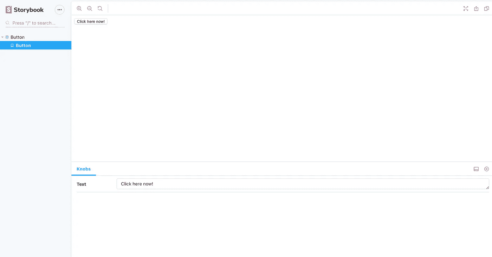

# 使用 React、Storybook 和 Webpack 创建可重用的组件库

> 原文：<https://levelup.gitconnected.com/creating-a-reusable-component-library-with-react-storybook-and-webpack-c0a30076aa54>

当使用 React 之类的现代 JavaScript 库处理大型代码库时，将我们的 UI 分成小的、可管理的、易于重用和分发的组件变得很重要。这样做有助于我们大规模交付有凝聚力的用户体验。BBC 的一个团队创建的现代组件库的一个很好的例子是 [iPlayer 组件库，可以在这里](https://www.bbc.co.uk/iplayer/storybook/index.html?path=/story/style-guide--colours)看到。

在本指南中，我将概述让您建立自己的基本 React 组件库的步骤，这样您就可以开始在您的 React 应用程序中重用组件。为此，我们将使用 React、Sass、Storybook 和 Webpack。

## 初始化项目

首先，让我们创建一个新目录，`cd`并运行`npm init`开始。然后，我们需要安装以下依赖项

```
yarn add react react-dom yarn add --dev [@babel/core](http://twitter.com/babel/core) [@babel/preset-env](http://twitter.com/babel/preset-env) [@babel/preset-react](http://twitter.com/babel/preset-react) babel-loader node-sass sass-loader [@storybook/react](http://twitter.com/storybook/react) @storybook/addon-knobs webpack webpack-cli webpack-node-externals clean-webpack-plugin path
```

## 项目结构

我们的组件库的目录结构将非常简单。我们将有一个 *src* 目录，一个*。storybook* 目录，和一个 *dist* 目录。它最终看起来会有点像这样

```
/.storybook
  - main.js
/src
  - index.js
  /components
    /Button
      - index.js
      - button.scss
      - button.stories.js
/dist
  - index.js
- webpack.config.js
- package.json
```

如果我们想用可伸缩性来构建我们的项目，我们可以遵循[原子设计模式](https://bradfrost.com/blog/post/atomic-web-design/)，并将我们的组件分解成[原子](https://bradfrost.com/blog/post/atomic-web-design/#atoms)、[分子](https://bradfrost.com/blog/post/atomic-web-design/#molecules)和[有机体](https://bradfrost.com/blog/post/atomic-web-design/#organisms)。但在本教程中，我们只是要保持事情简单。

## 创建我们的 React 组件

现在我们需要创建我们的第一个 React 组件。在项目的根目录下创建一个名为 src 的目录，并在 src 目录下创建另一个名为 components 的目录。在组件目录中，创建另一个目录，它将是您的组件的名称；并在其中创建一个`index.js`文件，组件的代码将存放在这里。我将创建一个名为*按钮*的简单组件。下面是我的按钮组件的样子

```
// /src/components/Button/index.js
import React from 'react'const Button = ({message = 'Hello world'}) => (
   <button>{message}</button>
)export default Button
```

## 故事书

Storybook 使您在开发组件时很容易看到它们，它的设置非常简单，并且我们已经安装了我们需要的依赖项(`*@storybook/react*`和`*@storybook/addon-knobs*`)。在项目的根目录下创建一个名为。故事书，并在里面创建一个`main.js`文件。在 main.js 文件中添加以下配置，它告诉 Storybook 在哪里查找 Storybook 文件，并使用 knobs addon(这在处理道具时很有用)。

```
// /.storybook/main.js
module.exports = {
  stories: ['../src/components/**/*.stories.[tj]s'],
  addons: ['@storybook/addon-knobs/register']
}
```

Storybook 现在将自动获取我们在组件目录中创建的每个 Storybook 文件，因此我们应该为每个组件创建一个 Storybook 文件。这是我之前创建的按钮组件的故事书文件。它告诉 Storybook 渲染我的按钮组件，并添加一个名为“message”的可编辑道具，可以直接在 Storybook 内编辑。

```
// /src/components/Button/button.stories.js
import React from 'react'
import Button from './index.js'
import { withKnobs, text } from '@storybook/addon-knobs'export default { title: 'Button component', decorators: [withKnobs]}export const button = () => {
  const message = text('Text', 'Click here now!')
  return <Button message={message}></Button>
}
```

现在我们需要向 package.json 添加一个故事书脚本。

```
...
"scripts": {
  "start": "start-storybook"
},...
```

一旦我们添加了这个，我们应该能够运行`yarn start` / `npm run start`来启动 Storybook，它将会拉入我们刚刚创建的组件。



显示 React 组件的故事书的屏幕截图

## 设计我们的组件

用 React 设计组件有很多选择，在本教程中，我们将使用 Sass。要设置 Storybook 使用 Sass，我们需要编辑我们之前创建的 Storybook 配置(`/.storybook/main.js)`并导入`path`包，然后添加一个 Webpack 规则来告诉 Storybook 加载 Sass 文件。您的故事书配置现在应该看起来像这样

```
// /.storybook/main.js
const path = require('path');module.exports = {
  stories: ['../src/components/**/*.stories.[tj]s'],
  addons: ['@storybook/addon-knobs/register'],
  webpackFinal: async (config, { configType }) => {
    config.module.rules.push({
      test: /\.scss$/,
      use: ['style-loader', 'css-loader', 'sass-loader'],
      include: path.resolve(__dirname, '../src'),
    });

    return config;
  }
}
```

现在我们已经设置了 Storybook 来导入 Sass 文件，我们可以向之前创建的组件添加样式。为此，我们需要在组件目录中创建一个. scss 文件，因此在`/src/components/Button`中创建一个名为 button.scss 的文件。在`/src/components/Button/index.js`中，我们需要导入我们刚刚创建的文件`import './button.scss'`。现在，当我们向 button.scss 添加样式时，我们应该能够在 Storybook 中看到这些样式🎊

## 将项目与 Webpack 绑定

为了能够将我们创建的组件导入到其他 React 应用程序中，我们需要使用 Webpack 捆绑代码。在 src 目录中，我们需要创建一个 index.js 文件，该文件将用于声明和导出所有组件，如下所示

```
// /src/index.js
const { Button } = './components/Button'
export { Button }
```

在 package.json 中，我们需要添加一个构建脚本，用于使用 Webpack 构建组件。我们的 package.json 应该包含以下脚本

```
...
"scripts": {
  "start": "start-storybook",
  "build": "webpack -- mode production"
},
...
```

最后，我们需要设置 Webpack 配置来构建组件库。在根目录下创建一个名为`webpack.config.js`的文件，并添加以下内容

```
const path = require('path')
const { CleanWebpackPlugin } = require('clean-webpack-plugin')
const nodeExternals = require('webpack-node-externals');module.exports = {
  entry: './src/index.js',
  externals: [nodeExternals()],
  output: {
    filename: 'index.js',
    path: path.resolve(__dirname, 'dist'),
    library: '',
    libraryTarget: 'commonjs'
  },
  plugins: [new CleanWebpackPlugin()],
  module: {
    rules: [
     {
        test: /\.(js|jsx)$/,
        exclude: /node_modules/,
        use: ['babel-loader']
      },
      { 
        test: /\.scss$/,
        use: ['style-loader', 'css-loader', 'sass-loader'],
        include: path.resolve(__dirname, './src')
      }
    ]
  }
}
```

这个配置告诉 Webpack 在加载`src/index.js`的 JavaScript/Sass 内容并将其输出到 dist 目录之前清理 dist 目录(使用 *CleanWebpackPlugin* )。

## 发布我们的组件库

将我们刚刚创建的组件库发布到 NPM，并将其导入到其他 React 应用程序中非常简单。一旦使用我们之前创建的`yarn build`命令构建了代码，确保您登录到 NPM 并运行`npm publish`，将组件库发布到 NPM。

在其他 React 应用中使用组件就像在其他 React 应用中运行`yarn add yourPackageName`一样简单，然后像这样将其导入 React 应用

```
import { Button } from 'yourPackageName'
```

*如果你不想把你的组件库发布到 NPM，你可以* [*直接从 Github*](https://stackoverflow.com/questions/17509669/how-to-install-an-npm-package-from-github-directly) *导入。*

*我已经在 Github* *上发布了本指南* [*中的代码。如果你觉得这很有用，有任何问题，或者想要更多这样的内容，请随时在 twitter 上关注我！*](https://github.com/andypotts/components-library-template)