# 在 AWS 上创建无服务器联系人表单

> 原文：<https://levelup.gitconnected.com/creating-a-serverless-contact-form-on-aws-ff339ad1fa60>


除非你在过去的几年里一直生活在岩石下，否则你肯定听说过无服务器计算，并且经常想知道在什么情况下你可以自己尝试一下。不要再想了！是时候创建一个无需服务器的联系人表单，用来给自己发送电子邮件了。

免责声明:这种方法没有任何形式的验证码验证等…但会对低流量的网站或个人项目更有用。与 AWS 中的任何东西一样，确保为任何公开的东西设置计费警报。

以下是我们将在 AWS 上使用的服务列表:

1.  API 网关
2.  IAM 角色
3.  简单电子邮件服务

让我们开始吧。

我们的无服务器应用程序的目标是接受一个 JSON 对象有效负载，以**名称**、**电子邮件**、**电话**和**消息**作为参数，使用所有字段格式化消息，并在提交时将它们发送到我们的电子邮件地址。

应用程序的主要入口点(无论表单位于何处)将是 API 网关端点。API 网关端点将负责验证输入、格式化要发送给 SES 的消息，并最终调用 SES 来传递实际的消息。

在设置 API 网关之前，我们需要在 ses 中注册一个电子邮件地址——只有经过验证的电子邮件地址才能被 SES 用作发送目标和发件人电子邮件地址。您可以验证整个域，在这种情况下，SES 可以使用来自该域的所有电子邮件，也可以验证特定的电子邮件地址(例如 gmail)。

# 验证域名

你可以登录你的 AWS 账户，然后前往[https://console.aws.amazon.com/ses/home](https://console.aws.amazon.com/ses/home)。在侧面导航栏的左上角，单击**域**。

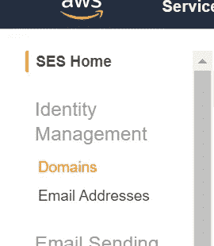

点击主屏幕顶部的**验证新域**按钮。

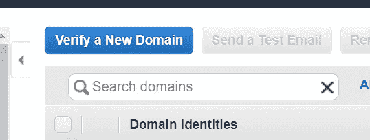

在弹出框中添加你的域名(没有任何像 www 这样的子域)(在这个例子中是 test.com)

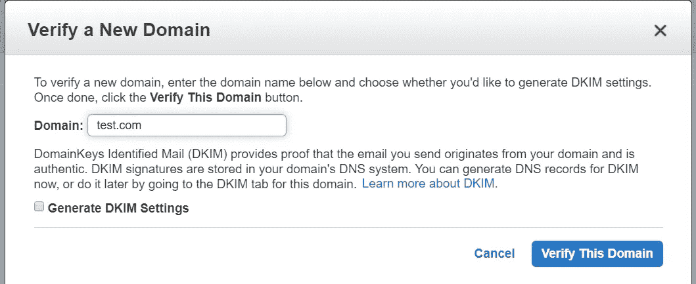

点击**验证该域**。另一个模式窗口将弹出一些 DNS 设置，你需要添加到您的域，以便进行验证。复制列出的设置，并在您的域上进行 DNS 更改。

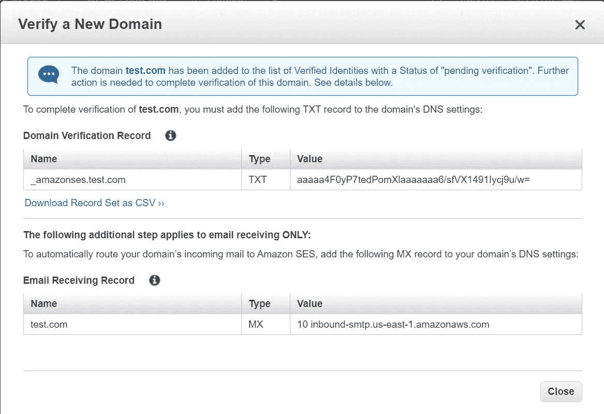

DNS 更改传播后，验证应该是自动的，所以您可能需要等待一会儿。一旦验证，你现在可以使用任何电子邮件地址使用该域。

如果您需要更多具体说明，请访问[https://docs . AWS . Amazon . com/ses/latest/developer guide/verify-domain-procedure . html](https://docs.aws.amazon.com/ses/latest/DeveloperGuide/verify-domain-procedure.html)

# 验证特定的电子邮件地址

你可以登录你的 AWS 账户，然后前往[https://console.aws.amazon.com/ses/home](https://console.aws.amazon.com/ses/home)。在侧面导航栏的左上方，单击**电子邮件地址**。

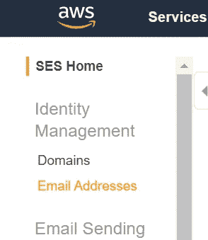

点击主屏幕顶部的**验证新的电子邮件地址**按钮。

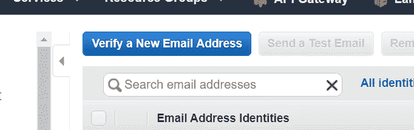

用您想要使用的电子邮件地址填写模式弹出窗口

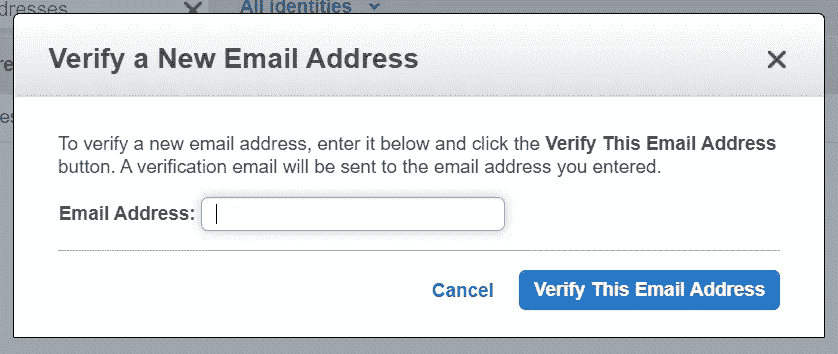

然后点击**验证这个邮箱地址**。此时，您应该会收到一封带有链接的验证电子邮件，您可以单击该链接进行验证。点击链接后，您可以在 SES 中使用该电子邮件。

为了设置 API Gateway 与 SES 对话，我们首先需要创建一个 API Gateway 将使用的新 IAM 角色。这个角色将指定我们希望给予 API Gateway 的权限——在本例中是通过 SES 发送电子邮件。

首先登录您的 AWS 帐户，然后导航至[https://console.aws.amazon.com/iam/home?region=us-east-1#/roles](https://console.aws.amazon.com/iam/home?region=us-east-1#/roles)

点击屏幕顶部的**创建角色**

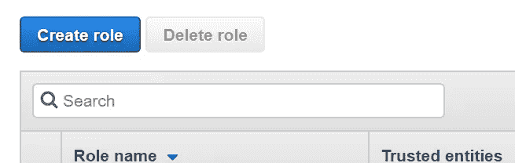

在下一个屏幕上，保留默认设置，向下滚动选择 **Api 网关**。

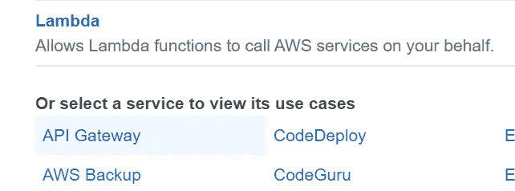

点击屏幕底部的**下一步:权限**按钮。

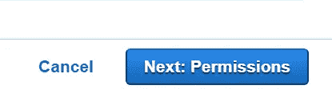

在下一个屏幕中，保留默认设置，然后单击**下一步:标签**按钮。再次保留默认设置，点击**下一步:查看**按钮。

最后一个屏幕是您命名新角色的地方。对于这个例子，我们称之为 ApiGatewaySes。还添加了修改后的描述。

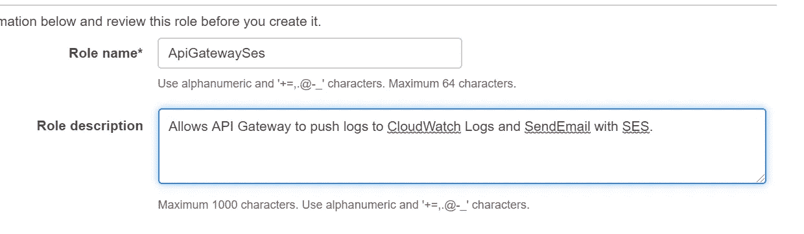

在屏幕底部点击**创建角色**按钮。此时，该角色实际上没有 SES 权限，只有 CloudWatch 日志记录，因此我们必须返回 IAM 角色并添加 SES 权限。

在创建新角色后显示的屏幕上，即角色列表屏幕上，单击新角色。


在下一个屏幕上向下滚动，直到看到**添加内嵌策略**链接。点击它。

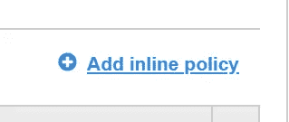

在下一个屏幕中，您将看到两个选项卡，其中一个标题为 JSON。单击该选项卡。

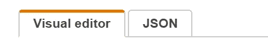

这将添加一个 textarea 提示，您可以在其中使用 JSON 声明添加 IAM 策略。将以下策略复制并粘贴到 textarea 输入中。

```
{
    "Version": "2012-10-17",
    "Statement": [
        {
            "Sid": "Custom",
            "Effect": "Allow",
            "Action": [
                "ses:SendEmail"
            ],
            "Resource": "*"
        }
    ]
}
```

在屏幕底部，单击**审查政策**，您将进入一个屏幕，在此您可以命名您的新政策。您可以使用 SesSendEmail 作为名称。

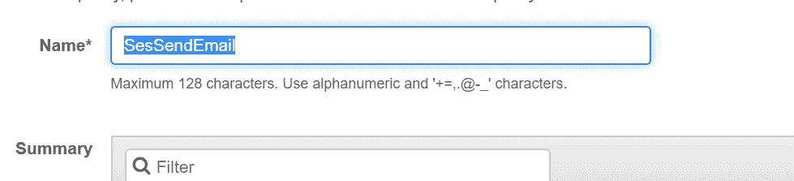

最后，在屏幕底部点击**创建策略**。现在，您已经创建了一个新的 IAM 角色，它将允许 API Gateway 使用 ses 的 SendEmail 功能。您需要做的最后一件事是复制或不取屏幕顶部的 ARN 值。在下面的 API 网关设置部分中，您将需要用到它。


随着我们最初的电子邮件和 IAM 角色设置的完成，我们现在可以专注于创建我们的 API 了。登录 AWS，前往 https://console.aws.amazon.com/apigateway/main/apis 的[。点击右上角的**创建 API** 按钮。](https://console.aws.amazon.com/apigateway/main/apis)

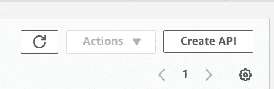

在下一个屏幕上，单击 REST API 部分下的 **Build** 按钮。

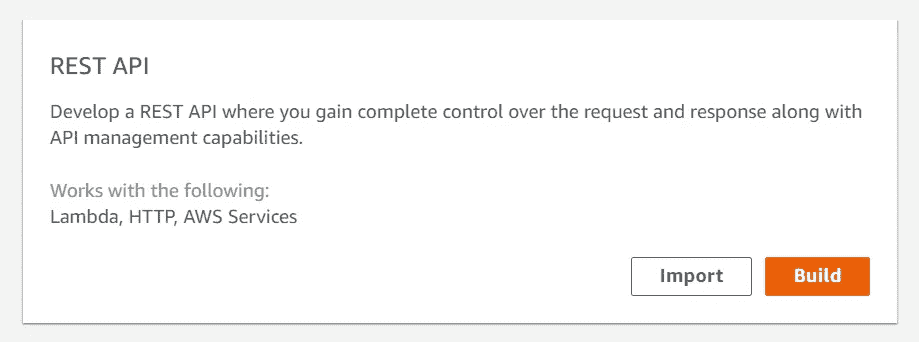

下一步，从命名您的新 API 开始—在本例中，我们称之为 Contact。然后点击**创建 API** 按钮。

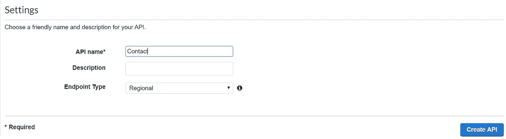

此时，API 的框架已经创建，但其中没有资源或方法(它有/但那只是 API 的根 URL)。资源是 API 上的 URL，相当于大多数 MVC 框架中的传统控制器。方法是可以在资源上执行 HTTP 方法，如 GET 或 POST。

在这个例子中，我们不会创建任何资源，但是我们会在根/资源上添加一个新的 POST 方法。选中/ resource，在顶部的 Actions 下拉菜单下选择 **Create Method** 。

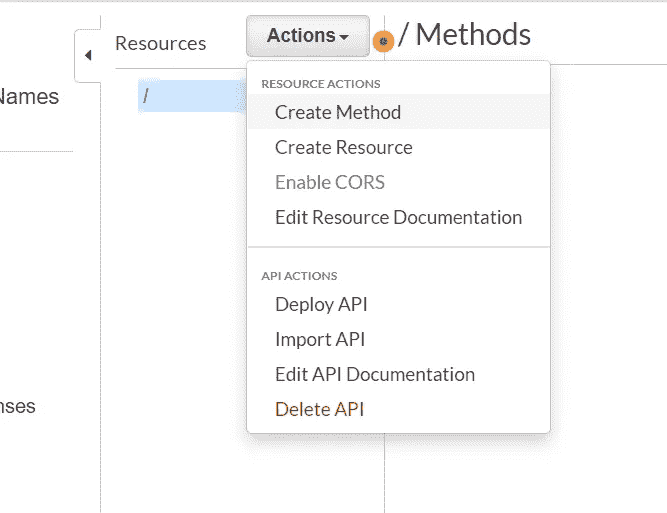

在下拉列表中选择**岗位**，然后点击**勾号**按钮。

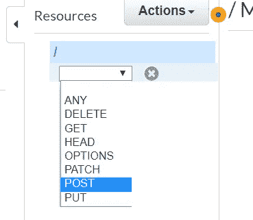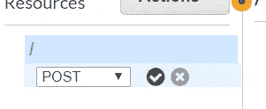

您将看到一个表单，您可以在其中选择希望这个新方法使用的集成。有许多选项可供选择，但在本教程中，我们将选择 AWS 服务并将此集成配置为 SES。填写下表，将执行角色 ARN 替换为您在上面的 IAM 部分中复制的 ARN。

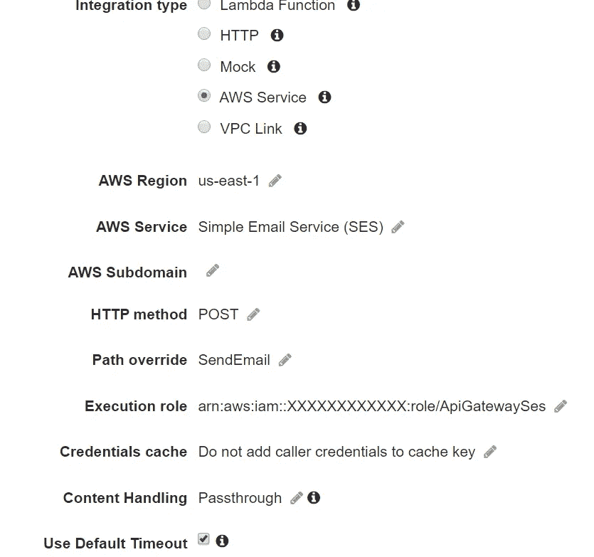

它在幕后所做的是对 SES AWS API 进行 REST API 调用(使用指定的执行角色),特别是 SendEmail 操作。您也可以集成任何其他有效的操作，但本教程只需要 SendEmail。

点击右下角的**保存**，新设置将被保存。屏幕将刷新，您将看到一个**集成请求**部分。点击那个。向下滚动到 **HTTP 标题**部分，点击**添加标题**按钮。

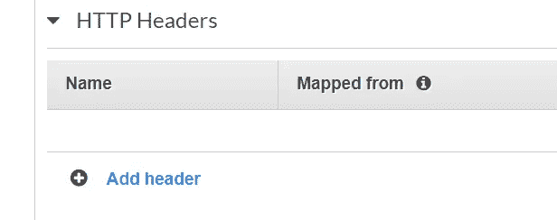

在名称中输入 Content-Type，在映射自字段中输入**‘application/x-www-form-urlencoded’**。您必须包括屏幕截图中显示的单引号。

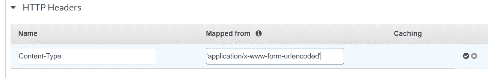

单击右侧的复选标记按钮进行保存。

这基本上是告诉 AWS 服务集成，当调用 SES API 时，我们希望发送带有内容类型 application/x-www-form-urlencoded 的有效负载，因为这是 API 所期望的。

保存后，向下滚动并展开**映射模板**部分。在**请求主体传递**部分，当没有定义模板时，选择**。**

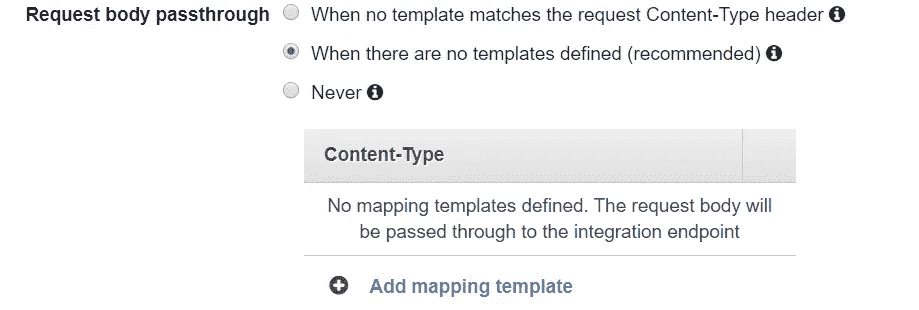

单击下面的**添加映射模板**文本，输入**应用程序/json** 然后单击复选标记按钮。

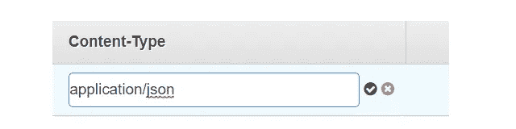

单击创建的新的**应用程序/json** 链接。

在这里，我们可以对发送电子邮件端点的实际调用进行格式化。API Gateway 使用一种来自 https://velocity.apache.org/engine/2.0/vtl-reference.html Apache[的叫做 VTL 的语言，尽管他们有一个更简单的版本。你可以在](https://velocity.apache.org/engine/2.0/vtl-reference.html)[https://docs . AWS . Amazon . com/API Gateway/latest/developer guide/API-Gateway-mapping-template-reference . html](https://docs.aws.amazon.com/apigateway/latest/developerguide/api-gateway-mapping-template-reference.html)了解更多关于 API Gateway 的 VTL 支持。

在单击 application/json 时打开的文本框中，添加以下文本:

```
Action=SendEmail&Message.Body.Text.Data=$util.urlEncode("
Name: $input.json('$.name')
Email: $input.json('$.email')
Phone: $input.json('$.phone')
Message: $input.json('$.message')")&Message.Subject.Data=Contact+form+submission&Destination.ToAddresses.member.1=recipient%40your_domain.com&Source=no_reply%40your_domain.com
```

然后点击**保存**。

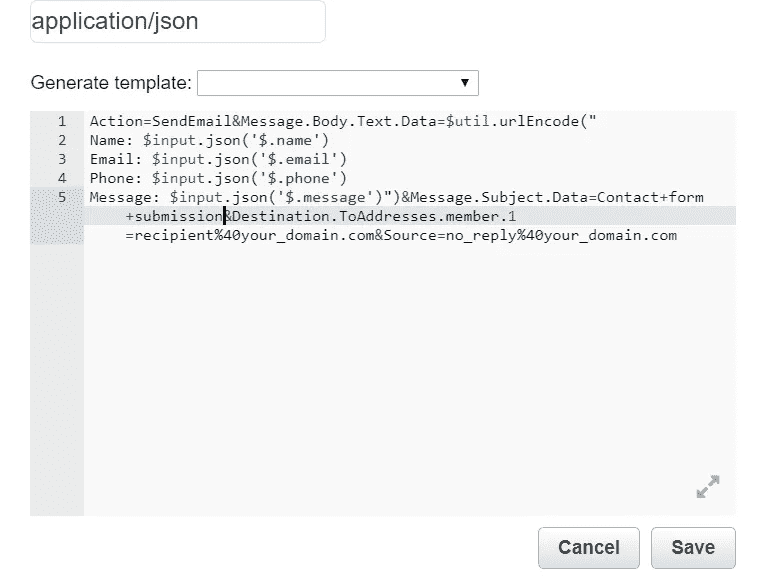

# 这是什么？

在我提到的教程的开始，我们将想要格式化对 SES 的调用。这就是发生的地方。虽然都在一行上，但我们可以将内容分成几个部分。

```
Action=SendEmail
```

我们必须指定这一点，因为集成需要一个动作。

```
&Message.Body.Text.Data=$util.urlEncode("The content you want to send in the text body of your message")
```

下一个参数是电子邮件的实际正文。出于演示的目的，我用一个简单的字符串替换了内容，这样您就可以看到实际值应该是什么。在上面的代码中，我们采用了各种 POST 主体字段，我们最终将发送我们的 API，并将其格式化为电子邮件主体。

```
Name: $input.json('$.name')
```

在主体中，我们添加了不同的部分。$input.json('$。name’)将被我们发送给 API 的 JSON 请求中的实际值所取代。所以如果我们把 Dave 作为名字，上面的字符串将变成

```
Name: Dave
```

我们对所有 4 个字段都这样做，因此最终值的示例是

```
Name: Dave
Email: daves@email.com
Phone: 1234567890
Message: Hi, I'm Dave
```

这是将通过 SES 作为电子邮件正文发送的值。

```
&Message.Subject.Data=Contact+form+submission
```

此参数指定要在电子邮件中发送的主题。

```
&Destination.ToAddresses.member.1=recipient%40your_domain.com
```

此参数指定要将电子邮件发送到的目标电子邮件地址。

```
&Source=no_reply%40your_domain.com
```

最后，源指定发送者的电子邮件地址/

既然集成已经就绪，我们现在可以部署 API 来生成一个可以集成的 URL。在屏幕顶部，您会看到一个**操作**下拉按钮。点击展开菜单，然后选择**部署 API** 。

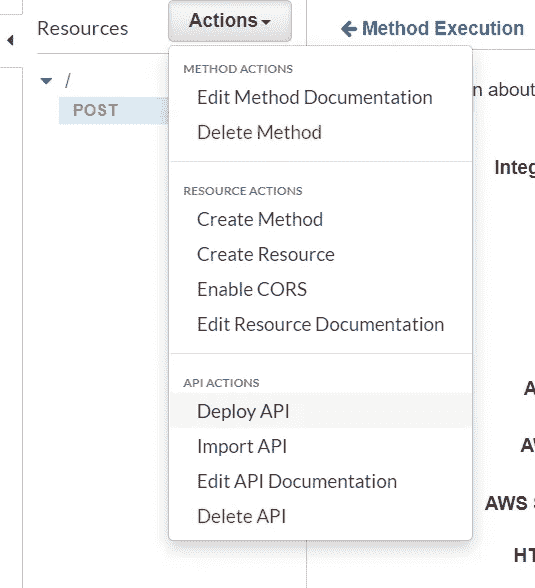

在弹出的模态窗口中选择**【新阶段】**，然后给阶段命名(在本例中为 live)。阶段名称实际上将是结果 URL 的一部分，因此要有选择性地选择。

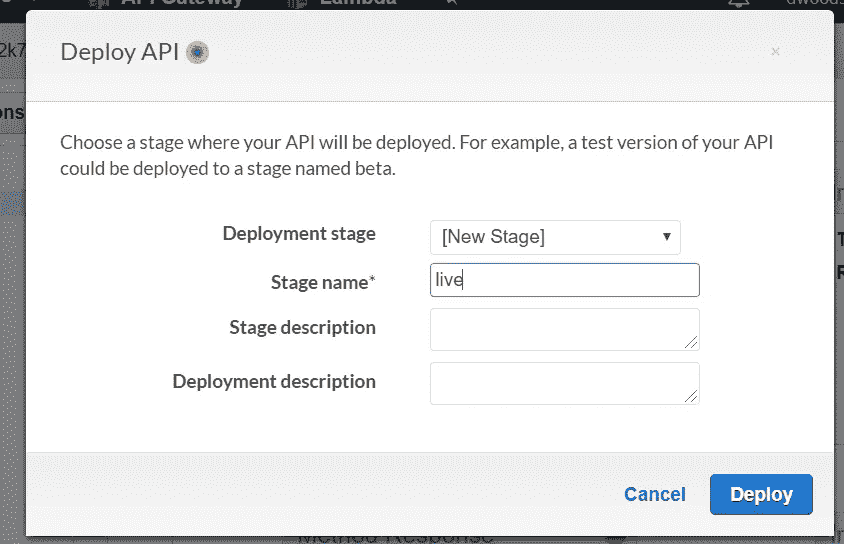

点击**部署**。然后你会被带到一个屏幕，在那里你会看到你可以用来点击你的 API 的 URL。


现在您已经有了 API URL，您可以向它发送一个测试有效负载。使用 Postman，或者您最喜欢的向表单发送 POST 请求的方法，发送以下 JSON 有效负载:

```
{
  "name": "Test Name",
  "email": "[test@test.com](mailto:test@test.com)",
  "phone": "123-456-7890",
  "message": "This is a test message!"
}
```

提交后，您应该会看到一封类似如下的电子邮件:

```
Name: Test Name
Email: [test@test.com](mailto:test@test.com)
Phone: 123-456-7890
Message: This is a test message!
```

祝贺您——您现在拥有了一个无服务器的联系人表单 API！