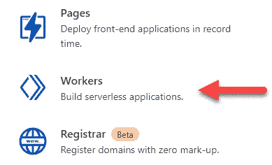

# 使用 Cloudflare Workers 创建短 URL 服务

> 原文：<https://levelup.gitconnected.com/creating-a-short-url-service-using-cloudflare-workers-b3092d427250>

## 在全球范围内即时部署无服务器代码


[图片来源:Unsplash](https://unsplash.com/photos/rzJKYpq2is4)

# 介绍

你是否曾经使用过像 bitly 或类似的短 URL 服务，并想知道它是如何工作的？更好的是，你想为自己创造一个吗？如果你对这两个问题的回答都是肯定的，那么你就来对地方了。在本文中，我们将看看如何使用 [Cloudflare Workers](https://workers.cloudflare.com/) 创建一个短 URL 服务。

# 什么是 Cloudflare Workers？

[Cloudflare Workers](https://workers.cloudflare.com/) 允许您将无服务器代码部署到 Cloudflare 的边缘网络，这意味着您的代码将在全球任何地方即时可用。你不必担心它的伸缩性，而且运行代码的成本非常低。Cloudflare Workers 附带了一个名为 [Workers KV](https://developers.cloudflare.com/workers/learning/how-kv-works) 的全局低延迟键值数据存储。在本文中，我们将使用 Workers KV 和 Cloudflare Workers。

# 步骤 1:注册 Cloudflare

访问 cloudflare.com 并注册一个免费账户。一旦您验证了您的电子邮件地址并访问了您的仪表板，您可能会看到一条添加站点的消息—您不需要添加站点，只需跳到仪表板页面并单击 **Workers** 。



由于这是您第一次使用 Cloudflare Workers，您将被要求设置一个子域。此子域名称对您来说是唯一的，并将标识部署到您帐户的所有员工。输入合适的子域，然后点击**设置**进入下一步。


在下一步中，我们将继续免费计划，因为我们将仅用于学习目的。最后一步，验证你的电子邮件，然后你就可以开始了。

在“Workers dashboard”页面中，您不会看到列出的任何员工，因为我们尚未创建任何员工。现在，只需复制应该在右侧面板中可见的**帐户 ID** 。


# 步骤 2:设置您的开发环境

我们将使用 Wrangler CLI 执行各种开发任务，因此，如果您尚未安装 CLI 工具，请按照本官方 Cloudflare 指南[在您的本地计算机上安装该工具](https://developers.cloudflare.com/workers/cli-wrangler/install-update)。

使用命令`wrangler login`使用 Wrangler CLI 工具登录您的 Cloudflare 帐户。建议使用管理员权限打开命令提示符。

这应该会在浏览器中打开 Cloudflare，您可能需要授权 Wrangler。Cloudflare 会在可以关闭页面时显示一条消息。回到控制台，您应该会看到一条消息，告诉您一切都已成功配置。

# 步骤 3:生成一些代码

在本地文件夹中，运行命令`wrangler generate shorturl [https://github.com/cloudflare/worker-template](https://github.com/cloudflare/worker-template)`基于 Cloudflare 的 [GitHub 存储库](https://github.com/cloudflare/worker-template)中的模板生成一些代码。


按照控制台输出中的指示，我们需要更新`wrangler.toml`文件，并向其中添加帐户 ID。根据[这个注释](https://github.com/cloudflare/wrangler/issues/209#issuecomment-541654484)，可以将`wrangler.toml`文件提交给源代码控制。此文件中包含的信息不敏感。

最后，如果您运行命令`wrangler dev`，您应该会看到下面的输出。


# 第四步:获得一个简短的网址并重定向

在`index.js`文件中，用下面的代码片段替换`handleRequest()`方法。我们从接收到的对象中获取整个请求 URL，然后从中获取路径名，然后简单地将用户重定向到 example.com，以相同的路径名作为后缀。例如，前往我们的开发人员 URL `127.0.0.1:8787/abc`会将用户重定向到`https://example.com/abc`。如果没有提供路径名，则在浏览器中打印一条简单的文本消息。使用命令`wrangler dev`对此进行测试。

# 步骤#5 用静态集合映射路径

下一步是使它稍微更有活力，并符合最终存储的样子。我们添加了`getRedirectURL()`方法，该方法简单地根据提供的键获取重定向 URL。在`handleRequest()`方法中，我们修改了一行来使用`getRedirectURL()`方法。

到目前为止，我们已经得到了一个静态的短 URL 列表和它们的重定向。现在是时候让它充满活力了。

# 步骤#6:设置 KV 存储

我们将使用 Cloudflare 的 KV 存储，而不是存储它重定向到的密钥和相应网站的静态列表。

让我们从运行命令`wrangler kv:namespace create “SHORTURLS”`开始，其中`SHORTURLS`是我用于 KV 名称空间的名称。该命令在控制台中打印一条消息，指示将 KV 配置添加到`wrangler.toml`文件中。


# 步骤 7:播种 KV 存储

为了快速测试我们的应用程序，让我们使用下面的命令向数据库中添加一条记录。

```
wrangler kv:key put --binding=<BINDING NAME> “<KEY>” “<URL>"
```

在我工作的仓库中，我已经将命令更新为`wrangler kv:key put --binding=SHORTURLS “twitter” “[https://twitter.com/clydedz](https://twitter.com/clydedz)"`。如果一切顺利，您应该会立即看到一条成功消息。

现在，如果您尝试运行命令`wrangler dev`,您应该会看到类似这样的错误消息:

> 错误:为了预览具有 KV 名称空间的 worker，您必须在您的配置文件中为您想要预览的每个 KV 名称空间
> 指定一个 preview_id。


在阅读了[这个有用的 GitHub 答案](https://github.com/cloudflare/wrangler/issues/1458#issuecomment-671465444)后，很明显我们需要的只是一个预览环境。当我们之前创建名称空间时，它与您的生产环境相关联。因此，当您使用`wrangler dev`进行测试时，它不允许您从开发环境中操纵生产 KV 存储。

# 步骤 8:设置预览 KV 环境

为了解决这个问题，我们需要像以前一样重复 KV 创建步骤，但是这次我们将添加参数`--preview`,表明我们需要一个预览，即创建开发实例。


因为我们输入了相同的 KV 名称空间名称，请注意主名称`id`仍然是原来的名称，除此之外，我们还被分配了一个`preview_id`。

如果您现在尝试运行应用程序，Worker 将会工作，但是前往`/twitter`不会将您重定向到 Twitter URL。这是因为我们只播种了 KV 名称空间的生产环境。既然我们已经连接到 preview，我们还需要用一个测试记录来播种这个 preview 名称空间。我将像以前一样运行下面的命令，但是这次我将添加`--preview`参数。

```
wrangler kv:key put --binding=SHORTURLS “twitter” “[https://twitter.com/clydedz](https://twitter.com/clydedz)" --preview.
```

# 步骤 9:从 KV 存储器中检索值

我们现在将更新`getRedirectURL()`方法，使用我们的 KV 名称空间来获取值，而不是本地静态集合。注意，我们写了`SHORTURLS.get()`来匹配我们的绑定名`SHORTURLS`。因此，如果您的绑定名称是`XYZ`，那么您应该将这个代码更新为`XYZ.get()`。我还将这个方法更新为异步的。

最后，让我们在本地运行应用程序进行测试。正如你在下面的 GIF 中看到的，它现在可以正常工作了。


# 步骤#10:自动化部署

我们不希望现在每次进行更改时都手动部署我们的 Cloudflare Worker，不是吗？对于自动化部署，我们将看一下 GitHub 动作，因为我的存储库已经在 GitHub 中受源代码控制。

## GitHub 工作流文件

GitHub 工作流文件是一个 YAML 文件，允许您通过代码配置构建和部署管道。我将解释我们在这个项目中使用了什么，但是如果你热衷于阅读更多关于 GitHub workflow 的内容，请在这里查看他们的官方文档。

让我们首先将下面的代码片段添加到一个名为`build-deploy.yml`的文件中，并将该文件存储在`.github/workflows/`文件夹中。

我们首先使用`name`关键字给它一个好听的描述性名称。然后，使用`on`关键字，我们配置这个管道在每次代码被推送到主分支时运行。

在这个文件的最后一部分，我们使用`jobs`关键字来定义一个作业，这个作业只是一批将要执行的步骤。关键字`deploy`只是这个作业的一个标识符，也可以被命名为其他名称。关键字`steps`包含了实现部署的各个步骤。

我们使用来自市场的 GitHub 动作 [actions/checkout](https://github.com/marketplace/actions/checkout) 来从我们的 Git 仓库中检查代码。接下来，我们使用 cloudflare 提供的[Cloudflare/wrangler-action](https://github.com/marketplace/actions/deploy-to-cloudflare-workers-with-wrangler)将我们的工作人员部署到 cloud flare。我们使用名为`CF_API_TOKEN`的 GitHub secret 变量，而不是硬编码 API 令牌，这是根据我们的 Cloudflare 帐户进行身份验证的步骤所必需的。前缀`secrets`和它周围的花括号只是访问 [GitHub 秘密](https://docs.github.com/en/actions/security-guides/encrypted-secrets)的语法。不要担心，我们将在下一步中添加这个秘密。

我们使用`workingDirectory`关键字将我们的 Cloudflare Worker 的工作目录设置为子目录(相对于根目录)，因为我们的 Worker 的代码不在根目录中，这通常是默认设置——下面将详细介绍这个决定。

## Cloudflare 令牌

导航到 Cloudflare 中的 [API 令牌页面](https://dash.cloudflare.com/profile/api-tokens)，然后单击**创建令牌**按钮。


从 API 令牌模板页面，我们将单击**编辑 Cloudflare Workers** 行项目旁边的**使用模板**按钮。


在下一页，从**帐户资源**和**区域资源**下拉列表中，选择您的帐户(电子邮件地址应该显示在这些下拉列表中)。如果您是多个 Cloudflare 帐户的用户，您需要小心选择正确的帐户。

继续总结，然后点击**创建令牌**按钮。复制令牌并安全保存。


## 在 GitHub 中添加秘密

由于我们已经在工作流文件中使用了变量`CF_API_TOKEN`，所以让我们在 GitHub 中添加一个同名的秘密。点击**设置**，然后点击**秘密**，再点击**新秘密**。键入秘密变量名`CF_API_TOKEN`，并在**值**字段中，输入我们之前生成的 Cloudflare API 令牌。点击**添加密码**按钮保存这些更改。


# 步骤#11:最终检查

现在，我们已经准备好了所有的项目，不要忘记提交和推送对工作流文件的更改。如果一切都设置好了，你应该在 GitHub 的**动作**标签中看到一次成功的运行。


现在，如果您转到 Cloudflare 帐户中的 Workers 页面，您应该会看到刚刚部署的 Worker 弹出在屏幕上。


转到 Worker URL，测试 URL 重定向是否有效。我们仍然可以测试`<URL of your Worker>/twitter`短 URL，因为我们之前已经植入了该数据。


# 下一步是什么？

## 单元测试

为了简洁起见，我们没有考虑编写单元测试和设置测试覆盖。然而，在实际的解决方案中，您可能希望考虑对代码进行单元测试，并且在 CI/CD 管道中包含必要的步骤。

## 添加更多员工

在上面的文章中，我们只看到了一个在我们提供了一个短 URL 之后将我们重定向到目标 URL 的 Worker。如果你想创建一个成熟的短 URL 服务，你也想创建一个允许我们创建一个新的短 URL 映射的服务，它将作为后端，并且可能是一个微服务，它将帮助发布短 URL 上的每次点击的分析，并且也取回这些分析。


作者绘制的手绘示意图

## 源代码控制多个工作线程

您不必创建不同的 Git 存储库来托管每个 Cloudflare Worker。您可以为所有员工创建 monorepo，并为每个员工创建包含内容的子文件夹。如果您在不同的工作人员之间共享代码，这将非常有用，这样您就不会重复代码。


作者绘制的手绘示意图

## 捆绑到单个 JavaScript 文件中

我们还在一个文件中编写了所有的 JavaScript 代码，这并不理想。开箱即用，我们不能将另一个 JavaScript 文件导入到我们工人的`index.js`文件中。为了解决这个问题，我们可以从最终生成的 Worker JavaScript 文件中分离出源代码。我的意思是(如上所述)，例如，我们在一个名为`src`的文件夹中维护一个工人的源代码，然后运行一个类似 [webpack](https://webpack.js.org/) 的过程，将一个 JavaScript 文件捆绑并生成到一个目标文件夹中，我们称之为`dist`。该目标文件夹的内容就是我们随后可以发布到 Cloudflare 的内容。

## 自定义域

如果您正在构建一个完整的解决方案，您可能还会考虑为您的员工设置一个自定义域名——这确实是可能的，您的最终解决方案可能会类似于下图，使用 bit.ly 作为参考域名。


作者绘制的手绘示意图

# 源代码

如果你想看这个项目的完整源代码，可以在 [GitHub](https://github.com/ClydeDz/shorturl-cloudflare-workers) 上找到。在同一个存储库中，您还会发现一个 [PowerShell 脚本](https://github.com/ClydeDz/shorturl-cloudflare-workers/blob/main/cloudflare.ps1)，它包含了我们上面使用过的所有命令。

就是这样。感谢阅读。