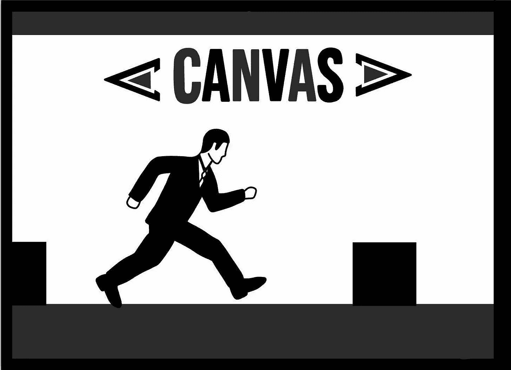
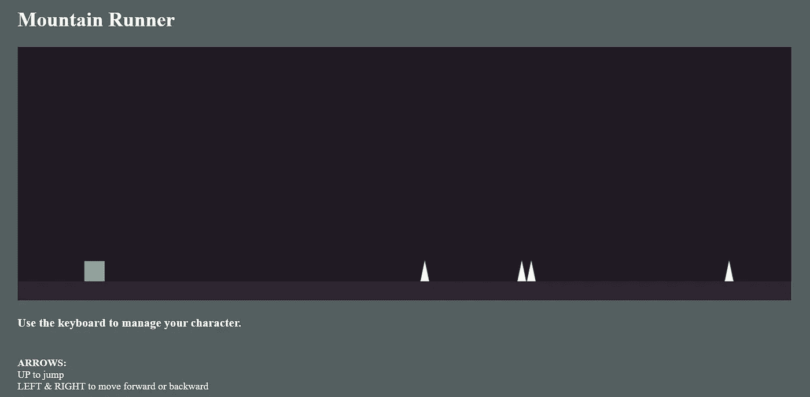

# 用 HTML5 和 JavaScript 创建一个简单的 2D 游戏

> 原文：<https://levelup.gitconnected.com/creating-a-simple-2d-game-with-html5-javascript-889aa06035ef>



为了理解本文中的代码，您应该熟悉 JavaScript，并了解 HTML5 Canvas 的基础知识。

如果您还不熟悉 Canvas，那么在继续之前花几分钟时间浏览一下这篇介绍性文章会很有帮助。

# 我们在建造什么？

**最终产品将是一个简单的 2D 侧滚游戏。**



*   简单的概念，明确的目标:玩家在前进时会遇到“障碍”,应该跳起来避开它们。
*   向前跑、向后跑和跳跃动作由键盘上相关的光标键(箭头)控制。
*   我们将保持画布元素不复杂(只是正方形和三角形)，这样我们可以更好地关注元素运动和“无尽的奔跑”效果，这实际上使这感觉像一个真正的游戏。

# 搭建舞台

在我们查看实际的“游戏”代码之前，我们需要设置我们的项目文件并创建我们打算使用的 canvas 元素。

1.  我们将需要 index.html、 **game.js** 和 **game.css** 文件。

**首先:**

创建一个 index.html 并包含显示的代码。

*   确保在 index.html 中链接了样式表和 javascript 文件。
*   我们在 HTML 的主体中创建 canvas 元素。我们将在别处为它处理任何样式和尺寸。
*   你给你自己的游戏起什么名字并不重要，只要包括相同的说明，告诉玩家他们可以使用哪些控件来玩游戏。

**下一步:**添加您喜欢的任何页面样式，包围将保存所有游戏内容的画布区域。

你可以从上面的图像中看到，在我们的例子中，我们将画布放在页面的中心，CSS 文件中唯一真正发生的样式将是我们包含的其他几个元素的背景和文本颜色。

**最后:**添加你的 **game.js** 文件，准备开始构建你的游戏！

这里跳过详细的解释，因为到本文的这一点，你要么已经掌握了画布知识，要么已经通过页面顶部的[链接](https://link.medium.com/9VvfHzjBg8)掌握了基础知识。

简而言之:

*   在 JavaScript 中，我们需要做的第一件事是定义画布的上下文；结果是，获得了所有返回的方法以及更多我们在 2D 创建时需要的方法。
*   下一步是调整画布元素的大小。如果我们不指定新的宽度和高度，元素默认为*300 px***W****x***150 px***h .**
*   当然，您可以选择自己的尺寸，以更好地适应您想要构建的游戏或您的游戏将被添加到的页面，但要知道，在我们的代码中有几个稍后使用的值完全是根据我们在示例中设置的尺寸计算的(*1120***W****x***400***H**)。
    你对画布尺寸所做的任何改变都需要反映在你为元素设置的坐标值中。

以上代码之后的所有内容都将针对我们的游戏。

# 创建玩家元素

在游戏中代表玩家的方块将被存储为一个对象。我们将在整个代码中使用这个对象来:

*   更新作为正方形当前位置的坐标属性
*   确定方块当前是否在空中
*   确定方块是向前还是向后移动
*   保持正方形的高度和宽度(设置大小)

```
const square = { height: 32,
  jumping: true,
  width: 32,
  x: 0,
  xVelocity: 0,
  y: 0,
  yVelocity: 0};
```

# 创建玩家的控制器

控制器也将被表示为一个对象，并将跟踪玩家当前正在按下的键(允许我们确定在画布中采取哪个动作)。

我们根据与左、右和上箭头键相关联的键码来检查键侦听器的事件类型。

```
const controller = { left: false,
  right: false,
  up: false, keyListener: function (event) { let key_state = (event.type == "keydown") ? true : false; switch (event.keyCode) {
      case 37: // left arrow
        controller.left = key_state;
        break;
      case 38: // up arrow
        controller.up = key_state;
        break;
      case 39: // right arrow
        controller.right = key_state;
        break;
    }
  }
};
```

# 创建促进动画的“循环”

下一步是非常具体的一步。

循环函数将是我们:

*   不断检查玩家正在用他们的控制器做什么，并相应地动画化玩家的方块(方向、速度、奔跑或跳跃)。
*   应用“重力”和“摩擦”效果，这将改变玩家方块的速度，并允许它以真实的方式移动。
*   处理玩家的方块向左或向右退出屏幕的情况，并建立无限滚动行为。
*   绘制并填充组成游戏的所有画布形状，最初，以及每个新帧的动画。

1.  因此，让我们从设置条件块开始，这些条件块将通过调整正方形对象的速度值或将跳跃标志设为 true 来模拟玩家触发的正方形移动。

```
const loop = function () { if (controller.up && square.jumping == false) {
    square.yVelocity -= 20;
    square.jumping = true;
  } if (controller.left) {
    square.xVelocity -= 0.5;
  } if (controller.right) {
    square.xVelocity += 0.5;
  }
```

— — — — — — — — — — — — — — — — — — — — — — — — — —

2.接下来，我们添加重力和摩擦效果。一旦添加了它们，它们在动作中不会很突出，但是没有它们，动画看起来会很颠簸和笨拙。

```
 square.yVelocity += 1.5; // gravity square.x += square.xVelocity; square.y += square.yVelocity; square.xVelocity *= 0.9; // friction square.yVelocity *= 0.9; // friction
```

— — — — — — — — — — — — — — — — — — — — — — — — — —

3.在此之后，我们必须开始处理游戏的特征，这些特征将会在观看动画在屏幕上运行的方式时变得明显。

首先，我们需要保证方块永远不会“落到”我们确定要穿过的“地面”以下。

```
 // if the square is falling below floor line, then: if (square.y > 386 - 16 - 32) { square.jumping = false; square.y = 386 - 16 - 32; square.yVelocity = 0; }
```

这里，方块的 y 坐标的当前值永远不应该大于表示地线“顶部”的 y 坐标(从中减去跳跃的高度和方块的高度)。

**如果是**，我们停止方块的跳跃，将方块的 y 坐标设置为它无法超越的值的 y 坐标，停止方块的“下落”(将 y 速度设置回 0)。

第二，我们需要保证当玩家的方块退出到游戏窗口的任何一边时，我们能够控制会发生什么。在这种情况下，我们设置它把玩家带回来，从他们离开的对面进入。

```
 if (square.x < -20) { square.x = 1220; } else if (square.x > 1220) {  // if the square goes off the right square.x = -20; }
```

— — — — — — — — — — — — — — — — — — — — — — — — — —

4.接下来绘制形状，包括背景、地面层、玩家广场(以及本文后面的障碍物)。这也包含在循环函数中，因此它运行并重新绘制每个动画帧上的形状。

```
 // Creates the backdrop for each frame context.fillStyle = "#201A23"; context.fillRect(0, 0, 1220, 400); // x, y, width, height // Creates and fills the cube for each frame context.fillStyle = "#8DAA9D"; // hex for cube color context.beginPath(); context.rect(square.x, square.y, square.width, square.height); context.fill(); // Creates the "ground" for each frame context.strokeStyle = "#2E2532"; context.lineWidth = 30; context.beginPath(); context.moveTo(0, 385); context.lineTo(1220, 385); context.stroke();
```

— — — — — — — — — — — — — — — — — — — — — — — — — —

5.我们向浏览器发出信号，表示我们已经准备好执行动画，并且在下一次重画之前，浏览器应该使用循环函数更新动画。

```
// Updates when called to tell the browser it is ready to draw againwindow.requestAnimationFrame(loop);
```

requestAnimationFrame 方法的一个规则是，您传递给它的回调函数必须在它自身内部调用 requestAnimationFrame
(如果您想在下一次重画时动画显示另一帧)。

# 创建事件监听器

## (& KICKSTART 动画循环)

我们为控制器对象中的必要键设置了 keyup 和 keydown 事件侦听器。

```
window.addEventListener("keydown", controller.keyListener)window.addEventListener("keyup", controller.keyListener);
```

然后，我们通过添加 requestAnimationFrame 的初始调用来启动动画循环，提供循环函数作为回调。

```
window.requestAnimationFrame(loop);
```

# 下一步:障碍

在这个阶段，我们几乎完成了。你会看到你是否遵循了你自己的代码版本，你有一个玩家控制的可以移动和跳跃的方块，以及一个看起来永远持续的背景。

然而，我们忽略了等式中的一个关键部分，那就是玩家需要面对的障碍。为了进行必要的调整来创建它们，我们只需在已经编写好的代码中添加一两件事情

1.  首先，我们需要重温代码的最开始。
    在上下文定义下方和 square 声明上方的空白处，我们需要添加以下内容:

```
// Start the frame count at 1 (also level 1)
let frameCount = 1;// Set the number of obstacles to match the current "level" number
let obCount = frameCount;// Create a collection to hold the randomly generated x coordinates
const obXCoors = [];
```

我们希望跟踪帧数，就我们对游戏幕后的关注而言，这相当于关卡。
我们也想设置障碍的数量随着等级的增加而直接增加。
最后，我们希望建立一个存储空间来保存我们随机生成的 x 坐标，并使用它在每个新帧上动态放置障碍物。

— — — — — — — — — — — — — — — — — — — — — — — — — —

2.有一种简单的方法可以让我们知道用户何时完成了一个“级别”并开始了一个新的级别，而且它实际上已经在现有的代码中设置好了。

我们知道，如果用户从右边退出游戏窗口，那么他们将从左边重新进入，这将代表一个新的关卡开始了。因此，我们希望有一些函数在这种情况下可以调用。

* *作为一个旁注，解释为什么我们不能简单地在用户退出屏幕时画出障碍物体*:T**画出形状的顺序*有关系吗？*** *因此，我们可以提前创建我们的随机坐标，但必须等到*背景和其他形状绘制完成后再绘制障碍物。*****

```
*// Create the obstacles for each frameconst nextFrame = () => { // increase the frame / "level" count frameCount++; for (let i = 0; i < obCount; i++) { // Randomly generate the x coordinate for the
       top corner start of each triangle obXCoor = Math.floor(Math.random() * (1165 - 140 + 1) + 140); obXCoors.push(obXCoor); }}*
```

*   *增加帧数(我们认为这意味着已经达到了下一个级别)，这将增加下一个场景中的障碍物的数量。*
*   *开始迭代，直到障碍物的当前计数。*
*   *在 140 和 1165 的 x 坐标之间产生那个数量(障碍计数)的随机 x 坐标
    “随机的”——选择这些坐标是为了确保没有障碍会出现在离游戏窗口的开始太近的地方，或者正好在游戏窗口的结尾(对玩家来说完全不公平且不可能被击败)。*
*   *将每个 x 坐标添加到坐标集合中，以便稍后可以在循环函数中动态绘制障碍物形状。*

*— — — — — — — — — — — — — — — — — — — — — — — — — —*

*3.一个非常小的调整，我们需要将 nextFrame()的调用添加到验证播放器正在退出窗口右侧的条件中*

```
*} else if (square.x > 1220) {// if square goes past right boundarysquare.x = -20;nextFrame();}*
```

*(这个条件的其余部分已经在您的代码中，我只在这里显示它，以便您可以在上下文中看到 nextFrame 方法调用。)*

*— — — — — — — — — — — — — — — — — — — — — — — — — —*

*4.实际的**最终的**变化是将障碍物形状的绘制部分添加到循环函数体的正确区域。我们将把它插在正方形抽屉的下面，地面抽屉的上面。*

```
 *// Create the obstacles for each frame // Set the standard obstacle height const height = 200 * Math.cos(Math.PI / 6); context.fillStyle = "#FBF5F3"; // hex for triangle color obXCoors.forEach((obXCoor) => { context.beginPath(); // (x = random, y = coor. on "ground")
    context.moveTo(obXCoor, 385); // (x = ^random + 20, y = coor. on "ground")
    context.lineTo(obXCoor + 20, 385); // (x = ^random + 10, y = peak of triangle)
    context.lineTo(obXCoor + 10, 510 - height); context.closePath(); context.fill(); });*
```

*   *计算所有障碍物的标准高度*
*   *对随机生成的 x 坐标集合进行迭代，这将确定障碍物在地面上沿窗口宽度出现的位置。*
*   *将每个 x 坐标值偏移一致的值(20 和 10 ),以绘制相同大小的等边三角形，而不管 x 坐标是什么。*

# *最后的结果*

*在我们介绍了所有内容之后，您的 game.js 文件应该如下所示:*

*   *玩家可以向前或向后移动和跳跃。*
*   *玩家的动作和移动会看起来流畅而逼真。
    -当方块从跳跃中落回时，存在影响方块的“重力”
    -当方块向前或向后滑动时，存在影响方块的“摩擦力”
    -按住向前或向后箭头，同时仍然按住另一个箭头，将会减慢然后立即停止方块的运动，因为两个相互冲突的力同时作用在物体上。*
*   *对于一个简单、快速的效果，障碍物的数量将与当前的“级别”相匹配(玩家每次通过另一帧时，级别都会增加)。*

# *结论:*

*现在你有了它，一个用 JavaScript 和 HTML5 画布制作的基本的 2D 侧边滚动条！*

*这篇文章的主要目的是展示开始制作某种游戏是多么容易；当它经常看起来像一个相当令人生畏的基础学习时，仅仅为了进入游戏开发的世界就必须完成。*

***一些快速改进游戏的建议和后续步骤:***

*   *在屏幕上添加一个指示器，通知玩家他们当前所处的“等级”。*
*   *添加一个[形式的碰撞检测](https://developer.mozilla.org/en-US/docs/Games/Tutorials/2D_Breakout_game_pure_JavaScript/Collision_detection)；所以玩家如果撞上一个或者一定数量的障碍物就会丢分或者直接失败。*
*   *优化新障碍的生成:
    -让新障碍的数量每两级增加一次，而不是每一级增加一个。
    -提高障碍物位置的随机性，限制它们聚集在一起的次数。*
*   *添加一些音乐或其他效果，如灯光，以改善玩家的体验。*

*有很多方法可以定制和改进我们开发的游戏，如果你在这个项目中玩得开心(像我一样)，并且很想知道下一步会发生什么，你可以学习很多技术。*

## *感谢您的阅读！*