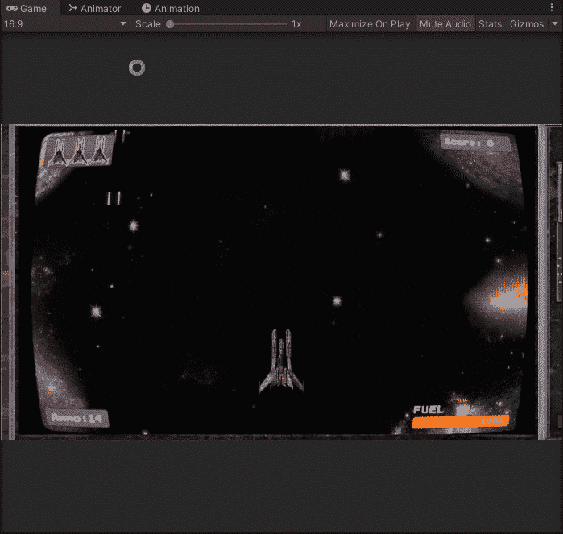
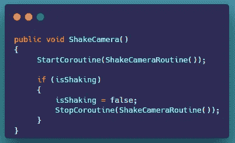

# 当玩家在 Unity 中受到伤害时，创建一个简单的相机抖动。

> 原文：<https://levelup.gitconnected.com/creating-a-simple-camera-shake-when-the-player-takes-damage-b6f67452510f>

**概述:**

今天，我们将创建一个当玩家受到伤害时的相机抖动效果。

**相机抖动:**

我们需要创建一个新的脚本，并将其附加到主摄像机上。

1.  在新脚本中，我们需要创建一些变量。摇动时我们需要一个浮子。一个动画曲线，用于一个随机向量和一个 bool 来判断我们的相机是否在抖动。

2.接下来，我们创建一个带有 while 循环的协程，它将在我们设置的时间内摇动摄像机。

3.我们还需要创建一个新方法，用于启动我们将从播放器脚本中调用的协程。

4.在播放器脚本中，我们需要创建一个对相机抖动脚本的引用。在 start 方法内部，我们可以使用 GameObject。Find 找到主摄像头，拿到剧本。

5.在我们检查当前生活的损坏方法中，我们称之为相机抖动方法。

我们现在应该有一个漂亮而简单的相机抖动效果。

本文到此为止。

感谢您的时间和关注。