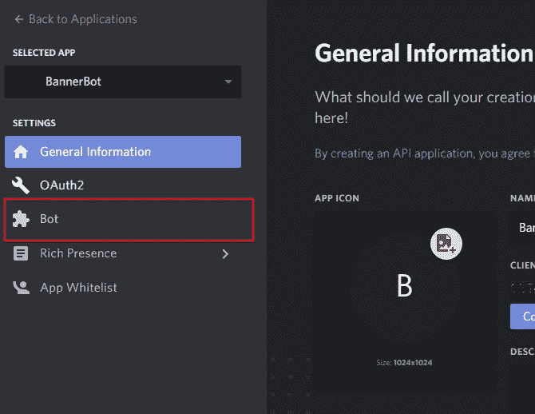
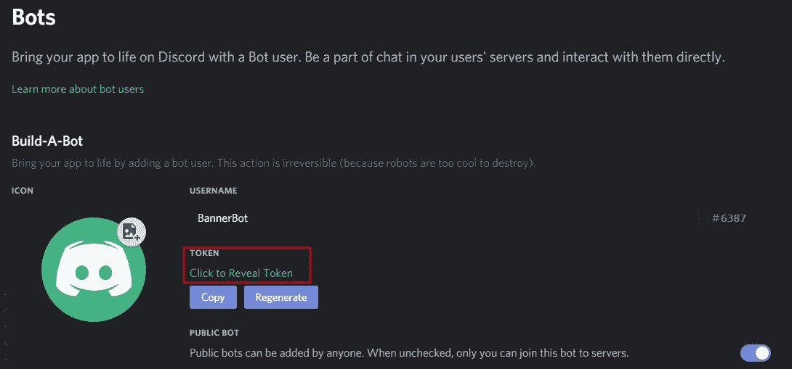
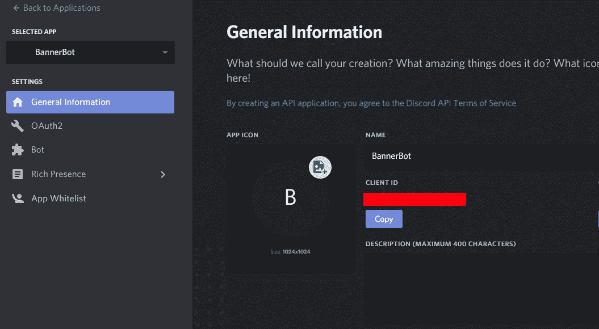

# 用 Discord.js 创建一个简单的 Discord Bot

> 原文：<https://levelup.gitconnected.com/creating-a-simple-discord-bot-with-discord-js-7b389da3d387>


在这篇文章中，我将带您浏览使用 discord.js 模块为您的 Discord 服务器创建一个简单机器人的步骤。discord.js 是一个 node.js 模块，允许您轻松地与 Discord API 进行通信。更多信息可以在 [discord.js 网站](https://discord.js.org/#/)上找到，该网站吹捧该模块非常可用和一致，同时还提供了 100%的 Discord API 覆盖率。

有不少关于制作不和谐机器人的教程，但我最终使用了一些不同的来源，从博客帖子到 StackExchange 问题，来启动和运行我的简单机器人。因此，我决定将我的发现收集到一个单一的综合职位。

# 目的

我的意图是创建一个可以做*任何事情*的机器人，只是为了掌握使用 Discord API 的窍门。作为 [Mount & Blade: Warband](https://www.taleworlds.com/en/Games/Warband) (这是我的 Steam 库中玩得最多的游戏)的忠实粉丝，我决定创建一个机器人，它会宣布距离其续集[Mount&Blade II:banner land](https://www.taleworlds.com/en/Games/Bannerlord)发布还有多少天。

对于那些不知道的人来说，在 Mount & Blade 社区中，发布日期在某种程度上是一个迷因。这款游戏于 2012 年发布，此后一直在开发中。直到最近才宣布了“2020 年 3 月”的软发布日期。在发布日期宣布之前，社区成员会开玩笑说要等待游戏发布，类似于《半条命 3》的做法。

# 创建机器人

## 1.下载 node.js

Node.js 是一个强大的 JavaScript 运行时，旨在构建高度可伸缩的网络应用程序。它是一个基于谷歌 Chrome 的 V8 引擎的服务器端平台。这个框架可以在这里[下载](https://nodejs.org/en/)，这将允许您安装 node.js 并从您的环境(Windows、Linux 或 MacOS)中的终端运行它的默认包管理器 npm。

## 2.创建 Bot 目录/文件

为了保持有序，我们将创建一个单独的文件夹来保存我们的机器人的所有文件；总共三个文件。为你的机器人目录选择一个名字和位置，我为这个项目中的几乎所有东西选择了名字 *BannerBot* 。我们需要这个机器人的 3 个文件: *auth.json，bannerbot.json，*和 *bannerbot.js* 。

## 3.安装依赖项

我们将要创建的机器人依赖于 discord.js(如上所述)和 *winston* 。 *winston* 是一个通用日志库，支持多种*传输*(即写入日志的存储设备)。但是，如果您愿意，winston 可以从依赖列表中排除，因为我们将把我们的日志记录信息输出到控制台，这可以通过 JavaScript 的 *console.log(…)* 方法来完成。

要安装这些依赖项，请打开您的终端并执行以下命令:

> npm 安装 winston discord.js

**注意:**在安装依赖项之前，请确保您位于打算存储 bot 文件的目录中。

## 4.创建机器人

要运行这个机器人，你需要一些来自 Discord 的令牌，这些令牌允许你使用 Discord 的 API。首先，您需要在您的 Discord 开发者页面上创建一个应用程序:

[https://discordapp.com/developers/applications/](https://discordapp.com/developers/applications/me)

在这个页面上，选择*新应用*并将你的应用命名为我的 BannerBot。(虽然当我第一次将它添加到我的 Discord 服务器时，我哥哥认为这是一个我会用来禁止人们的机器人，所以请负责任地命名。)

一旦你有了一个应用程序设置，你应该能够选择右边菜单上的*机器人*选项:



## 5.授权令牌

要在 Discord API 中使用 discord.js 的钩子，我们需要获得机器人的令牌。默认情况下，这个令牌是隐藏的，因为它对于开发者来说应该是私有的。除了你自己，这应该对每个人保密，因为我们实际上将令牌保存在一个与你应该保护的机器人逻辑分开的文件中。

我们感兴趣的密钥可以在右边菜单的 *Bot* 选项卡中的 Bot 用户名下找到:



从这里继续点击*复制*或显示令牌并用键盘/鼠标复制它。

## 6.将 Bot 添加到服务器中

现在，机器人必须添加到您的不和谐服务器。为此，您将需要 Discord 仪表板中的客户 ID。下面你可以看到你的客户 ID 在哪里。



以下 URL 可用于将 bot 添加到您的服务器

> [https://discordapp.com/oauth2/authorize?&client _ id = CLIENTID&scope = bot&permissions = 8](https://discordapp.com/oauth2/authorize?&client_id=CLIENTID&scope=bot&permissions=8)

其中 CLIENTID 替换为您在上面复制的客户端 ID。如果 bot 成功添加，在您的 Discord 服务器中应该会有一条消息(默认情况下),并且应该在服务器的右侧显示为用户。

## 7.Bot 逻辑和 JSON 配置文件

下面，将解释第 2 节中定义的文件结构，并创建和完成我们需要的三个文件。

auth.json :这个文件保存了我们的 bot 的令牌，它应该是私有的。文件的内容应该是:

```
{ "token" : "YOUR TOKEN HERE" }
```

*bannerbot.json:* 包含了 Discord bot 的配置。我的内容在下面，你的可能看起来有点不同。

```
{ 
    "name": "bannerbot", 
    "version": "1.0.0", 
    "description": "M&B Bannerlord Countdown", 
    "main": "bannerbot.js", 
    "author": "A. Morast", 
    "dependencies": {} 
}
```

*bannerbot.js* 是机器人的面包和黄油。这个文件包含 JavaScript 逻辑，让机器人登录到 Discord，找到今天和 Bannerlord 发布日期之间的差异(在正确的场合)，并将消息发送到特定的 Discord 聊天频道。文件的开头应该是这样的:

这段代码只是设置。它加载我们需要的几个库，并为机器人获取我们的身份验证令牌。然后，它通过添加控制台传输来配置记录器。如前所述，可以跳过/替换记录器。

接下来，我们需要为 Discord 客户端对象发生的特定事件定义一些回调。

这段代码定义了当客户端准备好(登录和设置)并且运行 bot 的 Discord 服务器收到消息时该做什么。

每当在安装了机器人的 Discord 服务器中发送消息时，就会调用回调函数 *message* 。该函数将查找以感叹号开头的消息，并根据下面的文本执行操作。在这种情况下，如果用户键入*！当*进入文本聊天时，机器人将回复发布日期前的天数。

接下来，我们需要一个函数来实际发送消息。

此逻辑计算当前日期和 2020 年 3 月 1 日(Bannerlord 的“发布日期”)之间的时间(以天为单位)。然后是*，“< num* ber_days > *天，直到 Bannerlord。”*打印到指定的聊天室。

最后，我们需要让机器人真正登录到 Discord 来开始监听和打印消息。这是通过

这应该是我们启动和运行机器人所需要的一切。完整的代码可以在这篇文章的底部找到。

## 8.运行机器人

现在我们已经有了逻辑，配置文件也设置好了，是时候运行我们的 bot 了。为此，在您选择的系统上打开一个终端，导航到 bot 的目录，然后键入

> 节点。/bannerbot.js

一旦机器人准备就绪，这将启动机器人并显示一些日志消息。现在你应该可以输入*！当*在你的 Discord 服务器上看到离 Bannerlord 发布还有多少天。

扩展 bot 的两种方法是为不同的命令添加附加的 switch 语句用例，前面加一个感叹号，并更智能地决定在哪里打印 bot 的消息。

干杯！

## 9.完整代码

*原载于 2019 年 10 月 13 日*[*【https://www.anthonymorast.com】*](https://www.anthonymorast.com/blog/2019/10/13/creating-a-simple-discord-bot-with-discord-js/)*。*