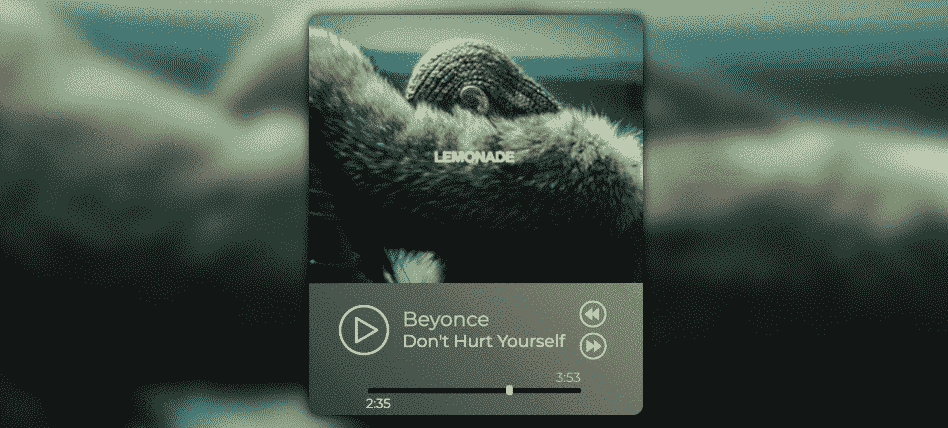
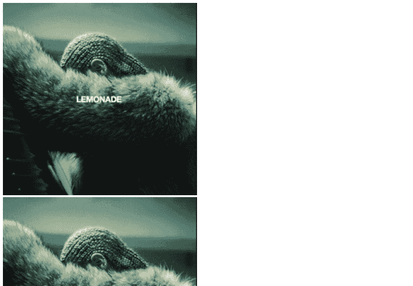
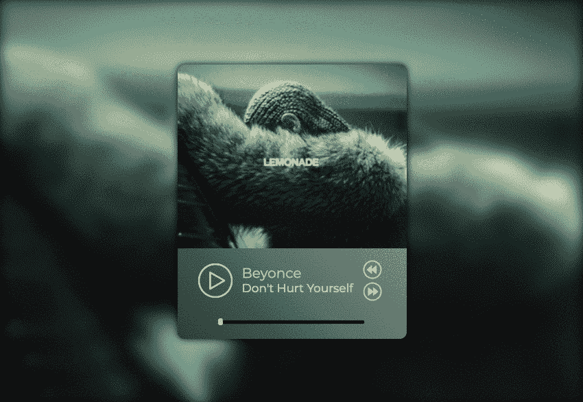
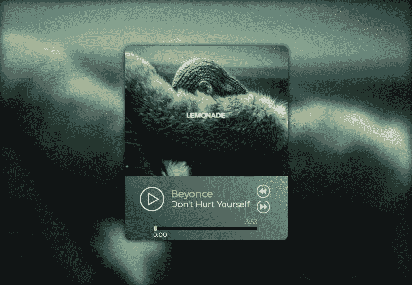

# 用 JavaScript 创建一个简单的音乐播放器

> 原文：<https://levelup.gitconnected.com/creating-a-simple-music-player-with-javascript-e825d93adff3>

我们没有意识到我们对媒体的体验在多大程度上受到其界面设计的影响。每天，我们通过各种播放器来体验音频和视频媒体。您的电视机需要导航播放器界面才能观看您喜爱的节目和电影。您的手机通过其音乐播放器界面将您连接到一个音乐世界。今天，我们将通过用 JavaScript 创建一个简单的音乐播放器来挖掘播放器界面的强大功能。



作为一名新的 JavaScript 开发人员，我倾向于构建应用程序的功能，但是如果没有基本的视觉和架构，设计和用户体验决策会变得更加困难。因此，让我们从构建基本架构开始，重点关注三个主题:

1.  HTML(为音频、播放器按钮和音乐信息添加元素)
2.  CSS(为 HTML 文件中定义的每个元素添加样式)
3.  JavaScript(点击 HTML 元素时添加功能)

首先，我们需要写出代表简单音乐播放器初始状态的 HTML 代码。当想到播放器时，脑海中浮现的主要组件有:

**音轨** 可以通过在音频标签的 src 属性中提供路径来加载音轨。我们将分配一个 ID，允许我们通过 JavaScript 更改曲目。

```
<audio src="./assets/music/beyonce.mp3" id="song"></audio>
```

**专辑封面** 专辑封面将有一个“缩略图”的 ID，我们将通过 CSS 修改专辑封面的大小和位置。我们稍后将通过 JavaScript 更改专辑封面。

```

```

**播放/暂停按钮**

*   按钮是一个带有 ID 的图像，允许我们通过 CSS 改变它在页面上的位置。
*   ***onclick*** 事件是一个 JavaScript 事件，当点击 Play 按钮图像时将执行 playPause()函数。当点击播放按钮时，playPause()函数将交换图像(play.png->pause.png)。

```

```

**下一个/上一个按钮**

*   按钮是带有 ID 的图像，允许我们通过 CSS 改变它在页面上的位置。
*   ***onclick*** 事件是一个 JavaScript 事件，当图像被点击时，它将执行 next- and previousSong()函数。

```


```

**进度条(能够改变轨道位置)**

*   音轨的进度条本质上是一个线性标尺，对应于音频的元数据。
*   元数据本身包含有关音频对象的信息，如轨道的当前时间和持续时间。
*   ***onchange*** 事件是一个 JavaScript 事件，当用户拖动音乐拇指改变音轨的 **currentTime** 时，调用 **changeProgressBar** 函数。

```
<input
  type="range"
  id="progress-bar"
  min="0"
  max=""
  value="0"
  onchange="changeProgressBar()"
/>
```

从结构的角度来看，我们需要 DIV 元素来封装播放器的特定部分，以使不同组件的样式和排列更加容易。下面加粗的项目是通过 DIV 元素和音轨信息添加到我们的音乐播放器中的。

```
<!DOCTYPE html>
<html>
<head>
  <title>Music Player</title>
</head><body>
  ****
  <audio src="./assets/music/beyonce.mp3" id="song"></audio> **<div class="container">
    <div class="box"></div>** 
    
    
     **<div class="song-artist">Beyonce</div>
    <div class="song-title">Don't Hurt Yourself</div>** <!-- Input element for progress bar - min=0 starting value of  
    every song - max length will change per song so leave empty -->
    <input
      type="range"
      id="progress-bar"
      min="0"
      max=""
      value="0"
      onchange="changeProgressBar()"
    /> **<div class="currentTime"></div>
    <div class="durationTime"></div>
  </div>** </body>
</html>
```

除了“容器”和“盒子”之外，上述 DIV 元素中的每个类都描述了将出现在元素中的数据类型。容器是将捕获音乐播放器的每个组件的桶。框是播放/暂停、下一个和上一个按钮以及音轨信息的容器。见 [HTML 文件此处](https://github.com/hdp2112/Simple-Music-Player/blob/master/player.html)。



步骤 1 后音乐播放器的浏览器呈现

其次，我们需要将所有与我们简单的音乐播放器相对应的组件放在一起，让它们看起来对我们的用户来说更美观。让我们使用以下代码将样式表链接到 HTML 文件:

```
<head>
  <title>Music Player</title>
  **<link rel="stylesheet" href="player.css">**
</head>
```

为了简洁起见，您可以在这里访问 [CSS 文件](https://github.com/hdp2112/Simple-Music-Player/blob/master/player.css)，创建您自己的 CSS 文件，并修改每个选择器的属性来定制您的音乐播放器。刷新页面后，你的应用程序现在看起来很干净，很有风格，但单击按钮不会产生任何结果。



步骤 2 后音乐播放器的浏览器呈现

第三，我们最后将添加功能，让您的音乐播放器执行编写在 HTML 文件中的 ***onClick*** 和 ***onChange*** 事件。

```
<script src="player.js"></script> **//add at the bottom of the <body> tag**
```

将上面的脚本标签添加到您的 HTML 文件中，让我们在这里开始分解 [JavaScript 文件中的函数](https://github.com/hdp2112/Simple-Music-Player/blob/master/player.js)。

**播放和暂停功能**

*   我们正在创建一个名为 ***playing*** 的变量来帮助我们创建一个“真”和“假”状态，以指示在 playPause() if/else 语句中运行哪个逻辑。
*   如果点击播放按钮，HTML 元素将运行 playPause()，If 语句中的逻辑将被执行， ***播放*** 变量将被设置为 false。
*   如果点击暂停按钮，HTML 元素将运行 playPause()，执行 ELSE 语句中的逻辑， ***播放*** 变量为真。

```
// If play button clicked, change pp.src to pause button and call song.play(). If pause button clicked, change pp.src to play button and call song.pause().let playing = true;function playPause() {
  if (playing) {
    const song = document.querySelector('#song'),
    thumbnail = document.querySelector('#thumbnail'); **pPause.src = "./assets/icons/pause.png"; //this will change the 
    Play button to a Pause button**
    thumbnail.style.transform = "scale(1.15)"; **//this will slightly 
    zoom in the album cover for a cool effect** **song.play(); //this will play the audio track**
    playing = false;
  } else {
    pPause.src = "./assets/icons/play.png"
    thumbnail.style.transform = "scale(1)" **//this will slightly 
    zoom in the album cover for a cool effect**

    song.pause();
    playing = true;
  }
}
```

**下一首歌曲功能**

*   在这个 [JavaScript 文件](https://github.com/hdp2112/Simple-Music-Player/blob/master/player.js)中，第 10–13 行有四个数组，分别指向存储在我本地机器上的音轨路径、专辑图片路径、艺术家姓名路径和歌曲名称路径。**注:** **阵中只有两首歌。**
*   如果单击 Next 按钮，HTML 元素将运行 **nextSong()** ， **songIndex** 值将增加， ***song*** ， ***thumbnail*** ， ***songArtist*** 和 ***songTitle*** 的属性将更改为下一个索引值。
*   最后，在运行 **playPause()** 之前，将 ***playing*** 变量设置为 true，以确保 IF 语句中的逻辑运行(这会运行 song.play()并显示暂停按钮)。

```
// function where songIndex is incremented, song/thumbnail image/background image/song artist/song title changes to next index value, and playPause() runs to play next tracksongIndex = 0;function nextSong() {
  songIndex++;
  if (songIndex > 1) {
    songIndex = 0;
  }; song.src = songs[songIndex];
  thumbnail.src = thumbnails[songIndex];
  background.src = thumbnails[songIndex]; songArtist.innerHTML = songArtists[songIndex];
  songTitle.innerHTML = songTitles[songIndex]; playing = true;
  playPause();
}
```

**上一首歌曲功能**

*   如果单击 Previous 按钮，HTML 元素将运行 **previousSong()** ， **songIndex** 值将减少， ***song*** ， ***thumbnail*** ， ***songArtist*** 和 ***songTitle*** 的属性将更改为之前的索引值。

```
// function where songIndex is decremented, song/thumbnail image/background image/song artist/song title changes to previous index value, and playPause() runs to play previous trackfunction previousSong() {
  songIndex--;
  if (songIndex < 0) {
    songIndex = 1;
  }; song.src = songs[songIndex];
  thumbnail.src = thumbnails[songIndex];
  background.src = thumbnails[songIndex]; songArtist.innerHTML = songArtists[songIndex];
  songTitle.innerHTML = songTitles[songIndex]; playing = true;
  playPause();}
```

**进度条功能**

如果您还记得，进度条是音频轨道的 ***持续时间*** (长度)的可视化表示，并允许我们单击它来更改轨道的 ***当前时间*** 属性。

*   **updateProgressValue()** 函数允许我们在播放音轨时，在页面中显示音轨的当前时间和持续时间。
    **注意:currentTime 和 duration 的值是以秒为单位的，所以需要通过一个函数将这些值转换成 MM:SS 格式。**

```
// update progressBar.max to song object's duration, same for progressBar.value, update currentTime/duration on the DOMfunction updateProgressValue() {
  progressBar.max = song.duration;
  progressBar.value = song.currentTime; document.querySelector('.currentTime').innerHTML =  
  **formatTime(song.currentTime)**; **// See lines 85-92 for MM:SS formatting** document.querySelector('.durationTime').innerHTML =  
  **formatTime(song.duration)**; **// See lines 85-92 for MM:SS formatting**
};
```

*   **updateProgressValue()** 函数很棒，但是它只在被调用时更新我们的页面，所以我们需要一个 **setInterval** 方法来确保它被定期调用，以创建轨迹运行时间的平滑假象。

```
// run updateProgressValue function every 1/2 second to show change in progressBar and song.currentTime on the DOMsetInterval(updateProgressValue, 500);
```

*   最后，我们需要添加一个功能，允许用户单击并拖动滑块来前进或后退音轨。当在<输入>元素中触发 onchange 事件时，运行 **changeProgressBar()** 函数。
*   只有当用户单击缩略图并将其拖动到标尺的左侧或右侧时，才会触发该事件。
*   当 thumb 被更改时，setInterval 运行 updateProgressValue 来更新音频的 currentTime 并更新音乐播放器以显示更改。

```
function changeProgressBar() {
  song.currentTime = progressBar.value;
};
```

刷新页面后，你的应用现在看起来很干净，点击按钮会导致你希望你的用户体验的行为。呜！



步骤 3 后音乐播放器的浏览器呈现

***恭喜恭喜！*** 你已经用 JavaScript 创建了一个简单的音乐播放器。完成上述步骤后，你会惊讶地发现大部分工作都是在音乐播放器的样式上。然后，就是将正确的 HTML 元素与正确的 JavaScript 事件耦合起来，以运行控制音频回放的功能。

你在制作音乐播放器时有什么不同的做法吗？请随意查看这里的[简单音乐播放器回购](https://github.com/hdp2112/Simple-Music-Player)，并在下面的评论中告诉我你的想法！

谢谢！

**来源:** [制作音乐播放器](https://www.youtube.com/watch?v=Hd-0vZ4edYM&t=1248s)