# 使用 TypeScript 在 AWS 上创建一个无服务器应用程序—第 1 部分

> 原文：<https://levelup.gitconnected.com/creating-a-simple-serverless-application-using-typescript-and-aws-part-1-be2188f5ff93>


由 [Kelvin Ang](https://unsplash.com/@kelvin1987?utm_source=medium&utm_medium=referral) 在 [Unsplash](https://unsplash.com?utm_source=medium&utm_medium=referral) 上拍摄的照片

无服务器架构和微服务改变了我们对应用的看法。现在，我们拥有由应用程序开发人员编写的服务器端逻辑，这些逻辑在无状态计算容器中运行，这些容器由事件触发，并完全由第三方云提供商管理。本质上，[功能即服务( **FaaS** )](https://en.wikipedia.org/wiki/Function_as_a_service) 。目前有许多 FaaS 的实现，但是 AWS Lambda 是最受欢迎的平台之一。

## 为什么没有服务器？

有很多原因可以解释为什么很多人更喜欢[无服务器应用](https://martinfowler.com/articles/serverless.html)而不是传统的服务器托管应用。这些原因的核心是:

*   成本损失和维护
*   易于扩展

运行[无服务器应用](https://martinfowler.com/articles/serverless.html)更便宜，因为我们只为每个请求付费，当我们不使用我们的应用时不会被收费。我们也只需要担心我们的代码，其他什么也不用担心。我们不需要担心服务器的管理，因此维护成本较低。此外， [Lambda](https://aws.amazon.com/lambda/) 根据需求进行扩展，而 [DynamoDB](https://aws.amazon.com/dynamodb/) 为我们提供了几乎无限的规模。

对于本文，我们将使用以下工具为待办应用程序创建一个简单的 [REST API](https://www.redhat.com/en/topics/api/what-is-a-rest-api) :

*   [无服务器框架](https://www.serverless.com/)带有[节点](https://nodejs.org/en/)和[打字稿](https://www.typescriptlang.org/)在 [AWS](https://aws.amazon.com/) 上，
*   测试使用[摩卡](https://mochajs.org/)和[柴](https://www.chaijs.com/)和
*   使用 [API Gateway Lambda 授权器](https://docs.aws.amazon.com/apigateway/latest/developerguide/apigateway-use-lambda-authorizer.html)进行访问控制，防止对我们的终端发出未经授权的请求。

# 发展

我总是发现在开发[无服务器应用](https://martinfowler.com/articles/serverless.html)时，使用[无服务器框架](https://www.serverless.com/)更容易。配置[亚马逊 API 网关](https://docs.aws.amazon.com/apigateway/latest/developerguide/welcome.html)和使用 [AWS Lambda](https://docs.aws.amazon.com/lambda/latest/dg/welcome.html) 可能会非常麻烦，这就是[无服务器框架](https://www.serverless.com/)非常有用的地方。[无服务器框架](https://www.serverless.com/)是一个开源的独立于提供商的框架，它为部署到 [AWS](https://aws.amazon.com/) 、[微软 Azure](https://azure.microsoft.com/en-gb/) 、[谷歌云平台](https://cloud.google.com/)或任何选择的云提供商提供了强大的支持。使用[无服务器框架](https://www.serverless.com/)也意味着作为一名开发人员，我能够快速构建、构建、打包、监控和部署我的无服务器应用程序。它移除了无服务器部署所需的大部分样板文件，同时支持代码为的[基础设施。该框架还使我能够提供我的应用程序所需的资源和基础设施，如数据库、对象存储和队列，同时还使我能够构建多种类型的应用程序。你可以阅读更多关于](https://en.wikipedia.org/wiki/Infrastructure_as_code)[无服务器框架与其他软件](https://www.serverless.com/learn/comparisons/)的比较。

[AWS](https://aws.amazon.com/) 一直是我选择的云提供商，因为我发现它是最适合开发者进行[无服务器开发](https://aws.amazon.com/serverless/)的平台。另外， [AWS 免费层](https://docs.aws.amazon.com/awsaccountbilling/latest/aboutv2/billing-free-tier.html)允许开发者免费试用一系列 AWS 服务。我能够尝试各种服务，看看它们是如何工作的，而不用担心成本。

对于开发，您需要在全球范围内安装`**serverless**`、`**npm**`和/或`**yarn**`。参见如何[安装纱线](https://classic.yarnpkg.com/en/docs/install/)和 [NPM](https://docs.npmjs.com/downloading-and-installing-node-js-and-npm) 。我也更喜欢使用 NVM 来管理我的节点版本。

```
// Install serverless framework CLI
$ **npm install -g serverless**
```

## 第一步。配置 AWS

如果尚未安装 AWS CLI，请安装。我在文章中介绍了如何[创建和配置 AWS 凭证](https://sidneyb231.medium.com/configure-aws-for-development-and-deployment-ad822097fc22)。接下来，我们需要设置我们的应用程序。

## 第二步。设置项目

使用 typescript 创建并设置一个无服务器项目:

```
$ sls create --template aws-nodejs-typescript --path <PROJECT-NAME>
```

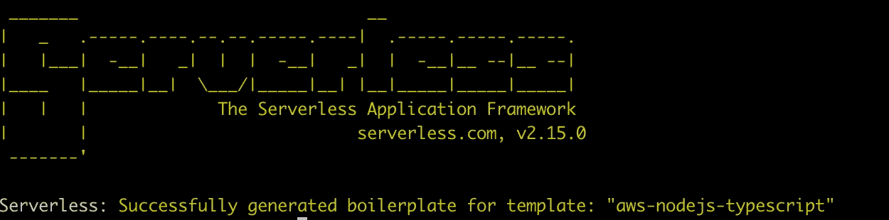

其中`**<PROJECT-NAME>**`是您项目的名称。

这为我们的应用程序生成了一个无服务器的样板文件。接下来，我们需要导航到我们的新项目`cd <PROJECT-NAME>`，并通过运行`**yarn install**`安装我们的依赖项。

在开发应用程序时，我们将更新的最重要的文件是`**handler.ts**`和`**serverless.ts**`。`**handler.ts**`文件处理我们的 lambda 函数或对 lambda 函数的引用。它应该是这样的:

```
import { APIGatewayProxyHandler } from 'aws-lambda';
import 'source-map-support/register';

export const *hello*: APIGatewayProxyHandler = async (event, _context) => {
  return {
    statusCode: 200,
    body: JSON.stringify({
      message: 'Go Serverless Webpack (Typescript) v1.0! Your function executed successfully!',
      input: event,
    }, null, 2),
  };
}
```

通过将基础设施视为代码，`**serverless.ts**`文件为我们提供了一个模板来为 [AWS CloudFormation](https://aws.amazon.com/cloudformation/) 建模和供应我们的应用资源。这有助于我们轻松地创建、更新甚至删除资源。它应该是这样的:

```
import type { Serverless } from 'serverless/aws';

const serverlessConfiguration: Serverless = {
  service: {
    name: 'serverless-todo',
    *// app and org for use with dashboard.serverless.com
    // app: your-app-name,
    // org: your-org-name,* },
  frameworkVersion: '>=1.72.0',
  custom: {
    webpack: {
      webpackConfig: './webpack.config.js',
      includeModules: true
    }
  },
  *// Add the serverless-webpack plugin* plugins: ['serverless-webpack'],
  provider: {
    name: 'aws',
    runtime: 'nodejs12.x',
    apiGateway: {
      minimumCompressionSize: 1024,
    },
    environment: {
      AWS_NODEJS_CONNECTION_REUSE_ENABLED: '1',
    },
  },
  functions: {
    hello: {
      handler: 'handler.hello',
      events: [
        {
          http: {
            method: 'get',
            path: 'hello',
          }
        }
      ]
    }
  }
}

module.exports = serverlessConfiguration;
```

此外，由于[弃用](https://www.serverless.com/framework/docs/deprecations/)，您需要将服务属性直接设置为服务名:

```
{ 
  service: 'serverless-todo', ...
}
```

并更新`**provider.apiGateway**`对象，如下所示:

```
provider: {
  ...
  apiGateway: {
    shouldStartNameWithService: true,
    ...
  },
  ...
},
```

我们可以在我们的项目根`**$ serverless invoke local --function hello**`中运行我们的函数，您应该会看到响应:

```
{
    "statusCode": 200,
    "body": "{\n  \"message\": \"Go Serverless Webpack (Typescript) v1.0! Your function executed successfully!\",\n  \"input\": \"\"\n}"
}
```

无服务器框架在本地调用`hello`函数，运行`**handler.ts**`文件中导出的`**hello**`方法。`serverless invoke local`命令允许我们在部署 Lambda 函数之前在本地运行它们。

接下来，我们需要为我们的应用程序安装一些依赖项:

```
$ yarn add -D serverless-offline serverless-dotenv-plugin serverless-bundle
$ yarn add aws-sdk uuid @types/uuid
```

*   [**aws-sdk**](https://www.npmjs.com/package/aws-sdk) —允许我们与 aws 服务进行通信
*   [**uuid**](https://www.npmjs.com/package/uuid) —为我们的数据库条目生成唯一的 id
*   [**无服务器-离线**](https://www.npmjs.com/package/serverless-offline) —这个插件使我们能够在本地运行我们的应用程序和 Lambda 函数
*   [**server less-dotenv-plugin**](https://www.npmjs.com/package/serverless-dotenv-plugin)—使我们能够将`**.env**`变量加载到我们的 Lambda 环境中
*   [**server less-bundle**](https://www.npmjs.com/package/serverless-bundle)—这个插件对我们的 Typescript 函数进行了优化打包，并确保我们不需要担心安装 [**Babel**](https://babeljs.io/) 、 [**Typescript**](https://www.typescriptlang.org/) 、 [**Webpack**](https://webpack.js.org/) 、 [**ESLint**](https://eslint.org/) 以及其他一系列包。这意味着我们不需要维护自己的 webpack 配置。所以我们可以继续删除`**webpack.config.js**`文件以及在`serverless.ts`自定义属性中对它的引用:

```
// FROM
custom: {
  webpack: {
    webpackConfig: './webpack.config.js',
    includeModules: true
  }
}// TO
custom: {

}
```

并且也从`**plugins**`阵中移除。您还可以从项目中移除以下默认依赖项:

*   **来源-地图-支持**
*   **fork-ts-checker-web pack-plugin**
*   **ts-loader**
*   **终端服务节点**
*   **打字稿**
*   **无服务器网络包**
*   **网络包**
*   **webpack-node-externals**

## **性能**

同样需要注意的是，默认情况下，无服务器框架为所有 Lambda 函数创建一个包。这意味着每次调用 Lambda 函数时，它都会加载应用程序中的所有其他 Lambda 函数和代码。随着应用程序变得越来越大，这将对性能产生负面影响，也会使[冷启动](https://dzone.com/articles/dealing-with-serverless-cold-starts-once-and-for-a)时间更长。

这个特性可以被关闭，它将通过向我们的`**serverless.ts**`添加以下内容来确保我们的功能被单独打包:

```
// serverless.ts package: {
  individually: true,
},
```

这个启用的选项也将允许`**serverless-bundle**`使用 Webpack 通过[树摇动算法](https://webpack.js.org/guides/tree-shaking/)生成优化的包。

## 第三步。设置资源

构建 CRUD 应用程序的下一步是决定如何存储数据。在这种情况下，我们将使用 [DynamoDB](https://aws.amazon.com/dynamodb/) 作为我们的数据库选择。DynamoDB 是一个无服务器的数据库，因此可以自动扩展，我们只需为我们使用的东西付费。我们还将添加一些 Lambda 函数。

因此，我们的新应用程序架构将如下所示:

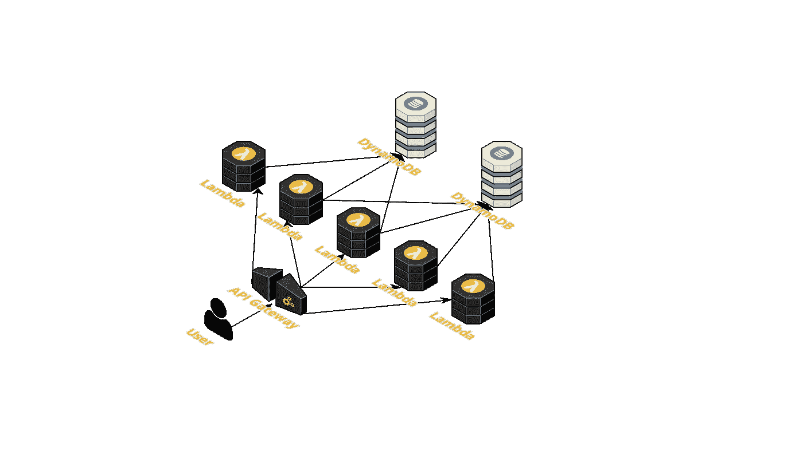

应用架构

你会注意到我们的数据库没有公开，只被我们的 Lambda 函数调用。

在设置我们的资源时，重要的是我们用代码做所有的事情，并避免使用 AWS 控制台。这样，配置、部署和维护基础架构组件就更加容易、快速和一致。我们将用我们需要的资源更新`**serverless.ts**`文件。

首先，我们需要如下设置我们的`**custom**`属性:

这设置了`**region**`、`**stage**`、`**table_throughputs**`、`**table_throughput**`和表格`**list_table**`和`**tasks_table**`变量。它还为本地开发配置`**dynamodb**`和`**serverless-offline**`。

接下来，我们需要更新`**serverless.ts**`文件中的`**provider.environment**`属性，如下所示:

```
// serverless.tsprovider: {
  ...
  environment: {
    ...
    REGION: '${self:custom.region}',
    STAGE: '${self:custom.stage}',
    LIST_TABLE: '${self:custom.list_table}',
    TASKS_TABLE: '${self:custom.tasks_table}',
  },
  ...
},
```

`environment`部分为我们的 Lambda 函数定义了环境变量，并将在`process.env` Node.js 变量下提供。这将`**REGION**`、`**STATE**`、`**LIST_TABLE**`和`**TASKS_TABLE**`定义为环境变量。

我们还需要提供 [**AWS 身份和访问管理**](https://aws.amazon.com/iam/) (IAM)访问，以允许对 DynamoDB 表进行读写。为此，我们需要将`**iamRoleStatements**`属性添加到`**provider**`对象中。这个部分告诉 AWS 我们希望 Lambda 函数访问哪些资源:

```
provider: {
  ...
  iamRoleStatements: [
    {
      Effect: 'Allow',
      Action: [
          'dynamodb:DescribeTable',
          'dynamodb:Query',
          'dynamodb:Scan',
          'dynamodb:GetItem',
          'dynamodb:PutItem',
          'dynamodb:UpdateItem',
          'dynamodb:DeleteItem'
      ],
      Resource: [
        {"Fn::GetAtt": [ 'ListTable', 'Arn' ]},
        {"Fn::GetAtt": [ 'TasksTable', 'Arn' ]}
      ]
    }
  ]
},
```

上面提到了三个权限块，分别是`**Effect**`、`**Action**`和`**Resource**`。设置为`Allow`的效果在列出的资源上授予列出的动作。Action 块包含所需 DynamoDB 动作的列表，如**可描述的**、**查询**、**扫描**、 **GetItem** 、 **PutItem** 、 **UpdateItem** 和 **DeleteItem** 。这些是我们的应用程序需要的唯一权限。最后，资源块拥有我们的表的 ARN，并将我们的应用程序权限的范围限制在列出的表，并且不能查询任何未列出的其他表。

接下来，我们需要添加`**resources**`，当部署我们的应用程序时，它们会被添加到您的 CloudFormation 堆栈中。我们需要在名为`**resources**`的属性中定义 AWS 资源，如下所示:

其中`**ListTable**`和`**TasksTable**`是对我们的 DynamoDB 表的引用。

*   **类型**:描述 AWS 资源类型。
*   **DeletionPolicy** :描述所有资源的删除策略，默认设置为`**Delete**`。`**Retain**`确保无论何时删除堆栈，我们的表都不会被删除。
*   **属性**:描述表格属性
*   **表名**:要创建的表的名称
*   **AttributeDefinitions** :描述表和索引的键模式的属性数组。
*   **KeySchema** :指定构成表主键的属性。KeySchema 中的属性也必须在 AttributeDefinitions 数组中定义。
*   **ProvisionedThroughput** :这为我们的表定义了提供的吞吐量

你可以阅读更多关于在 DynamoDB 中使用表和数据的信息。


多米尼克·汉普顿在 [Unsplash](https://unsplash.com?utm_source=medium&utm_medium=referral) 上的照片

利用 Javascript 的强大功能，我们可以通过分割成文件和使用动态导入来避免大型服务定义文件。这很重要，因为随着应用程序的增长，单独的定义文件更容易维护。

对于这个项目，我们将分别组织我们的资源并导入到`**serverless.ts**`中。为此，我们需要首先在根目录中创建一个`**resources**`目录，然后为 DynamoDB 表创建一个`**dynamodb-tables.ts**`文件:

```
// At project root
$ mkdir resources
$ touch resources/dynamodb-tables.ts 
```

接下来，我们如下更新`**dynamodb-tables.ts**`文件:

并导入到`**serverless.ts**` —见第 4 行，在第 98 行使用:

接下来，我们需要定义我们的项目结构。

## 第四步。定义项目结构并创建功能

下一步是为我们的待办事项应用程序创建我们的 a[CRUD](https://en.wikipedia.org/wiki/Create,_read,_update_and_delete)API。

首先，我们需要在根目录中创建一个`**src**`目录，并定义我们如何构建项目的其余部分:

```
// At project root
$ mkdir src
$ mkdir src/actions src/interfaces src/enums src/models src/services src/constraints src/utils
```

*   **动作** —针对我们的功能
*   **接口** —用于我们的应用程序接口
*   **枚举** —针对我们的应用枚举
*   **型号** —针对我们的型号
*   **服务** —针对我们的应用服务
*   **约束** —用于请求参数验证
*   **实用程序** —用于我们的实用程序功能

## -模特

接下来，我们需要创建我们的模型:

```
$ touch src/models/response.model.ts src/models/list.model.ts src/models/task.model.ts
```

我们的响应模型将处理我们的 API 响应，并确保我们始终保持一致的格式。更新`**response.model.ts**`如下:

我们还需要更新我们的`**list.model.ts**`和`**task.model.ts**`文件来处理我们的数据输入。

接下来，我们为我们的应用程序创建几个枚举:

```
$ touch src/enums/response-message.enum.ts src/enums/status.enum.ts src/enums/status-code.enum.ts
```

我们更新如下:

```
// src/enums/status.enum.ts
export enum Status {
    *SUCCESS* = 'success',
    *ERROR* = 'error',
    *BAD_REQUEST* = 'bad request',
}// src/enums/status-code.enum.ts
export enum StatusCode {
    *OK* = 200,
    *ERROR* = 500,
    *BAD_REQUEST* = 400,
}
```

并替换`**response.model.ts**`中的枚举。

## -服务

接下来，我们需要创建我们的数据库服务来处理我们的应用程序 CRUD 进程。

```
$ touch src/services/database.service.ts
```

我们还需要为我们的数据库服务创建一些接口:

```
$ touch src/interfaces/config.interface.ts
```

我们更新如下:

```
// src/interfaces/config.interface.ts
export default interface IConfig {
    region: string;
    accessKeyId?: string;
    secretAccessKey?: string;
    endpoint?: string;
}
```

接下来，我们需要更新`**database.service.ts**`如下:

*   **创建** —将项目放入 DynamoDB 表的函数
*   **batchCreate** —将项目批量写入 DynamoDB 表的函数
*   **更新** —更新 DynamoDB 表中项目的函数
*   **查询** —在 DynamoDB 表上运行查询的函数
*   **get** —从 DynamoDB 表中获取项目的函数
*   **删除** —从 DynamoDB 表中删除项目 an 的功能

我们需要通过在我们的`.**env**`文件中添加本地 DynamoDB 环境变量来增加对本地开发的支持，并更新我们的 AWS 配置:

```
const config: IConfig = { region: "eu-west-1" };
if (process.env.STAGE === process.env.DYNAMODB_LOCAL_STAGE) {
    config.accessKeyId = process.env.DYNAMODB_LOCAL_ACCESS_KEY_ID; config.secretAccessKey = process.env.DYNAMODB_LOCAL_SECRET_ACCESS_KEY; config.endpoint = process.env.DYNAMODB_LOCAL_ENDPOINT;}
AWS.config.*update*(config);
```

要在本地运行 DynamoDB，我们需要首先安装`**serverless-dynamodb-local**`插件:

```
$ yarn add -D serverless-dynamodb-local 
```

接下来，我们需要更新`**serverless.ts**`插件数组:

```
plugins: [
    'serverless-bundle',
    'serverless-dynamodb-local',
    'serverless-offline',
    'serverless-dotenv-plugin',
],
```

要使用这个插件，我们需要在项目根目录下运行`**sls dynamodb install**`来安装 DynamoDB Local。运行`**sls dynamodb start**`将在本地启动它:

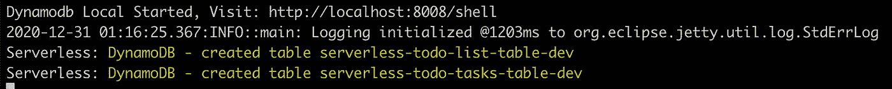

DynamoDB 本地

现在我们已经设置了 DynamoDB，我们需要创建我们的 CRUD 函数——创建、读取、更新和删除我们的待办事项列表和任务。

## -功能

首先，我们需要创建目录来存储我们的 Lambda 函数:

```
$ mkdir src/actions/list src/actions/task
```

*   `**list**` —用于我们的列表功能
*   `**task**` —用于我们的任务功能

— **请求验证**

我们不能依赖客户端验证，所以验证所有发送到端点的请求也很重要。

为此，我将安装`[**validate.js**](https://www.npmjs.com/package/validate.js)`库，因为它提供了在 Javascripts 中验证对象的声明性方式。在项目根目录下，运行`**yarn add validate.js**`作为依赖项安装到我们的项目中。

接下来，我们需要创建一个`**util**`验证函数来实现这种依赖性:

```
$ touch src/utils/util.ts
```

并更新如下:

接下来，我们需要为 Lambda 函数创建请求约束:

```
// Create directories for our constraints
$ mkdir src/constraints/list src/constraints/task// List constraints
$ touch src/constraints/list/create.constraint.json src/constraints/list/get.constraint.json src/actions/list/update.constraint.json// Task constraints
$ touch src/constraints/task/create.constraint.json src/constraints/task/update.constraint.json src/constraints/task/get.constraint.json
```

需要注意的是，为了在我们的 typescript 项目中动态导入和使用 JSON 文件，我们需要更新`**tsconfig.json**`compile options 并将`**resolveJsonModule**`设置为`**true**`。将`**tsconfig.json**` 的内容替换如下:

接下来，我们还需要为 Lambda 函数创建单独的文件:

```
// List functions
$ touch src/actions/list/create-list.action.ts src/actions/list/get-list.action.ts src/actions/list/update-list.action.ts src/actions/list/delete-list.action.ts// Task functions
$ touch src/actions/task/create-task.action.ts src/actions/task/update-task.action.ts src/actions/task/delete-task.action.ts
```

现在我们可以开始创建我们的函数了。

## -列出函数

我们从我们的`**createList**`函数开始。首先，我们需要通过更新`**create.constraint.json**`来定义请求的约束:

```
// src/constraints/list/create.constraint.json
{
  "name": {
    "presence": {
      "allowEmpty": false
    },
    "type": "string"
  }
}
```

这确保了`**createList**`函数期望一个包含`**name**`属性并且是字符串的请求对象。如果不匹配，则验证失败:

```
{
    "data": {
        "validation": {
            "name": [
                "Name can't be blank"
            ]
        }
    },
    "message": "required fields are missing",
    "status": "bad request"
}
```

接下来，我们需要更新`**create-list.action.ts**`如下:

首先，我们初始化我们的响应变量，然后解析来自代表 HTTP 请求体的`event.body`的输入。我们还使用在`**serverless.ts**`中设置的`**process.env.LIST_TABLE**`从环境变量中读取 DynamoDB 表的名称。

接下来，我们根据定义的约束验证请求参数。我们定义的约束需要一个请求对象，它看起来像:

```
*// Request-Example:
{
   "name": "My To-do list",
}*
```

如果请求有效，那么我们在 DynamoDB 表中创建一个新的列表项，并生成一条响应消息:

```
// *Example* Success Response
*{
  "data": { "listId": "468c8094-a756-4000-a919-example" },
  "message": "To-do List successfully created"
  "status": "success"
}*
```

接下来，我们继续使用`**updateList**`函数，并在`**update.constraint.json**`中创建更新约束:

```
// src/constraints/list/update.constraint.json
{
  "listId": {
    "presence": {
      "allowEmpty": false
    },
    "type": "string"
  },
  "name": {
    "presence": {
      "allowEmpty": false
    },
    "type": "string"
  }
}
```

和我们之前的约束定义一样，这也确保了我们的`**updateList**` API 期望一个带有`**listId**`和`**name**`属性的请求对象，这两个属性都是字符串。请求示例:

```
*// Request-Example:
{
  "listId": "468c8094-a756-4000-example",
  "*name*": "My Wednesday List",
}*
```

无效请求，例如:

```
*// Invalid request
{
  "listId": "468c8094-a756-4000-example",
  "*name*": 54647,
}*
```

接下来，我们还需要更新`**update-list.action.ts**`:

`**updateList**`函数只是更新 DynamoDB 表中现有的列表项，并生成一条响应消息:

```
*// Success Response
{
  "data": {},
  "message": "To-do List successfully updated"
  "status": "success"
}*
```

接下来，我们创建我们的`**getList**`函数和约束。首先我们更新`**get.constraint.json**`:

```
// src/constraints/list/get.constraint.json
{
  "listId": {
    "presence": {
      "allowEmpty": false
    },
    "type": "string"
  }
}
```

这确保了`**getList**`函数的请求对象必须包含一个`**listId**`属性和类型`**string**`。

接下来我们更新`**get-list.action.ts**`:

在`**getList**`函数中，我们还从环境变量中读取 DynamoDB 表的名称。在该函数中，我们首先从 DynamoDB 表中检索一个列表项，然后用请求的`**listId**`查询另一个 DynamoDB 表中的所有任务项，并在我们的 API 响应中返回数据:

```
{
    "data": {
        "name": "My To do List",
            "createdAt": 1609475930597,
            "id": "ae47940e-5bf3-45d6-a390-example",
            "updatedAt": 1609475930597,
            "taskCount": 2,
            "tasks": [
            {
                "id": "566e06a7-a9e9-449f-9e19-example",
                "description": "Task 1",
                "completed": false,
                "createdAt": 1609533804820,
                "updatedAt": 1609534302597
            },
            {
                "id": "263a3617-4a65-4879-b522-example",
                "description": "Task 2",
                "completed": false,
                "createdAt": 1609533804820,
                "updatedAt": 1609534302597            
            }

        ]
    },
    "message": "To-do list successfully retrieved",
    "status": "success"
}
```

接下来，我们创建我们的`**deleteList**`函数并使用之前的`**get.constraint.json**`，因为它需要相同的请求参数:

```
// src/constraints/list/get.constraint.json
{
  "listId": {
    "presence": {
      "allowEmpty": false
    },
    "type": "string"
  }
}
```

`**deleteList**`函数要复杂得多，因为每个列表项都与任务有一对多的关系。这意味着每个列表可以有一个或多个任务。因此，当我们删除一个列表时，我们也希望确保删除与该列表相关联的任务。

DynamoDB 提供了`**batchWrite**`函数，用于在 DynamoDB 表中插入或删除多个项目。但是，它被限制为每笔交易 25 个项目。除非我们将分配给列表的任务数量限制在 25 个以下，否则我们需要提供一种方法来处理超过 25 个任务的列表。我选择在`**util.ts**`中创建一个实用函数`**createChunks**`:

```
// src/utils/util.tsexport const *createChunks* = (data: any[], chunkSize: number) => {
    const urlChunks = [];
    let batchIterator = 0;
    while (batchIterator < data.length) {
        urlChunks.push(data.slice(batchIterator, (batchIterator += chunkSize)));
    }
    return urlChunks;
}
```

这个函数只是将一个大数组分解成一个组块数组。这将在`**get-list.action.ts**`实施:

和前面一样，我们首先验证请求数据，但是我们还需要检查 DynamoDB 表中是否存在该条目，然后才处理删除事务。我们还需要删除列表中所有的任务链接。无论成功与否，该函数都会返回一个 API 响应:

```
// Example Success response
*{
  "data": {},
  "message": "To-do list successfully deleted"
  "status": "success"
}*// Example Error response
{
    "data": {
        "id": "468c8094-a756-4000-a919-example"
    },
    "message": "Item does not exist",
    "status": "bad request"
}
```

## **-任务功能**

接下来，我们创建`**createTask**`、`**updateTask**`、`**deleteTask**`和`**getTask**`函数。由于每个任务都与一个列表项有一对一的关系，如`**TASKS_TABLE**`的 AttributeDefinitions 和 KeySchema 中的`**listId**` RANGE_KEY 所定义:

```
TasksTable: {
    ...
    Properties: {
        TableName: '${self:provider.environment.TASKS_TABLE}',
        AttributeDefinitions: [
            ...
            { AttributeName: 'listId', AttributeType: 'S' }
        ],
        KeySchema: [
            ...
            { AttributeName: 'listId', KeyType: 'RANGE' }
        ],
        ...
    }
}
```

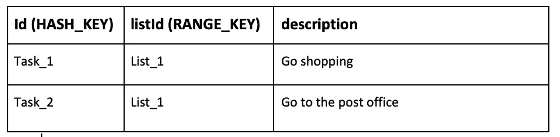

任务表结构

在创建`**createTask**`函数时，我们还需要为请求对象定义约束:

```
// src/constraints/task/create.constraint.json
{
  "listId": {
    "presence": {
      "allowEmpty": false
    },
    "type": "string"
  },
  "description": {
    "presence": {
      "allowEmpty": false
    },
    "type": "string"
  }
}
```

因此，我们运行一个 [Promise.all()](https://developer.mozilla.org/en-US/docs/Web/JavaScript/Reference/Global_Objects/Promise/all) 来验证我们的请求参数(第 36 行)，并且在我们将任务插入 DynamoDB 表(第 61 行)之前，有一个与`**listId**`(第 38 行)相关联的列表项。我们不想为不存在的列表创建任务。参见下面的`**create-task.action.ts**`:

```
*// Request-Example:*
{
    "listId": "ae47940e-5bf3-45d6-a390-example",
    "description": "Buy milk"
}*// Response-Example:*
{
    "data": {
        "taskId": "6cdff49d-a883-443b-87b2-example"
    },
    "message": "Task successfully added",
    "status": "success"
}
```

下一步是设置`**updateTask**`函数，该函数通过首先定义请求参数的约束来更新任务项:

```
// src/constraints/task/update.constraint.json
{
  "listId": {
    "presence": {
      "allowEmpty": false
    },
    "type": "string"
  },
  "taskId": {
    "presence": {
      "allowEmpty": false
    },
    "type": "string"
  },
  "description": {
    "type": "string"
  },
  "completed": {
    "type": "boolean"
  }
}
```

这确保了请求参数必须包括相关的`**listId**`、一个`**taskId**`以及可选的`**description**`和`**completed**`属性。然而，对可选属性进行类型检查以确保有效性。接下来，我们更新`**update-task.action.ts**`:

在上面的`**updateTask**`函数中，我们需要验证请求参数，并在更新任务之前验证 DynamoDB 表中是否存在带有请求`**listId**`的列表项。此外，由于`**description**`和`**completed**`属性都是可选的，可能不会出现在请求参数中，我们需要有条件地设置`**UpdateExpression**`和`**ExpressionAttributeValues**`。

这意味着我们可以更新每个任务项的属性。但是，如果两个参数都不存在，那么我们不应该更新该项，而是抛出一个错误，因为请求无效:

```
*// Request-Example:*
{
    "listId": "ae47940e-5bf3-45d6-a390-example",
    "taskId": "7aa35acc-9a20-4cce-9191-example"
}// Error Response
{
    "data": {},
    "message": "Invalid Request!",
    "status": "bad request"
}
```

我们还需要设置`**deleteTask**`函数，该函数简单地从 DynamoDB 表中删除一个任务。首先，我们为我们的请求定义约束:

```
// src/constraints/task/delete.constraint.json
{
  "listId": {
    "presence": {
      "allowEmpty": false
    },
    "type": "string"
  },
  "taskId": {
    "presence": {
      "allowEmpty": false
    },
    "type": "string"
  }
}
```

与前面的约束一样，对`**deleteTask**`函数的请求必须包括相关的`**listId**`和要删除的任务的 id`**taskId**`作为属性。因此我们相应地更新`**delete-task.action.ts**`:

我们首先验证请求，然后检索任务项(如果存在)，最后删除该项。

最后一个函数是`getTask`函数，它的作用就是为数据库获取一个任务。请求约束与`getTask`函数完全相同，因为两者都需要`HASH`和`RANGE`键从 DynamoDB 表中检索项目:

它验证请求，确保两个键都存在，然后在数据库中检查该项，如果存在则检索任务项，如果不存在则返回错误响应。

## —导出功能

现在我们已经创建了所有的函数，我们需要在`**handler.ts**`中导出我们的新函数。我们需要用以下内容更新`**handler.ts**`:

```
*// List functions* export { *createList* } from './src/actions/list/create-list.action';
export { *deleteList* } from './src/actions/list/delete-list.action';
export { *getList* } from './src/actions/list/get-list.action';
export { *updateList* } from './src/actions/list/update-list.action';

*// Task functions* export { *createTask* } from './src/actions/task/create-task.action';
export { *deleteTask* } from './src/actions/task/delete-task.action';
export { *updateTask* } from './src/actions/task/update-task.action';
export { *getTask* } from './src/actions/task/get-task.action';
```

我们还需要在`**serverless.ts**`中为我们的函数定义 API 端点，然而，通过分离我们的函数定义和使用动态导入来避免大型服务定义是很重要的。为此，我们要在我们的`**resources**`目录中创建一个`**functions.ts**`文件:

```
// At project root
$ touch resources/functions.ts
```

接下来，我们如下更新`**functions.ts**`文件:

*   **createList** —指定我们如何处理对`/list/create`端点的`post`请求。
*   **删除列表** —指定我们如何处理对`/list/delete`端点的`post`请求。
*   **getList** —指定我们如何处理对`/list`端点的`post`请求。
*   **更新列表** —指定我们如何处理对`/list/update`端点的`post`请求。
*   **createTask** —指定我们如何处理对`/task/create`端点的`post`请求。
*   **deleteTask** —指定我们如何处理对`/task/delete`端点的`post`请求。
*   **updateTask** —指定我们如何处理对`/task/update`端点的`post`请求。
*   **getTask** —指定我们如何处理对`/task`端点的`post`请求。

这是使用单个 Lambda 函数响应单个 HTTP 事件的模式

并导入到`**serverless.ts**`:

上面，我们只是将新功能导入到我们的无服务器配置中。

## -地方发展

我们现在可以使用之前安装的插件[无服务器离线](https://www.npmjs.com/package/serverless-offline)在本地测试我们的功能。这个插件在你的本地机器上模拟 [AWS Lambda](https://aws.amazon.com/lambda) 和 [API Gateway](https://aws.amazon.com/api-gateway) 并帮助加速开发。它通过启动 HTTP 服务器来处理请求的生命周期，并调用我们的处理程序，就像 [API Gateway](https://aws.amazon.com/api-gateway) 一样。

在我们项目的根目录下运行`serverless offline start`将会捆绑我们的应用程序并在本地调用我们的处理程序:

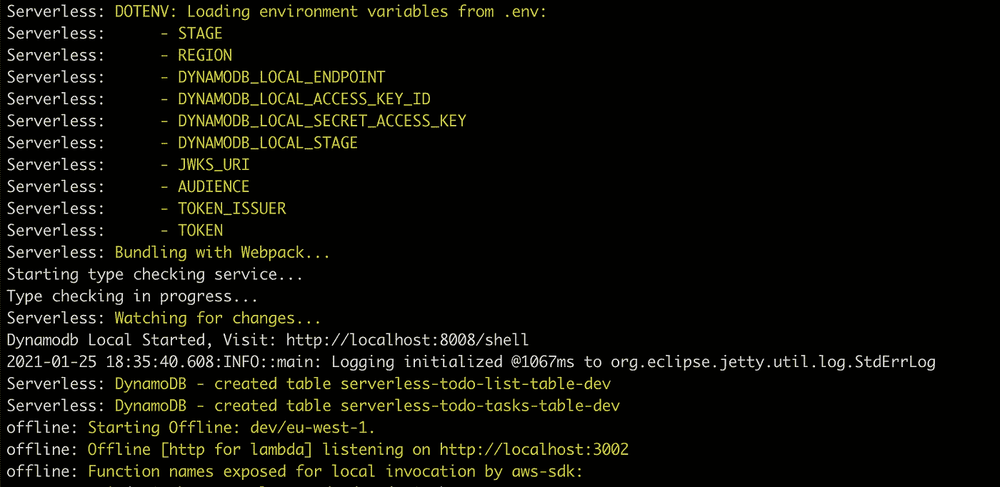

无服务器脱机—启动服务器

它还在本地公开了我们的端点:

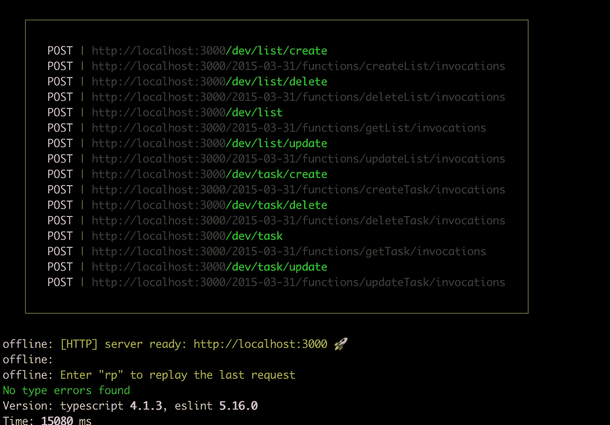

无服务器离线—本地端点

我们可以发送请求，例如创建一个新的列表。为此，我将使用 Postman 向端点`http://localhost:3000/dev/list/create`发送一个请求:

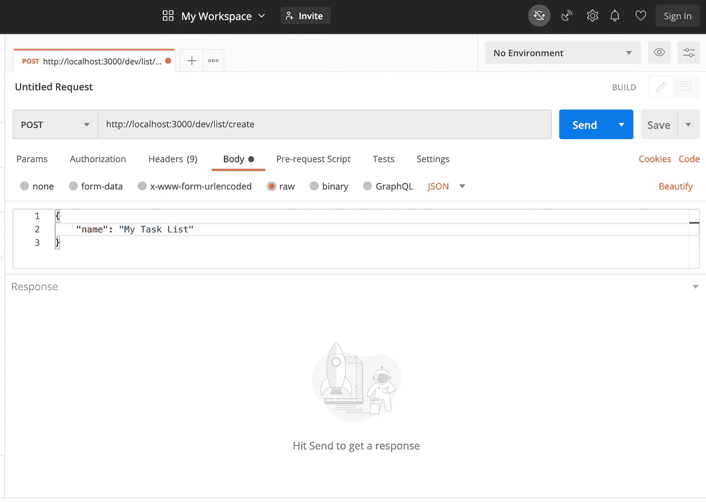

邮递员—创建列表

当我们单击发送按钮时，我们应该会收到如下所示的响应:

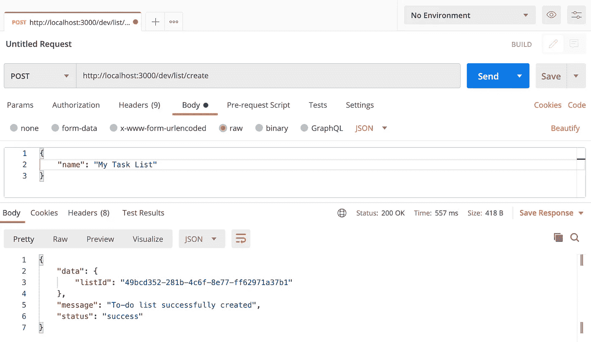

创建列表—有效请求

我们还可以通过在请求中发送一个空对象来测试我们的验证响应。我们应该会收到如下所示的验证响应:

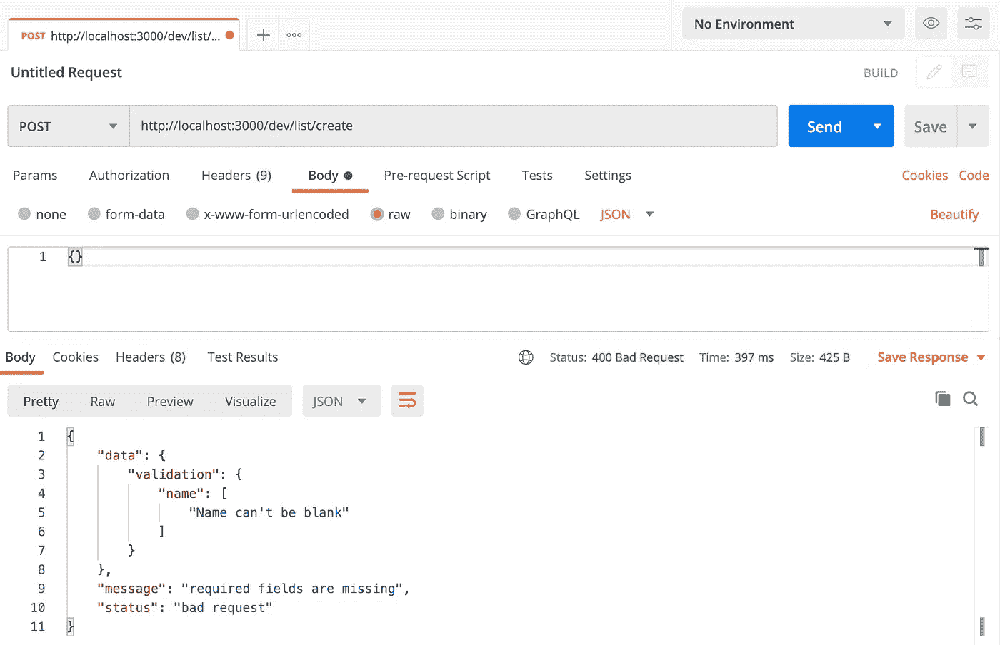

创建列表—无效请求

现在我们需要向我们的项目添加一些测试。

# 测试

为了向我们的应用程序添加测试，我们需要安装一些依赖项，即 [Mocha](https://mochajs.org/) 和 [Chai](https://www.chaijs.com/) :

```
$ yarn add -D mocha @types/mocha chai @types/chai
```

并在`**tsconfig.json**`的编译选项中增加`**types**`:

```
{
  "compilerOptions": {
    ....
    "types" : [ "node", "mocha"]
  },
  ....
}
```

我们还需要在应用程序的根目录下创建一个`**tests**`目录:

```
$ mkdir tests
```

我还喜欢将我的测试组织成`**unit**`和`**feature**`，并分别为我们的单元测试和特性测试创建目录。

```
$ mkdir tests/feature tests/feature/list tests/feature/task tests/unit tests/unit/model tests/unit/util
```

*   **特性** —特性目录将包含我们的 Lambda 端点的特性测试；`feature/list`用于列表功能，而`feature/task`用于任务
*   单元目录将为我们的模型、工具和服务处理单元测试。

我们还需要一个用于处理函数的`**lib**`目录和用于模拟实体和请求的`**mocks**`:

```
$ mkdir tests/lib tests/lib/actions tests/mocks 
```

## 单元测试

我们首先为我们的应用程序创建单元测试。目的是确保我们应用程序的每个单元都按预期执行。为此，我们将测试我们的模型和实用功能。我们需要创建以下文件:

```
$ touch tests/unit/model/response.model.test.ts tests/unit/model/list.model.test.ts tests/unit/model/task.model.test.ts tests/unit/util/util.test.ts
```

并更新`**tests/unit/model/list.model.test.ts**`如下:

下次更新`**tests/unit/model/response.model.test.ts**` **:**

我们还需要更新`**tests/unit/model/task.model.test.ts**`如下:

最后，我们需要测试我们的`**util**`函数并更新`**tests/unit/util/util.test.ts**`:

现在我们已经创建了我们的单元测试，我们需要用我们的`**test**`命令更新我们的`**package.json**`中的`**scripts**`属性:

```
**//** package.json**"scripts": {
  "unit-test": "./node_modules/.bin/mocha \"tests/unit/**/*.ts\" --require ts-node/register"
},**
```

我们使用节点 CLI 参数运行测试——Mocha 需要`**ts-node**`,这样我们就可以执行 Typescript 测试文件，而不需要编译它们。我们还指定了单元测试文件的路径。它将运行路径中匹配模式的每个测试文件。在命令行上运行`**yarn run unit-test**`启动单元测试。输出应该如下所示:

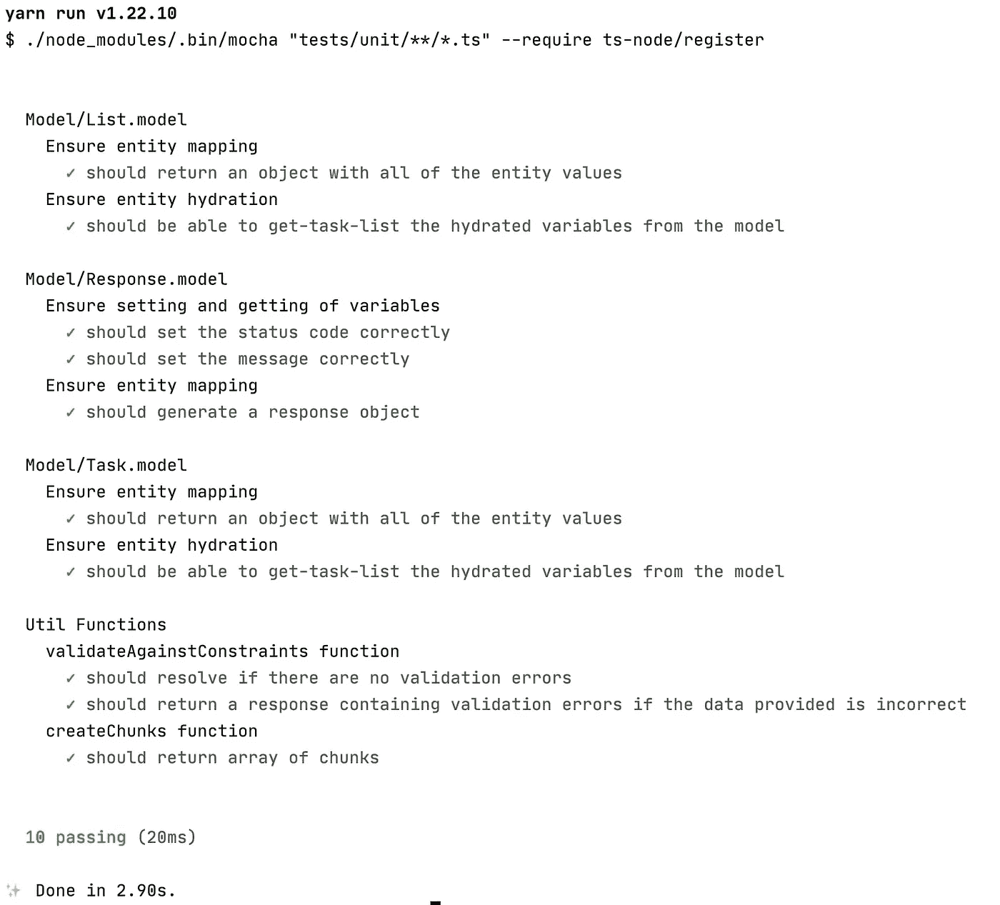

用 Mocha 和 Chai 进行单元测试

## 功能测试

接下来，我们还需要测试我们的 CRUD 特性，并确保对端点的请求得到应有的处理，并将准确的响应发送回客户端。我们还验证这些条目是从 DynamoDB 表中创建、更新还是删除的。

我们将向我们的端点发出请求，所以首先我们需要安装`[node-fetch](https://www.npmjs.com/package/node-fetch)`依赖项来帮助我们:

```
$ yarn add -D node-fetch
```

接下来，我们需要创建我们的测试处理程序文件:

```
$ touch tests/lib/actions/handler.ts
```

并更新如下:

我们有一个`**post**`函数，它使用`**fetch**`库向我们需要测试的所有端点发出请求。

我们还需要为每个 API 函数创建单独的目录:

```
// List functions
$ mkdir tests/feature/list/create-list tests/feature/list/delete-list tests/feature/list/get-list tests/feature/list/update-list// Task functions
$ mkdir tests/feature/task/create-task tests/feature/task/delete-task tests/feature/task/get-task tests/feature/task/update-task
```

每个 API 函数都有一个`valid.test.ts`,它用有效请求测试 API 端点并期望得到有效响应，还有一个`invalid.test.ts`,它用无效请求测试端点并期望得到定义的错误处理响应。

我已经包括了一个`create-list/valid.test.ts`的样本:

它运行`**createList**`函数来创建一个新列表，并确保收到预期的响应。接下来，它运行`**getList**`函数来确认该商品是否存储在数据库中。

我们还需要确保我们的端点相应地处理意外的请求和错误响应。见下文:

您可以查看存储库中的所有其他测试。

# 部署

既然我们已经有了 API 和测试，我们可以将它们部署到 AWS。请阅读我关于如何[为部署](https://sidneyb231.medium.com/configure-aws-for-development-and-deployment-ad822097fc22)创建和配置 AWS 凭证和概要文件的文章。

为了进行部署，我们可以通过在您的工作目录中运行以下命令来使用默认的 AWS 概要文件:

```
$ serverless deploy 
```

或者，如果您有多个概要文件，并且希望使用特定的概要文件进行部署，那么您必须运行以下命令:

```
$ serverless deploy --stage dev
```

它将使用为`dev`阶段设置的概要文件进行部署。底部的服务信息应该如下所示:

```
Service Information
service: serverless-todo
stage: dev
region: eu-west-1
stack: serverless-todo-dev
resources: 63
api keys:
  None
endpoints:
  POST - https://<API-GATEWAY-ID>.execute-api.eu-west-1.amazonaws.com/dev/list/create
  POST - https://<API-GATEWAY-ID>.execute-api.eu-west-1.amazonaws.com/dev/list/delete
  POST - https://<API-GATEWAY-ID>.execute-api.eu-west-1.amazonaws.com/dev/list
  POST - https://<API-GATEWAY-ID>.execute-api.eu-west-1.amazonaws.com/dev/list/update
  POST - https://<API-GATEWAY-ID>.execute-api.eu-west-1.amazonaws.com/dev/task/create
  POST - https://<API-GATEWAY-ID>.execute-api.eu-west-1.amazonaws.com/dev/task/delete
  POST - https://<API-GATEWAY-ID>.execute-api.eu-west-1.amazonaws.com/dev/task
  POST - https://<API-GATEWAY-ID>.execute-api.eu-west-1.amazonaws.com/dev/task/update
functions:
  createList: serverless-todo-dev-createList
  deleteList: serverless-todo-dev-deleteList
  getList: serverless-todo-dev-getList
  updateList: serverless-todo-dev-updateList
  createTask: serverless-todo-dev-createTask
  deleteTask: serverless-todo-dev-deleteTask
  getTask: serverless-todo-dev-getTask
  updateTask: serverless-todo-dev-updateTask
layers:
  None
```

这有一个创建的 API 端点的列表。还要注意，在我们的例子中，`**eu-west-1**`是我们的 API 网关区域，`**<API-GATEWAY-ID>**`是我们的 API 网关 ID。

部署应用程序时，您可能会遇到一些问题。在 [**Seed**](https://seed.run/) 的团队已经创建了一个 [**汇编最常见的无服务器错误**](https://seed.run/docs/serverless-errors/) 以及如何修复它们。

当我们对我们的功能进行更改时，我们也可以使用`serverless deploy function`命令来部署单个功能，从而避免经历整个部署周期。例如，我们可以运行以下命令来再次部署 **createList** 函数:

```
$ serverless deploy function -f createList
```

## 公共 API 架构

作为参考，这是我们目前的 API:

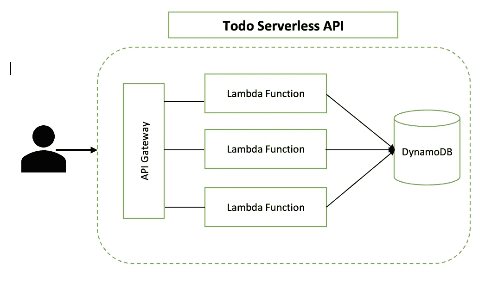

应用架构

简而言之，一个用户向我们的无服务器 API 发出请求，它首先点击我们的 API 网关端点，然后根据请求的端点，请求被转发到适当的 Lambda 函数。

我们的 API 网关端点被允许调用在我们的`**serverless.ts**.`中定义的 Lambda 函数。此外，由于权限也在`**serverless.ts**`中的 **iamRoleStatements** 块中定义，我们的 Lambda 函数被允许连接到我们的 DynamoDB 表。

您可能已经注意到，我们的 API 是公开可访问的，因此是不安全的，这意味着任何人都可以向我们的端点发送请求。解决这个问题的一个方法是扩展我们的应用程序来处理用户和身份验证。这将确保用户需要注册，然后登录进行身份验证。只有这样，他们才能创建和管理他们的待办事项列表。我们可以使用一些安全机制来做到这一点，包括 [**AWS Cognito**](https://aws.amazon.com/cognito/) 和 [**Auth0**](https://auth0.com/) 。对于这个应用程序，我选择使用一个定制的[**API Gateway Lambda authorizer**](https://docs.aws.amazon.com/apigateway/latest/developerguide/apigateway-use-lambda-authorizer.html)来验证对我们端点的请求。

[继续阅读本文的第二部分，看看我们如何控制对 API 的访问，接受和拒绝对端点的请求。](https://sidneyb231.medium.com/creating-a-simple-serverless-application-using-typescript-and-aws-part-2-2f9192717015)

[](https://github.com/s-barrah/serverless-todo) [## s-barrah/无服务器-todo

### 简单的无服务器 todo 应用程序您需要在本地安装以下软件包，然后再启动本地…

github.com](https://github.com/s-barrah/serverless-todo)