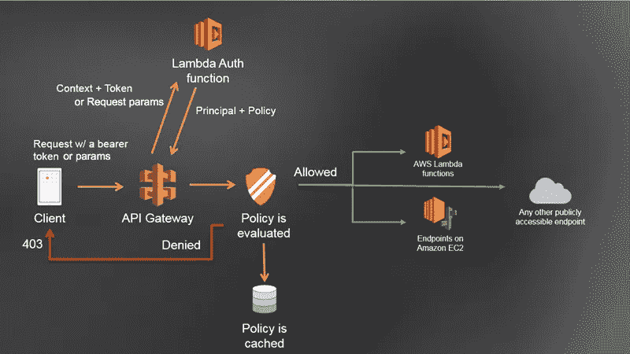

# 使用 TypeScript 在 AWS 上创建一个无服务器应用程序—第 2 部分

> 原文：<https://levelup.gitconnected.com/creating-a-simple-serverless-application-using-typescript-and-aws-part-2-2f9192717015>


Philipp Katzenberger 在 [Unsplash](https://unsplash.com?utm_source=medium&utm_medium=referral) 上的照片

从我们在第一部分 [**如何创建一个简单的无服务器应用**](https://sidneyb231.medium.com/creating-a-simple-serverless-application-using-typescript-and-aws-part-1-be2188f5ff93) 中停止的地方继续，我们将关注如何在 API Gateway 中实现授权，并确保只有经过身份验证的请求才能访问我们的 Lambda 函数。要了解更多关于授权机制和既定实践的信息，请参见[在 API 网关](https://docs.aws.amazon.com/apigateway/latest/developerguide/apigateway-control-access-to-api.html)中控制和管理对 REST API 的访问。对于这个应用程序，我选择使用 Lambda 授权器来控制对本文前面部分创建的 Lambda 函数的访问。

## API 网关 Lambda 授权器

[API Gateway Lambda 授权器](https://docs.aws.amazon.com/apigateway/latest/developerguide/apigateway-use-lambda-authorizer.html)是 Lambda 函数，由 API Gateway 调用以控制对我们函数的访问。有了 Lambda 授权器，我们可以允许一个请求继续我们的 API，或者拒绝这个未经授权的请求。这意味着我们可以控制谁可以访问我们的 API。

使用 Lambda authorizer 的一个优点是，我们可以将身份验证逻辑集中在一个函数中，而不是打包在每个单独的函数中。这意味着我们能够轻松地更新和部署我们的单个 auth 功能，而不需要重新部署每个使用身份验证的功能。使用 Lambda 授权器的另一个优点是，我们能够用进行远程调用的 auth 逻辑缓存响应。进行这样的远程调用会给每个运行检查的函数增加不必要的延迟。Lambda authorizers 还允许我们集成第三方身份提供者来控制对 API Gateway 中资源的访问，而不必配置诸如 [Amazon Cognito](https://aws.amazon.com/cognito/) 之类的服务。它还为我们定制授权逻辑提供了灵活性。

然而，使用 Lambda authorizers 也有一些缺点，包括 API 网关调用中增加的延迟。AWS Lambda 有一个 [**冷启动问题**](https://hackernoon.com/cold-starts-in-aws-lambda-f9e3432adbf0) ，使用 Lambda 授权器意味着我们可能要付出两次代价——在我们的授权器函数和核心函数中。此外，如果没有缓存策略，我们将不得不处理请求流中的额外网络跳跃。使用 Lambda 授权器的另一个缺点是，使用授权器的每个端点都必须包含授权信息。在某些情况下，这被证明是不灵活的。



Lambda 授权者授权工作流— AWS

## 履行

就访问控制和保护我们的基础设施而言，我们将实施如下所示的架构:


认证 API 架构

简单地说，当用户向我们的 API 网关端点发出 HTTP 请求时，请求必须在 HTTP 授权头中包含访问令牌。这将被转发到 Lambda Authorizer 函数，该函数使用第三方身份提供者对令牌进行身份验证。然后，它执行授权逻辑，并将身份管理策略返回给 API Gateway。API Gateway 使用该策略来评估是否允许用户调用所请求的 API，并允许或拒绝该请求。如果允许，API Gateway 会将请求转发给 Lambda 函数。您可以找到更多关于如何[使用 AWS Lambda 授权器和第三方身份提供者来保护 API Gateway REST API](https://aws.amazon.com/blogs/security/use-aws-lambda-authorizers-with-a-third-party-identity-provider-to-secure-amazon-api-gateway-rest-apis/)的信息。


照片由[托尔加·乌尔坎](https://unsplash.com/@tolga__?utm_source=medium&utm_medium=referral)在 [Unsplash](https://unsplash.com?utm_source=medium&utm_medium=referral) 上拍摄

现在对于我们的应用程序，我们需要使用第三方身份提供者 [Auth0](https://auth0.com) 创建一个基于令牌的 Lambda 授权器。

[免费注册 auth 0](https://auth0.com/signup?&signUpData=%7B%22category%22%3A%22docs%22%7D)，在仪表盘上，点击左侧边栏菜单上的 api，然后点击仪表盘上的 **CREATE API** 按钮，为新项目设置 API。


Auth0 仪表板

接下来，我们需要为我们的 API 输入一个名称和标识符


新的 API 表单— Auth0

单击 CREATE 按钮创建一个新的 API。

接下来，在 API 快速入门选项卡中，向下滚动并记下`**jwksUri**`


Auth0 API 页面

以及`issuer`和`audience`值


我们还需要从我们的 API 页面获取**客户端 ID** 和**客户端秘密**:


接下来，我们需要将这些值作为环境变量添加到项目中。修改`**.env**`文件并添加以下内容:

```
**//** .env**JWKS_URI**="<JWKS-VA>"
**AUDIENCE**="<AUDIENCE-VALUE>"
**TOKEN_ISSUER**="<ISSUER-VALUE>"
**AUTH0_CLIENT_ID**="<CLIENT-ID>"
**AUTH0_CLIENT_SECRET**="<CLIENT-SECRET>"
```

接下来，我们需要创建我们的认证服务。首先，我们安装一些依赖项:

```
$ yarn add jsonwebtoken @types/jsonwebtoken jwks-rsa
```

接下来，我们创建我们的`**auth.service.ts**`:

```
$ touch src/services/auth.service.ts
```

并更新如下:

上面的`**authenticate**`方法处理我们令牌认证的所有逻辑。首先，它使用`**_getToken**`方法从请求中检索令牌。这个令牌然后被`**jwt**`解码，然后我们检索`**kid**`。这个`**kid**`然后被用于使用`**_getSigningKey**`方法检索 Auth0 签名密钥。这个`**key**`被验证，然后我们返回策略文档。

我们还需要创建我们的 Lambda 授权函数:

```
$ mkdir src/actions/auth
$ touch src/actions/auth/jwt-auth.action.ts
```

并更新如下:

这个函数调用我们的认证服务`**authenticate**`方法。我们将它包装在一个 try catch 块中，这样任何错误都会作为一个`**Unauthorized**` 请求返回。

为了实现我们新的 Lambda authorizer，我们需要在我们的`**handler.ts**` 文件中导出我们的函数:

```
// handler.ts*// Custom API Gateway Authorizer* export { *jwtAuth* } from './src/actions/auth/jwt-auth.action';
```

然后更新`**functions.ts**`:

```
// resources/functions.tsexport default {
    jwtAuth: {
        handler: 'handler.jwtAuth',
    },
    ..........
}
```

要在函数中使用授权者，我们需要通过添加带有我们的授权者值的`**authorizer**`属性来更新`**http**`对象:

```
http: {
    method: '<METHOD>',
    path: '<ENDPOINT-URI>',
    authorizer: {
        name: 'jwtAuth'
    },
    cors: true
}
```

接下来，我们更新所有端点以使用授权器，这样我们的端点将不再接受没有正确授权令牌的请求:

在没有有效认证令牌的情况下向我们的端点发送请求应该会返回一个`**Unauthorized**`响应:


邮递员—失败的未授权请求

我们需要在请求头中包含一个有效的令牌。

要获得有效的令牌来测试我们的端点，请转到 Auth0 中的应用程序页面，并单击`**Quick Start**`选项卡:


向下滚动到**发送令牌 API** 部分，复制头`**authorization**`属性的值，包括*持有者*


我们需要在我们的请求`**Authorization**`头中使用这个`**Bearer token**`值:


确保`**Bearer**`和`**access_token**`之间有空间。单击 Send 按钮，我们应该会收到一个成功的响应:


现在，我们有了安全的端点，我们还需要更新我们的`**feature**`测试。

我们首先安装`[**dotenv**](https://www.npmjs.com/package/dotenv)`，这样我们就可以将环境变量从我们的`**.env**`文件加载到`[**process.env**](https://nodejs.org/docs/latest/api/process.html#process_process_env)`中，并在我们的测试处理程序中使用

```
$ yarn add dotenv @types/dotenv
```

然后我们更新我们的`**package.json**`脚本:

```
"scripts": {
  ....
  "feature-test": "./node_modules/.bin/mocha \"tests/feature/**/*.ts\" --require ts-node/register  --require dotenv/config "
},
```

我们还需要用我们的`**BASE_URL**`变量更新我们的`**.env**`文件:

```
BASE_URL=”http://localhost:3000/dev/"
```

接下来，我们更新我们的测试处理程序`**tests/lib/actions/handler**`:

我们的`**post**`函数从向 Auth0 发出客户端凭证请求开始，如果成功，返回一个`**access_token**`。有了这个**访问令牌**，我们就可以向我们的端点发出另一个请求。我在`post`函数中添加了一个`**authorized**`参数，这样我们也可以测试对我们的 API 的**未授权的**请求。

接下来，我们为未授权的请求创建一个测试:

```
$ touch tests/feature/list/create-list/unauthorized.test.ts
```

并添加我们的测试:

现在我们再次运行我们的测试`**yarn run feature-test**`:


功能测试

接下来，我们需要在您的工作目录中运行以下命令，将更新后的应用程序部署到默认的 AWS 概要文件中:

```
$ serverless deploy
```

或者通过运行以下命令来设置特定的配置文件:

```
$ serverless deploy --stage dev
```

你可以参考我的文章[如何为本地开发和部署](https://sidneyb231.medium.com/configure-aws-for-development-and-deployment-ad822097fc22)创建 AWS 凭证。就是这样。

# 结论

无服务器允许开发人员快速创建和部署可按需扩展且运行成本更低的微服务应用。这意味着我们获得了效率；然而，在控制和可见性方面存在权衡。无服务器缩短了开发时间，这意味着我们失败得更快。快速失败意味着我们也学得更快。

现在我们已经部署了我们的应用程序，我们可以创建一个客户端应用程序来使用我们的 API。然而，我不会在这篇文章中讨论这个问题。

本文旨在演示如何创建和部署一个简单的无服务器应用程序，它使用了[](https://docs.aws.amazon.com/amazondynamodb/latest/developerguide/Introduction.html)**，[**AWS Lambda**](https://docs.aws.amazon.com/lambda/latest/dg/welcome.html)**和 [**API 网关**](https://docs.aws.amazon.com/apigateway/latest/developerguide/welcome.html) 。我们还学习了如何使用[**API Gateway Lambda authorizer**](https://docs.aws.amazon.com/apigateway/latest/developerguide/apigateway-use-lambda-authorizer.html)来管理和控制对我们资源的访问。我们还可以通过实现一些功能来进一步改进我们的应用程序，例如使用平台[**【TravisCI】**](https://travis-ci.com/)[**circle ci**](https://app.circleci.com/)或[**concoursci**](https://concourse-ci.org/)进行监控、持续集成和部署，甚至使用服务添加自定义域，例如[**Amazon Route 53**](https://aws.amazon.com/route53/)。AWS 还提供了 [**Cloudwatch**](https://docs.aws.amazon.com/AmazonCloudWatch/latest/monitoring/WhatIsCloudWatch.html) ，实时监控我们在平台上运行的资源和应用。****

****我希望这篇文章有助于您理解如何开始创建简单的无服务器应用程序和管理对这些服务的控制。我还希望，在我们继续为未来设计解决方案时，它能以某种方式激励您。****

****我在下面包含了一个 GitHub 库的链接。如果对您有帮助，请随意克隆、派生或开始使用它:****

****[](https://github.com/s-barrah/serverless-todo) [## s-barrah/无服务器-todo

### 简单的无服务器 todo 应用程序您需要在本地安装以下软件包，然后再启动本地…

github.com](https://github.com/s-barrah/serverless-todo) 

# 进一步阅读

*   [开始使用无服务器框架](https://www.serverless.com/framework/docs/getting-started/)
*   [无服务器宣言](https://www.serverless.com/learn/manifesto/)
*   [无服务器架构 vs 其他](https://www.serverless.com/learn/comparisons/)
*   [无服务器架构初级读本](https://serverless.com/learn/)
*   [我们如何将创业迁移到无服务器](https://read.acloud.guru/our-serverless-journey-part-2-908d76d03716)
*   [为什么我们从 Docker 转向无服务器](https://serverless.com/blog/why-we-switched-from-docker-to-serverless/)
*   [无服务器(FaaS)与集装箱——何时选择哪个？](https://serverless.com/blog/serverless-faas-vs-containers/)
*   [AWS 无服务器框架指南](https://www.serverless.com/framework/docs/providers/aws/guide/intro/)
*   [IAM 中的安全最佳实践](https://docs.aws.amazon.com/IAM/latest/UserGuide/best-practices.html)
*   [IAM 基础知识:无服务器管理权限](https://www.serverless.com/blog/abcs-of-iam-permissions)
*   [在 API 网关中控制和管理对 REST API 的访问](https://docs.aws.amazon.com/apigateway/latest/developerguide/apigateway-control-access-to-api.html)
*   [亚马逊认知用户池](https://docs.aws.amazon.com/cognito/latest/developerguide/cognito-user-identity-pools.html)
*   [亚马逊 DynamoDB 是什么？](https://docs.aws.amazon.com/amazondynamodb/latest/developerguide/Introduction.html)
*   [使用 DynamoDB 中的表格和数据](https://docs.aws.amazon.com/amazondynamodb/latest/developerguide/WorkingWithTables.html)
*   [使用 API 网关λ授权器](https://docs.aws.amazon.com/apigateway/latest/developerguide/apigateway-use-lambda-authorizer.html)****