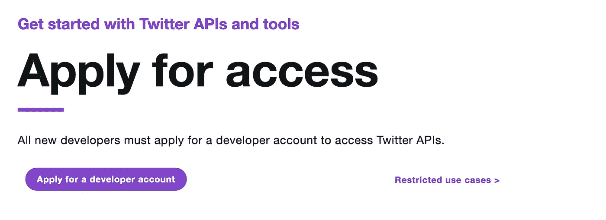
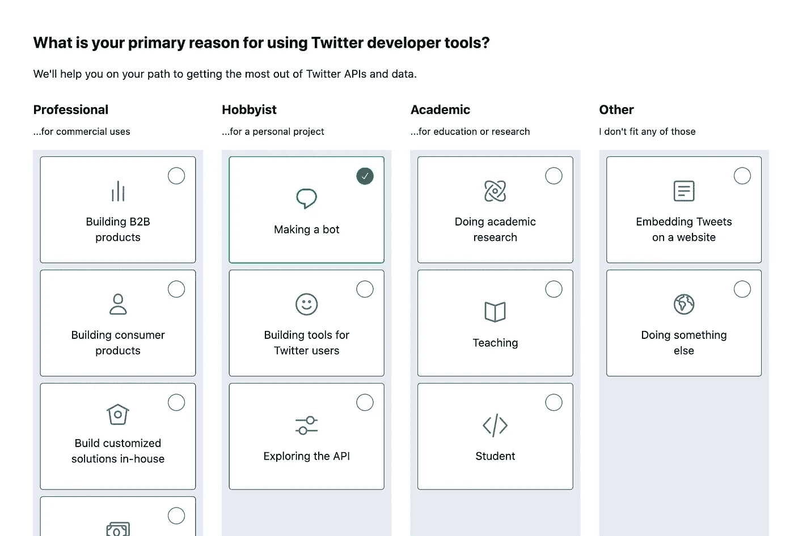
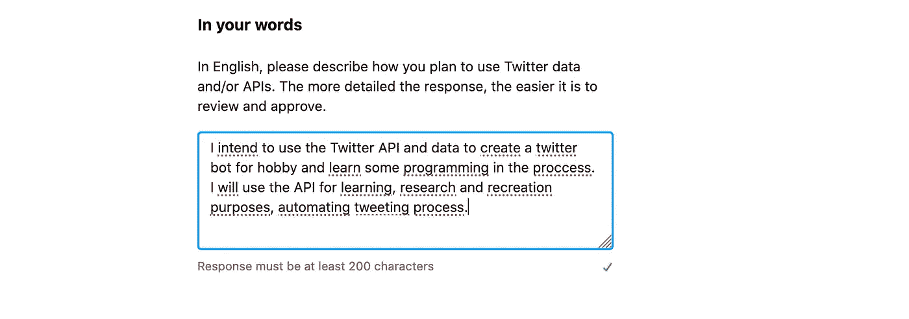
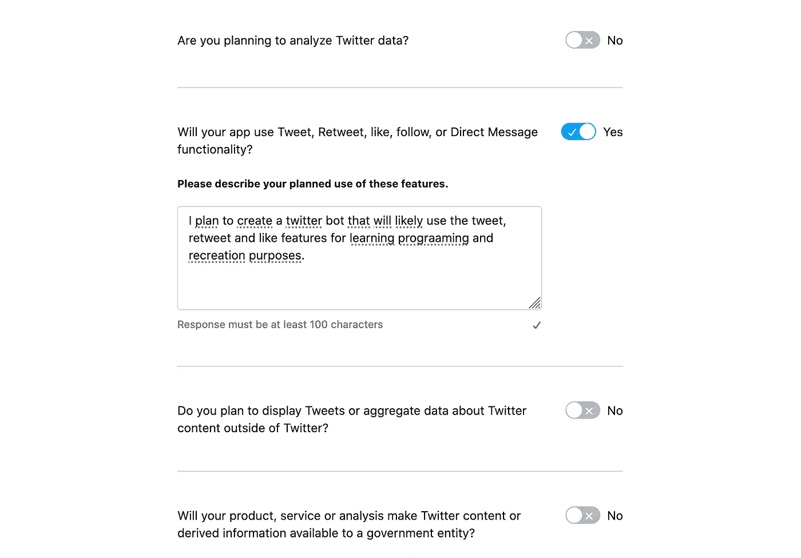
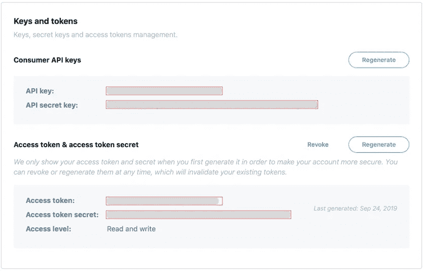
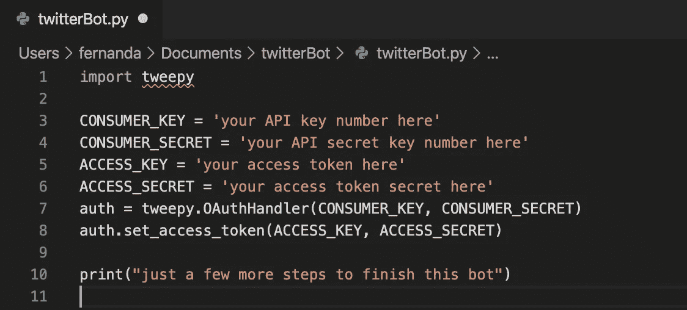

# 用 Python 创建一个简单的 Twitter 机器人

> 原文：<https://levelup.gitconnected.com/creating-a-simple-twitter-bot-with-python-5bfa6833ca15>


这将是一个简单快速的教程，使用 **Python** 语言和 **Tweepy** 库创建一个简单的 Twitter 机器人。

任何人都可以阅读这份材料(即使你对编码知之甚少)，它将涵盖创建你将使用的帐户的基础知识，你需要安装什么，以及一些你可以用 Twitter 机器人做什么的例子。也许它变得有点长，因为我试图把它分成小块，并解释它们，但你可以很容易地跳过一些部分，如果你发现一些过度解释。

现在，你需要做的是:

1.  **创建你的 twitter 开发者账户**
2.  **安装 python**
3.  **创建机器人应用**
4.  **写一些(很短的)代码**
5.  **推文！**

# **1。创建您的 twitter 开发者账户**

所以，首先，你需要有一个 twitter 开发者账户。有了这个帐户，你就可以访问我们开发这个机器人所需的 Twitter API。

去 [twitter 开发者网站](https://developer.twitter.com/en/apply-for-access)。



点击“申请开发者账户”

点击紫色的“申请开发者账户”按钮，登录你的常规 twitter 账户，如果你还没有的话。



选择“制作机器人”选项

选择“制作机器人”卡片，进入下一页。

填写表格中出现的下列字段。这一部分没有秘密，只要提供所要求的信息就行了。当你问到“你将如何使用 Twitter API 或 Twitter 数据？”佩奇，这样回答:



之后，接受开发者协议并提交申请。

这部分每个人可以不一样。有时申请会马上被接受，有时需要 1-2 周。一旦你的开发者帐户没问题，继续本教程。

# **2。安装 python**

你需要安装 Python3。有两种方法可以做到这一点。

1.  使用自制软件，只需在终端上输入:

```
$ brew install python3 && cp /usr/local/bin/python3 /usr/local/bin/python
```

2.或者从[这里](https://www.python.org/downloads/)下载。

安装后，检查是否一切正常，在您的终端中键入:

```
$ python3 --version
```

如果一切顺利，这应该会返回安装在您 PC 上的 python 的当前版本。现在，安装我们将在命令行中使用的库:

```
$ pip install tweepy
```

(如果不起作用，请尝试 pip3)

# **3。创建机器人应用程序**

回到 [Twitter 开发者网站](https://developer.twitter.com/en)，在屏幕右上角点击你的用户名。从下拉菜单中选择“应用程序”选项。然后“创建一个 app”。

提供应用程序名称、描述和其他必填字段。点击“创建”两次。

创建好 app 后，检查标签***权限*** ，查看你的 app 是否有[读写权限](https://developer.twitter.com/en/docs/basics/apps/guides/app-permissions)。万一没有，就编辑一下吧。

接下来，转到 ***密钥和令牌*** 选项卡，将您的 *API 密钥*、 *API 秘密密钥*、*访问令牌*和*访问令牌秘密*复制到某个地方。我们以后会用到它。



# **4。写一些(很短的)代码**

现在我们要做一些编码。根据自己的喜好使用文本编辑器(我个人使用 [VSCode](https://code.visualstudio.com/download) )。其他不错的选择是 [Atom](https://atom.io) 或 [Sublime Text](https://www.sublimetext.com) 。如果你不想下载任何东西，你也可以在你的电脑上使用本地文本编辑器。

创建一个文件夹，在该文件夹中创建一个 python 文件，然后打开它。您可以使用具有以下功能的终端来完成此操作:

> MacOS 和 Linux:

```
$ mkdir twitterBot
$ cd twitterBot
$ touch twitterBot.py
$ open twitterBot.py
```

> 窗口:

```
$ mkdir twitterBot
$ cd twitterBot
$ type nul > twitterBot.py
$ twitterBot.py
```

现在，在您刚刚创建并打开的文件中:

```
**import** tweepy
**import** time
```

这将导入 Tweepy 和时间库，因此我们可以使用它的函数。导入后，复制并粘贴这行代码:

```
CONSUMER_KEY = 'your API key number here'
CONSUMER_SECRET = 'your API secret key number here'
ACCESS_KEY = 'your access token here'
ACCESS_SECRET = 'your access token secret here'auth = tweepy.OAuthHandler(CONSUMER_KEY, CONSUMER_SECRET)
auth.set_access_token(ACCESS_KEY, ACCESS_SECRET)
```

在此替换您从创建的应用程序中保存的密钥。这几行代码将配置从 twitter 读取和写入数据所需的内容。之后，键入一个简单的打印命令，就像这样:

```
print(“just a few more steps to finish this bot”)
```

现在，您的文件应该如下所示:



让我们测试一下是否一切正常。从您的终端，访问这个文件所在的文件夹，并使用 python3 运行它。运行以下命令后，它应该会显示您在 print 语句中输入的消息:

```
$ python3 twitterBot.py
```

现在，让我们有效地使用 Twitter API。首先，将这行代码添加到您的代码中:

```
twitter_API = tweepy.API(auth)
```

现在，每次我们想使用一些函数从 twitter 中读写数据时，我们都会用这个变量` *twitter_API* ` *来调用它。*

但是我们将使用什么功能呢？嗯，有一堆有趣的。要检查它们，请阅读 [Tweepy 文档](http://docs.tweepy.org/en/latest/api.html)。这个文档非常清晰和完整，你应该能够理解和使用它没有任何问题。

但是让我们从一个简单的开始。让我们列出你的关注者，并在推特上提到他们中的每一个人。将此添加到代码的末尾。

```
**def** mention_followers():followers = twitter_API.followers()**for** follower **in** followers:
       twitter_API.update_status('Hello @' + follower.screen_name)while True:
   mention_followers()
   time.sleep(3600)
```

就这样。没错。你的推特机器人准备好了！

那么，这里发生了什么:首先你创建了一个名为*提提关注者的函数。*在这个函数中，您使用之前创建的变量( *twitter_API* )从 Twitter API 获得了您的关注者列表。然后，你遍历列表，用他们的名字提到追随者(API 数据 *screen_name* )。

最后，您在无限循环中调用了该函数。睡眠功能可以防止推特封杀账号。如果你连续多次发推文(特别是重复的推文)，这可以被认为是垃圾邮件。

# 5.推特！

现在，要查看这种工作方式，请在终端中导航到包含 python 文件的文件夹，并运行脚本:

```
*python3 twitterBot.py*
```

如果你现在打开 twitter，你应该会看到你的账户刚刚提到了你的所有粉丝。

# 现在该怎么办？

这只是一个简短的例子，展示了你可以用 python 写的 twitter 机器人做什么。

请随意探索 [API 提供的其他选项](http://docs.tweepy.org/en/latest/api.html)。你可以很容易地做一些事情，比如获得你收到的提及，你的时间表的最新状态，等等。要有创意！

你可以做的另一件事是在云中托管你的脚本(使用一些像 [Heroku](https://www.heroku.com) 这样的服务)，这样你可以更加自动化。

# 源代码

本教程的完整源代码可以在我的 [GitHub](https://github.com/azolinmf/twitter-bot-tutorial) 中找到。