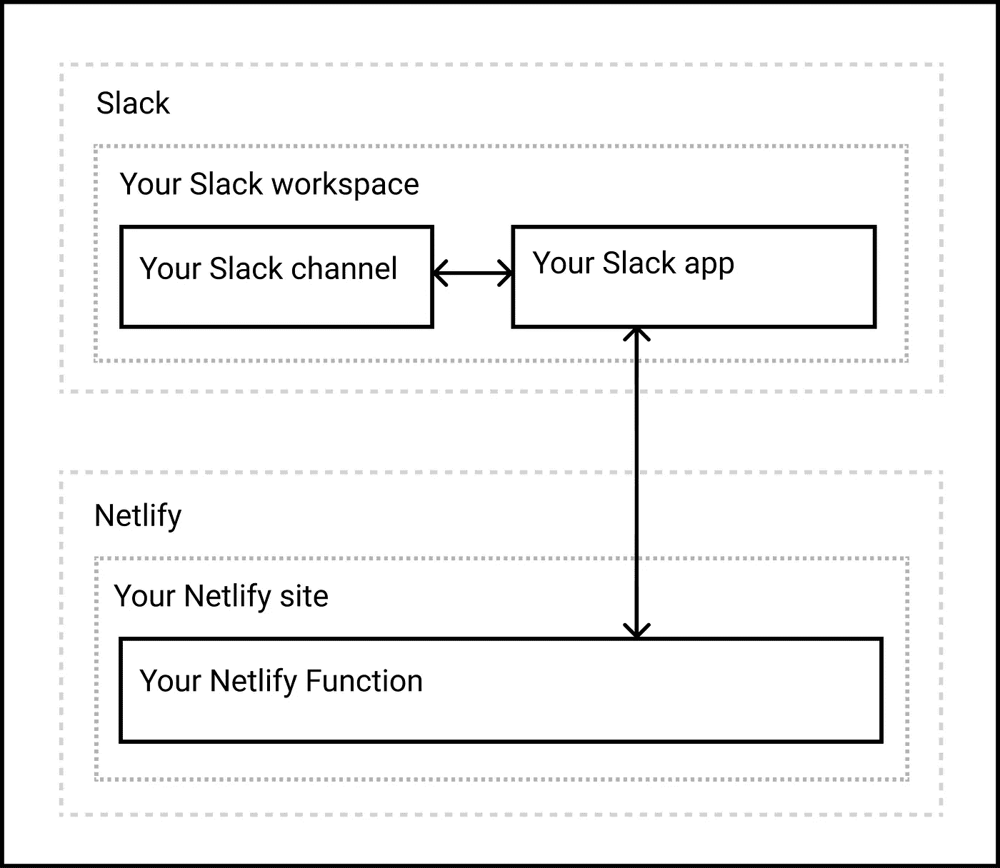

# 使用 Netlify 函数创建 Slack Bot

> 原文：<https://levelup.gitconnected.com/creating-a-slack-bot-using-netlify-functions-465d2a981686>

## 用 TypeScript 编写，使用 Bolt JS 框架，并附带开发技巧


由作者创建的带有 [Slack](https://slack.com/) 和 [Netlify](https://www.netlify.com/) 标志的图片。

# 介绍

[Netlify Functions](https://www.netlify.com/products/functions/) 是 Netlify 的无服务器功能版本——部署到托管服务提供商的单一用途脚本，在本例中是 Netlify，可按需扩展。 [Bolt JS](https://slack.dev/bolt-js/concepts) 是一个使用 JavaScript 构建 [Slack](https://slack.com/) 应用的框架。我很好奇如何将这两者结合在一起，在没有任何指导的情况下，我最终对这个主题进行了相当多的研究，并最终找到了答案。本操作指南旨在解释如何使用 Bolt JS 创建基于 TypeScript 的 Slack 应用程序，并使用 Netlify 函数将其作为无服务器函数运行。

我知道这是一个冗长的操作指南，所以让我给你一个快速的纲要，让你鸟瞰这篇文章。

*   **步骤#1:** 我们将看看如何使用一个现有的模板来创建我们的第一个基于 TypeScript 的 Netlify 函数。在这一步，我们将介绍如何在本地构建和运行一个函数，以及如何将它部署到 Netlify。这一步构成了本指南的基础。
*   **第 2 步:**现在我们已经熟悉了 Netlify 函数，我们将开始集成 Slack，方法是创建一个 Slack 应用程序，获取我们应用程序的凭证并将其集成到我们的函数中，以便该函数可以安全地与我们的 Slack 应用程序通信。
*   **步骤#3:** 在这一步，我们将把 Slack 的 Bolt JS 框架集成到我们的功能中。我们还将看看如何让 Slack 验证我们的函数 URL，并让 Slack 应用程序订阅一个事件。
*   **步骤#4:** 现在我们已经订阅了一个事件，当用户在频道中发布消息时，我们将能够从 Slack 接收消息。我们还会考虑让我们的 Slack 应用程序在每次发生这种情况时都做出响应。
*   **步骤#5** :在这一步中，我们将学习如何使用 Slack 的 slash 命令和 Netlify 函数来覆盖一个稍微不同的实现场景。
*   **整理和总结:**最后，我们将看看如何进一步整理我们的演示源代码，并提供一些提示，让它可以投入生产。

## 高层设计

为了让您对所有组件如何组合在一起以及如何相互作用有一个高层次的概述，这里有一个高层次的设计图。



图片由作者提供

# 步骤 1:创建 hello world 网络功能

## 样板代码

让我们从创建一个简单的基于类型脚本的 hello world Netlify 函数开始。为了加快速度，我在 GitHub 上创建了[这个模板库](https://github.com/ClydeDz/netlify-functions-typescript)——请派生这个库，并在您的计算机上本地克隆它。

让我解释一下这是干什么的。我已经创建了一个文件`index.ts`，它将是我们正在编写的函数的入口点。由于 Netlify 函数被部署到 [AWS 的无服务器 Lambda 函数中](https://docs.netlify.com/functions/overview/#default-deployment-options)，我们需要导出一个`handler()`方法。由于我们使用的是 TypeScript，我们需要对输入参数进行强类型化，并且由于这些参数将部署在 AWS Lambda 函数上，因此事件参数将接收类型为`APIGatewayEvent`的对象，而上下文将接收类型为`Context`的对象。返回对象的 body 属性中的内容将在浏览器中打印出来。

`netlify.toml`文件包含一个构建命令，它将在我们稍后构建项目时运行。本质上，Netlify build 将运行命令`npm run build`，该命令最终将运行`tsc`。`tsconfig.json`文件告诉 TypeScript 编译器(即`tsc`)将编译后的 JavaScript 文件放在哪里。在本例中，我们将 JavaScript 文件放在`.netlify/functions`目录中，这也是 Netlify 在提供函数时将查看的默认目录。

执行命令`npm install`安装所有节点依赖项。现在不要担心在本地运行这个函数，在这样做之前，我们还需要做一些事情。

## 向 Netlify 注册

接下来，我们将注册 Netlify 并从 Git repo 创建一个新站点。一旦你创建了你的团队，前往团队仪表板，点击按钮**从 Git** 新建站点。


图片由作者提供

这将向您展示创建站点的三步向导。第一步是将 Netlify 与您的 GitHub 存储库连接起来，也就是您之前在分叉模板后创建的存储库。当您提交对此 repo 的主要分支的更改时，Netlify 将自动构建和部署您的站点内容。


图片由作者提供

如果这弹出一个 GitHub 登录页面，请输入您的用户名和密码继续。你现在应该会看到一个**安装 Netlify** 的屏幕以及你的 GitHub 用户名。


图片由作者提供

如果您选择了该选项，您应该会看到下一个屏幕，该屏幕允许您授予 Netlify 对所有存储库的访问权限，或者您可以手动授予对某些存储库的访问权限。无论哪种方式，都要确保分叉的存储库可以访问。对于本文，我将选择**所有库**，然后点击**安装**按钮来安装 Netlify。


图片由作者提供

现在，您将被重定向回 Netlify，在那里您可以选择要从中创建站点的存储库。我将选择我的演示库[**ClydeDz/netlify-functions-slack-demo**](https://github.com/ClydeDz/netlify-functions-slack-demo)。


图片由作者提供

保留第三步中的所有设置，然后单击**部署站点**按钮继续。Netlify 将创建一个站点并触发第一次构建和部署。

## 更新网站名称

默认情况下，Netlify 会为您创建一个随机的站点名称，以使其独一无二。这意味着，您的函数 URL 也将包含这个名称。我们将在后台使用这个函数，所以用户永远看不到这个 URL，因此，这个名称应该无关紧要。事实上，我个人的建议是让这个 URL 尽可能的随机，这样别人就很难猜到它并对它进行随机请求。

但是，如果您确实想重命名，请转到 Netlify 中的**站点设置**，从**站点详细信息**部分，点击**更改站点名称**按钮。


图片由作者提供

在弹出窗口中输入您的新站点名称，并点击**保存**按钮。


图片由作者提供

当您在**站点详细信息**屏幕时，也请抓取 **API ID** 。

## 安装 Netlify Dev CLI

[Netlify Dev CLI](https://www.netlify.com/products/dev/) 是一个命令行工具，用于在本地运行所有 Netlify 产品。我们将用它在本地测试我们的功能。要安装 CLI，请运行命令`npm i netlify-cli -g`。您可以随时使用命令`netlify --version`来检查您正在运行的 CLI 版本。可用命令的完整列表可以在他们的[文档站点](https://cli.netlify.com/)上找到。

## 网络链接

下一步您需要做的是将本地设备上的代码与您刚刚创建的 Netlify 站点链接起来。为此，键入命令`netlify link`。这将在终端中启动一个交互式会话，您可以选择如何创建这个链接。最简单的方法是选择**使用当前 git 远程原点**。因为您已经将代码库下载到了本地机器上，并且因为 Netlify 已经连接到了这个库的远程源，所以 Netlify 将很容易地为您建立链接。简单来说，如果 A=B and B=C，那么 A=C


图片由作者提供

在后台，Netlify 将创建一个名为`.netlify`的隐藏文件夹，在这个文件夹中，它将放置一个名为`state.json`的文件，其中包含您的站点 id。这个文件夹也应该被自动添加到`.gitignore`文件中，所以我们不需要担心它被检入——这不是敏感信息，它只是不需要被检入。

## 代码更改

在这个阶段，我只想让你把`index.ts`的文件名更新为`slackbot.ts`。

## 比较代码更改

如果您想比较这一步的代码变化，请访问 GitHub 上的 [this diff page](https://github.com/ClydeDz/netlify-functions-slack-demo/commit/f73ae6a12efb09778ca097fb9a1e3dbb9b4fe02b) 。

## 闪耀时刻到了！

让我们在本地看看我们的 hello world 函数是什么样子的。运行命令`netlify build`编译您的代码，并在`.netlify/functions`文件夹中生成 JavaScript 文件。

一旦构建成功完成，运行命令`netlify dev`来启动本地开发服务器。Netlify 为我的应用程序分配了端口 8888，所以我将转到 [http://localhost:8888/。netlify/functions/slackbot](http://localhost:8888/.netlify/functions/slackbot) 查看输出。您应该在浏览器中看到打印的`Hello, World`。


图片由作者提供

> **提示:**执行命令`netlify dev --live`将在本地运行该函数，但这一次，Netlify 将使用公共 URL 公开展示该函数。在用 Slack 测试您的函数时，您会想要使用这种方法，因为这消除了像 [ngrok](https://ngrok.com/) 这样的工具的使用。

## 构建和部署

祝贺您在本地运行了第一个 Netlify 函数！让我们提交这个更改并将其推送到 GitHub。很快，你应该会看到 Netlify 构建你的代码，并把它发布到你的 Netlify 站点上。


图片由作者提供

现在，不用 localhost:8888，而是使用 Netlify 站点 URL 在浏览器中查看您的函数。您可以从 Netlify 中的**站点概述**选项卡获取您的 Netlify 站点 URL。您应该再次看到浏览器中打印的`Hello, World`。


图片由作者提供

## 开发者提示

我强烈推荐在您的开发中使用[而不是代码](https://code.visualstudio.com/)。使用 VS 代码，您可以利用多个终端来实现无缝的开发体验。一个终端可以用来执行像`netlify dev --live`这样的命令来运行函数的本地版本，第二个终端可以在对应用程序进行代码修改后执行像`netlify build`这样的命令。您会注意到，在使用第二个终端再次构建您的功能后，live function 应用程序会自动在第一个终端中重新加载。这很好，因为这样你的开发 URL 保持不变。

# 步骤 2:创建一个 Slack 应用程序

## 签约雇用

如果你还没有，免费注册 Slack，创建一个工作空间和一个频道。我们将在这个频道测试一些东西，所以先不要把你的伙伴添加到这个频道。

## 创建应用程序

前往[https://api.slack.com/apps](https://api.slack.com/apps)，点击**创建应用**按钮。


图片由作者提供

将此应用程序部署到生产环境时，您可能希望更新频道图标、描述和应用程序的其他方面。现在，由于我们只构建了一个演示应用程序，我们将省略这些细节。

## 添加范围

默认情况下，Slack 应用程序不能执行任何读取或写入功能。要添加功能，我们需要向应用程序添加范围。从左侧栏中，选择 **OAuth & Permissions** ，然后向下滚动到 **Scopes** 部分。

在此部分，点击**添加 OAuth 范围**按钮，并从范围列表中选择`chat:write`。我们可以随时回来添加更多的范围，所以现在让我们从小处着手。您的更改将自动保存。


图片由作者提供

现在，让我们向上滚动到您的工作区的 **OAuth 令牌**部分，并单击**安装到工作区**按钮。您可能需要接受要求您授予的权限，然后进入下一个屏幕。


图片由作者提供

安装此应用程序后，您现在将获得一个 **Bot 用户 OAuth 令牌**。请把那个价值抄下来，因为我们很快就要用到它。

## 获取签名机密

点击左侧边栏菜单中的**基本信息**选项卡，向下滚动至**签名密码**字段。点击**显示**按钮，然后复制并保存该值。


图片由作者提供

## 将这些价值注入到你的应用中

转到您的代码，在根目录下创建一个`.env`文件。这个文件应该已经添加到了`.gitignore`文件中，所以不要担心提交这个更改。

在这个文件中，使用格式`key=value`添加签名秘密和 bot 令牌。您可以随意命名该密钥，但是如果您正在跟进，请按照下面的截图命名。


图片由作者提供

运行命令`npm i dotenv @types/node --save-dev`来安装这些 npm 包。dotenv NPM 包允许我们访问。env 文件和[类型/节点](https://www.npmjs.com/package/@types/node) npm 包为节点提供了类型定义。

像上面的代码片段一样，在`slackbot.ts`的开头导入 dotenv 包，并在文件中尽可能早地调用 config 方法。然后，您应该能够使用`process.env.SLACK_SIGNING_SECRET`访问签名秘密，并使用`process.env.SLACK_BOT_TOKEN`访问 bot 令牌。

## 网络生活中的环境变量

由于`.env`文件没有添加到源代码控制中，我们需要添加相同的环境变量到 Netlify 中，以便函数可以访问这些值。在 Netlify 中，从导航菜单中转至**站点设置**，然后选择**构建&部署**，然后从子菜单中选择**环境**。


图片由作者提供

点击**新变量**按钮，添加相同的键和值对。点击**保存**以使更改生效。

# 步骤 3:集成 Bolt JS 框架

## 安装螺栓

Bolt 是一个 JavaScript 框架，用来构建 Slack 应用。运行命令`npm install @slack/bolt --save-dev`来安装这个框架，并在`slackbot.ts`文件的开头添加下面的代码片段。

除了导入`App`，它是 Bolt 对 Slack 应用程序的表示，我们还要导入`ExpressReceiver`，因为我们需要将 Bolt 的事件监听器与 Netlify 函数集成在一起。

接下来，我们将下面的代码片段添加到`slackbot.ts`中，用我们之前复制的签名秘密初始化`ExpressReceiver`，之后，我们将立即用签名秘密、bot 令牌和之前创建的 express receiver 实例初始化我们的`App`。

在`handler()`方法内部，让我们添加下面的代码。

我们将在`event.body`属性中接收的内容传递给一个实用方法，该方法将把这个字符串内容解析成一个 JSON 对象。接下来，我们将让我们的函数实现一个小目标——检查我们从 Slack 接收到的有效负载是否属于类型`url_verification`,然后简单地用它接收到的挑战进行响应。Slack 发送这种类型的请求来验证您是否为 Slack 应用程序输入了正确的 URL 端点。

不要忘记添加这个实用函数，它将接收到的内容解析成一个 JSON 对象。

我们还将从函数响应中删除文本 hello world，因为我们不再需要打印出来。

在`tsconfig.json`文件中，我们将在编译器选项部分添加属性`“esModuleInterop”: true`，因为如果没有这个，我们的构建将由于其他依赖包而产生错误。

## 构建和部署

现在，我们已经为这一步做了代码更改，让我们在本地运行命令`netlify build`来编译 TypeScript 文件并在`netlify/functions`文件夹中生成 JavaScript 文件。

假设没有错误，将您的更改提交到 GitHub 存储库。这将触发 Netlify 构建和自动部署。

## 比较代码更改

如果您想比较这一步的代码变化，请访问 GitHub 上的 [this diff page](https://github.com/ClydeDz/netlify-functions-slack-demo/commit/f1fed35591d7ac75ae9d7a4de2f93bd54da2258b) 。

## 完成 Slack 的挑战

前往你的应用的 Slack API 设置页面。然后，从左侧边栏菜单中，点击**事件订阅**。所有可以在 Slack 中执行的不同操作都被归类到不同的事件中。我们的应用程序可以订阅一个或多个这些事件，所以当它们发生时，Slack 会向我们的应用程序发送一个 POST 请求，其中包含事件的详细信息，使我们的应用程序能够处理这些事件。

由于这是您第一次来这里，我们需要通过轻触上的开关**来启用事件，然后在**请求 URL** 字段中，输入您的 Netlify 函数的 URL。我的网络生活功能的网址是
[https://netlify-functions-slack-demo.netlify.app/.netlify/functions/slackbot](https://netlify-functions-slack-demo.netlify.app/.netlify/functions/slackbot) 这是我在下面的截图中输入的内容。**


图片由作者提供

当您输入这个 URL 时，Slack 会立即向您的 Netlify 函数发送一个`url_verification`有效负载，并期望您的函数返回挑战。这是您之前更改代码的场景。

既然我们在这里，让我们订阅一个事件。展开**订阅机器人事件**部分，然后点击**添加机器人用户事件**按钮，搜索并添加**消息。**


图片由作者提供

点击**保存更改**按钮保存您的更新后，会要求您在工作区重新安装应用程序。请在继续之前完成此操作。

# 第四步:接收和发送你的第一条信息

## 代码更改

现在该做些有趣的事情了。让我们来看看您的函数如何从 Slack 接收消息并回复。在`slackbot.ts`文件中，将下面的代码片段添加到`handle()`方法中。这个代码片段构造了一个`ReceiverEvent`有效负载，它由接收到的解析的 JSON 主体和一个`ack()`方法组成，函数将通过确认收到来自 Slack 的事件来响应这个方法。

然后我们将这个`ReceiverEvent`对象传递给 Bolt 的`processEvent()`方法。`processEvent()`方法将检测接收到的事件类型，并将控制传递给相关方法。

接下来，让我们在`slackbot.ts`文件中添加`message()`方法来处理任何传入的消息并回复“Hi👋".

## 比较您的代码

如果您想比较这一步的代码变化，请访问 GitHub 上的 [this diff page](https://github.com/ClydeDz/netlify-functions-slack-demo/commit/b66bf0e4b6bb1474c6fcfcf6c5401c70cc0c9711) 。

## 构建和部署

提交您的更改并将它们推送到 GitHub，这样它就会自动构建和部署。

## 测试时差的变化

现在是时候在松弛通道中测试功能了。将演示应用程序添加到您的 Slack 频道。这一点很重要，因为你的应用程序无法阅读发布在该应用程序不属于的频道中的消息。在通道中发布一条消息后，您的函数应该立即从 Slack 接收一个有效负载，并用一条消息进行响应。


图片由作者提供

## 回复帖子并添加表情反应

为了简洁起见，我不会深入讨论让您的 Slack 应用程序回复一个线程并添加表情符号反应的细节。相反，我会让你通过 GitHub 上的[diff page](https://github.com/ClydeDz/netlify-functions-slack-demo/commit/3bc26c5a06d619a60b93ac40d82394ed000160dd)来查看你需要做出的更改，以使你的 Slack 应用程序回复一个线程，并通过 GitHub 上的[diff page](https://github.com/ClydeDz/netlify-functions-slack-demo/commit/82dfa348d5b0fd0f8f2b4ac2e4f0e1b364cf4f53)来查看让你的 Slack 应用程序用表情符号回复所需的代码更改。注意，为了添加一个反应，你将额外需要**反应:写**范围。

# 第 5 步:用斜杠命令删除

## 创建斜线命令

前往你的应用的 Slack API 设置页面，从左侧边栏菜单中选择**斜杠命令**。在出现的屏幕上，点击**创建新命令**按钮。


图片由作者提供

顾名思义，斜杠命令的前缀是正斜杠，后跟命令名和一些可选的参数。例如，你可以有一个类似`/greet morning`的斜杠命令，在那里你期待一个早晨主题的问候。你也可以有一个不带参数的斜杠命令，比如像`/greet`那样给你发送一个随机的问候。请记住，您的命令名称在所有应用程序中必须是唯一的，并且最好是简短的——所以要明智地选择！

从**创建新命令**屏幕，输入应该以正斜杠为前缀的命令名，在**请求 URL** 字段中输入网络功能 URL，键入简短描述以便用户了解该命令的作用，如果您的斜杠命令需要一个参数，可选地，在**用法提示**字段中键入一个参数。

我们将使**转义频道、用户和发送到您的应用程序的链接**复选框处于未选中状态，因为我们的斜杠命令在此阶段不需要用户 id 和频道 id，所以一个纯文本未转义字符串是可以的。


图片由作者提供

保存您的更改，然后在您的工作空间中重新安装该应用程序。

## 代码更改

让我们添加另一个方法来监听这个斜杠命令并响应它。在下面的代码片段中，`command()`方法的第一个参数是斜杠命令名，在第二个参数中，我们将使用对象析构来只接受`body`和`ack`对象。当响应 slash 命令时，我们的应用程序必须在发送实际消息之前的三秒钟内向 Slack 发送确认。`ack`对象是确认函数。

接下来，我们调用`chat.postEphemeral()`方法向 Slack 发送回复。使用`postEphemeral()`方法发送的回复只能被触发这个斜杠命令的用户看到，因此我们在方法中传递用户 id。当然，你仍然可以继续使用常规的`say()`或`chat.postMessage()`回复一条所有人都能看到的消息。

> **提示:**属性`body.text`将包含 slack 命令名。因此，如果您的命令类似于`/greet morning`，那么`body.text`将包含`morning`。属性`body.channel_name`将包含值`directmessage`当这个斜杠命令通过直接消息被触发到应用程序时。

## 提交、构建和部署

提交您的更改，并将其上传到 GitHub。在 Netlify 上成功构建和部署之后，我们将继续测试我们的 slash 命令。

## 在空闲时测试它

在您的 Slack 频道中，使用闪电图标弹出一个弹出窗口，然后搜索您的命令名。在输入框中输入命令名后，按 enter 键。


图片由作者提供

不幸的是，这次您会得到一个错误。

## 解决纷争

最简单的方法是在`handler()`方法中添加一个`console.log()`语句来检查接收到的事件对象内容。当然，这一次，您不希望将更改推送到 Netlify，而是希望在本地解决这个问题。

这意味着运行命令`netlify dev --live`以获得可公开访问的功能应用程序的本地实例，然后更新 slash 命令的**请求 URL** 字段以使用该 URL。然后再次触发 slash 命令，跳回终端窗口查看输出。

您会注意到事件对象包含该事件的大量数据，但是如果您在`parseRequestBody()`方法之后放置一个`console.log()`方法，您会注意到有效负载是未定义的。现在，如果您将 slash 命令的`event.body`属性中的内容与通道中消息的`event.body`属性中接收到的内容进行比较，您将会注意到格式上的重大差异。

斜杠命令的`event.body`属性将包含以下格式的消息:

```
body: 'token=some_token&team_id=your_team_id&team_domain=your_workspace'
```

而通道中常规消息的`event.body`属性将是这样的格式:

```
body: '{"token":"some_token","team_id":"your_team_id","api_app_id":"your_api_id"}',
```

前者是查询字符串格式，而后者是 JSON 字符串格式。这意味着，我们将需要我们的`parseRequestBody()`方法来处理这两种情况。

## 修理

幸运的是，`event.headers[“content-type”]`属性在两个场景中都包含不同的值。对于常规消息事件，`event.headers[“content-type”]`为`application/json`，而对于斜线命令事件，`event.headers[“content-type”]`为`application/x-www-form-urlencoded`。

让我们更新我们的`parseRequestBody()`方法，接受这个内容类型值作为第二个参数，并更新这个方法中的代码，将格式查询字符串转换为 JSON 对象。

非常感谢这个[源代码](https://www.developerdrive.com/turning-the-querystring-into-a-json-object-using-javascript/)提供了将查询字符串转换成 JSON 的代码片段。

现在，在`handler()`方法中，让我们更新`parseRequestBody()`方法来传递内容类型值。

## 此步骤的代码更改

如果您想比较这一步的代码变化，请访问 GitHub 上的 [this diff page](https://github.com/ClydeDz/netlify-functions-slack-demo/commit/76ff0f2efc268faf65e8e67884eb85389211bf7c) 。

## 构建和部署

提交您所有的更改，并将它们上传到您的 GitHub 库。成功构建和部署后，继续下一步。

## 在空闲时测试它

是时候再次测试斜杠命令了。这一次，你应该会收到应用程序的回复，这条消息只有你能看到。


图片由作者提供

## 其他松弛交互和事件

虽然我已经以一般消息和斜杠命令的形式介绍了两个不同的事件，但是我们仍然可以看到大量的 Slack 事件和交互。然而，你会发现剩下的部分可以通过以某种形式重复上述步骤来实现。因此，就本文的范围而言，我不打算演示更多的场景。

# 整理你的代码和结论

虽然上面只是演示代码，但还有很多地方需要进一步整理。[这个](https://github.com/ClydeDz/netlify-functions-slack-demo)是我希望生产就绪的源代码的样子，但是你可以根据自己的喜好自由清理代码。以下是我更新的一些亮点:

## 重构和单元测试

我尽可能将代码提取到[单独的方法](https://github.com/ClydeDz/netlify-functions-slack-demo/pull/1/files#diff-39b2554fd18da165b59a6351b1aafff3714e2a80c1435f2de9706355b4d32351)中，并利用了多个类型脚本文件。然后[为这段代码添加了单元测试](https://github.com/ClydeDz/netlify-functions-slack-demo/pull/1/files#diff-c37842b08434952211c06ad3cdc71258303dcce7491a2b5f2005876cfbc26681)，并且[更新了构建命令](https://github.com/ClydeDz/netlify-functions-slack-demo/commit/3b5ccd0504511bbf95b2bb1e05f3fabe23d078f6#diff-7ae45ad102eab3b6d7e7896acd08c427a9b25b346470d7bc6507b6481575d519R8)以便在编译文件之前运行这些单元测试。注意，你不需要测试 Bolt 的代码，因为他们的团队已经测试过了。您只想测试您添加的代码。

## 类型

我已经添加了变量、方法和方法参数的类型。在某些情况下，我创建了一个[自定义类型](https://github.com/ClydeDz/netlify-functions-slack-demo/pull/1/files#diff-8fa4b52909f895e8cda060d2035234e0a42ca2c7d3f8f8de1b35a056537bf199R23-R25)来稍微简化事情。

## 仅公开您需要的功能

你会注意到我已经把`slackbot.ts`文件移到了名为`functions`的文件夹中，而其他文件仍然在`src`文件夹下。我还更新了`tsconfig.json`文件中的[输出目录](https://github.com/ClydeDz/netlify-functions-slack-demo/pull/1/files#diff-b55cdbef4907b7045f32cc5360d48d262cca5f94062e353089f189f4460039e0R7)，将编译后的 JavaScript 文件放入`./netlify`目录，由于 TypeScript 编译器会维护文件夹结构，所以它会在将编译后的`slackbot.js`文件放入文件夹之前，自动在`netlify`文件夹中创建`functions`文件夹。

由于缺省情况下，Netlify 将只提供来自`netlify/functions`文件夹的函数，它现在将只暴露`slackbot.js`，而将`utils.js`和`constants.js`隐藏起来。下图直观地说明了这一过程。


图片由作者提供

在这段代码的演示版本中，`utils.js`和`constants.js`文件都放在了`functions`文件夹中。这意味着当您试图通过函数 URL 访问 utils 文件时，它将抛出一个错误。

## 分发您的应用

本操作指南中内置的演示应用程序可在单一工作空间中使用。如果你想在多个工作空间中使用你的应用程序，或者通过应用程序目录将你的应用程序分发给更多的受众，那么你可能必须遵循[这篇文章](https://api.slack.com/start/distributing)来查看你可能需要对你的应用程序进行哪些更改。

就是这样！感谢阅读。