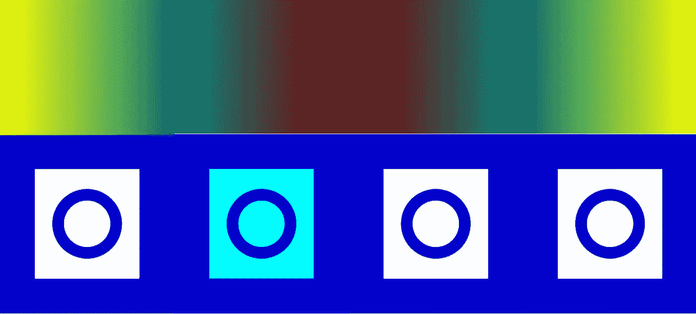
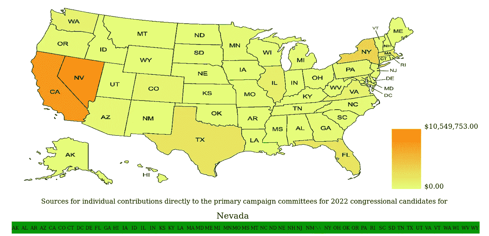

# 用 HTML5 画布元素创建幻灯片

> 原文：<https://levelup.gitconnected.com/creating-a-slideshow-with-the-html5-canvas-element-d956c348d9c1>

## 使用 vanilla JS 和 canvas 元素支持自动和手动滚动图像



作者图片

Web 开发人员通常需要创建幻灯片，循环显示一组图像，并依次显示每张图像。本教程提供了一个使用 HTML5 画布创建这样一个幻灯片的示例，包括如何设置图像的自动循环，以及如何使用户能够使用键盘或鼠标在图像中导航。

在我们的示例中，我们将设置一个幻灯片，显示 51 个不同的热图(美国每个州一个，DC 华盛顿州一个)，显示每个州国会候选人直接向初选委员会捐款的来源。这是我用来制作展示 WhoTheyRepresent.org 地图的幻灯片的实际方法。

**创建基本的自动化幻灯片放映**

在我们的例子中，我们有一组 51 个 PNG 图像，我们希望循环遍历它们，所有这些图像都位于包含这个站点的 HTML/JavaScript 代码的目录的`img`子目录中。我们将通过创建一个`[Image](https://developer.mozilla.org/en-US/docs/Web/API/HTMLImageElement/Image)`对象并依次将它指向每个不同的图像来做到这一点，在每个转换之间有 5 秒钟的等待时间。每次`Image`对象被指向一张新的图片时，我们将把图像绘制到我们的 [HTML 画布](https://developer.mozilla.org/en-US/docs/Web/API/Canvas_API)(如果你不熟悉 HTML 画布元素，Mozilla 开发者网络有[关于使用它的介绍性教程](https://developer.mozilla.org/en-US/docs/Web/API/Canvas_API/Tutorial))，创建我们的幻灯片效果。

作为第一步，我们将定义我们的 HTML canvas 对象，并给它一个普通的白色([十六进制](https://en.wikipedia.org/wiki/Web_colors#Hex_triplet))背景。在我们的 JavaScript 代码中，我们将定义变量`canvas`和`ctx`来分别表示我们的 canvas 元素及其上下文。此外，我们将定义一个新的`Image`对象`img`，尽管我们还不会给它分配一个实际的 PNG 图像——这将在稍后的一个单独的函数中处理。

我们还将初始化其他几个 JavaScript 变量。为了允许我们在各种状态及其相关的 PNG 图像中循环，我们将创建一个数组`states`，包含每个状态的缩写，并将该数组的长度存储在变量`numStates`中。此外，我们将定义`curSt`，它将表示当前时间我们想要显示图像的州的`states`中的索引，并将其初始化为`0`(阿拉斯加)。

由于我们在图像转换之间等待 5 秒的技术将利用`setTimeout()`函数，我们将定义一个`timeoutId`变量来保存该函数返回的当前定时器 ID，并将其初始化为`-1`。

如果有人打开浏览器访问我们的网站，为了防止我们的幻灯片浪费地继续从我们的服务器加载图像，我们还将定义一个`maxLoads`变量，它代表在不刷新页面的情况下允许的自动图像过渡的最大数量，我们将它设置得足够高，以允许我们的图像经过两个完整的周期。我们的`numLoads`变量将对已经发生的图像转换次数进行计数(自上次重置以来)，我们的`paused`布尔变量将用于确定自动循环是否应该继续运行。

```
<!DOCTYPE html>
<html>
<head>
    <meta charset="utf-8" />
    <title>Heat Maps Example</title>
    <style>
     * { padding: 0; margin: 0; }
     canvas { background: #FFFFFF; display: block; margin: 0 auto; }
    </style>
</head>
<body>
  <canvas id="states_map" width="1400" height="720"></canvas>
  <script>
   const states = ['AK','AL','AR','AZ','CA','CO','CT','DC','DE','FL',
      'GA','HI','IA','ID','IL','IN','KS','KY','LA','MA',
      'MD','ME','MI','MN','MO','MS','MT','NC','ND','NE',
      'NH','NJ','NM','NV','NY','OH','OK','OR','PA','RI',
      'SC','SD','TN','TX','UT','VA','VT','WA','WI','WV',
      'WY'];
   const numStates = 51;
   var curSt = 0;
   var timeoutId = -1;
   const img = new Image();
   img.crossOrigin = "anonymous";
   const canvas = document.getElementById("states_map");
   const ctx = canvas.getContext("2d");
   var paused = false;
   var numLoads = 0;
   const maxLoads = 2*numStates; 
```

现在我们已经有了画布元素、`Image`对象和其他需要的变量，我们可以定义我们的`loadMapImg()`函数，它增加我们的状态计数器(如果幻灯片没有暂停的话),并将由`curSt`表示的状态的地图分配给我们的`img`对象。由于我们示例中的图像遵循标准命名约定，我们只需将来自`states[]`的相关州缩写插入到表示相对文件路径的字符串中。如果我们没有标准化的命名约定，我们可以在数组中存储完整的文件名/路径(或者从另一个文件中动态读取它们)。

请注意，当我们递增我们的`curSt`变量以指向下一个状态时，我们取这个递增值的结果[对](https://en.wikipedia.org/wiki/Modular_arithmetic) `numStates`取模，这样当我们到达幻灯片的结尾时，它将返回到开头。

```
function loadMapImg() {
  if(paused === false) {
   curSt = (curSt+1)%numStates;
  }
  img.src = "./img/"+states[curSt]+"_indiv_cont_sources_2022.png";
 };
```

现在，我们可以添加一个事件监听器，它将在每次我们的`img`对象加载时触发，这将在每次`img.src`被我们的`loadMapImg()`函数指向一个新的 PNG 后不久发生。我们将让这个事件监听器调用一个新函数`drawMaps()`，它将把我们的 PNG 绘制到画布上。

```
img.addEventListener("load", () => {
        drawMaps();
 });
```

我们的`drawMaps()`函数需要执行几个步骤。首先，它需要使用`[ctx.drawImage()](https://developer.mozilla.org/en-US/docs/Web/API/CanvasRenderingContext2D/drawImage)`方法将加载到我们的`img`对象的当前 PNG 文件绘制到画布上。

如果我们的幻灯片被暂停(即如果`paused`是`true`)，那么这就是这个函数要做的。但是，如果`paused`是`false`，我们的函数将首先检查我们的`numLoads`计数器是否超过我们的最大转换计数`maxLoads`。如果是这样，我们将调用另一个函数`pause()`(即将定义)，来暂停我们的幻灯片。

但是，如果我们还没有达到我们的负载极限，我们将调用`[setTimeout()](https://developer.mozilla.org/en-US/docs/Web/API/setTimeout)`函数并传递它`loadMapImg`(我们之前定义的函数)和`5000`作为输入。这样，`setTimeout()`将在调用我们的`loadMapImg()`函数之前等待`5000`毫秒(或 5 秒)，从而创建我们的幻灯片循环(因为`loadMapImg()`的完成将触发我们的事件监听器用于`img`加载，这又调用`drawMaps()`，这将再次调用`loadMapImg()`，除非我们达到了我们的加载限制或幻灯片暂停)。

请注意，`setTimeout()`的返回值存储在我们的`timeoutID`变量中，我们在调用`setTimeout()`来跟踪另一个图像已被加载后，递增`numLoads`。

```
function drawMaps() {
  // draw current map
  ctx.drawImage(img, 0, 0, canvas.width, canvas.height);

  // automated reload handling if not paused
  if(paused === false) { 
     if(numLoads >= maxLoads) { // pause if too many automated loads
       pause();
     } 
     else { // otherwise, set reload timer and increment load counter
       timeoutID = setTimeout(loadMapImg, 5000);
       numLoads += 1;
     }
  }
 };
```

在`drawMaps()`中使用的`pause()`函数需要执行两个任务。首先，如果`timeoutID`被设置为等于一个实际定时器的 ID，我们想要调用`[clearTimeout()](https://developer.mozilla.org/en-US/docs/Web/API/clearTimeout)`来阻止当前定时器完成并再次调用`loadMapImg`。我们可以在清除相关定时器后将`timeoutID`设置为`-1`。然后，我们可以将`paused`设置为`true`，这样对`drawMaps()`的调用将不再触发另一个定时器。

```
function pause() {
  if(timeoutID > -1) {
   clearTimeout(timeoutID);
   timeoutId = -1;
  }
  paused = true;
};
```

最后，在我们脚本的底部，我们将调用`loadMapImg()`，这将在页面被加载时触发我们的幻灯片循环。

```
 loadMapImg();
</script>
```

此时，我们有了一个简单的幻灯片，它将循环显示我们的 51 幅热图两次。

**添加显示条**

为了让用户知道他们在幻灯片中的位置，我们可以在图像底部添加一个菜单栏，显示 50 个不同的州和 DC，并突出显示当前显示的是哪个州的热图。幸运的是，canvas 元素使得在我们的图像上绘制这样一个菜单栏变得相对简单。

为了实现这一点，我们将首先在脚本顶部附近添加一些新的变量声明。这些将代表我们的菜单栏的大小和位置，我们将它们定义为画布宽度和高度的一部分，以使缩放更容易。

```
const menuTop = 19*canvas.height/20;
const menuHeight = canvas.height/20;
const menuItemWidth = canvas.width/numStates;
```

接下来，我们可以向我们的`drawMaps()`函数添加一个代码片段，以循环遍历`states[]`中的每一项，并为每个州绘制一个包含州缩写(即存储在`states[]`中的关联值)的矩形。我们将使用`[ctx.rect()](https://developer.mozilla.org/en-US/docs/Web/API/CanvasRenderingContext2D/rect)`方法创建矩形，使用`[ctx.fillText()](https://developer.mozilla.org/en-US/docs/Web/API/CanvasRenderingContext2D/fillText)`绘制州名缩写。当我们为热图当前显示的状态绘制菜单项时，我们将使用不同的颜色(即`[ctx.fillStyle](https://developer.mozilla.org/en-US/docs/Web/API/CanvasRenderingContext2D/fillStyle)`)来创建高亮效果。

```
 // draw states menu bar, one state at a time
  for(let i = 0; i < numStates; i++) {
   // draw rectangle in menu representing this state
   ctx.beginPath();
   ctx.rect(i*menuItemWidth, 
    menuTop, 
    menuItemWidth, 
    menuHeight);
   if(i === curSt) { // highlight current state
    ctx.fillStyle= "#00FF00";
   }
   else {
    ctx.fillStyle = "#009900";
   }
   ctx.fill();
   ctx.closePath();
   // write state abbr to menu bar
   ctx.font = "14px sarif";
   ctx.fillStyle = "#000000";
   ctx.fillText(states[i], 
       (i+0.05)*canvas.width/numStates, 
       59*canvas.height/60);
  }
```

因此，我们最终的`drawMaps()`函数将如下所示:

```
function drawMaps() {
  // draw current map
  ctx.drawImage(img, 0, 0, canvas.width, canvas.height);
  // draw states menu bar, one state at a time
  for(let i = 0; i < numStates; i++) {
   // draw rectangle in menu representing this state
   ctx.beginPath();
   ctx.rect(i*menuItemWidth, 
    menuTop, 
    menuItemWidth, 
    menuHeight);
   if(i === curSt) { // highlight current state
    ctx.fillStyle= "#00FF00";
   }
   else {
    ctx.fillStyle = "#009900";
   }
   ctx.fill();
   ctx.closePath();
   // write state abbr to menu bar
   ctx.font = "14px sarif";
      ctx.fillStyle = "#000000";
      ctx.fillText(states[i], 
       (i+0.05)*canvas.width/numStates, 
       59*canvas.height/60);
  }
  // automated reload handling if not paused
  if(paused === false) { 
     if(numLoads >= maxLoads) { // pause if too many automated loads
       pause();
     } 
     else { // otherwise, set reload timer and increment load counter
       timeoutID = setTimeout(loadMapImg, 5000);
       numLoads += 1;
     }
  }
 };
```

此时，我们可以循环播放幻灯片，并在图像底部绘制适当的菜单栏，创建如下效果:



图片由作者提供，使用由[https://www.mapchart.net/usa.html](https://www.mapchart.net/usa.html)提供的美国基本州地图和 [Wistia 色盲友好热图调色板](https://github.com/wistia/heatmap-palette)中描述的配色方案创建。

**启用用户对幻灯片放映的控制**

用户可能对特定州的热图最感兴趣，或者他们可能希望暂停幻灯片放映，以便给自己更多时间来查看给定的地图。为了方便起见，我们将实现按键处理，让左/右箭头键用于图像之间的滚动，空格键用于暂停或恢复幻灯片放映。我们还将允许单击菜单栏中的一个状态来选择其热图。

我们将首先处理键盘控制。为了监听点击，我们需要添加一个[事件监听器](https://developer.mozilla.org/en-US/docs/Web/API/EventTarget/addEventListener)到我们的脚本中，它将在每次按键时调用一个定制的处理函数(`keyDownHandler()`)。

```
document.addEventListener("keydown", keyDownHandler, false);
```

然后，我们可以定义我们的`keyDownHandler()`函数，它将有一系列的 if/else 语句来执行特定的动作，如果特定的键被按下，这是基于输入对象`e`的`[code](https://developer.mozilla.org/en-US/docs/Web/API/KeyboardEvent/code)`属性的值来确定的，由我们的事件监听器传递。

如果`e.code`的值为`'Space’`，那么空格键被按下。在这种情况下，用户可能想要暂停幻灯片放映，或者如果已经暂停，则继续播放。所以，如果`paused`当前是`true`，我们将调用一个新函数`unpause()`(稍后定义)来恢复幻灯片放映。否则，我们将调用我们现有的`pause()`函数。请注意，我们还调用了`[e.preventDefault()](https://developer.mozilla.org/en-US/docs/Web/API/Event/preventDefault)`方法，以便当用户试图暂停或继续播放幻灯片时，按下空格键不会导致用户页面向下滚动(按下空格键时的默认操作)。

如果用户按下右箭头，那么我们将使用我们的`pause()`功能暂停幻灯片放映，以防止自动滚动干扰用户的手动滚动。然后，在调用`loadMapImg()`加载对应于下一个状态的 PNG 之前，我们将递增`curSt`计数器，使其指向下一个状态(或者回到第一个状态，如果我们达到其最大值)。

同样，如果用户按下左箭头，我们将在从`curSt`中减去`1`之前调用`pause()`(或者如果`curSt`已经是`0`的最小值，则将`curSt`设置为其最大可能值)，然后我们将调用`loadMapImg()`加载相应的热图图像。

```
function keyDownHandler(e) {
  if(e.code === 'Space') { // spacebar
   e.preventDefault(); // Prevent spacebar from scrolling down
   if(paused) {
    unpause();
   }
   else {
    pause();
   }
  }
  else if(e.code === 'ArrowRight') { // right arrow
   pause();
   curSt = (curSt+1)%numStates;
   loadMapImg();
  }
  else if(e.code === 'ArrowLeft') { // left arrow
   pause();
   if(curSt === 0) {
    curSt = numStates-1;
   }
   else {
    curSt = (curSt-1)%numStates;
   }
   loadMapImg();
  }
 };
```

此时，左右箭头应该能够成功地滚动不同的状态，空格键应该能够暂停幻灯片放映，但是我们仍然需要定义我们的`unpause()`函数来恢复幻灯片放映。为此，我们将把`paused`设置为`false`，并调用`loadMapImg()`，这将加载下一张图像，从而恢复我们的幻灯片放映周期。我们还会将`numLoads`重置为`0`，因为用户可能希望如果按下恢复键的话，能够再次观看完整的幻灯片。

```
function unpause() {
  paused = false;
  numLoads = 0;
  loadMapImg();
 };
```

我们的键盘命令现在应该都可以工作了，但是我们还希望能够单击一个菜单选项来选择该州的热图。为此，我们将添加另一个事件侦听器，这次是针对画布上的点击事件。当 canvas 元素上的某处有一个点击时，这个监听器将调用一个新的`clickHandler()`函数，并将点击事件作为输入传递。

```
canvas.addEventListener("click", (event) => clickHandler(event));
```

在`clickHandler()`中，我们将使用`[canvas.getBoundingClientRect()](https://developer.mozilla.org/en-US/docs/Web/API/Element/getBoundingClientRect)`方法返回一个表示包含画布的矩形的对象，通过从单击位置的 x 坐标中减去矩形左侧的位置，从单击位置的 y 坐标中减去矩形顶部的位置，我们可以找到画布上单击的(x，y)坐标的相对位置。我们将把这些新坐标存储在`x`和`y`变量中，这些坐标适合我们的画布。

从那里，我们需要检查点击是否落在我们的一个菜单项的边界内。由于所有菜单项的垂直位置是相同的，我们可以简单地检查`y`是否大于`menuTop`但小于`menuTop + menuHeight`以确定它是否在适当的垂直范围内。由于菜单跨越了我们画布的整个宽度，我们可以做一个快速的安全检查来确保`x`既大于`0`又小于`canvas.width`，以确保点击落在菜单上的某个地方。

假设满足以上条件，我们可以调用`pause()`来停止自动滚动。然后我们可以设置`curSt`等于所选状态对应的值，用`x`除以每个菜单项的宽度(`menuItemWidth`)再取结果的[底](https://developer.mozilla.org/en-US/docs/Web/JavaScript/Reference/Global_Objects/Math/floor)即可得到。为了理解这种计算，请记住`x`代表从画布左侧的距离，这个距离对应于一个特定的项目。所以，如果我们将`x`除以每个项目的宽度并向下舍入，我们可以找到代表包含`x`的特定项目的顺序(从最左边的项目开始)的数字。

最后，我们调用`loadMapImg()`来显示与`curSt`的新值对应的 PNG。

```
function clickHandler(event) {
   const bounding = canvas.getBoundingClientRect();
   const x = event.clientX - bounding.left;
   const y = event.clientY - bounding.top;

   if((y > menuTop) && (y < menuTop + menuHeight)) { //verify within vertical range of menu
    if((x >= 0) && (x < canvas.width)) { // verify within horizontal range of menu
     pause();
     curSt = Math.floor(x/menuItemWidth);
     loadMapImg();
    }
   }
 };
```

**结论**

我们现在已经创建了一个具有自动和手动滚动功能的基本幻灯片。使用 canvas 元素，您还可以在图像上动态地覆盖额外的绘图或文本，或者在图像之间切换时实现某种过渡动画。探索可能性，快乐编码！

**资源**

使用这种技术的示例网站:[WhoTheyRepresent.org](http://whotheyrepresent.org)

MDN HTML 画布教程:[https://developer . Mozilla . org/en-US/docs/Web/API/Canvas _ API/Tutorial](https://developer.mozilla.org/en-US/docs/Web/API/Canvas_API/Tutorial)

MDN 图像对象文档:[https://developer . Mozilla . org/en-US/docs/Web/API/HTMLImageElement/Image](https://developer.mozilla.org/en-US/docs/Web/API/HTMLImageElement/Image)

MDN setTimeout 文档:【https://developer.mozilla.org/en-US/docs/Web/API/setTimeout 

MDN clearTimeout 文档:[https://developer . Mozilla . org/en-US/docs/Web/API/clear time out](https://developer.mozilla.org/en-US/docs/Web/API/clearTimeout)

MDN canvas drawImage 文档:[https://developer . Mozilla . org/en-US/docs/Web/API/canvasrenderingcontext 2d/draw image](https://developer.mozilla.org/en-US/docs/Web/API/CanvasRenderingContext2D/drawImage)

MDN 事件监听器文档:[https://developer . Mozilla . org/en-US/docs/Web/API/event target/addevent listener](https://developer.mozilla.org/en-US/docs/Web/API/EventTarget/addEventListener)

MDN getBoundingClientRect 文档:[https://developer . Mozilla . org/en-US/docs/Web/API/Element/getBoundingClientRect](https://developer.mozilla.org/en-US/docs/Web/API/Element/getBoundingClientRect)