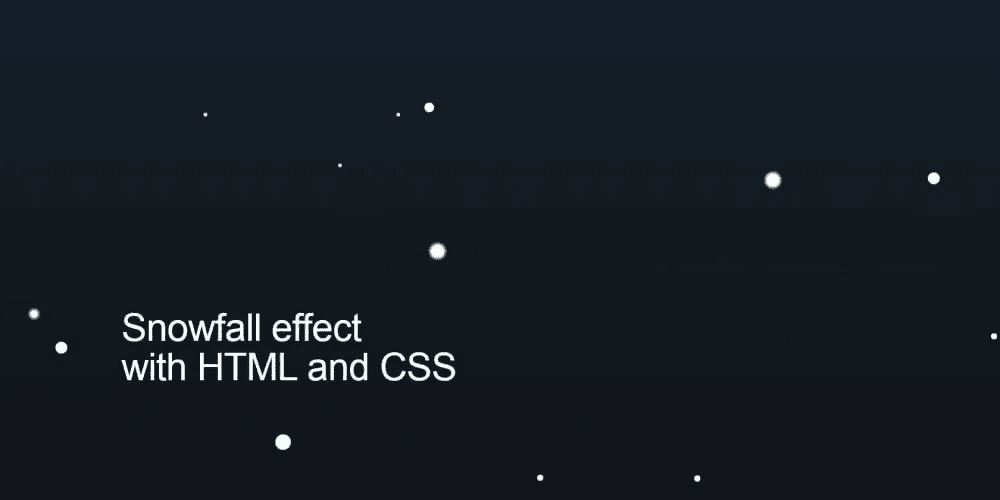

# 用 HTML 和 CSS 创建降雪效果

> 原文：<https://levelup.gitconnected.com/creating-a-snowfall-effect-with-html-and-css-a9b34de67d79>



德克萨斯州最近一直在下雪和结冰(现在仍然如此)…这是这个用 HTML 和 CSS 在不到 10 分钟内完成的[下雪的快速动画的灵感(视频在页面底部)。](https://www.youtube.com/watch?v=XO02P3QwENo)

> *注:我们用* [*Pug*](https://pugjs.org/api/getting-started.html) *和*[*Sass/SCSS*](https://sass-lang.com/)*分别简化了 HTML 和 CSS 的重复部分，但并不需要。您可以推断代码只有 HTML 和 CSS(为了简单起见，我们将在本文中展示这两者。)*

这是我们的动画最终的样子(通过 CodePen 进行[演示):](https://codepen.io/alvaromontoro/full/GRNmdzB)

# 设置背景

让我们从设置背景开始。这一步是可选的，可以通过多种方式完成。出于演示的目的，我们将仅限于用 CSS 制作一个黑色背景:

```
html, body {
  padding: 0;
  margin: 0;
  width: 100vw;
  height: 100vh;
  position: relative;
  overflow: hidden;
  background: linear-gradient(#123, #111);
}
```

# 加入雪花

然后我们将为屏幕上想要的每一片雪花创建一个`<div>`。我们可以这样做:

```
<div class="snowflake"></div>
...
...
...
<div class="snowflake"></div>
<div class="snowflake"></div> <!-- 50 times! -->
```

但是为了简单起见，我们使用了 PugJS，它允许我们对这些重复的任务使用循环:

```
- for (i = 0; i < 50; i++)
  div(class="snowflake")
```

# 设计雪花

现在页面上已经有了所有的雪花，我们需要对它们进行样式化。他们将是小的，圆形的，白色的:

```
.snowflake {
  --size: 1vw;
  width: var(--size);
  height: var(--size);
  background: white;
  border-radius: 50%;
  position: absolute;
  top: -5vh;
}
```

我们为宽度和高度使用了一个自定义属性(`--size`)，因为以后我们想要不同大小的雪花时会很方便。

此外，我们将雪花放置在视图框架之外(从顶部)。我们将使它们落在视图框架的外部(从底部)。

# 添加动画

为了制作这个秋天的动画，我们需要使用一个带有`@keyframes`的 CSS 动画。我们将从一些基本的东西开始，然后让它增长一点。

首先，我们将使用`translate3d`让雪花垂直移动。因为这是一个 3D 转换，它将触发硬件加速，看起来比我们制作不同属性的动画更好，如`top`:

```
@keyframes snowfall {
  0% {
    transform: translate3d(0, 0, 0);
  }
  100% {
    transform: translate3d(0, 110vh, 0);
  }
}
```

我们可以通过添加以下属性将该动画应用于雪花类:

```
animation: snowfall 5s linear infinite;
```

但是那样只会把雪花从上到下垂直移动，看起来不真实。再加上因为绝对定位，所有雪花都是重叠的，不好看。我们需要解决这个问题。

我们可以创建 50 种不同的规则，每种规则对应一片雪花，给它们分配不同的左边位置、角度、速度……虽然这在普通的 CSS 中是可能的，但这真的很乏味:

```
.snowflake:nth-child(1) {
  --size: 0.6vw;
  left: 55vw;
  animation: snowfall 8s linear infinite;
}

...

.snowflake:nth-child(49) {
  --size: 1vw;
  left: 78vw;
  animation: snowfall 7s linear infinite;
}

.snowflake:nth-child(50) {
  --size: 1.5vw;
  left: 20vw;
  animation: snowfall 10s linear infinite;
}
```

用 SCSS 及其函数编码，然后使用生成的 CSS 代码更容易。因此，我们可以使用循环来大大简化开发，而不必编写数百行代码:

```
@for $i from 1 through 50 {
  .snowflake:nth-child(#{$i}) {
    --size: #{random(5) * 0.2}vw; /* randomize size! */
    left: #{random(100)}vw;
    animation: snowfall #{5 + random(10)}s linear infinite;
  }
}
```

嘣！那是 7 行代码，以后会编译成 250 行！我们不必担心会产生随机数，因为 SCSS 为此提供了`[random()](https://blog.codepen.io/2013/08/26/random-function-in-sass/)` [函数](https://blog.codepen.io/2013/08/26/random-function-in-sass/)。

# 最后润色

雪花大小不同，移动速度也不同，但它们仍然只是垂直移动，这不太真实。我们可以将 CSS 变量与 SCSS 函数结合起来，添加一些*随机*横向移动:

```
/* uses CSS variables to determine initial and final position */
@keyframes snowfall {
  0% {
    transform: translate3d(var(--left-ini), 0, 0);
  }
  100% {
    transform: translate3d(var(--left-end), 110vh, 0);
  }
}

@for $i from 1 through 50 {
  .snowflake:nth-child(#{$i}) {
    --size: #{random(5) * 0.2}vw;
    --left-ini: #{random(20) - 10}vw; /* random initial translation */
    --left-end: #{random(20) - 10}vw; /* random final translation */
    left: #{random(100)}vw;
    animation: snowfall #{5 + random(10)}s linear infinite;
    animation-delay: -#{random(10)}s;
  }
}
```

作为最后的润色，我们添加了一个负片`animation-delay`，所以不是所有的雪花都在同一点开始动画。否则，它们会同时开始下降，看起来有点奇怪。

# 更新:将变量移动到 HTML

上面的代码还可以，但是生成了很多重复的 CSS 规则，只是改变了一个很小的值。可以直接在`.snowflake`类中将其简化为一个(或两个)属性，并为每个元素使用 CSS 变量。

想法是将 CSS 变量的声明从 CSS 移到 HTML:

```
<!-- 1 -->
<div class="snowflake" style="--left: 69vw; --left-ini: -4vw; --left-end: 0vw; --speed: 8s; --size: 0.4vw; --delay: -10s;"></div>
...
...
...
<!-- 50 -->
<div class="snowflake" style="--left: 83vw; --left-ini: 5vw; --left-end: 1vw; --speed: 10s; --size: 0.2vw; --delay: -6s;"></div>
```

在 PugJS 中，我们需要定义一个`random`函数，然后使用它为 CSS 变量设置值:

```
- function random(num) { return Math.floor(Math.random() * num) } 
- for (i = 0; i < 50; i++) 
  div(class="snowflake", style=`--left: ${random(100)}vw; --left-ini: ${random(20) - 10}vw; --left-end: ${random(20) - 10}vw; --speed: ${5 + random(15)}s; --size: ${random(5) * 0.2}vw; --delay: -${random(15)}s;`)
```

现在我们已经有了 HTML 中的所有值，我们可以删除所有的 CSS 选择器，只保留动画属性直接在`.snowflake`定义中:

```
.snowflake {
  width: var(--size);
  height: var(--size);
  background: white;
  border-radius: 50%;
  position: absolute;
  top: -5vh;
  left: var(--left);
  animation: snowfall var(--speed) linear infinite;
  animation-delay: var(--delay);
}
```

这个解决方案使 CSS 变得更小更简单(从 500 行代码减少到 34 行代码！)同时给 HTML 增加了一点复杂性。[你可以看到它在这里运行](https://codepen.io/alvaromontoro/full/dyORQLy)。

# 结论

这是一个简单的动画，可以吸引眼球…但如果加入太多雪花，也会消耗 CPU。慎用。

你可以在 Youtube 上观看动画开发的视频:

*与此同时，你可以* [*订阅我的频道获取更多 CSS 视频*](https://www.youtube.com/c/AlvaroMontoroCSS) *:)*

*原载于 2021 年 2 月 18 日*[*https://dev . to*](https://dev.to/alvaromontoro/creating-a-snowfall-effect-with-html-and-css-1pp1)*。*