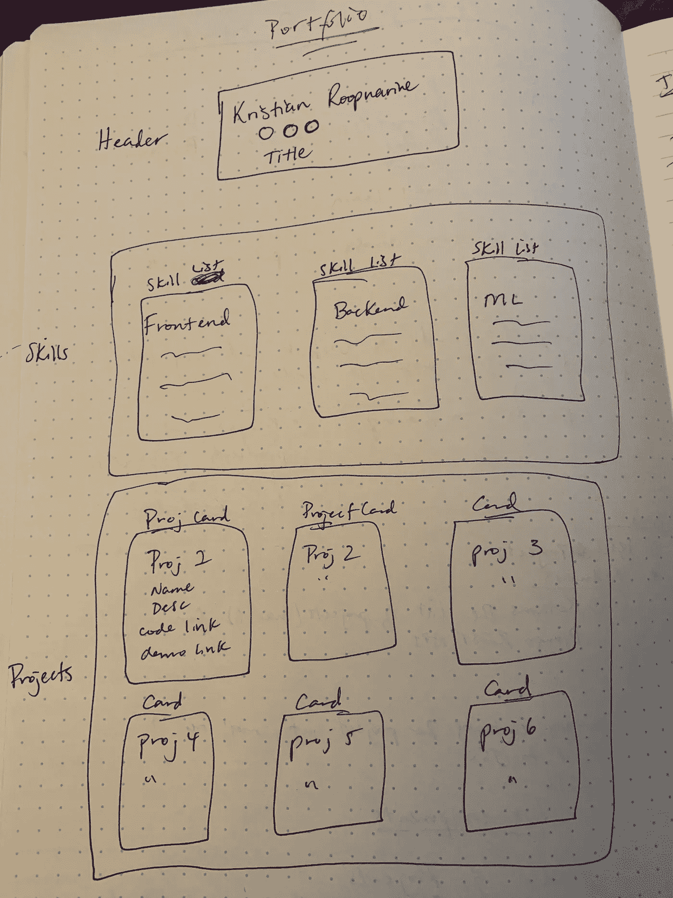
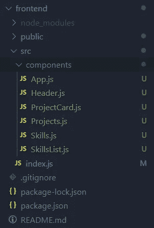
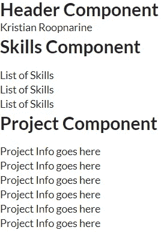
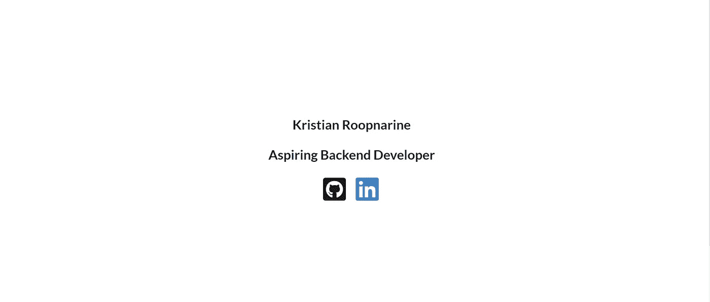
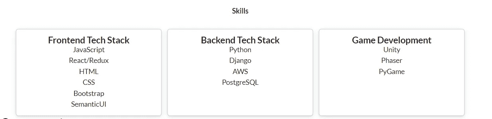
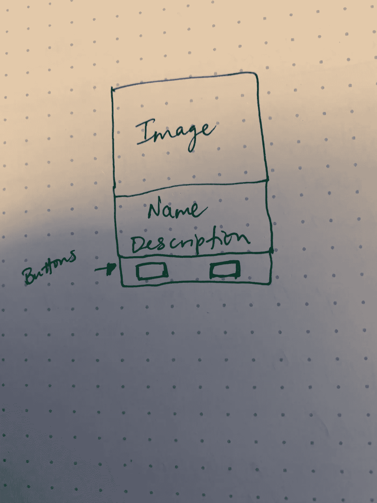
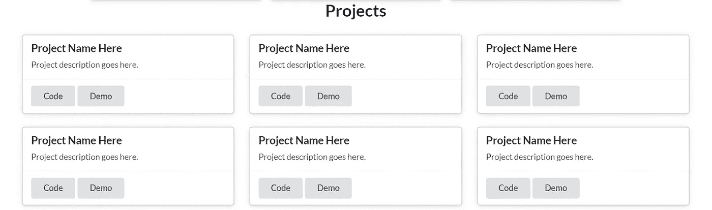

# 用 Django 和 React 创建软件开发者组合

> 原文：<https://levelup.gitconnected.com/creating-a-software-developer-portfolio-with-django-and-react-647af56623cf>

第 2 部分:为我的投资组合创建 React 组件。

# 概述和计划

我目前正在重做我的开发者组合，kristianroopnarine.com，因为早就该升级了。我认为创建 Django-React 组合是一个有趣的学习机会，可以将 REST API 连接到 React 应用程序。

之前，在第 1 部分中，我使用 Django REST 框架创建了 Django REST API，它将存储关于我将在网站上显示的项目的信息。[如果你对如何创建 Django REST API 感兴趣，这里有一个第 1 部分的链接。](https://medium.com/@kristian.roopnarine/how-to-make-a-developer-portfolio-with-django-rest-and-react-e16e52261f2f)

在这里，我将创建我的项目的前端，以显示项目和其他信息，在下一部分中，我将 React 应用程序连接到 Django REST API，可以在这里找到。

# 规划 React 应用程序

创建应用程序时进行规划是非常重要的。从长远来看，它可以帮助你节省时间，组织你的想法，并为你的应用程序提供一个粗略的路径。开发 React 应用程序也不例外。提前考虑要创建的不同组件有助于减少想法之间的转换，并且有助于组织 React 组件中的状态。

我的投资组合现在将是一个单页应用程序，(我有想法让它成为人们学习编码的多页资源)，有几个不同的组件。与其谈论它，我要把它画出来！

我的作品集网站草图

我对这个草图进行了颜色编码，所以任何紫色的都是一个 React 组件，绿色的是该组件中的数据。`Skills`和`Projects`组件都是父组件，因为它们封装了更小的子组件。

让我们来分解一下每一个组成部分和我的思考过程。

# 标题组件

该组件将有 100 个视图高度，并将显示非常基本的信息，如我的名字，职位。圆圈是链接 GitHub 和 LinkedIn 的图标，可能是我的 twitter。这个组件不需要与其他组件共享数据，所以我可以使它成为一个基于功能的组件。

# 技能部分

该技能部分将由三个较小的`SkillsList`部分组成。我认为最好的方法是将一个数组作为道具传递给`SkillsList`，每个`SkillsList`组件会将这个数组映射到一个列表。`Skills`组件将在一行 3 列中显示这些组件。

# 项目组件

`Projects`组件将由子组件`ProjectCard`组成。这些项目卡的信息将通过 GET 请求从 Django REST API 中检索。我想返回一个 JSON 对象数组来映射它们，以创建每个`ProjectCard`组件，并将它们显示在 2 行 3 列中。

`ProjectCard`组件将是简单的卡片，包含有关名称、描述的信息，以及代码和演示(如果每个项目都有)的链接。

现在，我将对虚拟信息进行硬编码，以确保在执行任何 GET 请求之前，网站能够正常工作并正确显示信息。

我认为我们已经有足够的信息来开始创建我们的 React 应用程序。总结一下我们的产品组合:

**割台组件**

*   名字
*   2–3 个图标
*   标题

**技能组件**

*   3 个技能列表组件(作为道具从技能中传承下来的一系列技能)

**项目组件**

*   6 ProjectCard 组件(名称、描述、作为道具传递的链接)

# 项目布局

我使用 windows 命令`npx-create-react-app`引导前端，并删除了该命令附带的样板文件。由于我之前创建的计划，我的目录看起来像这样。

React 应用程序的目录

我为组件创建了一个文件夹，以保持所有文件的有序，并向`SkillsList`和`ProjectCard`组件添加了一些文本，以确保在进一步移动之前所有内容都连接正确。文件`App.js`是将被连接到 DOM 的所有组件的父级。创建所有文件后`App.js`看起来像:

当我运行`npm start`并转到 localhost:3000 时，我会看到这个，它显示我们的组件连接正确。

这基本上是我们的投资组合的开始，提前计划好一切使得创建组件的步骤变得非常容易。组件都在它们应该在的地方，现在我们只需要设计所有的样式。我将使用语义 UI 进行样式设计，因为我一直使用 Bootstrap，我认为熟悉其他 CSS 框架很有用。

# 标题组件样式

我设想这个组件占据 100%的视图高度来显示我的名字、头衔和图标。使用一些自定义的 flexbox CSS，我可以把我的名字移到屏幕中间。添加了一些图标、锚标签和自定义样式后，我的`Header`组件看起来有点像这样。

添加一些语义 UI 类和自定义样式后的 Header 组件

这是我在访问我的投资组合时所设想的第一次体验，一些简单的东西，与 GitHub 和 LinkedIn 等重要东西的链接。当然，最终产品不会看起来像这样，但我认为它会更好地让一切工作，然后让它看起来很漂亮。

# 技能组件代码和样式

在我样式化`Skills`组件之前，我需要修改`SkillsList`组件来呈现作为道具传递的数组中的技能列表。这应该相对简单，我将创建一个助手方法来返回一些包含列表的 JSX。

`SkillsList`组件是一个基于函数的组件，这意味着我不能在组件中创建助手方法，但是我可以返回将技能数组映射到列表中的 JSX。创建列表的代码是:

技能列表组件

这非常简单，我们只需接收一个包含我们想要显示的技能的数组，然后映射它们以返回技能的多个`
` 标签。我们已经完成了这里的代码，现在我们将转移到`Skills`组件上。我想在一张卡片中显示这些列表。现在`Skills`组件看起来像是:

技能部分

我将每个`SkillsList`组件包装在一行中的一列中。起初，我只是打算手动将卡片添加到这些列中，但是当我阅读关于 SemanticUIs 卡片的文档时，他们已经有了卡片组的类。这使得创建它们变得更加容易，现在`Skills`组件的代码看起来像这样:

技能部分

我创建了技能数组，并将它们作为道具传递给每个要渲染的`SkillsList`组件。这导致我们的`Skills`组件看起来像:

技能部分

我对这看起来很满意，我只需要调整后端的文本和游戏开发技能，这样它们就可以垂直延伸到整张卡片。

我喜欢这些卡类，我想把它们用于`ProjectCard` 和`Projects`组件。与其重写所有用于创建卡片的代码，我认为创建一个`Card`组件会更好。这样，我将拥有可重用的代码，在我完成我的作品集后，我可能会用到这些代码。然而，让我们首先创建`ProjectCard`组件。

# 提取 SkillsCard 组件

在创建了`Skills`组件并看到所有重复的代码后，我的脑海里响起了警铃。我没有遵循干燥原则！必须有一种高效或干净的方法来制作技能卡。我注意到每张卡片之间唯一的区别是传递给组件的数组和技能的名称。我决定将这段代码提取到一个名为`SkillsCard`的新组件中，并创建对象来存储更多的信息。每个对象都有两个属性，技能类别和包含所有技能的数组。这样，我可以将技能类别和数组传递给组件，而无需对任何信息进行硬编码。`SkillsCard`组件看起来像:

技能卡组件

传递给这个组件的道具是我前面提到的一个对象。它包含了卡片的名称，然后下面我们将技能数组作为道具从`SkillsCard`传入`SkillsList`组件。`Skills`组件代码已更新为:

技能部分

与之前版本的`Skills`组件相比，这次重构看起来更加清晰易读，前端看起来完全一样，这意味着一切都连接正确。

现在我想我将通过创建一个`ProjectCard`组件为项目做一些类似的事情，因为我们将有 6 个这样的组件。

# ProjectCard 组件

每个项目卡看起来都像下面的惊人的图画。

我对每个项目卡的描述

语义用户界面有预设的类来帮助创建这样的卡片。代码将被写入`ProjectCard`组件，最终版本如下:

ProjectCard 组件

我将把其中的 6 个`ProjectCard`放到`Projects`组件中。SemanticUI 也有一个类来帮助将这些卡片排成一行，这将使制作两行 3 张卡片变得非常容易。现在`Project`组件看起来像这样:

项目组件

我的投资组合的前端看起来不错，显然它需要更多的造型，但我会在屏幕外这样做。为我的作品集寻找配色方案实际上比我想象的要困难得多，但是我不会让你们都厌烦这个过程。

前端的项目组件

图像没有显示出来，因为我还没有在图像中编码。

现在唯一要做的就是从 Django REST API 中提取信息，并在这些`ProjectCard`组件中显示它们。为此，我将在`Projects`组件中发出一个 API 请求，我认为呈现`ProjectCard`的最佳方式是创建一个助手函数来映射 API 响应，并将数据作为道具传递给`ProjectCard`组件。

# 还能做什么

1.  我们必须将 React 应用程序连接到 Django REST API，为此我将使用 Axios。
2.  让前端看起来漂亮，我会在屏幕外完成。
3.  弄清楚如何部署 Django/React 应用程序。

在[第 3 部分](https://medium.com/@kristian.roopnarine/consuming-a-django-rest-api-with-react-31d9a07038f7)中，我使用 axios 将这个应用程序连接到 Django REST API！