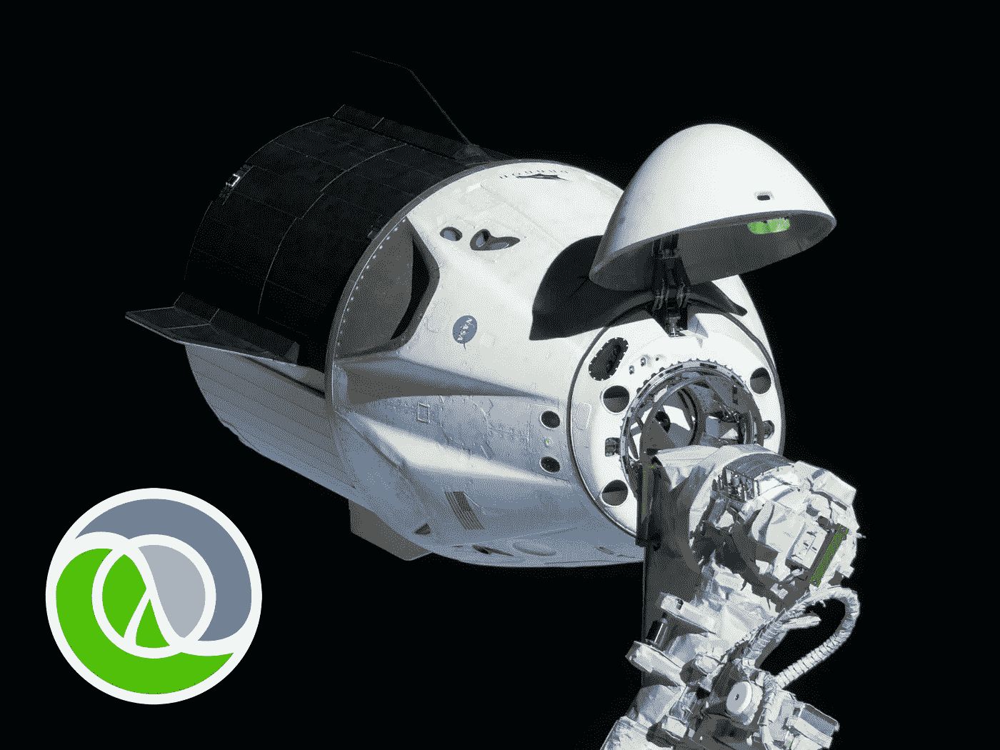
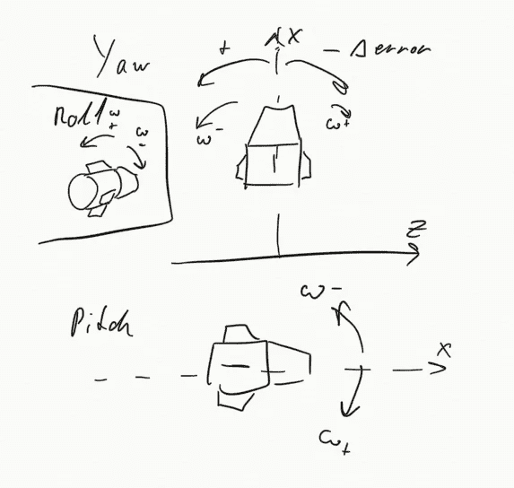
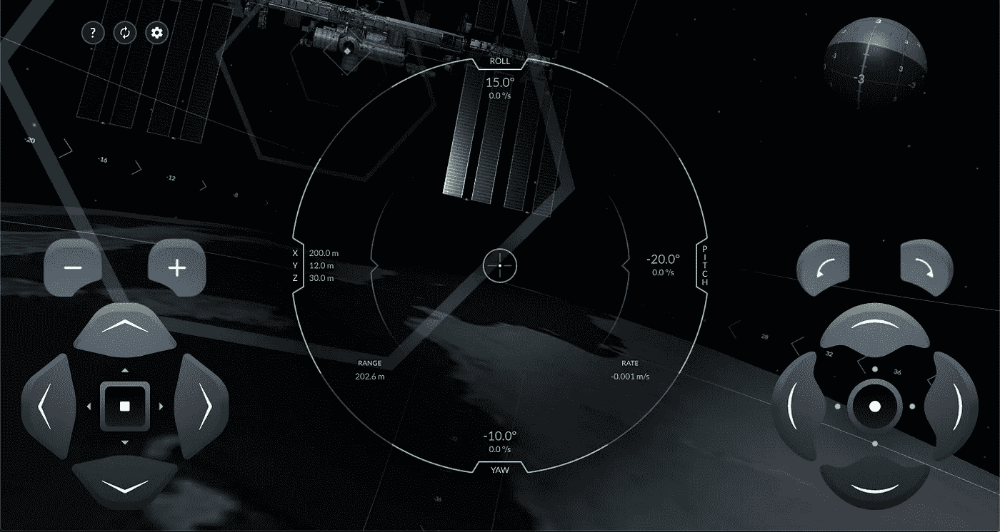
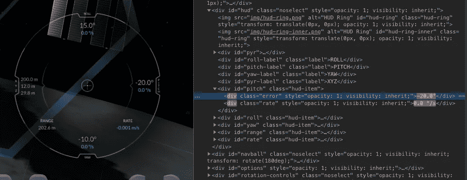
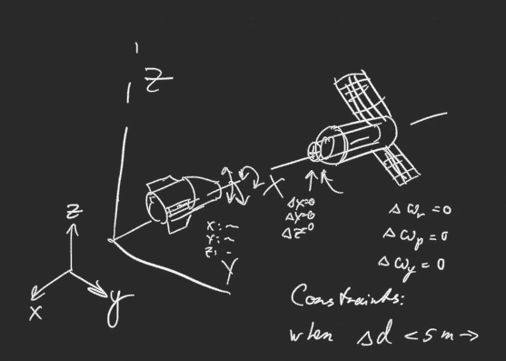
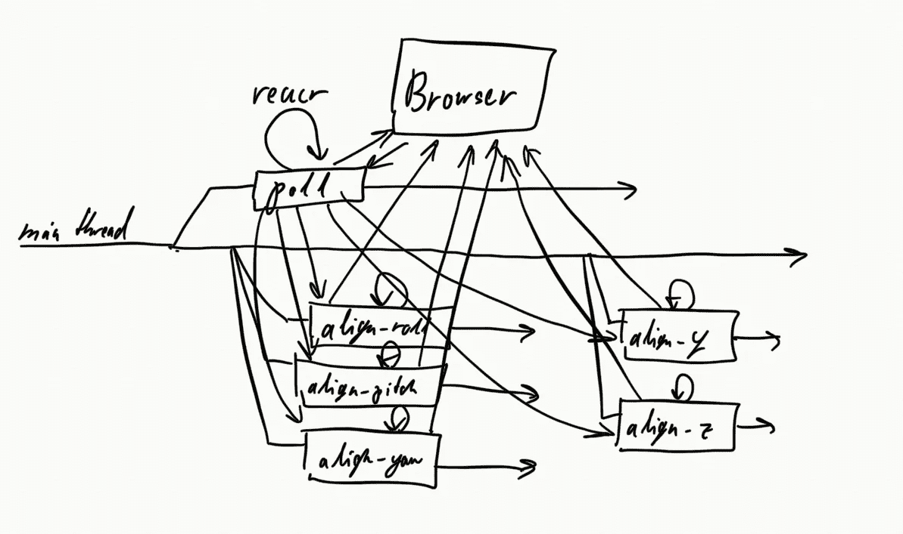

# 在 Clojure 中创建 SpaceX Crew Dragon 模拟器自动驾驶仪

> 原文：<https://levelup.gitconnected.com/creating-a-spacex-crew-dragon-simulator-autopilot-in-clojure-1ac095d9209b>



美国宇航局太空探索技术公司宇航员龙

为了准备 5 月下旬 SpaceX 载人龙的首次载人任务 [Demo-2](https://en.wikipedia.org/wiki/Crew_Dragon_Demo-2) ，SpaceX 发布了一个非常酷的小 [WebGL 对接模拟器](https://iss-sim.spacex.com/)，以龙飞船为特色。在成功完成几次对接后，我意识到这是编写对接自动驾驶仪的绝佳机会！一个人如何处理这样的问题？

轨道航天器与你所认为的普通交通工具有点不同，比如汽车或飞机。在太空中，你有全部 6 个**自由度**，这意味着你可以上下、左右、顺时针-逆时针滚动等。



那太好了，但是我们实际上如何对接呢？

在模拟器中，成功对接意味着:

*   我们与国际空间站的对接端口完全对齐
*   我们的最终**接近率**低于某个值
*   我们不想让我们价值数百万美元的宇宙飞船撞上沿途的任何东西

如果你把它分解，问题只是简单地包括调整龙应该如何(与国际空间站对接端口对齐)，并慢慢地把它飞到它应该在的地方(在对接端口)。

对于语言，我使用的是运行在 JVM 上的类似 Lisp 的函数式编程语言。它是高度可扩展的，简单的，有很多库和强大的并发抽象，我们以后绝对需要。

第一步显然是弄清楚如何**控制**模拟器。如今，驱动浏览器的最佳方式是使用 [WebDriver](https://www.w3.org/TR/webdriver/) ，以及一些 API 或客户端库来发送命令。在我们这边，我们所要做的就是在代码中创建一个控制接口。在整个项目中，我使用了 [Etaoin](https://github.com/igrishaev/etaoin) ，这是 WebDriver 协议的一个完美的纯 Clojure 实现。



SpaceX ISS 模拟器 GUI 发布

虽然模拟器有可点击的屏幕控件，但它也有**键绑定**，我们可以利用:

接下来，如果没有**遥测**的话，自动化飞船是没有希望的。简而言之，我们必须知道**我们在看哪里**和**如何**，我们应该看哪里，以及我们在太空中的位置。幸运的是，SpaceX 的优秀工程师为 HUD 中的信息制作了易于定位的元素，我们的**司机**将从中获取信息。



在编写了一堆定位器和解析器之后，我们有了一个从 HUD 获取所有需要的数据的好方法:

现在这里存在第一个问题:当我们移动航天器时，HUD 一直在更新信息，因此我们需要不断获取新的遥测数据，并使其可用于所有未来的控制系统，而不是用一些循环阻塞**主线程**。这就是 Clojure 的并发性真正闪光的地方，因为我们可以简单地创建一个递归的`poll`函数，并使用一个`future`将它放在一个单独的线程中，并将主线程向前移动。

我们还需要以某种方式将遥测数据保存在某个`state`中，这也是线程安全的。幸运的是，`atoms`来帮忙了，我们可以用`swap!`简单地用新数据更新遥测数据:

你可能已经注意到我们也在用船的`x, y and z`坐标做一些计算。不幸的是，平视显示器没有给出我们的**速度矢量分量**，所以我们必须通过使用距离/时差来自己计算。

下一步是为每个**旋转**控制轴——滚动、俯仰和偏航——编写校准函数。归结起来就是这个简单的逻辑:

然而，这里我们有下一个问题:对准需要一直保持，并且对于每个轴**同时**。这意味着，如果我们尝试按顺序执行此操作**，我们将会遇到**锁定问题**:滚动校准功能可能会阻止偏航校准并阻止其旋转等。**

这就是`future`再次出手相救的地方！

```
*;; concurrent futures for each control axis* (*println* "Rotation alignment enabled")
(*future* (*dragon/align-roll-rot* chr))
(*future* (*dragon/align-pitch-rot* chr))
(*future* (*dragon/align-yaw-rot* chr))
```

既然已经解决了旋转问题，下一步就是为这个方法编写逻辑。



我们需要在`z`和`y`轴上对齐，并在`x`轴上稳步移动。我们已经编写了速度分量计算，所以我们所要做的就是在需要的时候解引用我们的`telem`遥测原子。

棘手的部分是在这个阶段为 RCS 点火编写所有正确的逻辑——开始总是朝一个方向推得太多，它会变成不可控制的摇摆运动，燃烧大量燃料！我想出了实现“死区”的方法——当我们基本上接近现场时，我们不会以错误的方式或过多地启动推进器。我们再次使用`future` s 进行平移对齐。

将所有东西绑在一起，这大致就是我们的线程的样子，以及我们的控制功能如何使用遥测技术:



总之，宇宙飞船很难，SpaceX 和 NASA 的人显然比我更清楚他们在做什么。然而，这是一个有趣的练习，思考这些自动对接系统在现实生活中是如何工作的，以及展示**函数式编程**和并发性真正闪耀的地方。

可以去看看 Github 里的代码:[https://Github . com/DaniruKun/spacex-ISS-docking-sim-auto pilot](https://github.com/DaniruKun/spacex-iss-docking-sim-autopilot)

展示自动驾驶仪的小演示视频: