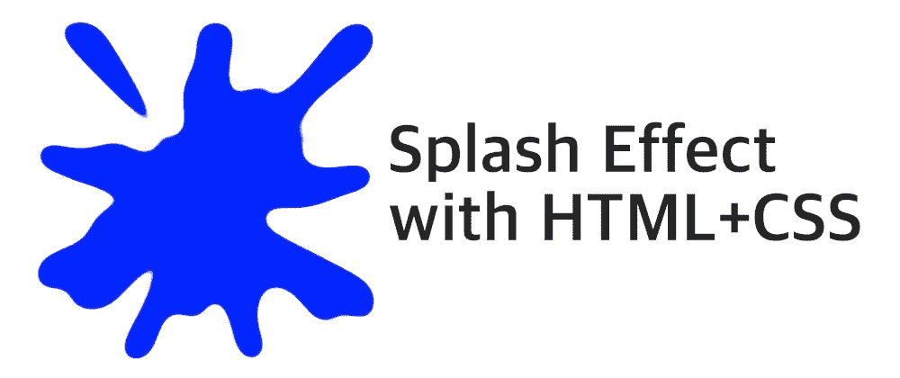
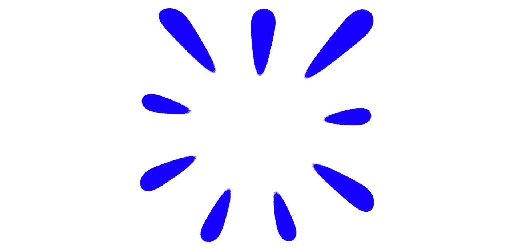
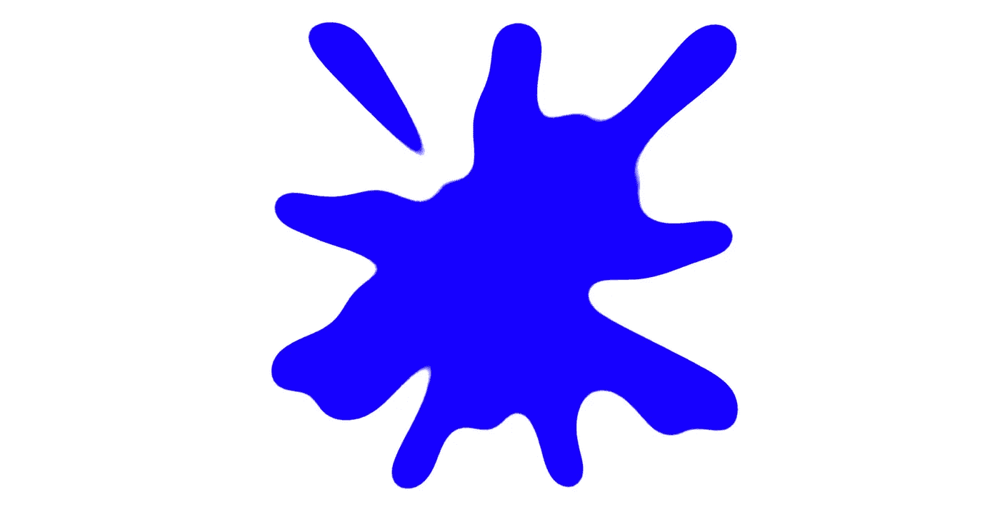

# 用 HTML 和 CSS 创建飞溅效果(带视频)

> 原文：<https://levelup.gitconnected.com/creating-a-splash-effect-with-html-and-css-with-video-49d8921de97b>



## 了解如何用一个 HTML 元素和一些过滤器绘制飞溅的液体，参加今天的 divtober 挑战赛

今天 divtober 挑战赛的词是“飞溅”在这篇文章中，我将展示如何用一个 HTML 元素和几行 CSS 创建一个 splash 效果。如果你更喜欢视频解释过程，向下滚动到文章的底部。

我们从创建元素开始。对于 CSS 艺术，我通常使用

，但是这个更多的是一个装饰性的东西，所以我将使用保持简单(但是任何块类型的元素都可以，真的):

```
<div class="splash"></div>
```

我们需要做一个基本的设置，指定宽度、高度和边框半径(或者没有)。我们使用的形状将最终决定水花的外观。

```
.splash {
  width: 500px;
  height: 500px;
}
```

我们将创建飞溅的效果，有一套重复的圆锥梯度，然后应用 CSS 过滤器。特别是两个:

*   使用高斯模糊，这将模糊颜色并混合一点。
*   `contrast()`:调整模糊背景的对比度，混合它们，使它们看起来更清晰。

结果会因我们的值而异:**更高的模糊半径会产生更多不确定的斑点，而更高的对比度会消除模糊并使事物更清晰**。

让我们从一个重复的圆锥梯度开始:

```
.splash {
  width: 500px;
  height: 500px;
  background: repeating-conic-gradient(#00f 0 3%, #0000 0 11%) #fff;
  filter: blur(20px) contrast(20);
}
```

使用这段代码，飞溅看起来像这样:


边缘看起来很糟糕，因为我们的元素有一个蓝色和白色的背景，但过滤器以一种“时髦”的方式模糊了它，周围是透明的。解决办法？在元素周围添加小白框阴影:

```
.splash {
  width: 500px;
  height: 500px;
  background: repeating-conic-gradient(#00f 0 3%, #0000 0 11%) #fff;
  filter: blur(20px) contrast(20);
  box-shadow: 0 0 0 50px #fff;
}
```

有了这个小小的改变，我们的水花看起来就像水花:



这个结果可能看起来很棒，文本或图像在中间，但我们将采取一步之遥。通过添加更多重复的圆锥梯度(也许这里或那里有一个径向梯度)，我们得到了不同类型的飞溅:

```
.splash {
  width: 500px;
  height: 500px;
  background:
    repeating-conic-gradient(#00f 0 3%, #0000 0 11%),
    repeating-conic-gradient(#0000 0 5%, #00f 0 7%) 50% / 60% 60%,
    repeating-conic-gradient(#0000 0 7%, #00f 0 9%) 50% / 70% 70%,
    repeating-conic-gradient(#0000 0 11%, #00f 0 13%) 50% / 80% 80%,
    radial-gradient(#00f 22%, #0000 0),
    #fff;
  background-repeat: no-repeat;
  filter: blur(20px) contrast(50);
  box-shadow: 0 0 0 50px #fff;
}
```



在上面的代码中有几件事情值得一提:

1.  我们添加了一个`background-repeat: no-repeat`来避免较小渐变的重复。你可以去掉它，得到不同的水花。
2.  我喜欢用质数来重复渐变，因为碰撞更少，而且看图案更有挑战性。

就是这样！玩大小，梯度停止，或过滤值，你会得到一个完全不同的飞溅。添加额外的滤镜来更改颜色(受对比度限制)并获得新的结果。发挥创意，享受乐趣！如果你最终为 divtober 制作了一个演示，请在评论中或在 Twitter 上与我分享。我会很高兴看到它。