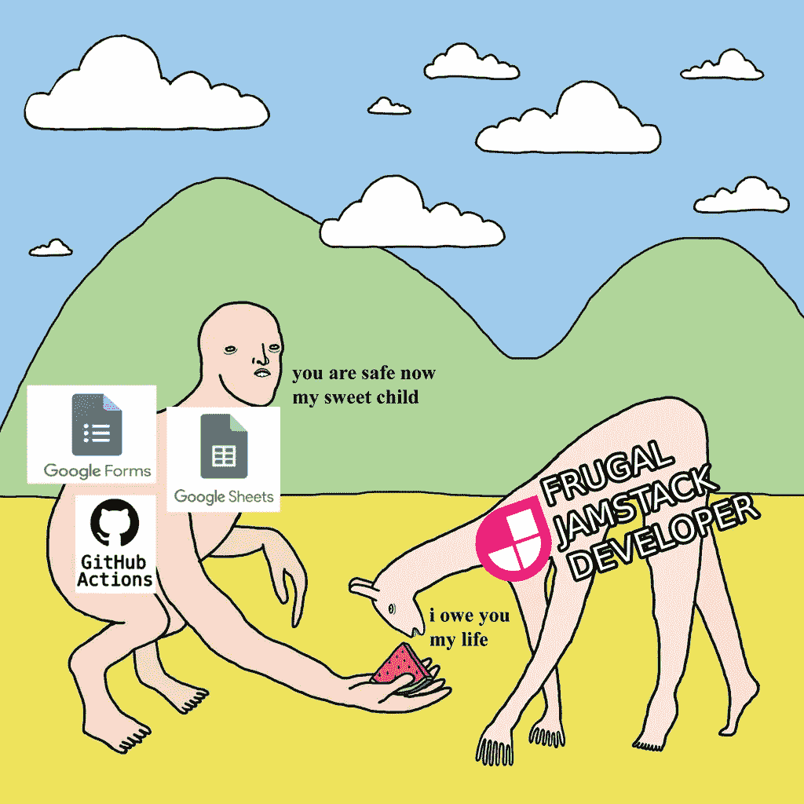
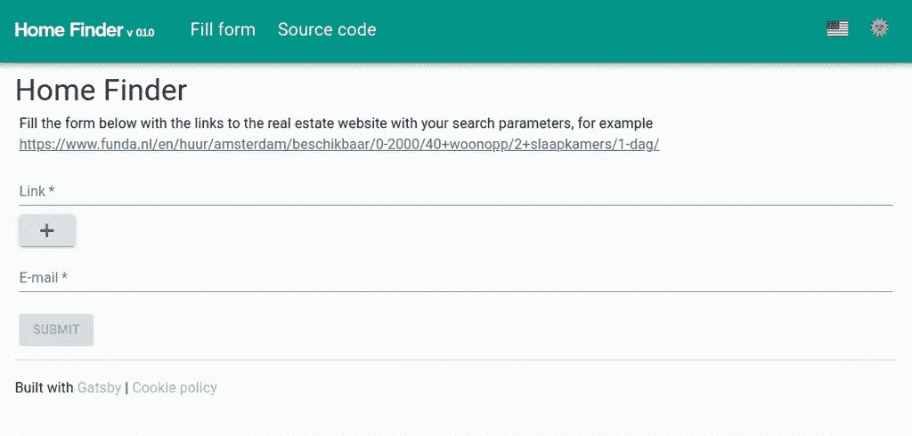

# 用 GitHub Actions 和 Google Forms 创建创业公司

> 原文：<https://levelup.gitconnected.com/creating-a-startup-with-github-actions-and-google-forms-146cfedb711d>

阿姆斯特丹的房地产市场非常疯狂，以至于大学告诉学生不要来阿姆斯特丹，除非他们已经在这里有地方住了(T2)，而且情况只会越来越糟。

租金和房地产价格正在飙升，由于阿姆斯特丹是一个技术中心，总有一个预订工程师有足够的钱超过你的出价。那么你能做什么呢？

嗯，如果你够快的话，你可以在房子一上市就预订看房，然后提出一个足够好的报价，让房主当场接受。

最好的方法是在房子上市后立即得到通知，向其中一家租赁机构支付订阅费，他们会在你的电子邮件中通知你何时有新房子上市。

这很好，但由于我想在 Telegram plus 上获得通知，又不想花任何钱，因为`#frugallife`，[我写了一个脚本来抓取 funda.nl 并为我找到一所房子](https://pablo.gg/en/blog/coding/using-nodejs-and-github-action-to-find-a-house-on-fundanl/)。

这对我来说效果很好，但对于缺乏编程技能的人来说，设置 GitHub 帐户并搞乱 GitHub 动作有点太多了，所以我决定创建一个免费的开源项目，名为 Home Finder (一个独特的名字，我知道)，它使用 GitHub 动作和谷歌表单来帮助任何人找到新房子。

# 创业？

你一定想知道为什么我称之为创业，嗯，[有很多公司提供这样的服务，按月收费](https://www.reddit.com/r/Amsterdam/comments/6kvofb/whats_your_experience_been_with_rental_or_room/)，所以是的，我想你可以简单地:

1.  克隆我的项目
2.  部署到您自己的网域
3.  ????
4.  利润

你可能会问，为什么我要让它免费和开源？因为我疯了。

# 商业计划

在阿姆斯特丹付房租已经够贵的了，而且由于供暖价格上涨的速度比 Dogecoin 还要快，支付额外的找房子服务是绝对不允许的，但是托管一个有数据库和后台的网站来抓取网页并不是免费的，Digital Ocean 上最便宜的一个月要花 5 美元——尽管如此，还是比大多数租赁机构好。

谢天谢地， [GitHub Actions 对任何 GitHub 账户都有 2000 小时的免费等级](https://docs.github.com/en/billing/managing-billing-for-github-actions/about-billing-for-github-actions#included-storage-and-minutes)，这样就解决了脚本在后台抓取网页的问题，但是用户如何提交他们的数据，以便脚本可以根据他们的需求寻找房屋呢？

[有一种变通方法，可以在任何网站上使用谷歌表单](https://blog.webjeda.com/google-form-customize/)，使用任何你想要的布局，所有表单提交的数据都将存储在谷歌电子表格中，以后可以通过抓取脚本下载，以获取用户数据并寻找房屋。

这就是堆栈:GitHub 操作、GitHub 页面、Google 电子表格和 Google 表单。

但在编写任何代码之前，我开始思考业务模型和用例，并提出了以下用例:

# 为什么不是 Firebase？

因为。

# 编码

为了建立这个网站，我从我的“要走的 SSG”框架开始，Gatsby。我几乎只是从一个 Gatsby 项目向另一个项目复制和[粘贴](https://github.com/blopa/gatsby-material-ui-blog-starter)相同的代码，这次也不例外。

Gatsby 的伟大之处在于，我可以获取 Gatsby 的`node.js`部分中的数据，并过滤掉任何我不想发送到前端的数据，如用户电子邮件和 tcharam，而不会发生数据泄漏。对于这个项目，我不必这样做，但我为这个博客这样做了——所以每当用户用他们的电子邮件留下评论时，那封电子邮件永远不会出现在前端构建中。

这个项目将有 2 个不同的部分，Gatsby 网站，我将建立一次，[使用节点获取](https://github.com/WeRules/home-finder/blob/main/src/utils/gatsby-node-helpers.js#L18)从谷歌表单获取表单数据，[将下载谷歌电子表格数据](https://github.com/WeRules/home-finder-script/blob/main/scraper.js#L17)并用 [xlsx](https://www.npmjs.com/package/xlsx) 解析它的脚本。

我还想确保我不会将同一个房子发送给同一个用户两次，为此，我需要一个数据库来保存我已经发送给那个用户的房子，为此，我将简单地使用一个具有以下结构的`db.json`文件:

为了将这些数据持久化到 repo 中，我将使用[git-auto-commit-Action](https://github.com/stefanzweifel/git-auto-commit-action)GitHub 动作。这是有问题的，因为现在任何人都可以去那个回购，看到所有用户的电子邮件和链接，而我不能这样做，所以回购需要是私人的，但如果你愿意，你可以克隆[这个](https://github.com/WeRules/home-finder-script)到你自己的 GitHub 账户。

# 限制

由于我不想使用比 GitHub Actions 更多的免费层，我将每小时运行一次脚本，这应该足以不超过每月的限制——当然，这取决于用户的数量。

我还必须手动为各种房地产网站[编写抓取脚本](https://github.com/WeRules/home-finder-script/blob/main/scraper.js#L133)，所以你不可能从荷兰任何地方的任何网站获得通知。

这就是为什么我把它做成了免费开源的，我强烈鼓励人们部署他们自己的版本，改变抓取脚本的频率来满足他们的需求。

# 部署您自己的版本

要部署你自己的版本，你需要克隆 2 个 GitHub repos、 [Home Finder](https://github.com/WeRules/home-finder) 和 [Home Finder 脚本](https://github.com/WeRules/home-finder-script)。如果真的不需要前端部分，可以直接克隆脚本 repo。

# 前端

对于[寻家器](https://github.com/WeRules/home-finder)项目，您需要执行以下步骤:

1.使用 GitHub 上的`Use this template`按钮克隆项目，并确保项目保持公开，否则，您无法将其部署到 GitHub 页面。

2.更改 Gatsby 的 [siteUrl](https://github.com/WeRules/home-finder/blob/b79635bf04ed9161c425b37df0d95f5f80c9f449/gatsby-config.js#L13) 和 [pathPrefix](https://github.com/WeRules/home-finder/blob/b79635bf04ed9161c425b37df0d95f5f80c9f449/gatsby-config.js#L6) 属性，这样 GitHub Actions 就可以正确地将项目部署到`username.github.io/home-finder`中。

3.用完全相同的字段名和字段类型创建一个类似于的[谷歌表单。](https://docs.google.com/forms/d/e/1FAIpQLSfNXZrkvG-in6kurmGRQt4SOt2xyDOautibKpC4PAeQElzrgQ/viewform)

4.例如，获取 Google Forms 表单 ID`1FAIpQLSfNXZrkvG-in6kurmGRQt4SOt2xyDOautibKpC4PAeQElzrgQ`，并将其添加到您的[回购秘密](https://docs.github.com/en/actions/reference/encrypted-secrets)中，名称为`GATSBY_GOOGLE_FORM_ID`。

5.将你的修改推送到`main`分支，网站会自动建立。

# 后端

对于 [Home Finder 脚本](https://github.com/WeRules/home-finder-script)项目，您需要执行以下步骤:

1.使用 GitHub 上的`Use this template`按钮克隆项目，并确保将项目更改为私有，否则可能会泄露用户数据。

2.更新`template.html`以使用您自己的网站网址

*   或者，如果你跳过了前端，你可以简单地删除邮件页脚的链接。

3.从之前创建的表单中获取谷歌电子表格，并确保[将谷歌电子表格发布到网上](https://support.google.com/a/users/answer/9308870)，并通过链接提供给任何人。

*   或者，如果你跳过前端，任何谷歌电子表格都可以，但电子表格需要有与谷歌表单相同的标题字段。

4.获取 Google 电子表格`ID`和`Grid ID`，比如这个电子表格的[，`ID`是`1jRMEvfI6OsWUwnaHgH5UwnoikZA0a3s8wPnCortNJ_A`，`Grid ID`是`0`。](https://docs.google.com/spreadsheets/d/1jRMEvfI6OsWUwnaHgH5UwnoikZA0a3s8wPnCortNJ_A/edit#gid=0)

5.新增 5 个[回购的秘密](https://docs.github.com/en/actions/reference/encrypted-secrets):

*   `EMAIL_USER`:将用于发送邮件的 Gmail 电子邮件。
*   `EMAIL_PASSWORD`:Gmail 账户的密码。强烈建议您[为此创建一个应用程序密码](https://support.google.com/mail/answer/185833?hl=en-US)。
*   `GOOGLE_SPREADSHEET_ID`:谷歌电子表格`ID`。
*   `GOOGLE_SPREADSHEET_GID`:谷歌电子表格`Grid ID`。
*   `USER_AGENT`:scraper 脚本要使用的用户代理。如果你愿意，你可以使用[你自己的用户代理](https://www.whatismybrowser.com/detect/what-is-my-user-agent/)。

6.更新[cron 工作频率](https://github.com/WeRules/home-finder-script/blob/main/.github/workflows/run-task.yml#L5)来满足你的需求。

7.将您的更改推送到`main`分支，脚本将根据 cron 作业设置自动运行。

# 如何使用网站

进入搜房网网站的[表单页面，在表单中填写你的邮箱和所有来自房产网站的链接，并附上你的搜索参数，例如](https://werules.github.io/home-finder/en/form)[https://www . funda . nl/en/huur/Amsterdam/beschikbaar/0-2000/40+woonopp/2+slaapkamers/1-Dag/](https://www.funda.nl/en/huur/amsterdam/beschikbaar/0-2000/40+woonopp/2+slaapkamers/1-dag/)，点击提交。之后，只需等待脚本找到新的房子，并直接发送到您的电子邮件。

截至本文撰写之时，该项目支持的网站有: [funda.nl](https://funda.nl) ， [vbo.nl](https://vbo.nl) ， [huislijn.nl](https://huislijn.nl) ， [zah.nl](https://zah.nl) ， [pararius.nl](https://pararius.nl) ， [jaap.nl](https://jaap.nl) 和 [hoekstraenvaneck.nl](https://hoekstraenvaneck.nl) ，所以继续访问这些网站，添加您的过滤器并将其添加到

# 结论

通过 GitHub 动作、创造力和一些黑客技术的结合，你可以在没有任何预算的情况下做几乎任何事情，然后如果需要的话就从那里扩展。

如果你有一个好主意，将它部署到 GitHub 页面，使用 GitHub Actions，使用 Google Spreadsheet (ok ok，或 Firebase)并从那里开始你的项目，如果你使用的不只是免费层，这可能是开始扩展的好时机，也许可以考虑创造一些收入或为你的想法寻找合作伙伴或投资者。

祝你好运，如果你正在荷兰找房子，别忘了使用 [Home Finder](https://werules.github.io/home-finder/en/) 并推荐给你的朋友。

下一集见。

*原载于*[*https://pablo . gg*](https://pablo.gg/en/blog/coding/creating-a-startup-with-github-actions-and-google-forms/)*。*

# 分级编码

感谢您成为我们社区的一员！在你离开之前:

*   👏为故事鼓掌，跟着作者走👉
*   📰查看[升级编码出版物](https://levelup.gitconnected.com/?utm_source=pub&utm_medium=post)中的更多内容
*   🔔关注我们:[Twitter](https://twitter.com/gitconnected)|[LinkedIn](https://www.linkedin.com/company/gitconnected)|[时事通讯](https://newsletter.levelup.dev)

🚀👉 [**加入人才集体，找到一份令人惊喜的工作**](https://jobs.levelup.dev/talent/welcome?referral=true)