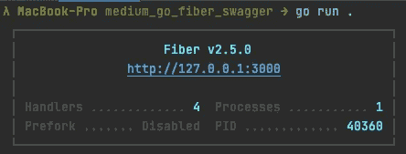
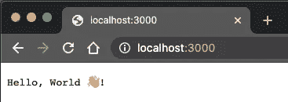
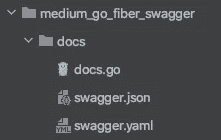
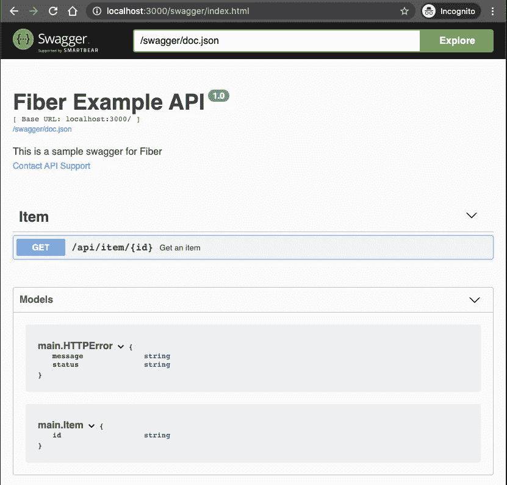

# 用两个简单的步骤创建一个 Swagger 文档化的 Go Web 服务器

> 原文：<https://levelup.gitconnected.com/creating-a-swagger-documented-go-web-server-in-two-easy-steps-59f1118bd247>

## 通过使用 Go Fiber 和自动生成的 Swagger 文档逐步解释如何设置 Go web 服务器。


照片由[斯科特·格雷厄姆](https://unsplash.com/@homajob)在 [Unsplash](https://unsplash.com/) 上拍摄

和往常一样，您可以在我的 GitHub 资源库中查看这篇文章的完整示例，因此可以随意将其作为参考:

[](https://github.com/Abszissex/medium_go_fiber_swagger) [## abszisex/medium _ go _ fiber _ swagger

### 在 GitHub 上创建一个帐户，为 abszisex/medium _ go _ fiber _ swagger 开发做贡献。

github.com](https://github.com/Abszissex/medium_go_fiber_swagger) 

# 从头开始设置 Web 服务器

所以让我们从头开始我们的围棋项目。首先，我们必须创建一个新模块:

```
// Create new project folder and 'cd' into it.
$ mkdir medium_go_fiber_swagger && cd medium_go_fiber_swagger// Create module called `medium_go_fiber_swagger`
$ go mod init medium_go_fiber_swagger
```

接下来，我们已经可以将[光纤](https://github.com/gofiber/fiber)模块添加到我们的模块/应用程序中。

```
// Install Go Fiber module and add to `go.mod`
$ go get -u github.com/gofiber/fiber/v2
```

`go.mod`文件现在应该如下所示:

现在让我们用一些初始代码创建我们的主文件`main.go`,通过一个 GET 端点启动一个简单的 web 服务器:

main.go



通过“go run”启动 Go web 服务器



访问 [http://localhost:3000](http://localhost:3000) 以验证服务器是否正确响应

在我们定义了我们的初始应用程序后，我们应该通过`go run .`快速验证服务器是否按预期启动。

接下来，在浏览器中或者通过`curl`检查 [http://localhost:3000](http://localhost:3000) ，如果服务器响应正确。

恭喜你，你的第一个 Go web 服务器已经运行并响应了你的请求！🎉

# 添加招摇

由于 web 服务器现在正在运行，是时候为它添加一些对 Swagger 文档的支持了。

1.  下载 [Swag](https://github.com/swaggo/swag) 进行 Go，稍后运行`swag init`需要用到。

```
$ go get -u github.com/swaggo/swag/cmd/swag
```

2.下载[光纤招摇](https://github.com/arsmn/fiber-swagger/)

```
$ go get -u github.com/arsmn/fiber-swagger/v2
```

3.接下来，让我们在`main.go`文件中添加一条新路径、一些代码文档和必要的导入。结果将如下所示:

请特别注意`"_ memdium_go_fiber_swagger/docs”`。这是一种会产生“副作用”的进口，因此有了`_`。`medium_go_fiber_swagger`对应于我们正在工作并在本文开头创建的模块。`/docs`部分告诉应用程序应该导入在`docs`文件夹中定义的文件，这些文件将在下一步通过一些 CLI 命令自动生成。

在上面的代码示例中，还可以看到在`main`函数和路由处理程序`GetItem`之上的注释部分有很多注释。我不会详细讨论单个注释的细节，因为我认为这是不言自明的，尤其是当您已经使用 Swagger 至少工作过一次的时候。尽管你可以在这里找到通用 API 信息(`func main`)注释[的文档，在这里](https://swaggo.github.io/swaggo.io/declarative_comments_format/general_api_info.html)找到 API 操作(`func GetItem` ) [的文档。](https://swaggo.github.io/swaggo.io/declarative_comments_format/api_operation.html)

既然实际的应用程序已经准备好了，我们当然需要创建我们的 Swagger 文档，这样它就可以由 web 服务器提供服务了。要实现这一点，我们只需在代码文档中的每次更改后运行以下命令:

```
$ swag init
```

这个命令在它被调用的位置创建一个名为`docs`的新文件夹。



由“swag init”创建的文件夹结构

由于我们的文档现在已经生成，并且我们已经通过一些副作用导入将它导入到我们的`main.go`文件中，我们可以重新启动我们的服务器并检查我们的 Swagger 文档是否被正确提供。

```
// Start the server
$ go run .
```

访问[http://localhost:3000/swagger/index . html](http://localhost:3000/swagger/index.html)并查看它是否按预期工作:



http://localhost:3000/Swagger/index . html 上的 swagger 文档

# 最后的话

我希望我可以向您展示如何使用 Go Fiber 框架从头开始设置 Go web 服务器，并相应地对其进行配置，以便应用程序使用自动生成的 Swagger 文档并在一条路线上提供服务。

感谢您花时间阅读我的文章。

## 你想联系吗？

如果你想联系我，请在 LinkedIn 上给我打电话。

另外，请随意查看我的书籍推荐📚。

[](https://mr-pascal.medium.com/my-book-recommendations-4b9f73bf961b) [## 我的书籍推荐

### 在接下来的章节中，你可以找到我对所有日常生活话题的书籍推荐，它们对我帮助很大。

mr-pascal.medium.com](https://mr-pascal.medium.com/my-book-recommendations-4b9f73bf961b) [](https://mr-pascal.medium.com/membership) [## 通过我的推荐链接加入 Medium—Pascal Zwikirsch

### 作为一个媒体会员，你的会员费的一部分会给你阅读的作家，你可以完全接触到每一个故事…

mr-pascal.medium.com](https://mr-pascal.medium.com/membership)