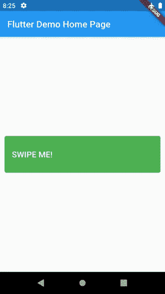
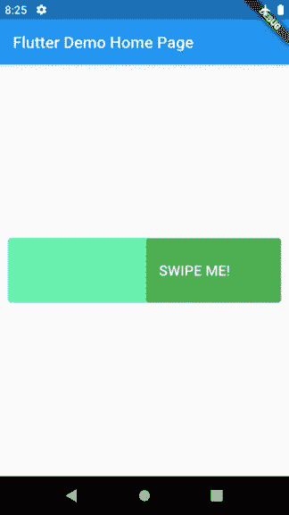

# 在 Flutter 中创建滑动按钮

> 原文：<https://levelup.gitconnected.com/creating-a-swiping-button-in-flutter-35106e38034b>

嗨伙计们！我已经有一段时间没有写一篇激动人心的文章了。事实上，我现在缺少关于 Flutter 的话题，所以如果你对我应该写什么有建议，请随意在下面的评论区添加建议。

在本文中，我将介绍如何在 Flutter 中制作滑动按钮。下面这个视频上看起来像这个优步司机 app 的那个(7 点 58 分，会刷按钮):

优步司机应用程序中的滑动按钮示例

本文中教程的最终结果将是这样的。它所做的是用户滑动按钮部件到足够滑动的宽度的某个百分比。如果滑动的时间不够长，按钮会回到原来的状态。



本教程的最终结果

同样，如果您喜欢直接查看代码，可以在我的 GitHub 知识库中找到。

[](https://github.com/blackmenthor/flutter-swiping-button-sample) [## 黑色/颤动-滑动-按钮-样本

### 一个新的带有滑动按钮的颤振应用程序。这个项目是颤振应用的起点。几个…

github.com](https://github.com/blackmenthor/flutter-swiping-button-sample) 

好吧，首先。我还没有发现一个可以自己检测滑动的 Flutter 小部件，所以我们必须创建一个。

首先，创建一个名为`SwipeableWidget`的`StatefulWidget`。然后，为这个小部件创建 4 个变量。

*   一个`Widget`，我们姑且称之为孩子。这个小部件将是这个`SwipeableWidget`的子部件，并且将是用户在其上滑动的小部件。例如，在滑动按钮中，按钮将是子按钮。

```
final Widget child
```

*   一个`double`，我们姑且称之为高度。这个小部件需要知道它应该画多少高度，否则它将是不可见的

```
final double height
```

*   一个`VoidCallback`，我们就叫它一个`onSwipeCallback`。一旦用户在这个小部件上充分滑动，这个回调将被调用。

```
final VoidCallback onSwipeCallback
```

*   一个`double`，我们就叫它一个`swipePercentageNeeded`。这将是用户应该刷卡的百分比，因此回调会被调用，如果用户刷卡低于这个数字，回调不会被调用。该值默认为小部件总宽度的 0.75%。

```
final double swipePercentageNeeded
```

接下来，我们需要添加一个`SingleTickerProviderMixin`到这个部件的状态，因为我们需要动画这个部件来模拟滑动。

之后，我们需要为状态创建三个变量，分别是标记滑动开始的`AnimationController`、`_dxStartPosition`和标记滑动结束的最后一个`_dxEndPosition`。

然后，我们需要初始化控制器，并将其初始值设置为`1.0`。所以现在，我们的代码应该是这样的。

之后，我们应该在小部件本身上实现小部件的逻辑。主要我们将为此使用一个`GestureDetector`，并且我们将通过使用`onPanStart`、`onPanUpdate`、`onPanEnd`来利用其检测滑动的能力。它看起来会像这样。

我会试着解释它的作用。

*   `onPanStart`

我们将把`_dxStartPosition`设置到用户开始滑动的位置。我们将它设置为`details.localPosition.dx`

*   `onPanUpdate`

之后，我们将只计算用户在小部件的开始部分之间的滑动，在这种情况下，它将是小部件宽度的 0–0.25%开始部分。

我们还将更新`_dxEndsPosition`，并且我们还将更新控制器的值来激活小部件。

*   `onPanEnd`

我们需要检查用户完成的滑动是否足够。如果是这样，我们将动画这个部件，这样它将被隐藏。如果没有，我们会让它回到初始值。

在此之后，我们将添加一个小部件，将滑动动画。在本例中，我们将使用一个`FractionallySizedBox`。它所做的，基本上是通过我们想要的宽度因子来显示部件的一部分。比如我们之前根据用户滑动设置的控制器值。

之后，我们将创建`SwipingButton`小部件。这个小部件非常简单，因为它将实现我们在`SwipeableWidget`中所做的事情。它将有一个`SwipeableWidget`和一个背景小部件，它们将被放在一个`Stack`中。我们需要一个背景部件，以便当刷卡完成时，将有一个背景颜色。它看起来会像这样。



滑动按钮的背景

首先，我们将定义所需的变量。它会有一个`Text`和一个`onSwipeCallback`。它看起来会像这样。

之后，我们将创建一个宽度与设备宽度相同的`Container`,因为我们希望它是一个全屏小部件。如果您有不同的要求，您也可以将宽度定义为参数之一。

我们将创建一个高度为`80.0`和`Colors.greenAccent`的`Container`作为背景。

```
Container(
  height: 80.0,
  decoration: BoxDecoration(
      color: Colors.*greenAccent*,
      borderRadius: BorderRadius.circular(4.0)
  ),
)
```

最后，我们将在它的上面放一个`SwipeableWidget`,背景是一个容器`Colors.green`。

```
SwipeableWidget(
  height: 80.0,
  child: Container(
    child: Padding(
      padding: const EdgeInsets.fromLTRB(16, 0, 16, 0),
      child: _buildContent(),
    ),
    height: 80.0,
    decoration: BoxDecoration(
        color: Colors.*green*,
        borderRadius: BorderRadius.circular(4.0)
    ),
  ),
  onSwipeCallback: onSwipeCallback,
)
```

最后，它会变成这样。

瞧啊。既然已经完成了。如果我们想要包含这个小部件，我们需要做的就是在下面插入这段代码。

```
@override
Widget build(BuildContext context) {
  return Scaffold(
    appBar: AppBar(
      title: Text(title),
    ),
    body: Center(
      child: Column(
        mainAxisAlignment: MainAxisAlignment.center,
        children: <Widget>[
          SwipingButton(
            text: "SWIPE ME!",
            onSwipeCallback: () => print("I'M SWIPED!"),
          ),
        ],
      ),
    ),
  );
}
```

我们都完成了。

我希望这篇文章对那些试图在你的应用中实现这种小部件的人有用。

如果您有任何意见、建议或问题。请在下面随意评论，我会尽力回答。

下一篇文章再见！

祝你今天开心！玩的开心！