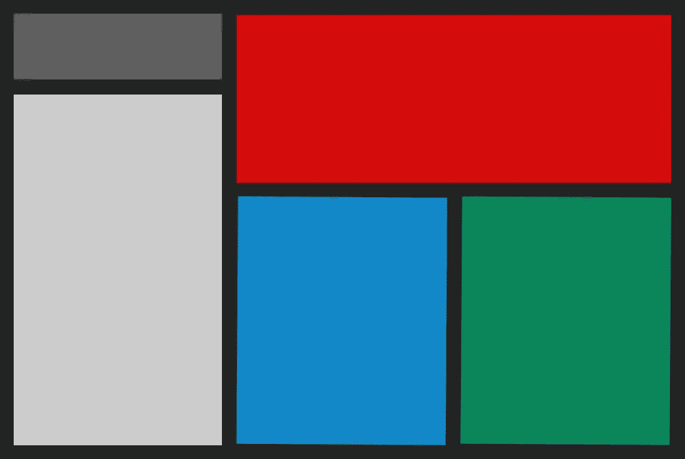
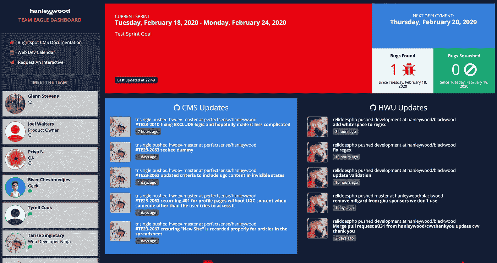

# 通过开源框架在 Ruby 中构建终极团队项目仪表板

> 原文：<https://levelup.gitconnected.com/creating-a-team-dashboard-with-smashing-b2e435248fcf>



# 为什么要创建团队项目仪表板？

当我有空的时候，我会选择做一个副业项目，这样可以让我们的开发团队或者汉利伍德公司受益。所以我决定创建一个团队项目仪表板，使我的同事能够在任何给定的时间看到我们当前正在进行的工作。我的目标是开发一个界面，可以通过内部网在桌面上查看，也可以在安装在我们工作区附近墙上的电视监视器上显示。

这个内部团队仪表板将是加强跨部门协作和沟通的一个很好的方式。此外，这将增加部门之间的透明度，因为你将能够进一步了解公司在你的筒仓之外正在做什么。

# 选择正确的框架和工具

为您的项目选择合适的框架和工具可能是一项艰巨的任务。选择正确框架的方法是基于你想要完成的目标。使用您考虑的某些框架有好处也有坏处。

如果你正在寻找一个轻量级的代码，与 Rails 相比，Sinatra 将是最好的选择。但是如果你想要开源软件，那么 Rails 可能是最好的选择，因为它已经有超过九年的发展历史，并且有一个活跃的社区作为后盾。

# Ruby on Rails vs. Sinatra

Ruby on Rails 正迅速成为许多初创公司的首选框架。然而，Ruby on Rails 的一个缺点是它对于每种类型的项目都不够灵活。因此，在选择框架时应该考虑灵活性，尤其是当您的项目在规模和范围上有所变化时。

我选择使用 Sinatra，因为它为我的项目提供了所需的灵活性。此外，Sinatra 与其他框架或第三方软件没有任何联系，这使得它非常适合不需要高级框架的小型项目。

# 粉碎中轻松发展

[Smashing](https://smashing.github.io/) 是一个 Ruby 编程框架，可以轻松开发一个仪表盘。它帮助开发人员编写更少的代码并生成更强大的结果。


Smashing 框架建立在 Sinatra 之上，Sinatra 是一种 DSL(领域特定语言)，它允许你用更少的代码用 Ruby 创建 web 应用程序。Sinatra 提供了许多有价值的功能，例如构建控制器、创建路线、添加视图以及为生产环境生成静态页面。以下是通过其[网站](https://smashing.github.io/)宣传的功能列表:

*   能够使用预制的部件，或者完全用 SCSS、HTML 和 CoffeeScript 创建自己的部件
*   小部件利用数据绑定的力量来保持事物的干燥和简单
*   将数据推送到仪表板的 API
*   拖放界面重新安排你的部件
*   能够在不到 30 秒的时间内在 Heroku 上托管您的仪表板

添加小工具很容易，而且有很多是在[https://github . com/Smashing/wiki/Additional-Widgets](https://github.com/Smashing/smashing/wiki/Additional-Widgets)上预制的

这里有一个显示 Twitter 提及的超级简单的方法，由 Github 上的 [Vanessa Henderson](https://gist.github.com/VanessaHenderson) 提供:

**Twitter.rb**

```
require 'twitter'#### Get your twitter keys & secrets:
#### [https://dev.twitter.com/docs/auth/tokens-devtwittercom](https://dev.twitter.com/docs/auth/tokens-devtwittercom)
twitter = Twitter::REST::Client.new do |config|
  config.consumer_key = 'YOUR_CONSUMER_KEY'
  config.consumer_secret = 'YOUR_CONSUMER_SECRET_KEY'
  config.access_token = 'YOUR_ACCESS_TOKEN'
  config.access_token_secret = 'YOUR_ACCESS_TOKEN_SECRET'
endSCHEDULER.every '15m', :first_in => 0 do |job|
  begin
    user = twitter.user
    if mentions
      mentions = mentions.map do |tweet|
        { name: tweet.user.name, body: tweet.text, avatar: tweet.user.profile_image_url_https }
      endsend_event('twitter_mentions', {comments: mentions})
    end    
  rescue Twitter::Error
    puts "\e[33mThere was an error with Twitter\e[0m"
  endend
```

然后将以下 HTML 插入到`dashboard.erb`文件中:

```
<li data-row="1" data-col="1" data-sizex="2" data-sizey="1">
      <div data-id="twitter_mentions" data-view="Comments" style="background-color:#00afd7;" data-moreinfo="Tweets @sourceclear" ></div>
      <i class="icon-twitter icon-background"></i>
  </li>
```

您可以在以下网址找到关于这个小部件的更多信息:[https://gist . github . com/Vanessa Henderson/9aa 0823 EFD fc 085 f 675d](https://gist.github.com/VanessaHenderson/9aa0823efdfc085f675d)

# 结果



完成的仪表板屏幕截图

这个仪表板的目标是让它可以显示在开发团队附近的电视监视器上，并且可供内部员工访问。

因此，我决定显示以下信息:

*   **有用资源的链接** —包括我们的内部文档网站、我们的团队可用性日历以及互动电子邮件请求的链接。
*   **团队成员列表** —这使用了 Slack 小部件，并使用一个图标来显示团队成员是否在线。
*   **冲刺细节** —这包括冲刺日期、目标和 bug 状态。
*   **部署细节** —包括下一次部署的日期和任何附加信息，例如延迟。
*   **代码提交** —使用单独的模块显示我们 CMS 系统的代码变更和我们继续教育系统的代码变更。

# 克服挑战

这个项目的大部分涉及到处理我以前从未处理过的代码，所以这本身就是一个挑战。我必须学习 Ruby、Coffeescript 以及 Slack、Github 和 Google 的 API。阻碍我最大的问题是试图使用一个最初不起作用的小部件，却意识到我需要更新到一个新的 API，以及未能使用 Vivify API 来使用 sprint 数据。

## 过时的小工具

Smashing 提供的用户提交的部件列表非常有用；然而，许多已经过时。

例如，自从创建了 [Slack 用户在线小部件](https://gist.github.com/machadolab/c948672c4a6855c48a596dd4fbbb9646)以来，Slack API 已经发生了变化，所以我必须熟悉这个 API，而不是使用现成的小部件。

这一行:

```
slack_client = Slack::Client.new token: options[:api_token]
```

最终不得不改为:

```
slack_client = Slack::Web::Client.new token: options[:api_token]
```

## 生动活泼的 Scrum

我很难使用 Vivify Scrum 的 API 来显示我想要的信息。我通过 Twitter 询问是否有可能使用他们的 API 获得当前的 sprint，他们说“不”，为了完成这个项目，我放弃了尝试使用 API，选择使用 Google 表单填充 sprint 数据；因此，我学会了如何使用 Google Drive 和 Spreadsheets APIs 将 sprint 数据填充到仪表板中。我可以随时回头使用 Vivify Scrum API。

# 结论&关于在 Ruby 中构建团队项目仪表板的最终想法

我在这项工作中获得了很多乐趣。这是一个附带项目，旨在让我做一些我在汉利伍德通常做的事情之外的事情。并非一切都如我所愿，但我很高兴有这样的经历。