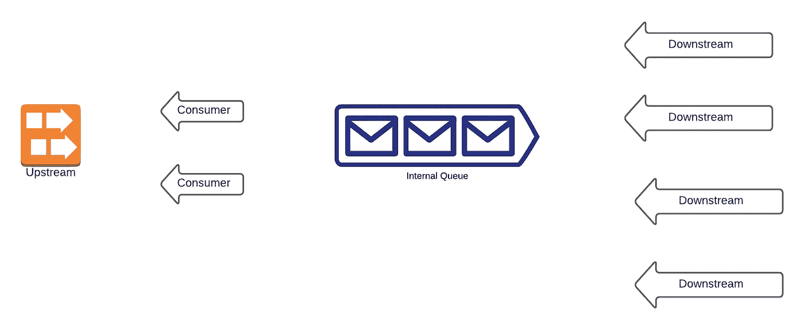

# 用不超过 100 行代码为任何应用程序创建一个节流系统

> 原文：<https://levelup.gitconnected.com/creating-a-throttling-system-for-any-application-with-no-more-than-100-lines-of-code-ac5b2b6d86d8>



应用程序通常设计有一个节流机制。有时，我们希望限制请求的数量，以提高应用程序的安全性和性能。有时，您的应用程序无法响应超过一定数量的连接。例如，如果您尽可能快地从队列中轮询消息，并且没有限制连接数，您的应用程序将很快耗尽其连接傻瓜并面临拒绝服务错误。在这种情况下，拥有一种限制同时处理的应用程序数量的机制将有助于提高应用程序的性能。

在本文中，我想分享我们如何用 FS2 并发原语队列创建一个节流机制。

在我们开始之前，我想让你想象一个应用程序，它将不断地从上游轮询元素。然后，我们通过提供资源可以同时操作的最大缓冲区大小，利用 [FS2](https://fs2.io/guide.html) 来处理节流/背压。当内部队列已满时，在某些任务完成之前，它不会将消息排入队列。

实际上，应用程序的用户可以这样使用它:

因此，当最大大小超过 100 时，它将停止轮询元素，直到内部队列有一些空间。

创建该文件的过程分为两个部分:

*   消费者是一种通过不断将值排入内部队列来订阅上游的类。
*   Subscriber 是一个类型类，它将包装消费者，从内部队列中取出数据块并处理该值。

根据应用程序的用例，我们可以封装订户部分或消费者部分。在本文中，它将是消费者。这意味着用户可以指定他们的函数想要从哪个上游轮询，并且他们可以从订阅者那里访问结果。最后一篇文章封装了订户部分。

# 消费者

消费者将订阅上游。因此，我们想要一个这样的函数:

该函数接收来自`upstream`和`enqueue`的任何值，并将该值发送到内部队列。

让我们创建初始订阅方法。我们需要通过让我们的调用者初始化内部队列并将它们注入到`Consumer`实例中来创建`Consumer`类型类的实例。

一旦上游站点向消费者发送消息，我们将使用 NoneTerminatedQueue 来终止队列。消费者可以告诉订户停止该流。

这听起来像资源获取吗？

你是对的！本质上，我们希望获得一个资源，并希望保证在获得资源的情况下运行一些清理操作。因此，我们将为`subscribe`创建资源助手方法:

我们将把来自`upStream`和`enqueue1`的值放到我们的内部队列中。然后，我们将`compile.drain`并排出来自`upStream`的所有输入。如果所有的信息都被耗尽或者在计算过程中出现任何错误，资源将通过`enqueue1` a `None`清理到我们的内部队列(订户)。然后订户停止其流。

这就是我们所说的`Consumer`:

`start`这里将开始一个`fiber`。如果你没有放入一个`start`，那么整个过程将是连续的，这意味着它将所有的值入队，然后出列。如果我们的内部队列满了，它就会挂在那里。因此，拥有`start`将在另一个 IO 线程中执行`subscribe`。

# 订户

我们希望`Subscriber`到*的轮询重复*并返回一个`Stream[F, A]`给调用者。

因此，我们可以创建一个具有 will `pollRepeat`的类型类:

与`Consumer`类似，我们需要创建一个`Subscriber`的实例，将最大队列大小和上游作为参数:

我们需要订阅上游，将订阅者发送到另一个线程，并实例化订阅者。

我们用调用者提供的`maxBufferSize`创建`boundedNoneTerminated`内部队列。然后，我们在`Consumer`类型类的帮助下制作我们的`Consumer`，并订阅上行，开始另一个光纤。我们返回队列，这样我们就可以用`Subscriber`实例连接它。

然后，当我们创建`consumer`时，我们可以将消费者与`Subscriber`联系起来。像这样:

这是使用订户实例并将其用作应用程序中任何节流机制的程序:

您需要在结束时呼叫`unsafeRunSync`:

```
subscriberExample.unsafeRunSync
```

# 结论

添加节流机制可能很有挑战性，尤其是如果您需要在并发环境中这样做的话。幸运的是，在 FS2 的帮助下，在任何应用程序上构建节流机制只需几行代码。

我们创建了`Consumer`类型的类来订阅任何源。然后，我们用`Subscriber`以并发的方式不断地`enqueue`和`dequeue`。我们可以保证在通过资源获取停止流之前清理队列数据。

我希望这篇文章对学习更多关于 FS2、Scala 或函数式编程的知识有所帮助。如果有任何可能导致错误的地方，请随时指出来，这样我也可以向你学习。

所有源代码都在 [GitHub](https://github.com/edwardGunawan/Blog-Tutorial/tree/master/ScalaTutorial/fs2/src/main/scala/Subscriber) 里。

**感谢阅读！如果你喜欢这篇文章，请随意订阅我的时事通讯中的**[](https://edward-huang.com/subscribe/)****以获得关于科技职业的文章、有趣的链接和内容的通知！****

**你可以关注我，也可以在[媒体](https://medium.com/@edwardgunawan880)上关注我，以获得更多类似的帖子。**

***原载于*[*https://edward-huang.com*](https://edward-huang.com/fs2/functional-programming/stream-processing/scala/programming/2020/10/11/create-a-throttling-system-for-any-application-with-no-more-than-100-lines-of-code/)*。***