# 在 Unity2D 中为玩家创建一个推进器效果

> 原文：<https://levelup.gitconnected.com/creating-a-thruster-effect-for-the-player-e9ba034cb4bb>

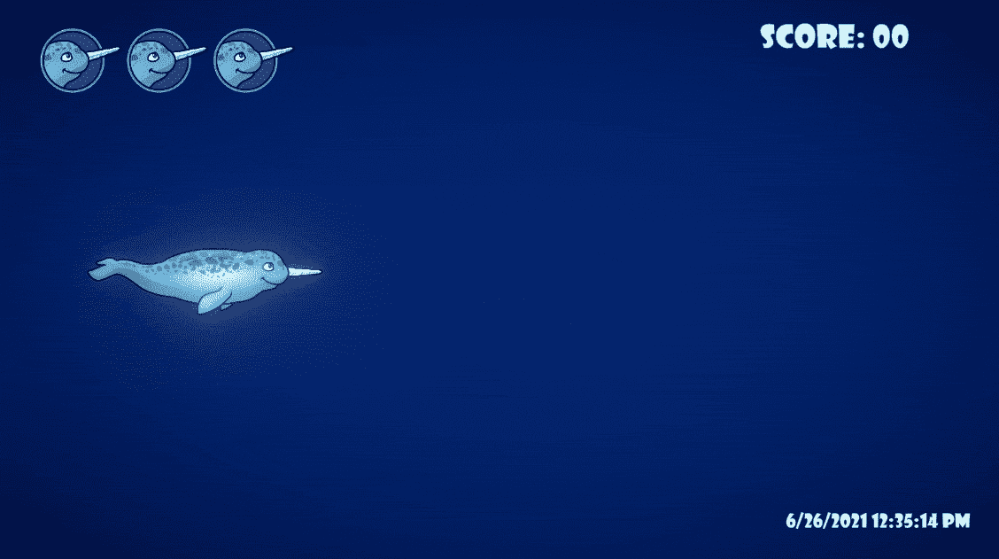

这篇文章是关于让我的玩家能够在按住 shift 键的时候让**加速**，在松开 shift 键的时候让**减速**。我目前只有三个**变量**用于我的玩家的**速度**，这对于我想做的所有事情来说是不够的。我已经有了一个**加电**来改变**玩家**的**速度**，而它的**活动**持续五秒钟，我不想用我的新推进器实现来覆盖这个能力。

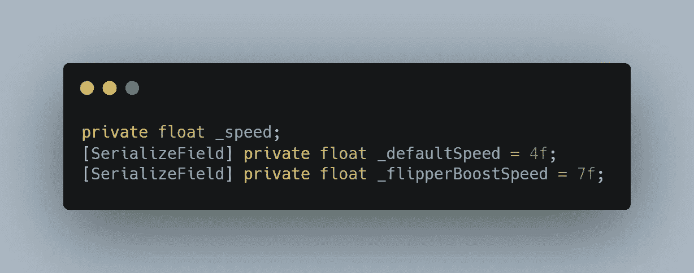

首先，我对我的**变量**做了一次彻底的修改，在我的**玩家等级**的顶端**速度**。
我将原来的**速度**变量的名称改为**当前速度**，我立即得到一些如下所示的**错误**，告诉我所有的**位置**，我需要**将旧的**速度**变量名称改为**当前速度**。这个新名字给了变量保存的**值**更贴切的**描述**。我的**默认速度**变量保持不变，当**加电**被收集时，我的**翻板加速**变量也保持不变。我为最小**和最大**速度**添加了两个变量，同时为**加速**和**减速**因子添加了两个变量。我**序列化**所有的**字段**，因为我想要在**检查器**中的某个点调整或监控它们。好了，我准备走了！****

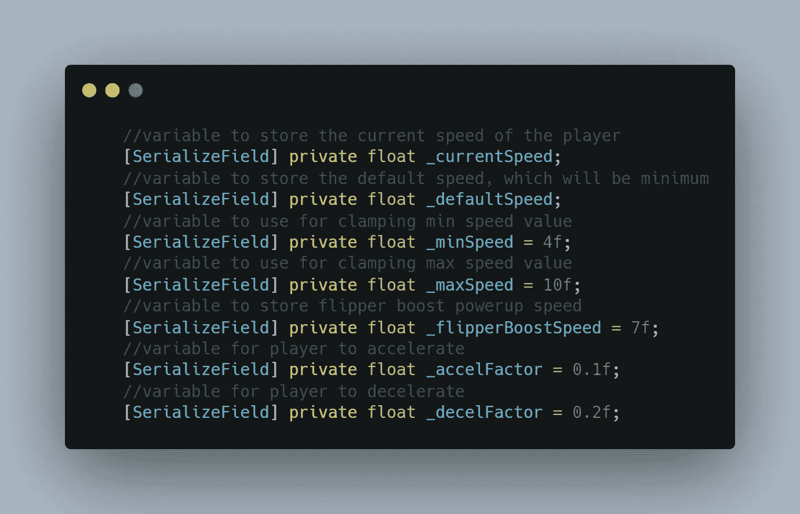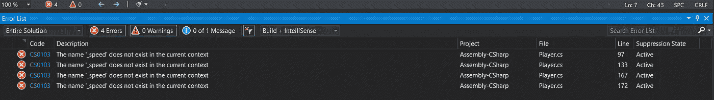

我需要将旧速度变量名改为当前速度变量名的错误位置

我的 **currentSpeed** 变量将在整个过程中被重新分配**的值**，但是当游戏开始时，我希望玩家默认以**最小速度**移动，所以我将 **currentSpeed** 赋值为与 **void Start** 中的 **minSpeed** 相同。我还将**默认速度**变量分配给**最小值**，因为稍后我将更改**最小速度**变量，并且需要另一个变量**将**最小速度变量**重置回其默认速度**。稍后会有更多内容。****

**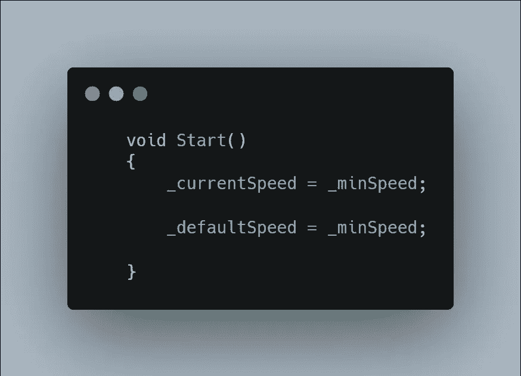**

**这个新的推进器特性将会从我的**玩家移动**方法中得到**称为**，这个方法在**无效更新**中不断被触发。这将为用户输入提供非常**响应的**推进器。**

**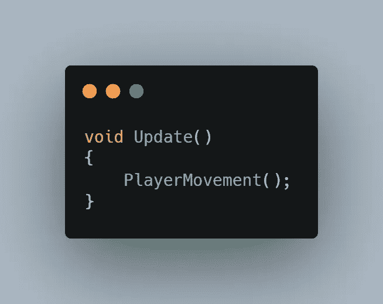**

**我为我的推进器特性创建了一个新的**方法**，并输入一些**伪代码**来得到我需要做的事情的蓝图。**

**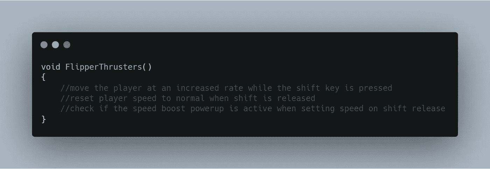**

**即使我的推进器方法中只有一些伪代码，我现在也可以从我的 **PlayerMovement** 方法中无误地调用它。**

**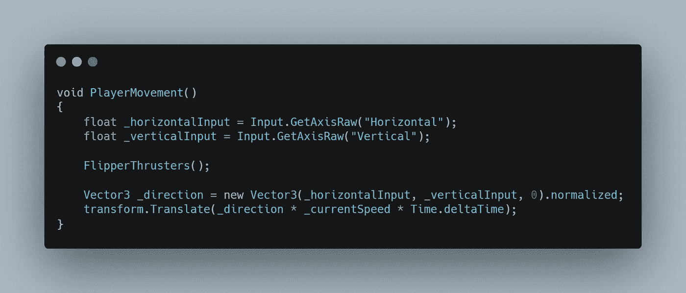**

**回到我的方法，我开始工作。我首先检查**左移**键，看它是否被**按住**。如果 shift 键被按下，我将**加速系数**加到**当前速度**变量上。**当前速度**变量是使玩家在上面显示的**玩家移动**方法中移动的变量，所以**越长**shift 键被**按住**，**玩家就会走得越快**。通过 void **Update** 调用这个将保持**增加**玩家速度的加速系数，这提供了一些不错的……**加速！**我认为这比加电操作更好，加电操作是**使**玩家从一个速度转换到另一个速度，而**没有速度转换**。当 shift 键被按下**而不是**时，参数的 **else** 部分将玩家的速度重置为**默认值**。所以，还没有减速，只是减速时速度突然加快。**

**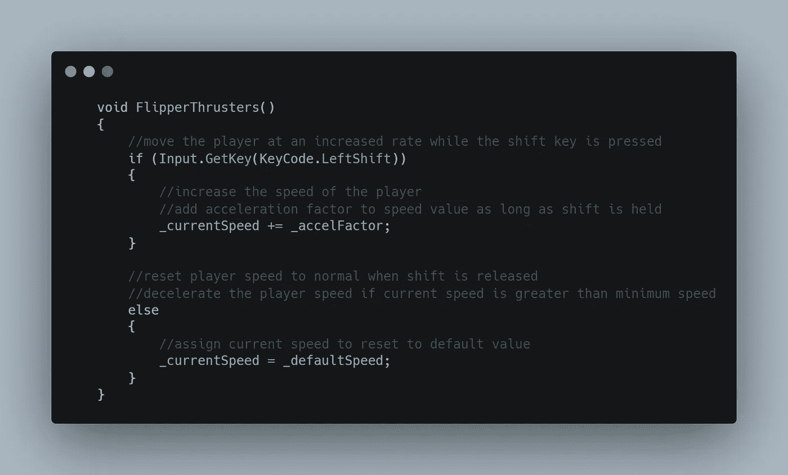**

**正如这里所看到的，如果对玩家没有速度限制，没有最高速度的加速会很快失控！如果离开的时间足够长，可以打到无限大速度，这个我不推荐*(先存后试！)*。**

**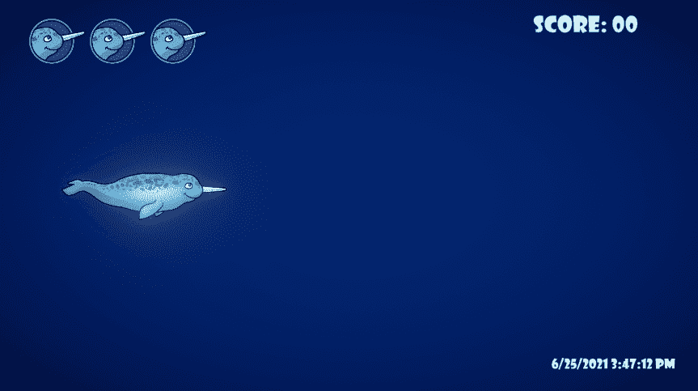**

**这里是**最小**和**最大**速度变量发挥作用的地方。在我的**推进器方法**的顶端，我使用 **Mathf。夹紧**将**当前速度**变量限制为**最大值**和**最小值**，并将该值分配给本地**速度夹紧**变量。现在当 shift 键被按下时，**当前速度**值被重新分配给**夹紧值**，然后增加了**加速度**变量。现在播放器不会比指定的 **maxSpeed** 值更快，该值可以在**检查器**中调整。我还在 **else if** *(由****else****)*中添加了一个**减速器**，用于当 shift 键未被按下时，并且仅当当前速度**大于**最小速度**值**时。即使有固定的速度值，无效的**更新**将**继续**尝试**减慢**玩家的速度，这导致一些看起来不稳定的移动。它还会将我的玩家速度降低到 **3.8f** ，即使我的**最小速度**设置为 **4f** 。为了减轻这种情况，我添加了最后的 **else if** 语句，这将把我的**当前速度**值重置为**最小值**。基本上玩家一旦打到最低速度，这个语句就告诉**减速器**让**停止**试图减速，晃动的动作就没了。**

**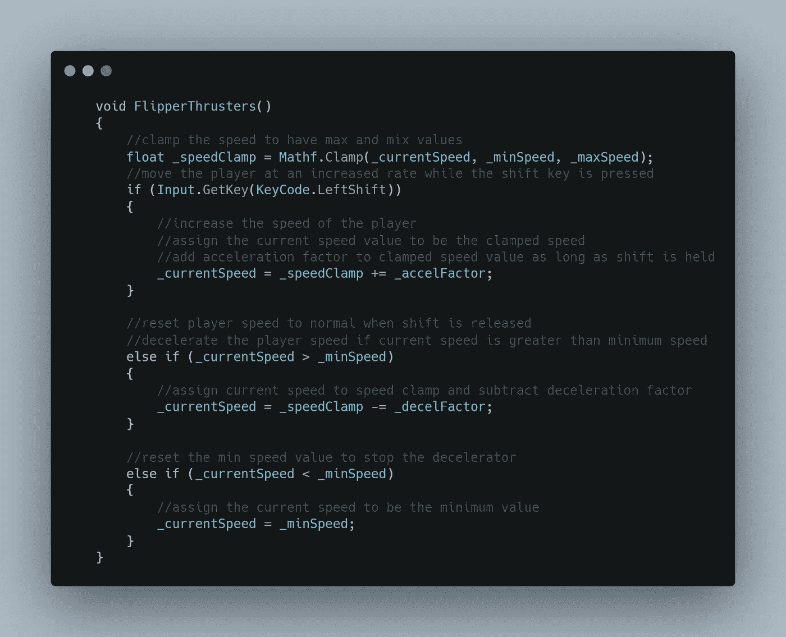**

**有趣的一点是，**如果没有**对我的速度进行最小限制，减速器会迅速将玩家的速度变为负**值，这使得玩家向后移动**！******

****这个片段向我展示了**按住 shift** ，**当前速度**值**加速**，**停止**刚好在**箝位值**之上，**减速**回到**默认**值。****

****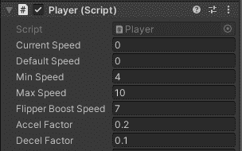****

****我仍然需要解决我的**加速启动**。现在，我的减速器会将播放器恢复到默认速度，即使速度提升是活跃的，这不是我想要的。在我的**推进器方法**的顶部，我添加了一个简单的 **if** 语句，通过与之相关的**布尔变量**来检查速度提升是否**激活**。如果是**激活**，我会将我的**最小速度**值重新分配为**脚蹼助推** **加电**值。只要没有按下 shift 键，参数的 **else if** 部分就会将**最小值**重置为**默认值**。速度提升现在被确认，我不应该有任何速度冲突！****

****我的加速速度提升比最大推进器速度稍微慢了一点，但是我很快就会限制推进器的能力，所以加速速度提升仍然有很大的游戏价值。****

****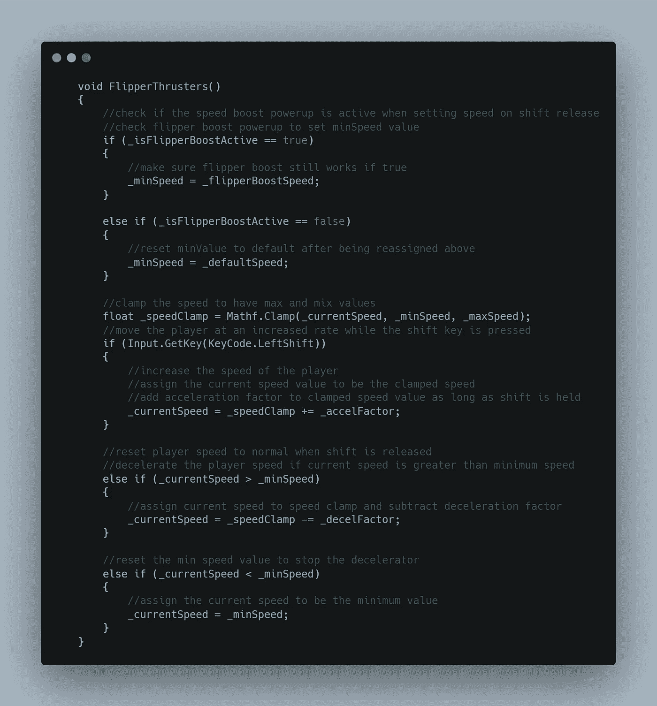****

****我把一个**脚蹼助推启动**拖到我的**场景视图**中，以测试并确保我的推进器尊重启动，而不是**覆盖**它的速度行为。****

****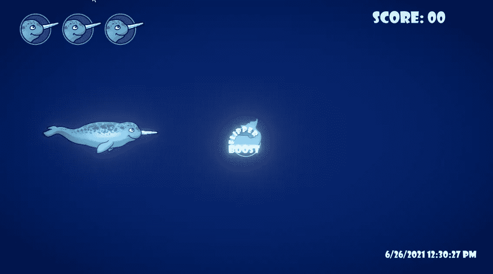****

****这里在**检测器**中你可以看到我**加速**到**最大速度**，然后**减速**到速度提升**加电值**。****

****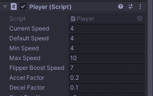****

****现在我的播放器有多种途径来加速和减速！如果不加控制的话，这个能量有点太大了，所以我需要限制推力的能力，并添加一个 UI 元素来显示推进器的实时值。感谢您的关注！****

********