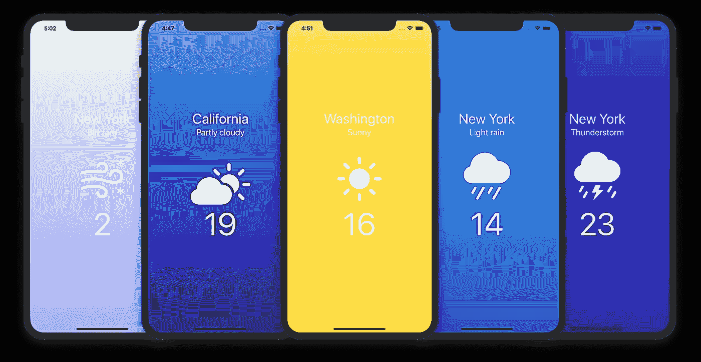
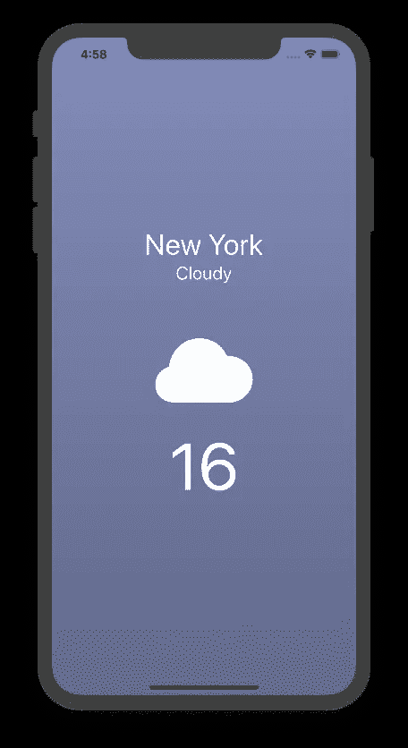
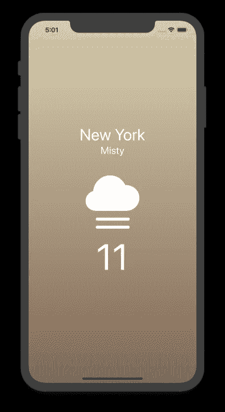
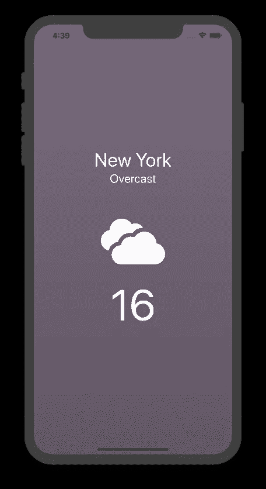

# 使用 SwiftUI 和 Weatherstack 创建天气应用程序

> 原文：<https://levelup.gitconnected.com/creating-a-weather-app-using-swiftui-weatherstack-98578a98c621>

## 数据解析/ JSON 解码、SF 符号和 iOS 13



天气应用截图

创建天气应用程序将帮助您发现和了解 iOS 13 中的新功能。它涵盖了如何集成 API、数据解析以及使用 SwiftUI 显示数据。当 Apple 引入新的库，或者对现有库进行更改时，这是一个很好的第一个项目。

# API 集成

Weatherstack 是将天气数据传递给应用程序的著名 API 之一。您可以检索当前天气预报或最多 14 天的预报详情。本教程将带您了解如何将这个 API 集成到您的 iOS 应用程序中。对于其他选项，可以查看 GitHub 上的[公共 API。](https://github.com/public-apis/public-apis)

要使用 Weatherstack，您需要有一个帐户并选择一个定价选项。他们的免费选项允许每月 1000 次通话，并可以给我们提供实时天气数据。一旦你有了你的帐户设置，你将有一个 API 访问密钥，我们将在我们的代码中使用。

对 Weatherstack 的请求如下所示:

```
http://api.weatherstack.com/current
    ? access_key = **YOUR_ACCESS_KEY**
    & query = New York
```

以下是 JSON 响应的一个示例:

```
{
    "request": {
        "type": "City",
        "query": "New York, United States of America",
        "language": "en",
        "unit": "m"
    },
    "location": {
        "name": "New York",
        "country": "United States of America",
        "region": "New York",
        "lat": "40.714",
        "lon": "-74.006",
        "timezone_id": "America/New_York",
        "localtime": "2019-09-07 08:14",
        "localtime_epoch": 1567844040,
        "utc_offset": "-4.0"
    },
    "current": {
        "observation_time": "12:45 PM",
        "temperature": 17,
        "weather_code": 113,
        "weather_icons": [
            "https://assets.weatherstack.com/images/wsymbols01_png_64/wsymbol_0001_sunny.png"
        ],
        "weather_descriptions": [
            "Clear"
        ],
        "wind_speed": 5,
        "wind_degree": 344,
        "wind_dir": "N",
        "pressure": 1010,
        "precip": 0,
        "humidity": 50,
        "cloudcover": 0,
        "feelslike": 15,
        "uv_index": 4,
        "visibility": 20
    }
}
```

# JSON 解码

为了解析项目中的数据，我们需要创建可解码的结构。数据是嵌套的，所以我们需要创建四个可解码的结构。如果返回的响应中的任何信息为空，将所有常量设为可选，以防止应用程序崩溃。第一个结构用于请求信息:

```
**struct** Request : Decodable {**let** type : String?**let** query : String?**let** language : String?**let** unit : String?}
```

第二个可解码的结构将用于位置数据，我们将使用该数据来获取将在 SwiftUI 视图中显示的城市名称:

```
**struct** Location : Decodable {**let** name : String?**let** country : String?**let** region : String?**let** lat : String?**let** lon : String?**let** timezone_id : String?**let** localtime : String?**let** localtime_epoch : Int?**let** utc_offset : String?}
```

第三，我们要解析“current ”,它包含温度、描述和天气代码，这些代码将在本教程中检索和使用:

```
**struct** Current : Decodable {**let** observation_time : String?**let** temperature : Int?**let** weather_code : Int?**let** weather_icons : [String?]**let** weather_descriptions : [String?]**let** wind_speed : Int?**let** wind_degree : Int?**let** wind_dir : String?**let** pressure : Int?**let** precip : Double?**let** humidity : Int?**let** cloudcover : Int?**let** feelslike : Int?**let** uv_index : Int?**let** visibility : Int?}
```

需要的最后一个结构是 weather 结构，它将包括我们之前存储在常量中的所有结构:

```
**struct** Weather : Decodable {**let** request : Request?**let** location : Location?**let** current : Current?}
```

现在，我们可以创建一个函数来启动一个会话，并从 API 中获取我们需要的数据。编写一个函数，创建一个 URL 会话，检查错误，然后使用 JSONDecoder 解析数据，并将值存储在一个常量中。检查下面的代码&不要忘记将您的访问密钥添加到 URL 字符串中:

```
**func** getWeatherData() {**let** jsonURLString = "http://api.weatherstack.com/current?access_key=**YOUR_ACCESS_KEY**&query=New%20York"// make URL**guard** **let** url = URL(string: jsonURLString) **else** { **return** }// create a session
URLSession.shared.dataTask(with: url) { (data, response, error) **in**// check for error
**if** error != **nil** {print(error!.localizedDescription)}// check for 200 OK status**guard** **let** data = data **else** { **return** }**do** {**let** weather = **try** JSONDecoder().decode(Weather.**self**, from: data) } **catch** **let** err {print ("Json Err", err)}
// start the session}.resume()}
```

对于本教程，我将温度、天气描述和天气代码存储起来供以后使用。您可以使用下面相同的方法来利用您可以从 API 获得的所有其他数据。将粗体文本添加到我们上面创建的函数中，将变量添加到我们的视图结构中:

```
struct ContentView: View {**@State var city = ""****@State var temperature = 0****@State var description = ""**
...func getWeatherData() {
...do {let weather = try JSONDecoder().decode(Weather.self, from: data)**self.city = weather.location?.region ?? ""****self.temperature = (weather.current?.temperature) ?? 0****self.description = weather.current?.weather_descriptions[0] ?? ""****let code = weather.current?.weather_code**}
...}
```

该 API 提供了可以在我们的应用程序中检索和呈现的图像。您可以使用下面的代码获取图像，并在代码中使用它们:

```
struct ContentView: View {
**@State var imgData = Data()**
...
func getWeatherData() {
...do {let weather = try JSONDecoder().decode(Weather.self, from: data)**let url = URL(string: (weather.current?.weather_icons[0]!)!)****if let data = try? Data(contentsOf: url!) {****self.imgData = data**}
...
}
```



天气应用-渐变背景色

我将使用默认的符号/图标，而不是使用 API 给我的图标。

为了能够添加自定义图标和背景颜色，我们将创建一个函数，该函数接受天气代码并返回天气状况。你可以在 Weatherstack 的网站上或者直接从[这个链接](https://weatherstack.com/site_resources/weatherstack-weather-condition-codes.zip)找到每个代码的天气情况。

这些值可以用多种语言返回，并用来代替天气描述，天气描述可以从我们前面创建的“current”结构中获得。

下面的代码负责返回天气状况:

```
**func** getWeatherDescription (code : Int) -> String {**switch** code {**case** 113: **return** "Clear"**case** 116: **return** "Partly cloudy"**case** 119: **return** "Cloudy"**case** 122: **return** "Overcast"**case** 143: **return** "Mist"**case** 176: **return** "Patchy rain possible"**case** 179: **return** "Patchy snow possible"**case** 182: **return** "Patchy sleet possible"**case** 185: **return** "Patchy freezing drizzle possible"**case** 200: **return** "Thundery outbreaks possible"**case** 227: **return** "Blowing snow"**case** 230: **return** "Blizzard"**case** 248: **return** "Fog"**case** 260: **return** "Freezing fog"**case** 263: **return** "Patchy light drizzle"**case** 266: **return** "Light drizzle"**case** 281: **return** "Freezing drizzle"**case** 284: **return** "Heavy freezing drizzle"**case** 293: **return** "Patchy light rain"**case** 296: **return** "Light rain"**case** 299: **return** "Moderate rain at times"**case** 302: **return** "Moderate rain"**case** 305: **return** "Heavy rain at times"**case** 308: **return** "Heavy rain"**case** 311: **return** "Light freezing rain"**default**:**return** "Clear"}}
```

代码 113 在白天和晚上可以分别是“晴朗”或“晴朗”。您可以创建一个功能来检查时间，并在晚上显示“晴朗”，在白天显示“晴朗”。

在我们的代码中，在 JSON 解码部分之后，添加一个变量来存储从上面的函数返回的值，并在其中保留函数结果:

```
struct ContentView: View {
**@State var weatherDescription = "Clear"**
...
func getWeatherData() {
...do {let weather = try JSONDecoder().decode(Weather.self, from: data)...**self.weatherDescription = self.getWeatherDescription(code: code ?? 113)**}
...
}
```

你可以自定义你认为合适的背景颜色。下面的代码创建了一个字典，其中包含代表天气状况的字符串和应用程序背景的线性渐变颜色:

```
**let** bgColors = [**"Clear"**:LinearGradient(gradient: Gradient(colors: [Color( colorLiteral(red: 0.6544341662, green: 0.9271220419, blue: 0.9764705896, alpha: 1)), Color( colorLiteral(red: 0.2392156869, green: 0.6745098233, blue: 0.9686274529, alpha: 1))]), startPoint: .top, endPoint: .bottom),**"Sunny"**:LinearGradient(gradient: Gradient(colors: [Color( colorLiteral(red: 0.9764705896, green: 0.850980401, blue: 0.5490196347, alpha: 1)), Color( colorLiteral(red: 0.9529411793, green: 0.8685067713, blue: 0.1800223484, alpha: 1))]), startPoint: .top, endPoint: .bottom),**"Partly cloudy"**:LinearGradient(gradient: Gradient(colors: [Color( colorLiteral(red: 0.5644291786, green: 0.6156922265, blue: 0.8125274491, alpha: 1)), Color( colorLiteral(red: 0.3611070699, green: 0.3893437324, blue: 0.5149981027, alpha: 1))]), startPoint: .top, endPoint: .bottom),**"Cloudy"**:LinearGradient(gradient: Gradient(colors: [Color( colorLiteral(red: 0.5088317674, green: 0.5486197199, blue: 0.7256778298, alpha: 1)), Color( colorLiteral(red: 0.3843137255, green: 0.4117647059, blue: 0.5450980392, alpha: 1))]), startPoint: .top, endPoint: .bottom),**"Overcast"**:LinearGradient(gradient: Gradient(colors: [Color( colorLiteral(red: 0.4714559888, green: 0.41813849, blue: 0.4877657043, alpha: 1)), Color( colorLiteral(red: 0.3823538819, green: 0.3384427864, blue: 0.3941545051, alpha: 1))]), startPoint: .top, endPoint: .bottom),**"Mist"**:LinearGradient(gradient: Gradient(colors: [Color( colorLiteral(red: 0.8536048541, green: 0.8154317929, blue: 0.6934956985, alpha: 1)), Color( colorLiteral(red: 0.5, green: 0.3992742327, blue: 0.3267588525, alpha: 1))]), startPoint: .top, endPoint: .bottom),**"Patchy rain possible"**:LinearGradient(gradient: Gradient(colors: [Color( colorLiteral(red: 0.422871705, green: 0.486337462, blue: 0.7241632297, alpha: 1)), Color( colorLiteral(red: 0.3826735404, green: 0.4012053775, blue: 0.9529411793, alpha: 1))]), startPoint: .top, endPoint: .bottom),**"Patchy snow possible"**:LinearGradient(gradient: Gradient(colors: [Color( colorLiteral(red: 0.8229460361, green: 0.8420813229, blue: 0.9764705896, alpha: 1)), Color( colorLiteral(red: 0.6424972056, green: 0.9015246284, blue: 0.9529411793, alpha: 1))]), startPoint: .top, endPoint: .bottom),**"Patchy sleet possible"**:LinearGradient(gradient: Gradient(colors: [Color( colorLiteral(red: 0.9764705896, green: 0.7979655136, blue: 0.9493740175, alpha: 1)), Color( colorLiteral(red: 0.6843526756, green: 0.7806652456, blue: 0.9529411793, alpha: 1))]), startPoint: .top, endPoint: .bottom),**"Patchy freezing drizzle possible"**:LinearGradient(gradient: Gradient(colors: [Color( colorLiteral(red: 0.6207757569, green: 0.9686274529, blue: 0.9110963382, alpha: 1)), Color( colorLiteral(red: 0.4745098054, green: 0.8392156959, blue: 0.9764705896, alpha: 1))]), startPoint: .top, endPoint: .bottom),**"Thundery outbreaks possible"**:LinearGradient(gradient: Gradient(colors: [Color( colorLiteral(red: 0.3647058904, green: 0.06666667014, blue: 0.9686274529, alpha: 1)), Color( colorLiteral(red: 0.1764705926, green: 0.01176470611, blue: 0.5607843399, alpha: 1))]), startPoint: .top, endPoint: .bottom),**"Blowing snow"**:LinearGradient(gradient: Gradient(colors: [Color( colorLiteral(red: 0.1764705926, green: 0.01176470611, blue: 0.5607843399, alpha: 1)), Color( colorLiteral(red: 0.09019608051, green: 0, blue: 0.3019607961, alpha: 1))]), startPoint: .top, endPoint: .bottom),**"Blizzard"**:LinearGradient(gradient: Gradient(colors: [Color( colorLiteral(red: 0.9551106616, green: 0.9764705896, blue: 0.9351792135, alpha: 1)), Color( colorLiteral(red: 0.6891936611, green: 0.7095901305, blue: 0.9529411793, alpha: 1))]), startPoint: .top, endPoint: .bottom),**"Fog"**:LinearGradient(gradient: Gradient(colors: [Color( colorLiteral(red: 0.6324083141, green: 0.8039215803, blue: 0.7850640474, alpha: 1)), Color( colorLiteral(red: 0.4545597353, green: 0.393878495, blue: 0.5369011739, alpha: 1))]), startPoint: .top, endPoint: .bottom),**"Freezing fog"**:LinearGradient(gradient: Gradient(colors: [Color( colorLiteral(red: 0.8039215803, green: 0.8039215803, blue: 0.8039215803, alpha: 1)), Color( colorLiteral(red: 0.4545597353, green: 0.393878495, blue: 0.5369011739, alpha: 1))]), startPoint: .top, endPoint: .bottom),**"Patchy light drizzle"**:LinearGradient(gradient: Gradient(colors: [Color( colorLiteral(red: 0.5892893535, green: 0.7170531098, blue: 0.9764705896, alpha: 1)), Color( colorLiteral(red: 0.2392156869, green: 0.6745098233, blue: 0.9686274529, alpha: 1))]), startPoint: .top, endPoint: .bottom),**"Light rain"**:LinearGradient(gradient: Gradient(colors: [Color( colorLiteral(red: 0.2392156869, green: 0.6745098233, blue: 0.9686274529, alpha: 1)), Color( colorLiteral(red: 0.2854045624, green: 0.4267300284, blue: 0.6992385787, alpha: 1))]), startPoint: .top, endPoint: .bottom),**"Moderate rain at times"**:LinearGradient(gradient: Gradient(colors: [Color( colorLiteral(red: 0.3437546921, green: 0.6157113381, blue: 0.7179171954, alpha: 1)), Color( colorLiteral(red: 0.4118283819, green: 0.5814552154, blue: 0.6975531409, alpha: 1))]), startPoint: .top, endPoint: .bottom),**"Heavy rain"**:LinearGradient(gradient: Gradient(colors: [Color( colorLiteral(red: 0.1764705926, green: 0.4980392158, blue: 0.7568627596, alpha: 1)), Color( colorLiteral(red: 0.1596036421, green: 0, blue: 0.5802268401, alpha: 1))]), startPoint: .top, endPoint: .bottom),**"Light freezing rain"**:LinearGradient(gradient: Gradient(colors: [Color( colorLiteral(red: 0.7433765433, green: 0.9529411793, blue: 0.8886958889, alpha: 1)), Color( colorLiteral(red: 0.4561494407, green: 0.6342332627, blue: 0.7568627596, alpha: 1))]), startPoint: .top, endPoint: .bottom),**"Heavy rain at times"**:LinearGradient(gradient: Gradient(colors: [Color( colorLiteral(red: 0.1764705926, green: 0.4980392158, blue: 0.7568627596, alpha: 1)), Color( colorLiteral(red: 0.1596036421, green: 0, blue: 0.5802268401, alpha: 1))]), startPoint: .top, endPoint: .bottom)]
```



天气应用程序—图标图像

这个项目中的图标都是系统默认图标。你可以在苹果公司创建的一个名为 [SF Symbols](https://developer.apple.com/design/human-interface-guidelines/sf-symbols/overview/) 的程序中找到所有可以在 iOS 13 和之前版本中使用的系统图标列表。

你可以找到超过 1500 个符号，其中 65 个是与天气相关的图标。根据你的喜好改变它们的尺寸不会影响它们的质量。它们被视为字体，要赋予它们新的大小，您可以更改字体大小。

根据您的需要自定义下面的图标字典:

```
**let** icon = ["**Clear**": "moon.stars.fill","**Sunny**": "sun.max.fill","**Partly cloudy Moon**": "cloud.moon.fill","**Partly cloudy**": "cloud.sun.fill","**Cloudy**": "cloud.fill","**Overcast**": "smoke.fill","**Mist**": "cloud.fog.fill","**Patchy rain possible**": "cloud.drizzle.fill","**Patchy snow possible**": "cloud.hail.fill","**Patchy sleet possible**": "cloud.sleet.fill","**Patchy freezing drizzle possible**": "cloud.hail.fill","**Thundery outbreaks possible**": "cloud.bolt.rain.fill","**Blowing snow**": "cloud.snow.fill","**Blizzard**": "wind.snow","**Fog**": "cloud.fog.fill","**Freezing fog**": "cloud.fog","**Patchy light drizzle**": "cloud.drizzle.fill","**Light rain**": "cloud.rain.fill","**Moderate rain at times**": "cloud.rain.fill","**Heavy rain**": "cloud.heavyrain.fill","**Light freezing rain**": "cloud.hail.fill","**Heavy rain at times**": "cloud.heavyrain.fill"]
```



天气应用— SwiftUI 界面

# 斯威夫特伊

下面我提供了我的 ContentView 的组件。我做了一个简单的 UI，包括城市名称、天气描述和温度的文本视图，以及图标的图像视图。

我有一个布尔变量，当应用程序从 API 获取数据时，它会改变它的值。我使用这个变量来检查我是否获得了能够用正确的数据更新视图的数据。

使用 onAppear()运行从 API“getWeatherData”中检索数据的函数

```
**struct** ContentView: View {
...
@State **var** getTemp = **false****var** body: **some** View {ZStack {bgColors[weatherDescription]VStack {**if** getTemp {Text("\(city)").foregroundColor(Color.white).font(.system(size: 40))Text("\(description)").foregroundColor(Color.white).font(.system(size: 25)).padding(.bottom, 60).frame(maxWidth: .infinity)Image(systemName: icon[weatherDescription]!).foregroundColor(Color.white).font(.system(size: 120))Text("\(**self**.temperature)").foregroundColor(Color.white).font(.system(size: 90))}}}.edgesIgnoringSafeArea(.all).onAppear() {**self**.getWeatherData()}}
```

将上面创建的布尔值添加到 getWeatherData 函数中。收到数据后，使用“toggle”将其值从 false 更改为 true:

```
func getWeatherData() {...do {...**self.getTemp.toggle()**...}.resume()}
```

我们完了！您可以在下面找到完整的项目代码:

```
**import** SwiftUI**struct** ContentView: View {@State **var** imgData = Data()@State **var** getTemp = **false**@State **var** city = ""@State **var** temperature = 0@State **var** description = ""//---------**let** bgColors = ["Clear":LinearGradient(gradient: Gradient(colors: [Color( colorLiteral(red: 0.6544341662, green: 0.9271220419, blue: 0.9764705896, alpha: 1)), Color( colorLiteral(red: 0.2392156869, green: 0.6745098233, blue: 0.9686274529, alpha: 1))]), startPoint: .top, endPoint: .bottom),"Sunny":LinearGradient(gradient: Gradient(colors: [Color( colorLiteral(red: 0.9764705896, green: 0.850980401, blue: 0.5490196347, alpha: 1)), Color( colorLiteral(red: 0.9529411793, green: 0.8685067713, blue: 0.1800223484, alpha: 1))]), startPoint: .top, endPoint: .bottom),"Partly cloudy":LinearGradient(gradient: Gradient(colors: [Color( colorLiteral(red: 0.5644291786, green: 0.6156922265, blue: 0.8125274491, alpha: 1)), Color( colorLiteral(red: 0.3611070699, green: 0.3893437324, blue: 0.5149981027, alpha: 1))]), startPoint: .top, endPoint: .bottom),"Cloudy":LinearGradient(gradient: Gradient(colors: [Color( colorLiteral(red: 0.5088317674, green: 0.5486197199, blue: 0.7256778298, alpha: 1)), Color( colorLiteral(red: 0.3843137255, green: 0.4117647059, blue: 0.5450980392, alpha: 1))]), startPoint: .top, endPoint: .bottom),"Overcast":LinearGradient(gradient: Gradient(colors: [Color( colorLiteral(red: 0.4714559888, green: 0.41813849, blue: 0.4877657043, alpha: 1)), Color( colorLiteral(red: 0.3823538819, green: 0.3384427864, blue: 0.3941545051, alpha: 1))]), startPoint: .top, endPoint: .bottom),"Mist":LinearGradient(gradient: Gradient(colors: [Color( colorLiteral(red: 0.8536048541, green: 0.8154317929, blue: 0.6934956985, alpha: 1)), Color( colorLiteral(red: 0.5, green: 0.3992742327, blue: 0.3267588525, alpha: 1))]), startPoint: .top, endPoint: .bottom),"Patchy rain possible":LinearGradient(gradient: Gradient(colors: [Color( colorLiteral(red: 0.422871705, green: 0.486337462, blue: 0.7241632297, alpha: 1)), Color( colorLiteral(red: 0.3826735404, green: 0.4012053775, blue: 0.9529411793, alpha: 1))]), startPoint: .top, endPoint: .bottom),"Patchy snow possible":LinearGradient(gradient: Gradient(colors: [Color( colorLiteral(red: 0.8229460361, green: 0.8420813229, blue: 0.9764705896, alpha: 1)), Color( colorLiteral(red: 0.6424972056, green: 0.9015246284, blue: 0.9529411793, alpha: 1))]), startPoint: .top, endPoint: .bottom),"Patchy sleet possible":LinearGradient(gradient: Gradient(colors: [Color( colorLiteral(red: 0.9764705896, green: 0.7979655136, blue: 0.9493740175, alpha: 1)), Color( colorLiteral(red: 0.6843526756, green: 0.7806652456, blue: 0.9529411793, alpha: 1))]), startPoint: .top, endPoint: .bottom),"Patchy freezing drizzle possible":LinearGradient(gradient: Gradient(colors: [Color( colorLiteral(red: 0.6207757569, green: 0.9686274529, blue: 0.9110963382, alpha: 1)), Color( colorLiteral(red: 0.4745098054, green: 0.8392156959, blue: 0.9764705896, alpha: 1))]), startPoint: .top, endPoint: .bottom),"Thundery outbreaks possible":LinearGradient(gradient: Gradient(colors: [Color( colorLiteral(red: 0.3647058904, green: 0.06666667014, blue: 0.9686274529, alpha: 1)), Color( colorLiteral(red: 0.1764705926, green: 0.01176470611, blue: 0.5607843399, alpha: 1))]), startPoint: .top, endPoint: .bottom),"Blowing snow":LinearGradient(gradient: Gradient(colors: [Color( colorLiteral(red: 0.1764705926, green: 0.01176470611, blue: 0.5607843399, alpha: 1)), Color( colorLiteral(red: 0.09019608051, green: 0, blue: 0.3019607961, alpha: 1))]), startPoint: .top, endPoint: .bottom),"Blizzard":LinearGradient(gradient: Gradient(colors: [Color( colorLiteral(red: 0.9551106616, green: 0.9764705896, blue: 0.9351792135, alpha: 1)), Color( colorLiteral(red: 0.6891936611, green: 0.7095901305, blue: 0.9529411793, alpha: 1))]), startPoint: .top, endPoint: .bottom),"Fog":LinearGradient(gradient: Gradient(colors: [Color( colorLiteral(red: 0.6324083141, green: 0.8039215803, blue: 0.7850640474, alpha: 1)), Color( colorLiteral(red: 0.4545597353, green: 0.393878495, blue: 0.5369011739, alpha: 1))]), startPoint: .top, endPoint: .bottom),"Freezing fog":LinearGradient(gradient: Gradient(colors: [Color( colorLiteral(red: 0.8039215803, green: 0.8039215803, blue: 0.8039215803, alpha: 1)), Color( colorLiteral(red: 0.4545597353, green: 0.393878495, blue: 0.5369011739, alpha: 1))]), startPoint: .top, endPoint: .bottom),"Patchy light drizzle":LinearGradient(gradient: Gradient(colors: [Color( colorLiteral(red: 0.5892893535, green: 0.7170531098, blue: 0.9764705896, alpha: 1)), Color( colorLiteral(red: 0.2392156869, green: 0.6745098233, blue: 0.9686274529, alpha: 1))]), startPoint: .top, endPoint: .bottom),"Light rain":LinearGradient(gradient: Gradient(colors: [Color( colorLiteral(red: 0.2392156869, green: 0.6745098233, blue: 0.9686274529, alpha: 1)), Color( colorLiteral(red: 0.2854045624, green: 0.4267300284, blue: 0.6992385787, alpha: 1))]), startPoint: .top, endPoint: .bottom),"Moderate rain at times":LinearGradient(gradient: Gradient(colors: [Color( colorLiteral(red: 0.3437546921, green: 0.6157113381, blue: 0.7179171954, alpha: 1)), Color( colorLiteral(red: 0.4118283819, green: 0.5814552154, blue: 0.6975531409, alpha: 1))]), startPoint: .top, endPoint: .bottom),"Heavy rain":LinearGradient(gradient: Gradient(colors: [Color( colorLiteral(red: 0.1764705926, green: 0.4980392158, blue: 0.7568627596, alpha: 1)), Color( colorLiteral(red: 0.1596036421, green: 0, blue: 0.5802268401, alpha: 1))]), startPoint: .top, endPoint: .bottom),"Light freezing rain":LinearGradient(gradient: Gradient(colors: [Color( colorLiteral(red: 0.7433765433, green: 0.9529411793, blue: 0.8886958889, alpha: 1)), Color( colorLiteral(red: 0.4561494407, green: 0.6342332627, blue: 0.7568627596, alpha: 1))]), startPoint: .top, endPoint: .bottom),"Heavy rain at times":LinearGradient(gradient: Gradient(colors: [Color( colorLiteral(red: 0.1764705926, green: 0.4980392158, blue: 0.7568627596, alpha: 1)), Color( colorLiteral(red: 0.1596036421, green: 0, blue: 0.5802268401, alpha: 1))]), startPoint: .top, endPoint: .bottom)]**let** icon = ["Clear": "moon.stars.fill","Sunny": "sun.max.fill","Partly cloudy Moon": "cloud.moon.fill","Partly cloudy": "cloud.sun.fill","Cloudy": "cloud.fill","Overcast": "smoke.fill","Mist": "cloud.fog.fill","Patchy rain possible": "cloud.drizzle.fill","Patchy snow possible": "cloud.hail.fill","Patchy sleet possible": "cloud.sleet.fill","Patchy freezing drizzle possible": "cloud.hail.fill","Thundery outbreaks possible": "cloud.bolt.rain.fill","Blowing snow": "cloud.snow.fill","Blizzard": "wind.snow","Fog": "cloud.fog.fill","Freezing fog": "cloud.fog","Patchy light drizzle": "cloud.drizzle.fill","Light rain": "cloud.rain.fill","Moderate rain at times": "cloud.rain.fill","Heavy rain": "cloud.heavyrain.fill","Light freezing rain": "cloud.hail.fill","Heavy rain at times": "cloud.heavyrain.fill"]//-------------------@State **var** weatherDescription = "Clear"**var** body: **some** View {ZStack {bgColors[weatherDescription]VStack {**if** getTemp {Text("\(city)").foregroundColor(Color.white).font(.system(size: 40))Text("\(description)").foregroundColor(Color.white).font(.system(size: 25)).padding(.bottom, 60).frame(maxWidth: .infinity)Image(systemName: icon[weatherDescription]!).foregroundColor(Color.white).font(.system(size: 120))Text("\(**self**.temperature)").foregroundColor(Color.white).font(.system(size: 90))}}}.edgesIgnoringSafeArea(.all).onAppear() {**self**.getWeatherData()}}//MARK: **- JSON****func** getWeatherData() {**let** jsonURLString = "http://api.weatherstack.com/current?access_key=**YOUR_ACCESS_KEY**&query=New%20York"// make URL**guard** **let** url = URL(string: jsonURLString) **else** { **return** }// start a sessionURLSession.shared.dataTask(with: url) { (data, response, error) **in**// check for error**if** error != **nil** {print(error!.localizedDescription)}// check for 200 OK status**guard** **let** data = data **else** { **return** }**do** {**let** weather = **try** JSONDecoder().decode(Weather.**self**, from: data)**self**.city = weather.location?.region ?? ""**self**.temperature = (weather.current?.temperature) ?? 0**self**.description = weather.current?.weather_descriptions[0] ?? ""**let** code = weather.current?.weather_code**self**.weatherDescription = **self**.getWeatherDescription(code: code ?? 113)**let** url = URL(string: (weather.current?.weather_icons[0]!)!)**if** **let** data = **try**? Data(contentsOf: url!) {**self**.imgData = data}**self**.getTemp.toggle()} **catch** **let** err {print ("Json Err", err)}}.resume()}**func** getWeatherDescription (code : Int) -> String {**switch** code {**case** 113: **return** "Clear" // or Sunny**case** 116: **return** "Partly cloudy"**case** 119: **return** "Cloudy"**case** 122: **return** "Overcast"**case** 143: **return** "Mist"**case** 176: **return** "Patchy rain possible"**case** 179: **return** "Patchy snow possible"**case** 182: **return** "Patchy sleet possible"**case** 185: **return** "Patchy freezing drizzle possible"**case** 200: **return** "Thundery outbreaks possible"**case** 227: **return** "Blowing snow"**case** 230: **return** "Blizzard"**case** 248: **return** "Fog"**case** 260: **return** "Freezing fog"**case** 263: **return** "Patchy light drizzle"**case** 266: **return** "Light drizzle"**case** 281: **return** "Freezing drizzle"**case** 284: **return** "Heavy freezing drizzle"**case** 293: **return** "Patchy light rain"**case** 296: **return** "Light rain"**case** 299: **return** "Moderate rain at times"**case** 302: **return** "Moderate rain"**case** 305: **return** "Heavy rain at times"**case** 308: **return** "Heavy rain"**case** 311: **return** "Light freezing rain"**default**:**return** "Clear"}}}// MAKE STRUCT VARIABLES OPTIONAL TO PREVENT CRASHING WHEN VARIABLE IS EMPTY**struct** Current : Decodable {**let** observation_time : String?**let** temperature : Int?**let** weather_code : Int?**let** weather_icons : [String?]**let** weather_descriptions : [String?]**let** wind_speed : Int?**let** wind_degree : Int?**let** wind_dir : String?**let** pressure : Int?**let** precip : Double?**let** humidity : Int?**let** cloudcover : Int?**let** feelslike : Int?**let** uv_index : Int?**let** visibility : Int?}**struct** Location : Decodable {**let** name : String?**let** country : String?**let** region : String?**let** lat : String?**let** lon : String?**let** timezone_id : String?**let** localtime : String?**let** localtime_epoch : Int?**let** utc_offset : String?}**struct** Weather : Decodable {**let** request : Request?**let** location : Location?**let** current : Current?} **struct** Request : Decodable {**let** type : String?**let** query : String?**let** language : String?**let** unit : String?}
```