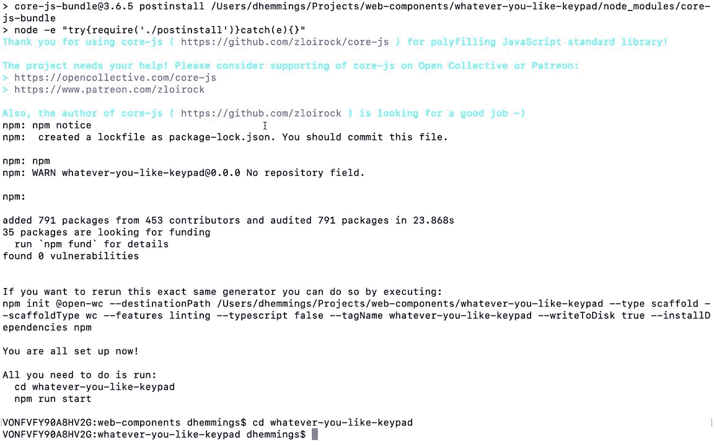
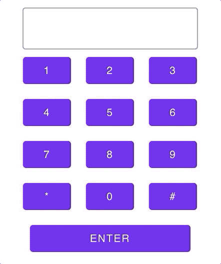
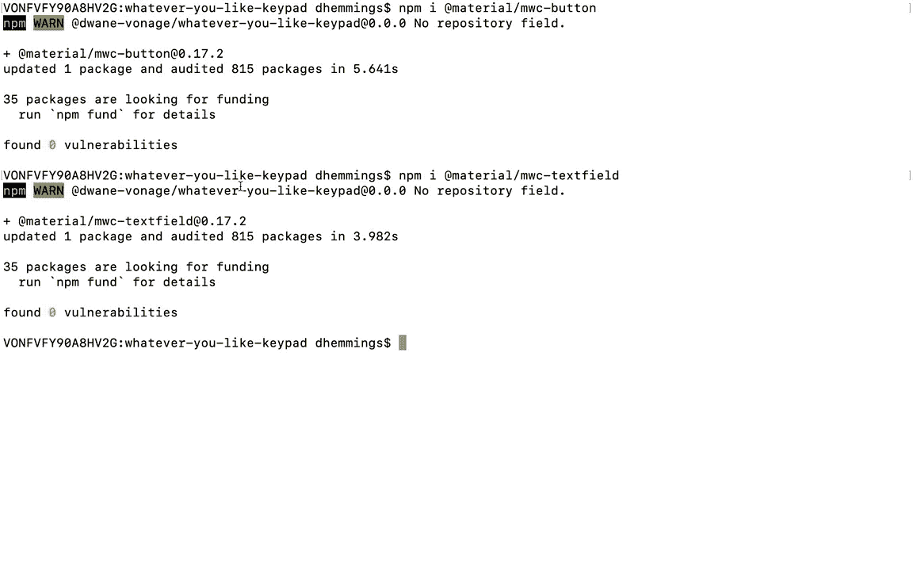
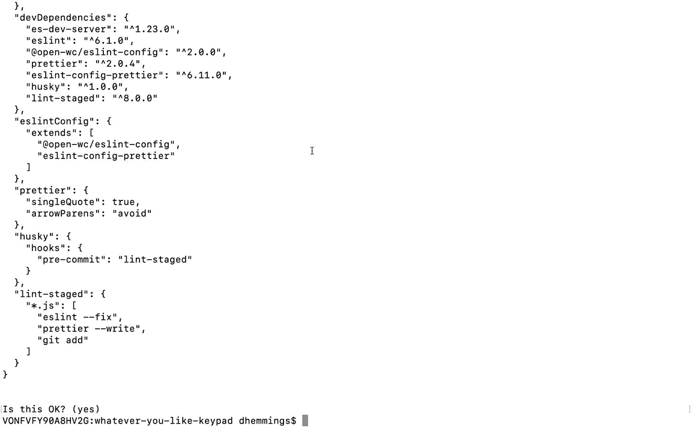

# 使用 Open-WC 创建 Web 组件

> 原文：<https://levelup.gitconnected.com/creating-a-web-component-with-open-wc-fe1922128080>

在这个系列的前面，我们讨论了什么是 Web 组件，以及用于创建它们的一些工具。现在，我们将创建一个 Web 组件，发布它，并在网页上使用它。

我们会做什么？采用[材料设计的网页组件](https://material-components.github.io/material-components-web-catalog/#/)的小键盘组件。构建一个由 Web 组件组成的 Web 组件，我知道这很简单。

这个想法是为了能够尽可能少的麻烦将键盘插入到项目中。只需几行代码，用户就可以在应用程序中输入数字来打电话、设置温度、选择测验答案、投票以及许多其他应用程序。

让我们列出将要构建的小键盘组件的功能:

*   现成的 Web 组件将呈现一个显示，在其下方是数字为 0–9、*、和#的按钮。
*   用户可以通过设置属性来隐藏显示和*、#按钮。
*   当用户点击一个按钮时，一个字符将被添加到显示屏上。同时，将发送一个自定义事件，以便组件外部的应用程序知道按钮被按下了。
*   将有一个“动作”按钮，将发送所有按下的数字作为一个更大的应用程序处理它认为合适的自定义事件。用户可以通过属性设置按钮的文本。
*   用户可以使用另一个按钮来“结束”操作。它的文本也将是可定制的。当按下时，显示将被清除，而另一个自定义事件将被发送到应用程序进行识别。
*   Web 组件将有一个可用的公共方法，因此应用程序可以切换到“活动”状态，然后显示“结束”按钮。
*   为了给 Web 组件添加一些样式，将使用材料设计按钮和 textfield 组件。

# 查看运行中的 Web 组件

这里有一个关于 CodePen 的工作示例

继续输入一些数字，然后按回车键。在警告上单击确定，然后单击取消。

# 使用开放 Web 组件构建组件

我们将如何构建这个键盘组件？我们将通过开放 Web 组件(Open-WC)的方式使用 lit-html。正如他们的[网站](https://open-wc.org/guide/index.html)上所说:

> 开放 web 组件的目标是为每个人提供一个强大的、经过实战检验的共享开源 Web 组件的设置。我们试图通过给出一组关于如何促进您的 web 组件项目的建议和默认设置来实现这一点。我们的建议包括:开发、林挺、测试、工具、演示、发布和自动化。

从 Open-WC 开始，团队中的每个人都可以有相同的起点来构建 web 组件。和许多事情一样，一致性是成功的一个因素。

由于 Open-WC 在如何构建 Web 组件和项目方面非常固执己见，他们有一个真正全面的 CLI 工具来生成它们。让我们把一切都安排好。

在您的终端中，导航到 Web 组件项目所在的位置。

然后，键入`npm init @open-wc`。这将启动 Open-WC 设置过程。

以下是我在这篇博文中为这个项目使用的选项:

*   你今天想做什么？当前位置着手一项新工程
*   你想做什么支架？:Web 组件
*   你想补充什么？:林挺(eslint & prettier)
*   你想用打字稿吗？不
*   您的应用程序/web 组件的标记名是什么？随便你喜欢的小键盘(你可以给 Web 组件起任何你喜欢的名字，只要它至少由两个单词组成，用一个'-'隔开)
*   您想将此文件结构写入磁盘吗？是
*   您想安装依赖项吗？是的，使用 npm(如果你喜欢纱线，你可以选择)

安装材质设计按钮和文本字段。进入 Open-WC 设置过程创建的新文件夹，键入以下内容:

`npm i @material/mwc-buttonnpm i @material/mwc-textfield`

# 组件代码

Web 组件的代码可以在这个 [GitHub 库](https://github.com/nexmo-community/open-wc-keypad)中找到。让我们检查一下`src`文件夹中的唯一文件中的代码。

首先是进口。Open-WC 推荐使用 [lit-html](https://lit-html.polymer-project.org/) 和 [lit-element](https://lit-element.polymer-project.org/) 基类来构建和呈现 Web 组件。我们还导入了在 Web 组件中使用的材质设计按钮和文本字段。

我们的新 Web 组件基于 LitElement。

样式化 Web 组件

在这里，Web 组件接受的属性和特性与它们的类型一起被设置。这样，lit-html 知道如何处理传入的值。

Web 组件继承了 LitElement 的所有“超级”能力，并定义了默认值。

接下来是 Web 组件的各种方法。比如添加或发送数字时调度自定义事件，以及结束一个动作。还有一个方法可以在 Web 组件上调用，让它知道一个操作已经开始。

你可能已经注意到了,`__addDigit`函数，只是把数字加到了末尾。如果用户将光标移动到数字的中间，新的数字将只添加到末尾。

现在，作为练习，让我们允许在光标所在的位置添加新的数字。这里有一个[提示](https://developer.mozilla.org/en-US/docs/Web/API/HTMLInputElement/setSelectionRange)关于去哪里`start`。

呈现 Web 组件的标记。根据状态和设置的属性，Web 组件将呈现或隐藏不同的元素。

# 发布新的 Web 组件

现在 Web 组件已经构建好了，让我们发布它，这样我们和其他人就可以在项目中使用它。

为此，我们将使用类似于 [npm](https://www.npmjs.com/) 的注册中心。如果你还没有，注册一个帐户。下面是一些[信息](https://docs.npmjs.com/creating-a-new-npm-user-account)。这不仅向您展示了如何注册一个帐户，还展示了如何使用您的终端登录到您的帐户，以便您可以发布 Web 组件。

一旦设置完成，Web 组件将作为公共范围的包发布。这将有助于防止冲突，以防存在与您选择的名称相同的 Web 组件或包。关于示波器的更多信息可以在[这里](https://docs.npmjs.com/about-scopes)找到。

在终端的项目目录中，键入(用您的 npm 用户名替换您的-NPM-用户名):

`npm init --scope=@your-npm-username`

接受所有默认选择，或者根据您对每个步骤的看法进行更改。

因为您的 Web 组件现在在一个作用域之后，所以让我们修改由 Open-WC 生成的`Readme`来反映这一点。再次将占位符(您的 npm 用户名和任何您喜欢的键盘)替换为您自己的占位符。

要安装的命令将是:

`npm i @your-npm-username/whatever-you-like-keypad`

要在项目中使用它，您将使用如下所示的`import`语法:

`import '@your-npm-username/whatever-you-like-keypad/whatever-you-like-keypad.js';`

保存您的更改。

现在，让我们发布 Web 组件。在终端中键入:

`npm publish --access public`

如果成功，您应该能够在 npm 网站的`[https://www.npmjs.com/package/@your-npm-username/whatever-you-like-keypad](https://www.npmjs.com/package/@your-npm-username/whatever-you-like-keypad.)` [找到 Web 组件。](https://www.npmjs.com/package/@your-npm-username/whatever-you-like-keypad.)

当然，用你的价值观代替`your-npm-username`和`whatever-you-like-keypad`。

恭喜你，你发表了！现在您有了一个公开可用的 Web 组件，您和其他人可以在项目中使用它。

# 使用 Web 组件

要在本地安装副本，请在终端中键入项目的目录，再次替换为您的值:

`npm i @your-npm-username/whatever-you-like-keypad`

但是如果不想安装包呢？也许你想确保你总是加载最新版本，或者想在不允许安装的环境中查看 Web 组件，比如 [CodePen](https://codepen.io) 。

这就是内容交付网络(CDN)的用武之地。它们托管您的包，您可以直接链接到您的文件。对于这篇文章，我们将使用[unpkg.com](https://unpkg.com/)。他们会自动复制你的文件，所以你不用做什么。

下面是一个示例代码笔，您可以使用它来测试您的 Web 组件:

再次在`HTML`和`JS`选项卡中用您自己的替换用户名和组件名占位符。

尝试为我们创建的 Web 组件添加一些属性(no-asterisk no-hash no-display)并设置按钮文本的值(action text = " Something " cancel text = " Something other ")。

> 注意:当使用 no-display 时，要看到数字，需要一个 input 或 textarea HTML 元素。就像这个例子:

# 接下来呢？

现在您有了一个闪亮的新 Web 组件，您还能向它添加什么呢？也许，添加一个退格键来删除字符，或者允许用户设置他们自己的按钮。或者创造一些全新的东西。

在我们的[社区 Slack 频道](https://developer.nexmo.com/slack)中留下您的 Web 组件、问题和/或反馈的任何链接。我很期待看到你的作品。

*最初发布于*[*https://www . NEX mo . com/blog/2020/08/13/creating-a-web-component-with-open-WC*](https://www.nexmo.com/blog/2020/08/13/creating-a-web-component-with-open-wc)