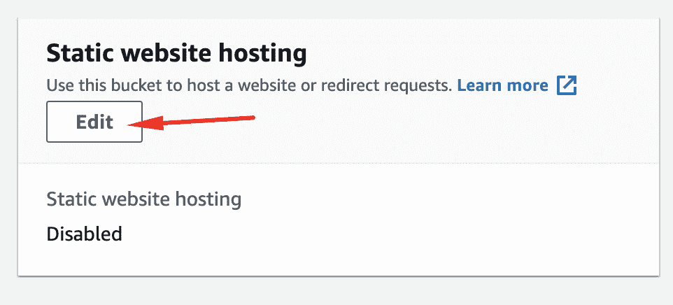

# 在 S3 AWS 上创建网站:一步一步来

> 原文：<https://levelup.gitconnected.com/creating-a-web-site-on-aws-s3-step-by-step-980ecaafa7f1>


我一直在我的文章中使用 AWS S3 部署，特别是微前端，我想给出一些简单的步骤，你可以在 AWS S3 bucket 上创建一个类似于我们在下面的[文章](https://www.linkedin.com/pulse/deploying-micro-frontends-aws-step-using-gitlab-react-rany/)中创建的网站:

[](https://www.linkedin.com/pulse/deploying-micro-frontends-aws-step-using-gitlab-react-rany) [## 使用 Gitlab、React、Webpack 5 和模块联盟逐步将微前端部署到 AWS

### 在我之前的文章(https://levelup.gitconnected。

www.linkedin.com](https://www.linkedin.com/pulse/deploying-micro-frontends-aws-step-using-gitlab-react-rany) 

结果可以在 http://mfe1.s3-website-us-east-1.amazonaws.com/的[查看](http://mfe1.s3-website-us-east-1.amazonaws.com/)


# 首先:创建一个免费的亚马逊账户

我们将需要它来部署到 AWS。它简单明了。只需按照这里的说明[https://AWS . Amazon . com/premium support/knowledge-center/create-and-activate-AWS-account/](https://aws.amazon.com/premiumsupport/knowledge-center/create-and-activate-aws-account/)

这里是报名页面[https://portal.aws.amazon.com/billing/signup#/start](https://portal.aws.amazon.com/billing/signup#/start)

# 2-转到 AWS 控制台并登录，然后选择 S3


# 3-创建一个存储桶


# 4-选择没有空格或大写字母的唯一名称


# 5 —公开

取消选中阻止流量


并承认


单击创建存储桶


现在，选择您创建的 bucket(注意，我更改了名称，因为原来的名称不是惟一的)


选择属性


在最后，编辑网站托管



启用:


选择主机静态网站


在索引文档和错误页面中写入 index.html


单击保存更改


现在，转到权限


向下滚动到存储桶策略，然后单击编辑


添加以下策略以对您的存储桶启用只读(使用您的存储桶名称更改 xxxxx)

```
{
  "Id": "Policy1615751075403",
  "Version": "2012-10-17",
  "Statement": [
    {
      "Sid": "Stmt1615751021409",
      "Action": [
        "s3:GetObject"
      ],
      "Effect": "Allow",
      "Resource": "arn:aws:s3:::xxxxx/*",
      "Principal": "*"
    }
  ]
}
```


单击保存更改


保存 URL，因为我们稍后会用到它。再次转到属性


滚动到最后，网站托管部分，你会发现桶的公共网址。复制并保存它，因为我们将在本文末尾导航到它


我的是[http://micro-front-ends.s3-website-us-east-1.amazonaws.com](http://micro-front-ends.s3-website-us-east-1.amazonaws.com/)它将在文章的最后看起来如下


这就是了。为了测试它，让我们执行以下操作:

1.  按照以下文章在您的计算机上安装和配置 AWS-CLI

[](https://www.linkedin.com/pulse/install-configure-aws-cli-deployment-rany-elhousieny-phd%E1%B4%AC%E1%B4%AE%E1%B4%B0) [## 为部署安装和配置 AWS CLI

### 在我们创建的大多数项目中，我们将经常与 AWS mor 打交道。因此，我决定创造这个…

www.linkedin.com](https://www.linkedin.com/pulse/install-configure-aws-cli-deployment-rany-elhousieny-phd%E1%B4%AC%E1%B4%AE%E1%B4%B0) 

2.克隆微前端项目

```
git clone [https://github.com/ranyelhousieny/react-microfrontends.git](https://github.com/ranyelhousieny/react-microfrontends.git)
```

进入 mfe2 并运行纱线安装

```
Rany>cd react-microfrontends Rany>cd mfe2Rany>yarn install
```

构建 webpack 项目

```
yarn webpack --config webpack.prod.js
```

将 dist 复制到您刚刚创建的 bucket 中(当然，用您的 Bucket 中的名称替换下面的名称)

```
aws s3 sync dist s3://micro-front-ends
```


如果你导航到你之前保存的网址，你会发现类似下面的[http://micro-front-ends.s3-website-us-east-1.amazonaws.com](http://micro-front-ends.s3-website-us-east-1.amazonaws.com/)


恭喜

# 现在，让我们按照这篇[文章](https://www.linkedin.com/pulse/adding-cloudfront-web-enabled-aws-s3-bucket-rany-elhousieny-phd%E1%B4%AC%E1%B4%AE%E1%B4%B0/)添加 CloudFront 发行版

[](https://www.linkedin.com/pulse/adding-cloudfront-web-enabled-aws-s3-bucket-rany-elhousieny-phd%E1%B4%AC%E1%B4%AE%E1%B4%B0/) [## 将 CloudFront 添加到支持 Web 的 AWS S3 Bucket

### 本文建立在前一篇文章(https://www.linkedin。

www.linkedin.com](https://www.linkedin.com/pulse/adding-cloudfront-web-enabled-aws-s3-bucket-rany-elhousieny-phd%E1%B4%AC%E1%B4%AE%E1%B4%B0/) 

您可能会从以下网址获得指向上一个网站的相关文章:

[](https://www.linkedin.com/pulse/micro-frontends-hands-on-example-using-react-webpack-rany) [## 使用 React、Webpack 5 和模块联合逐步实现微前端

### 在这篇文章中，我将一步一步地创建两个微前端反应组件，并呈现一个按钮组件…

www.linkedin.com](https://www.linkedin.com/pulse/micro-frontends-hands-on-example-using-react-webpack-rany) [](https://www.linkedin.com/pulse/deploying-micro-frontends-aws-step-using-gitlab-react-rany) [## 使用 Gitlab、React、Webpack 5 和模块联盟逐步将微前端部署到 AWS

### 在我之前的文章(https://levelup.gitconnected。

www.linkedin.com](https://www.linkedin.com/pulse/deploying-micro-frontends-aws-step-using-gitlab-react-rany)