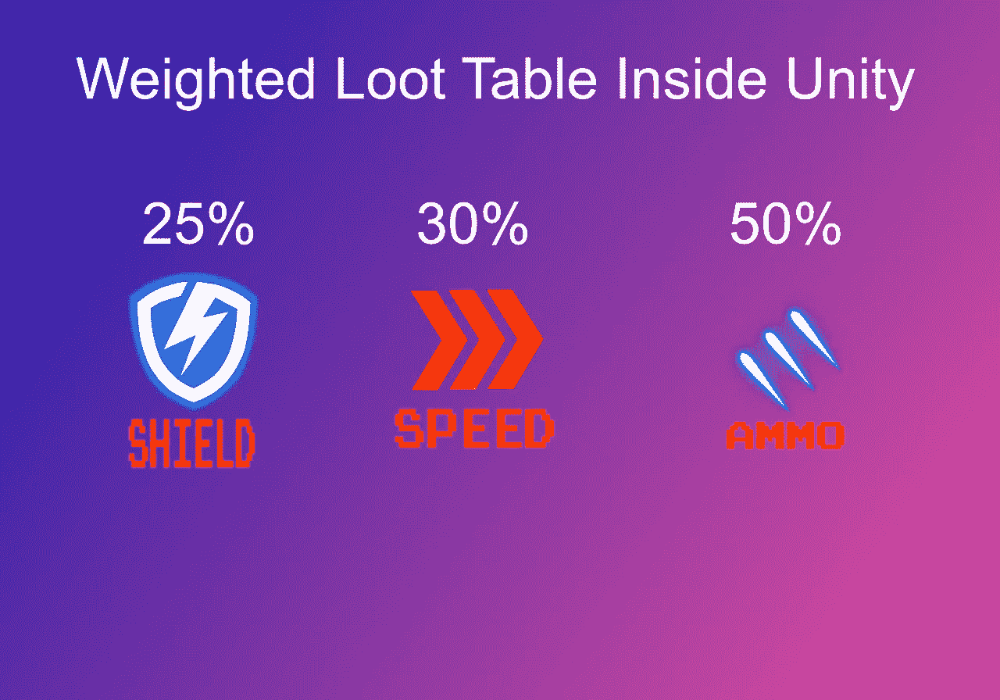
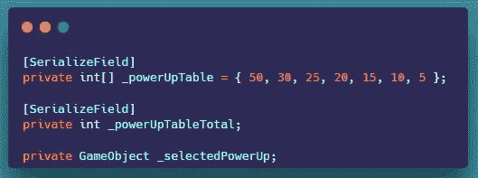
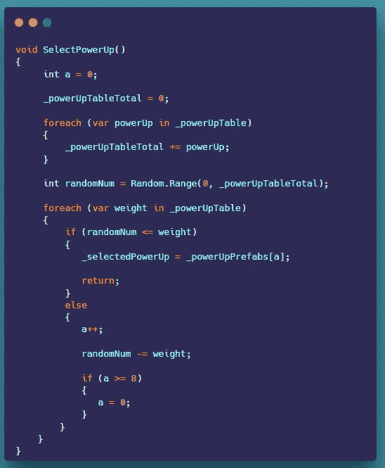
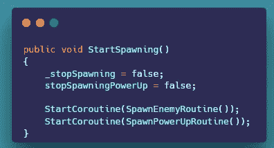
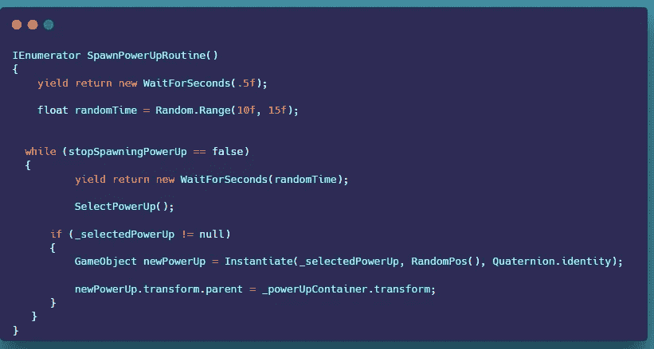

# 在 Unity 中创建一个加权的战利品表

> 原文：<https://levelup.gitconnected.com/creating-a-weighted-loot-table-inside-unity-c89fc804b343>

**概述:**

今天，我们将创建一个加权的战利品表。

这是如何工作的，我们有一个 loot 表(整数数组),保存每个对象从最高到最低的所有百分比。接下来，我们运行 for-each 循环，将每个百分比相加，并将其存储在一个名为 Table Total 的变量中。

我们生成一个从 0 到表总数的随机数。

然后我们运行 for-each 循环，比较随机数是否小于或等于当前重量(百分比)。如果是真的，我们就产生这个对象。如果它是假的，我们用随机数减去当前的重量(百分比)。

**加权战利品表:**

在种子管理器中，我们需要创建一些新的变量。

1.  我们需要一个 int 来表示加权值/百分比和加权表总计。

2.我们创造了一种新方法。我们运行一个 foreach 循环，将每个百分比相加，并存储在一个名为 Table Total 的变量中。接下来，我们生成一个从 0 到表总数的随机数。然后，我们运行 foreach 循环，比较随机数是否小于或等于当前权重(百分比)。如果是真的，我们就产生这个物体，如果是假的，我们就用随机数减去当前的重量(百分比)。

**产卵对象:**

1.  在 start spawning 方法中，我们需要将 stop spawning PowerUps 布尔值设置为 false。

2.在 spawn PowerUp 协同例程中，我们运行一个 while 循环，该循环将调用 SelectPowerUp 方法。接下来，我们检查所选择的加电是否不等于 null，如果不等于，我们产生加电。

这就是在 Unity 中创建一个加权的战利品表。

感谢您的时间和关注。