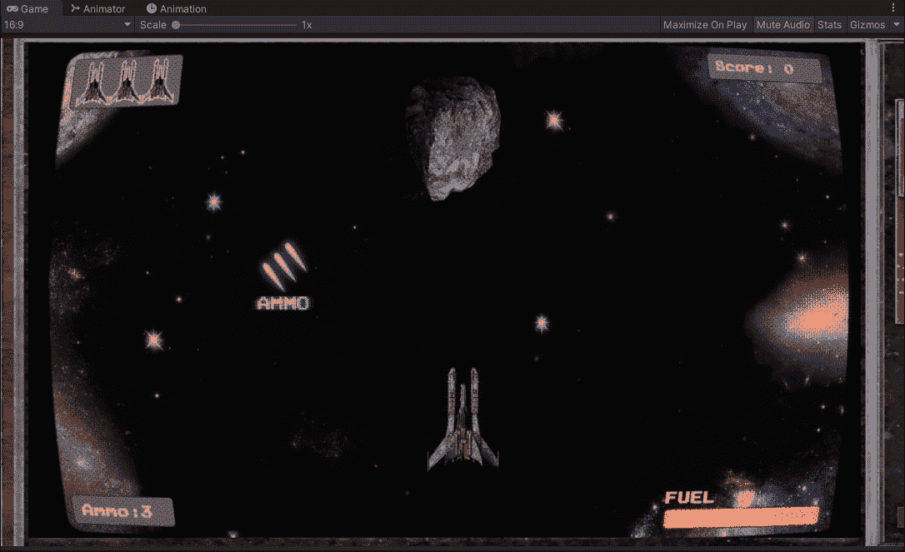
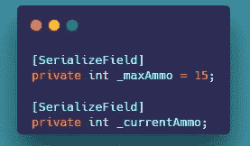
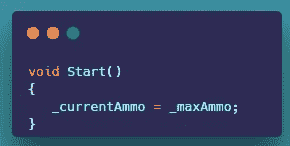
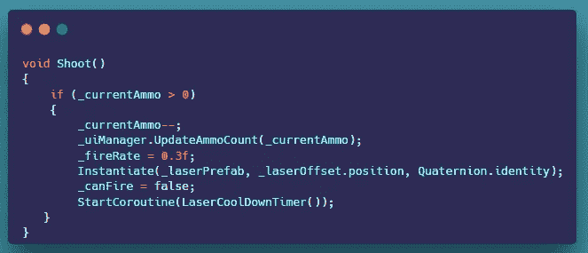
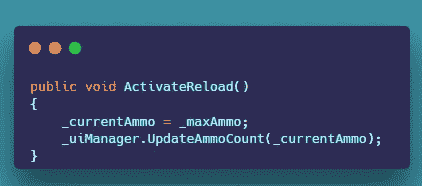
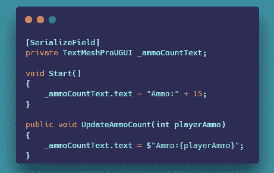
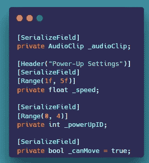
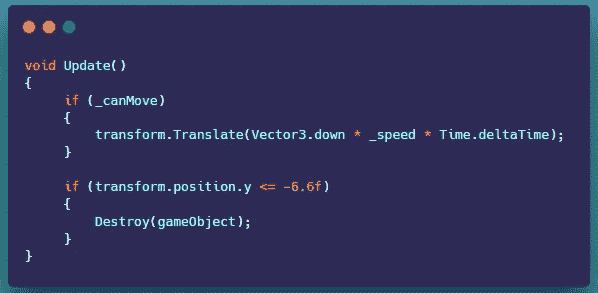
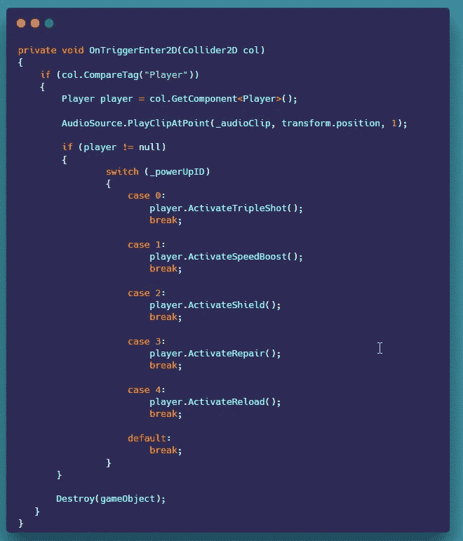

# 在 Unity 中为你的游戏创建弹药计数和弹药增强

> 原文：<https://levelup.gitconnected.com/creating-ammo-count-and-an-ammo-powerup-for-your-game-876081710a2c>

**概述:**

今天，我们将复习如何创建弹药计数和弹药领取。

**弹药数量:**

目前我们的球员有无限的投篮机会。我们将限制玩家最多只能有 15 次投篮机会。让我们开始吧。

1.  我们为最大弹药量和当前弹药量创建了两个私有整型变量。

2.我们在 start 方法中将当前弹药设置为最大弹药。

3.在射击方法中，我们更新弹药并检查我们当前的弹药是否大于零。如果是的话，我们从当前弹药中取出一个并更新界面。我们将射速设置为 0.3f，产生一个激光射弹，然后将一个 bool can fire 设置为 false，并启动激光冷却协程。

4.我们还需要创建一个名为 Activate Reload 的新公共方法。我们设置当前弹药等于我们的最大弹药，并更新界面。

**从加电脚本**调用激活重新加载

**弹药拾取:**

我们将实现一个弹药拾取，这样我们的玩家可以重新加载。让我们开始吧。

1.  我有一个简单的 UI 管理器脚本附加到画布上，用于更新 UI。

**用户界面管理器脚本**

2.我有一个用于处理多个加电的加电脚本，变量如下。我们有一个声音的音频剪辑，一个移动速度的浮动，一个加电 ID 和一个名为 can fire 的 bool。

**启动脚本变量**

4.在 update 方法中，我有一个简单的检查，如果 can move 为真，我们将电源上下移动，一旦它离开屏幕，我们就销毁它。

5.我们还创建了一个 OnTriggerEnter2D 方法。我们检查电源是否与播放器发生碰撞。然后我们从碰撞的物体上获取播放器脚本组件并播放声音。我们还检查播放器脚本是否不为空。然后，我们运行一个 switch 语句，这取决于在 inspector 中启动时设置的 ID。弹药的话，应该是四个。

我们现在应该有一辆皮卡来补充玩家的弹药。

本文到此为止。

如果您喜欢它，请鼓掌并关注更多 Unity 内容。

感谢您的时间和关注。