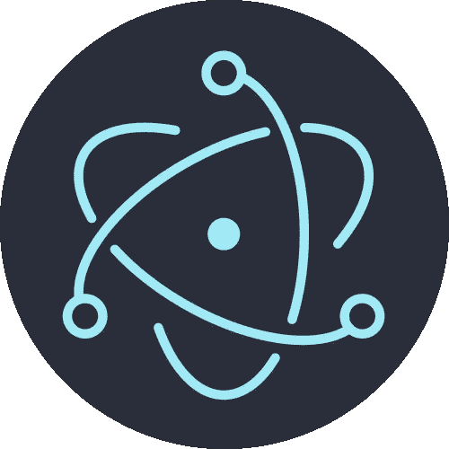

# 使用 Typescript、electronic、React、Express、Rollup、Yarn 和 Supercollider 创建 mac 应用程序

> 原文：<https://levelup.gitconnected.com/creating-an-app-for-mac-using-electron-react-express-rollup-yarn-and-supercollider-843740672d6>



这是一篇关于我使用 electron 将一个现有的 node 和 react 项目转换成一个独立的 mac 应用程序的文章。

我有一个现有的项目，它有一个基于 React-powered web 浏览器的前端，可以与 Express.js 后端通信。后端可以读取、写入和查询文件系统上的文件，并运行应用程序 Supercollider 来处理音频。最近，我决定尝试将这个项目转换成一个独立的电子应用程序。这样做的部分原因是试图将前端和后端放入一个方便的包中，部分原因是为了看看这项技术有多容易使用。虽然有很多关于使用电子在线的指南，但往往有一些非常简单的问题需要大量的研究来解决，所以我想我会写这篇文章来分享我从这个过程中获得的一些知识，希望其他人不必经历同样的努力。

```
DISCLAIMER: As web-based technologies are changing so quickly at the moment, it is worth noting that I am writing this in March 2020, and that this advice may not work by the time you read it.  Also, I am only dealing with building an app on mac - there are slightly different idiosyncrasies for both linux and windows which I will not cover here, as I don't have first-hand experience of them.
```

# 什么是电子？

Electron.js 没有打包基于`node.js`的项目，这样它们就可以作为独立的应用程序运行。或者，正如他们的[网站](https://www.electronjs.org)所描述的:“用 JavaScript、HTML 和 CSS 构建跨平台的桌面应用”

# 为什么我要将我的 react 和 express 项目转换成一个独立的电子应用程序？

在我现有的项目中，我使用 React 作为在网络浏览器中运行的交互式前端。与前端交互将允许用户在本地文件系统上生成、操作、读取和写入音频和文本文件。由于安全限制，网络浏览器不允许通过 javascript 脚本直接访问文件系统(因此`exec`、`fsRead`或`fsWrite`等`node`命令不会在浏览器内部运行)。因此，在浏览器之外运行一个后端服务器是很有用的，它可以使用`node`来控制文件系统访问，并通过 http 与前端通信。然而，如果你想和别人分享这个项目，它有时会很难设置；因此，使用 electron 将它打包成一个独立的应用程序，对于那些可能不熟悉 node/npm/javascript 技术或者可能没有兴趣或时间来完成安装一整套依赖项以使您的项目正常工作的人来说，是非常有用的。

# 你用什么工具来创建一个独立的应用程序？

显然是电子。Electron 将你的组件打包成一个简化版的 chromium，但是你需要一个单独的程序将它打包成一个独立的应用程序。目前，有三种常用的方法可以使用 electronic 将现有项目打包成独立的应用程序:

*   电子锻造[https://electronforge.io/](https://electronforge.io/)
*   电子制造商[https://github.com/electron-userland/electron-builder](https://github.com/electron-userland/electron-builder)
*   电子反应样板[https://github.com/chentsulin/electron-react-boilerplate](https://github.com/chentsulin/electron-react-boilerplate)

你选择哪一个很大程度上取决于你有多少耐心，你想要输出的文件的大小，以及你需要的定制程度。

如果你想很快得到结果，并且不在乎文件大小，使用`electron-forge`。如果你从头开始构建你的项目，它很大程度上是基于 react 的，或者你需要尽可能小的包，使用`electron-react-boilerplate`。我没有用过电子生成器，所以我不能对它说话。`electron-react-boilerplate`在幕后调整了许多设置，以确保最终的构建规模尽可能小。`electron-forge`提供了大量的配置选项，但是由于它是建立在`electron-rebuild`、`electron-packager`之上，并且包含了一个广泛的插件系统，理解改变什么以及如何改变它需要大量的时间。我最后用了`electron-react-boilerplate`。

# 我完成的应用程序会有多大？

在 mac 上，几乎不可能获得低于 130MB 的成品应用程序，这是因为该应用程序捆绑了 chromium 版本。压缩可以将该大小减少一半。根据我的经验，`electron-forge`往往比`electron-react-boilerplate`大 50MB 左右。完了。我的应用程序的 dmg 文件大约是 90MB。zip 文件自动生成。

另见:[https://stack overflow . com/questions/47597283/electronic-package-reduce-the-package-size](https://stackoverflow.com/questions/47597283/electron-package-reduce-the-package-size)

# 纱线 vs npm

对于电子应用程序，最好使用`yarn`而不是`npm`——这是因为许多电子工具都只使用纱线，就像`lerna`一样。如果你正在使用 npm，我建议在尝试用 electronic 做任何事情之前先切换一下，尽管`electron-forge`是少数几个可以与两个包管理器一起工作的工具之一。

# 使用你的前端

如果你正在构建一个有前端和后端的应用程序，你可能已经为项目的前端和后端创建了两个独立的文件夹。

如果你已经使用了`create-react-app`作为你的 react 前端，那么使用内置于该模块的极其高效的打包选项可能是最有意义的，而不是试图手动将其打包到一个独立的模块中——我放弃了尝试使用`rollup`来打包我的 react 项目，而是运行`yarn build`来生成一个构建文件夹，然后我使用`gulp`将其复制到我的电子应用程序的`app/dist/`文件夹中，方法是在我的`electron-react-boilerplate`文件夹的根文件夹中添加一个名为`gulpfile.js`的新文件:

```
// gulpfile.js
const gulp = require('gulp');
const path = require('path');function copyFrontend() {
  return gulp
    .src(['../frontend/build/**/*.*'])
    .pipe(gulp.dest('app/dist/frontend'));
}exports.default = gulp.series(copyFrontend);
```

并将以下内容添加到同一个文件夹中的顶层`package.json`:

```
// package.json
"scripts": {
    ...
    "resources": "rm -r -f app/dist/frontend && gulp -f gulpfile.js",
     "package": "yarn resources && yarn build && electron-builder build --publish never",
    ...
}
```

# 使用您的后端

对于后端，使用像`rollup`这样的工具打包你的模块可能是有用的，它似乎比 react 组件更适合直接使用 javascript。以下是我用来打包我的 express 应用程序的`rollup.config.js`文件:

```
import typescript from 'rollup-plugin-typescript2';
import external from 'rollup-plugin-peer-deps-external';
import commonjs from 'rollup-plugin-commonjs';
import resolve from 'rollup-plugin-node-resolve';
import url from 'rollup-plugin-url';
import json from '@rollup/plugin-json';
import pkg from './package.json';export default {
    input: 'src/server.ts',
    output: [
        {
            file: pkg.main,
            format: 'commonjs',
            sourcemap: true,
        },
        {
            file: pkg.module,
            format: 'es',
            sourcemap: true,
        },
    ],
    plugins: [
        external(),
        url(),
        json(),
        typescript({
            typescript: require('typescript'),
            rollupCommonJSResolveHack: true,
            clean: true,
        }),
        resolve({ preferBuiltins: true }),
        commonjs(),
    ],
};
```

在我的`tsconfig.json`文件中找到的我的类型脚本配置是:

```
{
    "compilerOptions": {
        "target": "es5",
        "skipLibCheck": true,
        "esModuleInterop": true,
        "allowSyntheticDefaultImports": true,
        "strict": true,
        "forceConsistentCasingInFileNames": true,
        "module": "ESNext",
        "moduleResolution": "node",
        "noImplicitAny": false,
        "resolveJsonModule": true,
        "declaration": true,
        "declarationDir": "./dist"
    },
    "include": [
        "src/**/*"
    ],
    "exclude": [
        "**/*.spec.ts",
        "node_modules",
        "build"
    ]
}
```

我的`package.json`包含以下几行:

```
"main": "./dist/server.js",
  "module": "./dist/server.es.js",
  "jsnext:main": "./dist/server.es.js",
```

值得记住的是，关于 rollup 的一个恼人的事情是，选项和插件的配置**以及它们的顺序**经常需要根据您在项目中使用的模块而发生巨大的变化——通常您需要以一种非常特别的、反复试验的方式来解决这个问题。 有时，您在代码中使用的特定模块组合使得 rollup 无法使用——这是我决定在`create-react-app`中使用内置捆绑器，而不是用它创建 react 模块的原因之一。

此外，近年来，rollup 的许多插件已经从孤立的变为被纳入 npm 上的`@rollup`范围，旧的插件已被弃用，不再维护。一些老的教程没有考虑到这一点。

在这个项目中有很多关于 rollup 和插件互不兼容的问题之后，在我的下一个项目中，我将使用`parcel.js`,它似乎有更多的功能，而没有 rollup 所要求的不断和恼人的调整。

# double package.json 格式

`electron-react-boilerplate`使用“double package.json”格式，其中外层文件夹包含一个`package.json`，用于控制应用程序构建过程的配置，而`package.json`位于`app`文件夹内，用于控制与应用程序本身相关的设置。

# 如何在电子版中使用我包装精美的 React 网站？

在一个`electron-react-boilerplate`项目中，控制完成的应用程序运行的主文件位于`app/main.dev.ts`。在这里你会看到一些启动新的`BrowserWindow`的代码，它会像这样开始:

```
mainWindow = new BrowserWindow({
    show: false,
    width: 820,
    height: 640,
    webPreferences: ...
```

在它下面，你会发现一些代码，指定了应用程序启动时加载的主 html 文件。如果你像我一样，已经将预建的 react 应用程序复制到了`app/dist/frontend`文件夹中，那么你的路径应该是这样的(注意:`file://`前缀很重要！):

```
mainWindow.loadURL(
    `file://${__dirname}/dist/frontend/index.html`
  );
```

# 向打包的 react 应用程序传递参数

如果您正在使用预打包的 react 应用程序，您可能会发现很难传入在应用程序级别生成的参数，例如用于在前端和后端之间通信的 http 端口。一种简单的方法是将这些元素作为文件路径中使用的参数传入，例如:

```
mainWindow.loadURL(
    `file://${__dirname}/dist/frontend/index.html?port=9009`
);
```

然后，您的前端可以使用以下命令来查询这些信息:

```
const currentPageUrl = new URL(window.location.href);
const port = currentPageUrl.searchParams.get('port');
```

# 将参数传递到 express 后端

当试图将信息传递到您的 express 后端时，也会出现类似的问题。对我来说，最简单的方法是使用内置在 express 应用程序的每个实例中的`locals`参数。您可以按以下方式使用它们:

```
// in app/main.dev.ts import myServer from 'myserver-component'const appPort = 9009;
const resourceFolder = '/me/Desktop/all-my-files'const appServer = myServer.start(appPort, resourceFolder);
```

在上面的代码中，我将一个端口号和文件夹路径传递给 express 应用程序的实例。下面，我将这个文件夹分配给 express 后端中的`app.locals`,这样就可以从其他地方的 express 实例中检索到它:

```
// in your express myserver-component componentimport app from './routers';const myServer = (port: string, resourceFolder: string) => {
    const server = app.listen(port, err => {
        if (err) throw err;
        console.log(`listening on port ${port}`);
    });
    app.locals.resourceFolder = resourceFolder;
    return server;
};export default { start: myServer };
```

在您的快速路由器中，您可以使用`req.app.locals.resourceFolder`检索此信息:

```
// in the ./routers file
import express from 'express';
import cors from 'cors';
import path from 'path';
import bodyParser from 'body-parser';import { getFiles } from './getFiles';const app = express();
app.use(bodyParser.urlencoded({ extended: true }));
app.use(bodyParser.json());
app.use(cors());
const router = express.Router();router.route('/file').get((req: any, res: any, next: any) => {
    console.log('Server received request for files from', req.app.locals.resourceFolder);
    return getFiles(req.app.locals.resourceFolder, res);
});
```

注意:如果您在前端和服务器之间传输大量的 JSON 数据，值得注意的是`bodyParser`插件有一个默认的它可以处理的最大数据量。如果需要，在将 bodyParser 添加到服务器代码中时，可以使用下面的代码来增加这个值:

```
app.use(bodyParser.urlencoded({ limit: '20mb', extended: true }));
app.use(bodyParser.json({ limit: '20mb' }));
```

# 包括预构建的二进制文件

我有一个预建版本的 supercollider，我想把它包含在我的应用程序中。如果您使用的是`electron-react-boilerplate`，那么可以通过在 package.json 中添加一个`extraResources`键来实现。

```
"extraResources": [
      {
        "from": "../resources",
        "to": "myresources",
        "filter": [
          "**/*"
        ]
      }
```

上面的代码会将所有文件从`../resources`文件夹复制到打包应用程序的`myresources`文件夹中。在打包的 mac 应用程序中，这可以在文件夹`example.app/Contents/Resources/myresources`中找到。

# 引用您预先构建的二进制文件

您可以使用`process.resourcesPath`来获取打包的 mac 应用程序中 Resources 文件夹的路径。您可能希望在代码中设置一个变量，如下所示，该变量根据电子应用程序是处于开发模式还是打包生产模式，在本地文件路径和相对文件路径之间切换:

```
const resourceFolder =
    process.env.NODE_ENV === 'development'
      ? '../resources'
      : path.join(process.resourcesPath, 'myresources');
```

# path.join 与 path.resolve

由于某些原因，`path.resolve`在封装电子 app 中不起作用- `path.join`是首选。

# 如果预构建的二进制文件打包成. asar 文件，我还能运行它吗？

不，可能不会——至少对我来说没用。

为了减小文件包的大小，electron 可以将应用程序的内容打包成一个`.asar`存档文件，该文件的内容应该能够使用`example.asar/example-folder/my-file.txt`等路径进行访问。然而，这种方法似乎不适用于预编译的二进制文件

# 编译超级对撞机

我想用超级对撞机来处理音频文件。然而，自从这个程序开始使用`Qt`来运行它的 IDE，它就不可能将程序的`sclang`和`scsynth`部分分开来单独使用(这似乎只是 MAC[https://doc.sccode.org/Classes/HelpBrowser.html](https://doc.sccode.org/Classes/HelpBrowser.html)上的一个问题)，这意味着文件可能会非常大(大约 600MB)。如果你在一个电子应用程序中使用 supercollider，我建议从源代码中构建它，将 supercollider 的大小减少到 65MB 左右。这是通过不包含用于显示帮助文件的 QtWebEngine 来实现的:

```
"Since the Qt WebEngine dependency is hefty and difficult to install on some systems, it is possible for sclang to have been built without WebView support (using the CMake flag -DSC_USE_QTWEBENGINE=OFF at compile). If so, attempting to invoke this class will throw an error."- [https://doc.sccode.org/Classes/HelpBrowser.html](https://doc.sccode.org/Classes/HelpBrowser.html)
```

当从源代码构建 supercollider 时，您需要遵循位于[https://github . com/super collider/super collider/blob/develop/README _ MAC OS . MD](https://github.com/supercollider/supercollider/blob/develop/README_MACOS.md)的说明。一旦您安装了所有需要的依赖项，您将需要使用带有以下标志的`cmake`，以确保它不会将 QtWebEngine 与构建捆绑在一起，并创建一个没有其他不必要组件(如调试器)的最小大小的应用程序。

```
cd SuperCollider
mkdir -p build
cd build
cmake -G Xcode -DCMAKE_PREFIX_PATH=`brew --prefix qt5` -DSC_USE_QTWEBENGINE=OFF ..
cmake --build . --target install --config MinSizeRel
```

这种方法在 supercollider 版本 3.10.4 上使用过，我不能保证它在其他版本上的有效性。

# 从节点运行 supercollider

我在 express.js 应用程序的后端运行 supercollider，方式如下:

```
export const runSupercollider = (resourceFolder: string) => {
    const command = path.join(resourceFolder, '/myresources/supercollider.app/Contents/MacOS/sclang');
    const commandArguments = [path.join(resourceFolder, '/myresources/my-supercollider-file.scd'), 'parameter1', 'parameter2'];
    return new Promise((resolve, reject) => {
        execFile(command, commandArguments, (error, stdout, stderr) => {
            if (stdout) {
                console.log('stdout', stdout);
                resolve(stdout);
            } else if (stderr) {
                console.log(stderr);
                reject(stderr);
            } else {
                console.log(error);
                reject(error);
            }
        });
    });
};
```

使用`execFile()`，第一个参数将是要运行的文件的路径(在这种情况下是来自 supercollider 应用程序的`sclang`可执行文件)，第二个参数将是一个参数数组，第一个参数将是`sclang`要运行的`.scd`文件，数组的其余部分将是传递给`.scd`文件的任何参数。可以通过使用`thisProcess.argv`从`.scd`文件中引用这些参数，T7 返回这些参数的数组。

# 让超级对撞机退出

当从命令行运行 supercollider 的`sclang`时，很难让 supercollider 在完成任务后退出。我发现做到这一点的唯一可靠方法是使用:

```
thisProcess.platform.killAll("sclang");
```

此外，如果您从您的电子应用程序运行 supercollider，您必须显式处理 supercollider 代码中的错误，以确保它在遇到错误时关闭，否则它可能会挂起，阻塞线程并阻止您的应用程序运行。您需要显式地让 supercollider 退出，因为 supercollider 在通过这个方法接收到错误时的默认行为:`Error(“ERROR: no output folder specified in file”).throw;` 是仍然保持进程运行。相反，您应该使用`onError`方法在每次抛出错误时显式退出 supercollider:

```
~printSeperator = "---OUTPUT---"
~errorMessage = '';~handleError = {
  (~printSeperator ++ "error!  supercollider had to quit because" + ~errorMessage).postln;
  ~server.remove;
  thisProcess.platform.killAll("sclang");
};OnError.add(~handleError);~generateError = { arg message;
  ~errorMessage = message;
  Error(message).throw;
};
```

然后，您可以在程序中的任何地方抛出一个带有自定义错误消息的错误，如下所示:`~generateError.value(“this file does not exist.”);`

我将`"---OUTPUT---”`的`~printSeperator`字符串附加到错误消息中，这样我就可以从服务器上运行 supercollider 的`fs.exec`函数中捕获标准输出，并使用这个字符串将我插入的错误消息与程序输出的其余文本分开:

```
const runSupercollider = () => {
    return new Promise((resolve, reject) => {
        execFile('./min-supercollider.app/Contents/MacOS/sclang', './example.scd', (error, stdout, stderr) => {
            if (stdout) {
                resolve(stdout);
            } else if (stderr) {
                reject(stderr);
            } else {
                reject(error);
            }
        });
    });
};runSupercollider().then((output: unknown) => {
  const reducedOutput = (output as string).split('---OUTPUT---')[1];
}).catch(err => console.log(err));
```

# 更改图标

默认情况下，`electron-react-boilerplate`打包时会使用默认的 React 图标。您可以使用应用程序外部的`package.json`中的`build`键将它切换为您自己的图标。

```
"build": {
    "productName": "myApp",
    "icon": "./icons/icon.icns",
}
```

这将使用在您的应用程序的`icons`文件夹中找到的图标文件，并将其复制到您打包的应用程序的`Contents/Resources`文件夹中。你可以使用下面的应用程序创建一个在 mac 上使用的`.icns`文件:[https://github.com/onmyway133/IconGenerator](https://github.com/onmyway133/IconGenerator)

# 保护您电子应用的安全

当您通过`yarn start-main-dev`在开发模式下运行您的电子应用程序时，您可能会在调试控制台中看到如下所示的错误:

```
Electron Security Warning (Insecure Content-Security-Policy) This renderer process has either no Content Security Policy set or a policy with "unsafe-eval" enabled. This exposes users of this app to unnecessary security risks.For more information and help, consult https://electronjs.org/docs/tutorial/security. This warning will not show up once the app is packaged.
```

此错误表明您可能没有仔细阅读电子安全清单。为了保证你的应用程序的安全，我强烈建议这样做。可以在:[https://www . electron js . org/docs/tutorial/security # check list-security-recommendations](https://www.electronjs.org/docs/tutorial/security#checklist-security-recommendations)找到。

通过将以下代码添加到`createWindow`函数内的`app/main.dev.ts`文件中，可以消除这个特定的错误:

```
if (process.env.NODE_ENV !== 'development') {
    session.defaultSession.webRequest.onHeadersReceived((details, callback) => {
      callback({
        responseHeaders: {
          ...details.responseHeaders,
          'Content-Security-Policy': ["default-src 'none'"]
        }
      });
    });
  }
```

我建议添加`if (process.env.NODE_ENV !== 'development') {`条件，因为它将确保错误总是出现在开发模式中，并且有了它有助于防止您在生产或打包期间忘记添加它。

当禁用 node.js 集成(安全清单中的第 2 点)时，您必须添加一个类似的条件，因为运行开发模式需要此集成，但打包时不需要:

```
mainWindow = new BrowserWindow({
    show: false,
    width: 820,
    height: 640,
    webPreferences:
      process.env.NODE_ENV === 'development' || process.env.E2E_BUILD === 'true'
        ? {
            enableRemoteModule: false,
            nodeIntegration: true
          }
        : {
            preload: path.join(__dirname, 'dist/renderer.prod.js'),
            enableRemoteModule: false,
            nodeIntegration: false
          }
  });
  ...
```

# 排除故障

构建电子应用程序的一个缺点是，打包后很难调试。但是，在打包的应用程序中读取控制台日志的一种方法是通过终端打开它，这将导致一个额外的终端窗口打开来显示这些日志:

`open myApp.app/Contents/MacOS/myApp`

值得注意的是，电子应用程序运行两个进程:一个`main`进程和一个`renderer`进程(更多信息在这里:[https://www . electron js . org/docs/tutorial/application-architecture)，](https://www.electronjs.org/docs/tutorial/application-architecture)终端将只显示来自主进程的日志，这意味着来自前端 React 页面的日志将不会显示，因为它们是由在自己的渲染器进程中运行网页的`BrowserWindow`实例处理的。

# 凯特琳娜

让你的应用程序在 Catalina 上运行可能比其他版本的 MacOS 更尴尬，因为这个操作系统对没有经过苹果公证程序的程序施加了更多限制。

需要注意的一点是。由于本文中概述的问题，用电子构建器构建的电子应用程序的 zip 文件在 catalina 上无法工作:[https://medium . com/cacher-app/getting-your-electron-app-working-on-MAC OS-catalina-10-15-63 e 53 f 397 da 2](https://medium.com/cacher-app/getting-your-electron-app-working-on-macos-catalina-10-15-63e53f397da2)。在`electron-react-boilerplate`中电子建造者在幕后使用，所以任何。打包过程中生成的 zip 文件在 Catalina 上将无法使用。相反，使用生成的分发您的应用程序。dmg 文件而不是. zip 文件。

你还必须添加一些额外的文件，以便你的应用程序符合卡特琳娜安全标准(以下信息部分改编自[https://kilianvalkhof . com/2019/electron/notarization-your-electron-application/](https://kilianvalkhof.com/2019/electron/notarizing-your-electron-application/))。与你将读到的一些建议相反，如果你遵循下面的说明，你的应用程序没有必要在 Catalina 上运行。

1.  创建一个`entitlements.mac.plist`文件。我把我的放在我的 app 文件夹的一个`entitlements`子文件夹里。该文件应包含以下信息，这些信息将明确显示您的应用程序拥有哪些权限:

```
<?xml version="1.0" encoding="UTF-8"?>
<!DOCTYPE plist PUBLIC "-//Apple//DTD PLIST 1.0//EN" "http://www.apple.com/DTDs/PropertyList-1.0.dtd">
<plist version="1.0">
  <dict>
    <key>com.apple.security.cs.allow-jit</key>
    <true/>
    <key>com.apple.security.cs.allow-unsigned-executable-memory</key>
    <true/>
    <key>com.apple.security.cs.debugger</key>
    <true/>
  </dict>
</plist>
```

2.更改 app 文件夹中 package.json 中的`build`键，使其包含以下信息。Catalina 要求应用程序具有“强化的运行时”，此选项将确保您的应用程序将使用此设置构建。`entitlements`和`entitlementsInherit`键应该指向上面创建的授权文件的位置。

```
"build": {
    ...
    "mac": {
      "hardenedRuntime": true,
      "gatekeeperAssess": false,
      "entitlements": "entitlements/entitlements.mac.plist",
      "entitlementsInherit": "entitlements/entitlements.mac.plist"
    },
    "dmg": {
      ...
      "sign": false
    },
```

好吧，我希望这有助于回答一些电子问题——祝你好运！

*   使用[https://markdown-to-medium.surge.sh/](https://markdown-to-medium.surge.sh/)将这篇文章从 markdown 转换为 medium