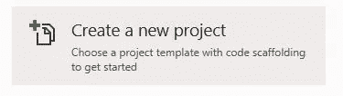
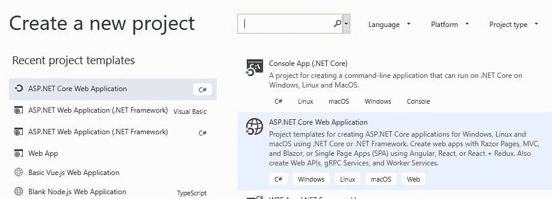
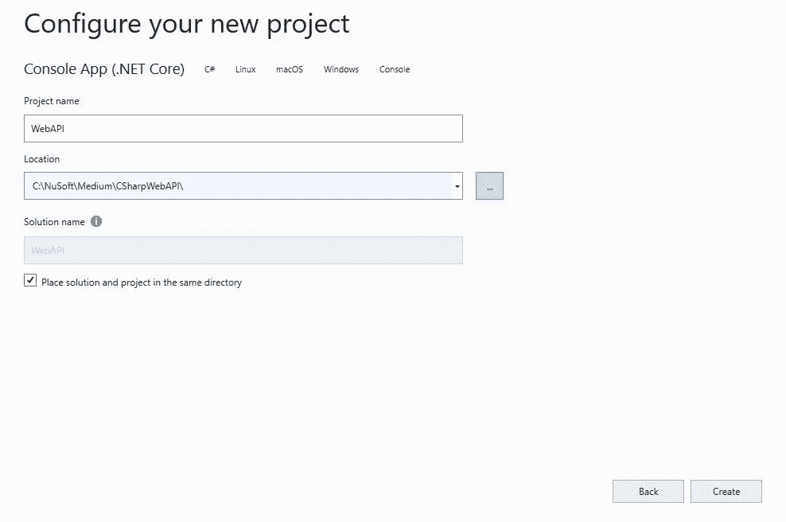
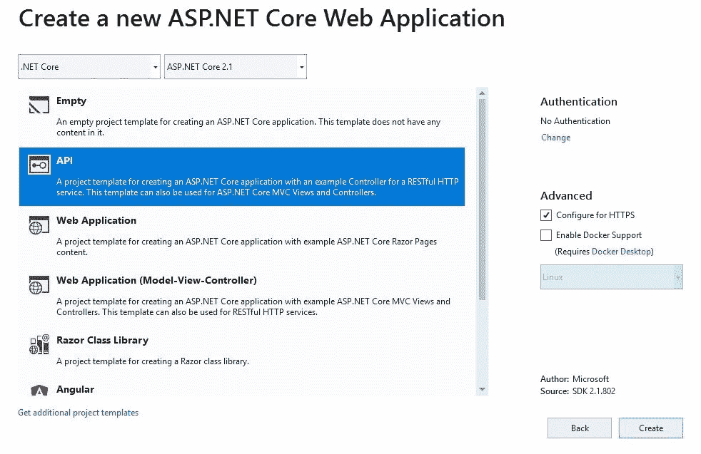
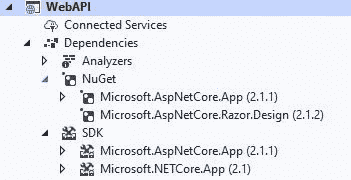
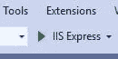
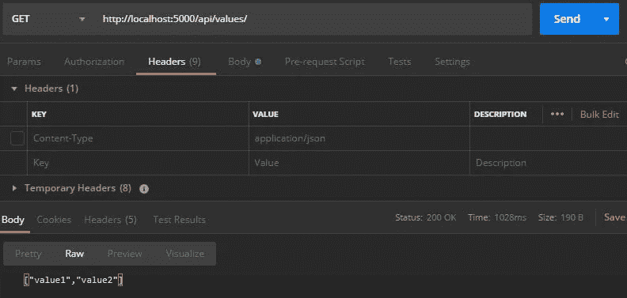
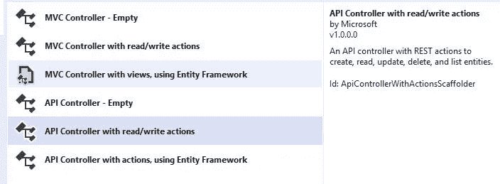
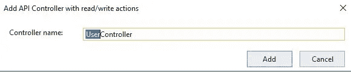
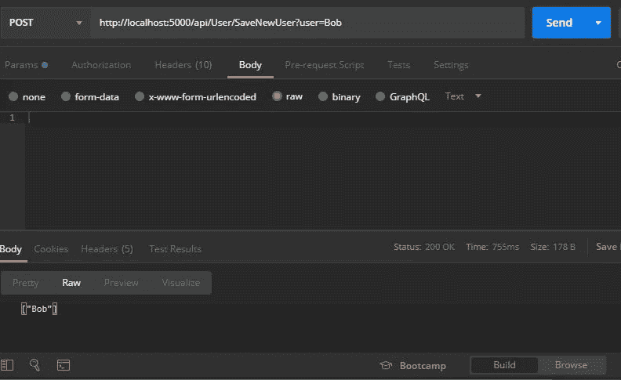

# 创建 ASP.NET 核心(RESTful) Web API

> 原文：<https://levelup.gitconnected.com/creating-an-asp-net-core-restful-web-api-62b3a5a90ba5>

## Web API 入门

## 探索 HTTP 动词并执行 CRUD 操作


[泽通李](https://unsplash.com/@zetong?utm_source=medium&utm_medium=referral)在 [Unsplash](https://unsplash.com?utm_source=medium&utm_medium=referral) 上的照片

在这篇文章/教程中，我们将重点关注使用 Visual Studio 2019 和 ASP.NET 核心来创建 RESTful Web API。我们先来了解或者回忆一下什么是 API，什么是 Web API。

## [一个 API](https://en.wikipedia.org/wiki/Application_programming_interface)

> **应用编程接口** ( **API** )是[接口](https://en.wikipedia.org/wiki/Interface_(computing))或[通信协议](https://en.wikipedia.org/wiki/Communication_protocol)在[计算机程序](https://en.wikipedia.org/wiki/Computer_program)的不同部分之间，旨在简化软件的实现和维护。API 可以用于基于网络的系统、[操作系统](https://en.wikipedia.org/wiki/Operating_system)、[数据库系统](https://en.wikipedia.org/wiki/Database_system)、计算机硬件或[软件库](https://en.wikipedia.org/wiki/Library_(computing))。

## [一个 Web API](https://en.wikipedia.org/wiki/Application_programming_interface#Web_APIs)

> 当在 [web 开发](https://en.wikipedia.org/wiki/Web_development_tools)的环境中使用时，API 通常被定义为一组规范，例如[超文本传输协议](https://en.wikipedia.org/wiki/Hypertext_Transfer_Protocol) (HTTP)请求消息，以及响应消息结构的定义，通常采用可扩展标记语言( [XML](https://en.wikipedia.org/wiki/XML) )或 JavaScript 对象符号( [JSON](https://en.wikipedia.org/wiki/JSON) )格式。

这些都是非常正式的定义，但是随着本教程的学习，我们将开始理解。

对于 Web API，我们关心的是如何处理 HTTP 动词。特别是，

*   GET-用于获取(读取)数据
*   后期-用于创建新数据
*   PUT-用于更新数据
*   删除-用于删除数据

*还有其他的，但我们将重点关注这些。尤其是与 PUT 一起的是 PATCH。更新整个资源。补丁让你只更新资源的一部分。*

这些 HTTP 动词构成了 [**CRUD**](https://en.wikipedia.org/wiki/Create,_read,_update_and_delete) 操作的基础。 **C** reate， **R** ead， **U** pdate， **D** elete。数据库的常见操作。当这些都实现后，我们就创建了一个**[**RESTful**](https://en.wikipedia.org/wiki/Representational_state_transfer)**API**。**

> **当我们构建一个 Web API 时，我们正在构建一个后端组件。前端可能也是我们创建的东西，但通常另一个应用程序会消费(使用)我们的 Web API。**

# **工具**

**对于本教程，您将需要 Microsoft Visual Studio ( **而不是** Visual Studio 代码。)我推荐免费的 [Visual Studio 2019 社区版](https://visualstudio.microsoft.com/downloads/)。**

**我们还将使用免费程序 [Postman](https://www.postman.com/downloads/) 来测试我们的 Web API。Postman 允许我们使用我们需要的 HTTP 动词。邮递员是一个很棒的工具，它本身就值得一个教程。**

## **本教程的结构**

**我将本教程分为两个部分。**

*   **第 1 部分——在这里，我们从头开始(使用 Visual Studio)并使用 Visual Studio 提供的默认 HTTP 控制器(ValuesController)进行实验。我们这样做是为了了解 Web API 是如何工作的。尝试使用邮递员。**
*   **第 2 部分—在这里，我们放弃使用 ValuesController，创建我们自己的控制器 UserController，通过构建我们自己的路由和 HTTP 处理程序来处理 GET、POST、PUT、DELETE 四个主要 HTTP 操作，以执行 [CRUD](https://en.wikipedia.org/wiki/Create,_read,_update_and_delete) 操作。再次测试邮递员。**

**如果你是 Web APIs 的新手，我建议你仔细阅读、分析和试验第一部分和第二部分的代码。如果你了解 Web API 的基础知识，请随意跳到第 2 节，并从第 1 节获取相关信息。**

# **第一节**

1.  **启动 Visual Studio 并点击**创建一个新项目****

****

**2.现在，我们将在左侧和右侧选择项目类型。我们想要的是一个【ASP.NET 核心网络应用。*如果你阅读右边的描述，你会看到“创建 Web API”***

****

**项目的类型。ASP.NET 核心网络应用**

**3.点击**下一步**，输入项目的**名称**和项目的**位置**。我给我的名字是 **WebAPI** 。完成后点击**创建**。**

****

**创建项目。如所愿命名，如所愿定位。**

**4.最后，我们从两个选项中选择一个，API，如下图所示，或者 Web 应用程序(模型-视图-控制器。)两者都能够创建 RESTful HTTP 服务。选择 API 将为我们提供一个带有一些 HTTP 方法的启动文件(ValuesController)。如果我们选择 MVC 选项，我们将有一些“视图”组件允许我们与前端一起工作。由于我们只想要一个后端 API，**我们将选择 API** 。然后点击**创建**。**

****

**在**解决方案浏览器**中的**依赖项**下，可能需要一段时间来获取 NuGet 包，但是它们会显示出来。我们应该有，**

****

**属国**

**接下来，我们将检查核心文件 **ValuesController.cs** ，我们将在其中完成大部分工作。**

**在解决方案浏览器中，找到并展开**控制器**文件夹。打开 **ValueController.cs.** 这个文件会有一些我们可以选择使用或者不使用的预置方法。我们将对该文件进行修改，但我们实际上可以立即使用它。注意我下面对前几个的评论。**

```
namespace WebAPI.Controllers
{
    [Route("api/[controller]")]**// This defines the route to our methods.[controller] is the name
// of our controller file, Values**Controller **// without the word controller.
// In this case "values"
// For example,** [***http://localhost:1234/api/values/MethodToRun***](http://localhost:1234/api/values/MethodToRun)[ApiController]
    public class ValuesController : ControllerBase
    {
        // GET api/values
        **[HttpGet]** 

        **// This is the *default* GET (fetch). If a consumer
        // just typed** [***http://localhost:port/api/values/***](http://localhost:port/api/values/) **// with no method name, this would be run**public ActionResult<IEnumerable<string>> **Get()**
        {
            return new string[] { "value1", "value2" };
        }// GET api/values/5
        [HttpGet("{id}")] **// This is a default GET when a parameter is supplied
        // If the user typed 
        //** [***http://localhost:port/api/values/somenumber***](http://localhost:port/api/values/somenumber) **// This would be run**public ActionResult<string> **Get(int id)**
        {
            return "value";
        }// POST api/values
        [HttpPost]
        public void Post([FromBody] string value)
        {
        }// PUT api/values/5
        [HttpPut("{id}")]

        public void Put(int id, [FromBody] string value)
        {
        }// DELETE api/values/5
        [HttpDelete("{id}")]
        public void Delete(int id)
        {
        }
    }
}
```

**在我们测试这个(来自 Postman)之前，我们需要对 **launchSettings.json f** 文件做一些调整。**

**在这个解决方案浏览器中，找到**属性**并打开 **launchSettings.json****

*   **我们将关闭 ssl (https)支持。**
*   **将我们的本地端口设置为 5000(您可以选择另一个端口。)**
*   **告诉它不要启动浏览器(launchBrowser)。我们的只是后端。**

**如下修改您的文件:**

```
{
  "$schema": "[http://json.schemastore.org/launchsettings.json](http://json.schemastore.org/launchsettings.json)",
  "iisSettings": {
    "windowsAuthentication": false, 
    "anonymousAuthentication": true, 
    "iisExpress": {
      "applicationUrl": **"**[**http://localhost:5000**](http://localhost:5000)**", ** **// Use port 5000**
      "sslPort": **0  //44363 - remove https for testing**
    }
  },
  "profiles": {
    "IIS Express": {
      "commandName": "IISExpress",
      "launchBrowser": **false,     // Keep browser from running**
      "launchUrl": "api/values",
      "environmentVariables": {
        "ASPNETCORE_ENVIRONMENT": "Development"
      }
    },
    "WebAPI": {
      "commandName": "Project",
      "launchBrowser": **false, // Keep browser from running**
      "launchUrl": "api/values",
      "applicationUrl": **"**[**http://localhost:5000**](http://localhost:5000)**",**
      "environmentVariables": {
        "ASPNETCORE_ENVIRONMENT": "Development"
      }
    }
  }
}
```

****试试看****

1.  **点击下面的“运行”按钮，选择**调试/开始调试**或点击 **F5** ，运行您的解决方案。**

****

**运行/F5 工具**

**你应该看不到任何东西，因为我们告诉它不要启动浏览器。这是所希望的。它运行在**本地主机端口 5000** 上。**

**2.启动**邮递员**。在 HTTP 动词的下拉菜单中选择 **GET** 并在其旁边键入，**

```
[http://localhost:5000/api/values/](http://localhost:5000/api/values/)
```

**你能猜到这会有什么作用吗？由于没有指定方法，它将运行默认的 Get 方法。回头看看我们的代码，可以看到它返回了一个字符串数组{"value1 "，" value2" }。点击 Postman 中的**发送**按钮，您将看到 Postman 底部**正文**部分的值。**

****

**访问默认 Get**

**为了好玩，让我们在应用程序中做一些简单的更改。**

1.  **通过选择**调试/停止调试**或 **SHIFT+F5** 来停止服务器。**
2.  **按如下方式修改 ValuesController.cs。**

```
[HttpGet] 
public ActionResult<IEnumerable<string>> Get()
{
    ** return new string[] { "Bob" };**
}// GET api/values/5
[HttpGet("{id}")]
public ActionResult<string> Get(int **id**)
{
     **return "You wanted the user with Id " + id;**
}
```

**3.运行您的解决方案并尝试以下邮递员 **GET** 调用。看身体结果。**

```
http://localhost:5000/api/values/
```

**return: ["Bob"]。**

```
http://localhost:5000/api/values/2
```

**return: **您想要 Id 为 2 的用户****

> **相当酷。您现在有了(非常简单的)Web API。**

# **第二节**

## **创造你自己的路线和方法——更进一步**

**ValuesController 没有任何问题。它给了我们探索 Web API 的能力。然而，是时候让事情更上一层楼了，**

*   **创造我们自己的控制器**
*   **定义到我们自己的方法的路线，以执行 GET/POST/PUT/DELETE**

***这样做会让我们对 Web API 的功能有更多的控制。虽然我们不会连接到实际的数据库，但是我们将通过使用 ArrayList 执行 CRUD 操作，并从 ArrayList 中添加(创建)、获取(读取)、更新(更新)和删除(删除)用户。***

***我们将实现两个 GET 操作。一个获取所有用户，一个获取特定用户。***

## **添加我们自己的控制器**

1.  **在解决方案浏览器中，右击**控制器**文件夹并选择**添加/控制器**。**
2.  **选择具有读/写动作的 **API 控制器。尽管我们会用自己的动作替换默认动作。注意右边对休息动作的描述。这是我们想要的，但是我们想要创建自己的方法。****

****

**REST API 控制器**

**3.将其命名为 **UserController** 。这将创建 UserController.cs**

****

**HTTP 控制器**

**这很像默认的 ValuesController，我们可以修改它，但是我希望我们知道如何创建一个控制器并修改它。**

**4.在我们更改 UserController 之前，让我们对位于解决方案浏览器的**属性**部分的 **launchSettings.json** 进行更改。在这里，我们将删除或注释掉默认的 **launchUrl** 。我们不想要也不需要它。如下修改这个文件(我删除了 launchUrl)，**

```
{
  "$schema": "[http://json.schemastore.org/launchsettings.json](http://json.schemastore.org/launchsettings.json)",
  "iisSettings": {
    "windowsAuthentication": false, 
    "anonymousAuthentication": true, 
    "iisExpress": {
      "applicationUrl": "[http://localhost:5000](http://localhost:5000)",  // Use port 5000
      "sslPort": 0  //44363 - remove https for testing
    }
  },
  "profiles": {
    "IIS Express": {
      "commandName": "IISExpress",
      "launchBrowser": false,     // Keep browser from running
      "environmentVariables": {
        "ASPNETCORE_ENVIRONMENT": "Development"
      }
    },
    "WebAPI": {
      "commandName": "Project",
      "launchBrowser": false, // Keep browser from running
      "applicationUrl": "[http://localhost:5000](http://localhost:5000)",
      "environmentVariables": {
        "ASPNETCORE_ENVIRONMENT": "Development"
      }
    }
  }
}
```

**5.现在打开 **UserController.cs** 。我们将使用一个**数组列表**来存储用户名，这将是我们用于 CRUD 操作的虚拟数据库。我们需要在顶部添加一个“using”语句来访问 ArrayList 集合。添加以下内容，**

```
using System.Collections;
```

**我们希望 UserController.cs 顶部的“using”语句如下所示:**

```
using System;
using System.Collections.Generic;
using System.Linq;
using System.Threading.Tasks;
using Microsoft.AspNetCore.Mvc;
**using System.Collections;   // Gives us access to ArrayList**
```

## **添加我们自己的方法**

**我们将向 UserController.cs 添加以下方法。**

*   ****GetAllUsers** —获取所有用户的列表。这是一个 HTTP **GET** 。**
*   ****GetUser** —根据 id 获取特定用户。这将是一个 HTTP **GET** 。**
*   ****SaveNewUser** —将用户添加到我们的集合(ArrayList，虚构的数据库。)这是一篇 HTTP **的帖子**。**
*   ****UpdateUser** —更新数组列表中位置 id 处的用户。这将是一个 HTTP **PUT** 。**
*   **DeleteUser —从我们的数组列表中删除一个用户。这将是一个 HTTP **删除**。**

*****注意*** *:出于测试目的，我们会在每次操作后返回 ArrayList。你会注意到大多数方法的返回数据类型是 ArrayList。这并不典型。通常，返回的数据是成功或失败的指示器。参见* [*HTTP 响应*](https://www.restapitutorial.com/httpstatuscodes.html) *了解更多信息。***

**除了创建处理操作的方法之外，我们还需要指定到方法处理程序的路由。**

## **语法和用法信息**

**我们会有一个主路由，**【路由(" api/User ")】。**因此消费者必须发送给[http://localhost:5000/API/User。](http://localhost:5000/api/User.)但是我们还有到处理程序的子路由，例如**【Route(" get allusers ")】**。消费者将调用[http://localhost:5000/API/User/get allusers](http://localhost:5000/api/User.)。当消费者输入时，我们的 Web API 将遵循该路线并调用 GetAllUsers 方法。**

**6.将您的 **UserController.cs** 替换为以下内容(或者修改它。)请注意以粗体显示的项目。**

```
using System;
using System.Collections.Generic;
using System.Linq;
using System.Threading.Tasks;
using Microsoft.AspNetCore.Mvc;
**using System.Collections;   // Gives us access to ArrayList**namespace WebAPI.Controllers
{
    **[Route("api/User")]// User because it is User**Controller
    [ApiController]public class UserController : ControllerBase
    {
        // Our fictitious database of User's. User Names
       ** public static ArrayList UserData = new ArrayList();**[HttpGet]
       ** [Route("GetAllUsers")]**
        public ArrayList **GetAllUsers**()
        {
            // Return all Users
           ** return UserData;**
        }[HttpGet]
       ** [Route("GetUser")]**
        public string **GetUser**(int id)
        {
            // Return a specific user
           ** return UserData[id].ToString();**
        }[HttpPost]
        **[Route("SaveNewUser")]**
        public ArrayList **SaveNewUser**([FromQuery]string user)
        {
            //Add a New user
           ** UserData.Add(user);**
            // Normally send a code such as 200-OK
            // This is for ease of verification
           **return UserData;** 
        }[HttpPut]
       ** [Route("UpdateUser")]**
        public ArrayList **UpdateUser**(int id, [FromQuery]string user)
        {
            // Update User at location specified by id
           ** UserData[id] = user;**
            // Normally send a code such as 200-OK
            // This is for ease of verification
           ** return UserData;**
        }[HttpDelete]
        **[Route("DeleteUser")]**
        public ArrayList **DeleteUser**(int id)
        {
            // Delete user at position id
           ** UserData.RemoveAt(id);**
           ** return UserData;**
        }
    }
}
```

## **试运转**

**运行您的解决方案。开放邮差。我们将从添加一些用户开始，然后测试每种方法。如果你看看你的代码，你会看到我们已经使用了 **id** 和**用户**作为我们的各种参数。**

1.  **在邮差里，选择 HTTP **帖子**，在那下面选择**正文**并选择 **raw** 。我们正在发送一个原始的查询字符串。然后打字，**

```
http://localhost:5000/api/User/SaveNewUser?user=Bob
```

**点击**发送**，你应该会在底部看到一个带有“Bob”、[“Bob”]的数组。**

****

**用查询字符串保存新用户**

****对卡罗尔、泰德和爱丽丝重复上述步骤，以获得****

**[“鲍勃”、“卡罗尔”、“特德”、“爱丽丝”]**

**2.在 Postman 中选择 HTTP **GET** 并输入，**

```
http://localhost:5000/api/User/GetAllUsers
```

**return: ["Bob "，" Carol "，" Ted "，" Alice"]**

**3.尝试使用 **GetUser** 获取单个用户。选择 HTTP **GET** 并键入，**

```
http://localhost:5000/api/User/GetUser?id=2
```

**return: Ted ( *这个方法返回一个字符串，而不是一个数组列表*)**

**4.尝试使用 **UpdateUser** 更新一个用户(在我们的例子中是更改他们的名字),**

```
http://localhost:5000/api/User/UpdateUser?id=0&user=Robert
```

**return: ["罗伯特"，"卡罗尔"，"泰德"，"爱丽丝"]**

**5.尝试使用 HTTP 类型使用 **DeleteUser** 删除用户，**

```
http://localhost:5000/api/User/DeleteUser?id=1
```

**return: ["罗伯特"，"泰德"，"爱丽丝"]**

****就是这样！****

# **结论**

**事实并非如此。还有更多需要学习和探索，但这是一个很好的基础。**

**这给了我们一个 RESTful Web API 的基础。使用。NET Core *和真正的任何 Web API* 。它们基本上都是一样的。它们使用 HTTP GET、POST、PUT、DELETE 等来执行操作。**

**请关注我，关注关于使用 **node.js** 、 **AWS Lambda** 构建 RESTful Web API 的文章，以及将它们连接到实际数据库和处理更复杂数据的文章。**

**同时，我鼓励您阅读更多关于 RESTful Web APIs 的内容，并尝试这个应用程序。**

****感谢阅读，继续学习！****

**在 Medium 上阅读所有你想要的文章，并通过成为 Medium 会员来帮助我继续写作，每月只需 5 美元。**

**[](https://bobtomlin-70659.medium.com/membership) [## 通过我的推荐链接加入灵媒——重力井(罗伯·汤姆林)

### 作为一个媒体会员，你的会员费的一部分会给你阅读的作家，你可以完全接触到每一个故事…

bobtomlin-70659.medium.com](https://bobtomlin-70659.medium.com/membership)**