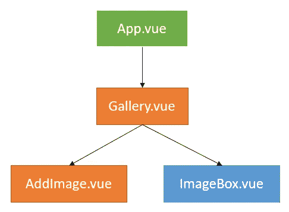

# 用 Vue.js 创建电子商务前端

> 原文：<https://levelup.gitconnected.com/creating-an-e-commerce-frontend-with-vue-js-631870bbae4>

## 第 3 部分:显示所有图片并上传新图片的图库


乔·杜德克在 [Unsplash](https://unsplash.com?utm_source=medium&utm_medium=referral) 上的照片

# 介绍

图像是任何电子商务业务中非常重要的一部分。产品图片是最先抓住顾客注意力的东西。我们正在从头开始创建一个[电子商务应用](http://remotedevs.org:8000/)。

我们有一系列的教程解释它的不同方面，现在是时候设计一个图片库了。我们的图像库将显示所有产品和类别的图像，并为我们提供添加新图像的功能。我们之前使用 Vue.js 创建了产品和类别显示页面。

[](https://medium.com/javascript-in-plain-english/lets-link-product-with-category-for-our-ecommerce-app-28100657a848) [## 让我们创建一个 Vue.js 电子商务应用程序

### 我们将创建一个 Vue.js 应用程序来显示我们的产品和类别。

medium.com](https://medium.com/javascript-in-plain-english/lets-link-product-with-category-for-our-ecommerce-app-28100657a848) 

# 演示

为了更好地理解我们将要做的事情，快速浏览一下我们的 web 应用程序。

 [## Webtutsplus 电子商务应用程序

### 编辑描述

remotedevs.org](http://remotedevs.org:8000/admin/gallery) 

我们的应用程序前端的存储库可以在[这里](https://github.com/webtutsplus/ecommerce-vuejs)找到。

# 先决条件

1.  JavaScript 和 Vue.js 框架基础知识
2.  代码编辑器(类似于 VS 代码)
3.  浏览器(如谷歌浏览器)

本教程是我们系列的一部分——[**前端与 Vue.js/JavaScript**](https://nilmadhab.medium.com/)**。**我们将**扩展我们在本系列之前的教程**中开发的代码。所以，如果你对我们之前开发的东西有任何疑问，你可以参考我们之前的教程。

# 项目结构

如果你没有看过我们的**前端 with Vue.js** 系列之前的教程，不用担心。这部分是专门为你准备的。我们将使用我们在以前的教程中创建的项目结构，所以在添加我们的图库功能之前，让我们先看一下它。这将有助于你更好地理解代码库。

我们应用程序的项目结构:


项目结构

*   **public** —包含我们项目的主 HTML 文件
*   **src/assets** —存储图像、徽标等媒体文件。
*   src/components —存储我们项目的所有可重用组件。这些组件并不是某些特定路线所独有的。
*   **src/router**——包含 index.js 文件，该文件记录了所有路由
*   **src/views** —存储所有路由器组件。这些是按照当前路线渲染的组件。

除此之外，我们还有一些重要的文件

*   App.vue —它是我们项目的根组件
*   **main.js** —是我们项目的起点。这里我们导入我们的根组件 **App.vue** ，我们的路由器文件 **index.js** 和 **createApp** 方法。然后，我们将根组件挂载到 DOM。

# API 设计

我们有[这个](https://medium.com/javarevisited/how-to-develop-file-upload-service-from-scratch-using-java-and-springboot-3a442f4636d5)教程解释我们如何创建我们的文件上传 API。使用下面的链接看看我们的应用程序的后端 API。

 [## Swagger UI

### 后端 API

remotedevs.org](http://remotedevs.org:8080/api/swagger-ui.html#/) 

这里使用的 [Swagger UI](https://swagger.io/tools/swagger-ui/) 允许可视化 API 及其端点。

在本教程中，我们将与以下端点进行交互。


用于处理图像的 API 端点

当我们发出 GET 请求从 API 获取图像时，我们的响应对象将数据存储为一个对象数组，每个对象描述一个单独的图像。GET 请求的响应如下所示

```
[
 {
    name: "89516583-5247-42ba-be4f-ae9435e73421.jpg",
    url: "http://remotedevs.org:8080/api/fileUpload/files/89516583-           5247-42ba-be4f-ae9435e73421.jpg"
 },
 {
    name: "89516583-5247-42ba-be4f-ae9435e73421.jpg",
    url: "http://remotedevs.org:8080/api/fileUpload/files/89516583- 5247-42ba-be4f-ae9435e73421.jpg"
 }
]
```

当我们上传图片时，我们必须发送一个 **FormData** 对象作为 POST 请求的主体。这个 **FormData** 对象应该有一个名为 *file* 的键，其值应该是要上传的图像文件。

我们后端 API 的基本 URL 是

```
http://remotedevs.org:8080/api/
```

这个 URL 存储在每个组件的`baseURL`数据字段中。例如，为了从我们的后端 API 获取所有文件，我们将把我们的请求发送到

```
this.baseURL + "fileUpload/"
```

# 让我们开始吧

如果你熟悉使用 Vue.js 或其他前端框架，你会意识到我们使用组件一点一点地制作我们的应用程序。为了更好地理解不同组件之间的交互，我们首先设计一个组件树。因此，我们的图库的组件树如下所示:



绿框代表我们应用程序的根组件。橙色框是路由器视图组件，与一些预定义的路由相关联。蓝色的`ImageBox`组件表示一个可重用的组件。


路由器视图

*   app . vue——它是我们应用程序的根组件。在`App.vue`中，我们使用了基于 URL 路径呈现组件的路由器视图标签。
*   **Gallery.vue** -这是一个路由器视图组件。在这里，我们显示我们所有的图像，并提供一个按钮到`AddImage`组件。
*   **AddImage.vue** -它也是一个路由器视图组件。它为我们提供了上传新图像的功能。
*   ImageBox.vue -这是一个可重用的组件，为我们所有的图像渲染。

所以现在，我们有两条新路线添加到我们的 **index.js 文件**中。

```
{
  path : '/admin/gallery',
  name : 'Gallery',
  component : Gallery
},
{
  path : '/admin/gallery/add',
  name : 'AddImage',
  component : AddImage 
}
```

# 画廊组件

让我们开始处理*图库*组件，首先我们为`AddImage`路由器视图提供一个按钮。我们将这个按钮放在由 [Vue 路由器](https://v3.vuejs.org/guide/routing.html#official-router)提供的`router-link`标签上。接下来，我们必须显示应用程序的所有图像。为此，我们首先必须向后端 API 发送一个请求来获取所有图像。

## 获取我们的图像📷

在之前的教程中，我们使用了[获取 API](https://developer.mozilla.org/en-US/docs/Web/API/Fetch_API) 来发出 HTTP 请求。但是现在我们将使用 [Axios](https://www.npmjs.com/package/axios) HTTP 客户端。它为我们提供了 Fetch API 上的一些附加特性，包括 JSON 数据的自动转换。还记得在 Fetch API 中，我们必须在响应中使用异步的 **json()** 方法来获取 json 数据。

我们在组件的`data()`方法中有一个数据字段`images`。这里声明的数据字段可以在组件的模板中使用。这个`images`字段将存储我们所有的图像。在开始创建我们的组件时，该字段被设置为`null`。获取图像后，我们会将它们存储在该数据字段中。因此，让我们看看如何使用 Axios 发出 HTTP 请求。

```
axios({
   method : "get",
   url : this.baseURL + "fileUpload/"
})
.then(res => this.images = res.data)
.catch(err => console.log(err));
```

我们必须调用 Axios 方法，并传递一个描述请求配置的对象。这里我们提到了请求方法、URL、头、参数、需要发送的数据等细节。为了我们的方便，Axios 也提供了一种微型方式来实现相同的任务。

```
axios.get(this.baseURL + "fileUpload/")
.then(res => this.images = res.data)
.catch(err => console.log(err));
```

发送 HTTP 请求是一个异步任务，因此 axios 方法返回一个[承诺](https://developer.mozilla.org/en-US/docs/Web/JavaScript/Reference/Global_Objects/Promise)。一旦承诺得到解决，我们的服务器做出适当的响应，发送给`then`方法的[回调](https://developer.mozilla.org/en-US/docs/Glossary/Callback_function)就会被执行。这个回调获取响应对象作为参数。如前所述，Axios 客户端自动转换 JSON 数据，然后存储在`res.data`中。在我们的例子中，`res.data`是一个数组，它存储了描述一个图像的`name`和`url`的多个对象。

当我们没有得到 *OK* 状态的响应或者在发出请求时出现错误时，就会调用`catch`方法。

现在我们可以显示我们的图像了。在组件的`template`中，我们将使用`v-for`指令遍历所有图像。对于 images 数组中的每个对象，我们调用`ImageBox`组件，将对象作为[属性](https://v3.vuejs.org/guide/component-props.html#props)传递。`ImageBox`组件将负责显示图像。

我们现在已经完成了我们的`Gallery.vue`组件。让我们看一下我们的档案。

注意，我们的 [**挂载的**](https://v3.vuejs.org/api/options-lifecycle-hooks.html#mounted) 生命周期钩子的前几行与用户认证相关。访问画廊页面和上传图像的能力是管理员独有的功能。因此，如果我们没有找到与管理员用户相关联的唯一令牌，这意味着该用户没有登录，我们重定向到**登录**页面。

为了更好地理解身份验证是如何工作的，请看一下介绍其实现的教程。

[](https://medium.com/javascript-in-plain-english/creating-an-ecommerce-frontend-with-vue-js-c64481a65941) [## 用 Vue.js 创建电子商务前端

### 第 2 部分:电子商务应用程序的注册和登录

medium.com](https://medium.com/javascript-in-plain-english/creating-an-ecommerce-frontend-with-vue-js-c64481a65941) 

另外，请注意，我已经编写了代码，用于在专用方法 **fetchData** 中发出 HTTP 请求，并从挂载的生命周期钩子中调用它。这样，如果需要的话，我们可以重用这些代码。


# ImageBox 组件

组件`ImageBox`从其父组件`Gallery`接收一个图像作为道具。`ImageBox`只是显示图像。我们还在图像上添加了一个按钮，将图像地址复制到我们的剪贴板中。只有当我们将鼠标悬停在图像上时，此按钮才可见。

我们还使用了 [**Sweetalert**](https://sweetalert.js.org/) 库来替换 JavaScript 的**“alert”**。这个库为我们提供了一些很酷的可定制的提醒。一旦用户点击*复制地址*按钮，就会调用一个方法来处理这个操作。完成后，我们会显示一个 *sweetalert* 来传达同样的信息。要在您的 Vue 项目中安装 *Sweetalert* ，请运行以下命令:

```
npm i sweetalert
```

之后在 **main.js** 文件中添加它的导入语句

```
*import* swal *from* 'sweetalert'
```

现在我们可以访问`swal()`方法，它的工作方式类似于 JavaScript 提供的`alert()`方法。这个`swal()`方法接受一个描述我们的 sweetalert 的对象。

```
swal({
  text: "Image Address copied to Clipboard!",
  icon: "success",
  closeOnClickOutside: false
});
```

但是我们如何执行复制到剪贴板的操作呢？要将一些文本复制到我们的剪贴板，我们要做的第一件事就是选择文本。然后我们执行复制操作(Ctrl+C)。

在我们的案例中，我们遵循的过程也是类似的。首先，我们创建一个 HTML `textarea`元素。我们将它的值设置为图像的来源。一旦我们创建了元素，我们就把它附加到 DOM 的某个远程位置(这样它就被隐藏了)。然后我们使用`select()`方法选择这个元素的文本，并执行`document.execCommand(‘copy’)`命令。我们现在可以从 DOM 中移除`textarea`元素。我们完了。


无悬停和有悬停

复制图像地址

# AddImage 组件

`AddImage`组件是一个路由器视图组件。它让我们上传一张新的图像到我们的数据库。这里我们使用了带有类型 [**文件**](https://developer.mozilla.org/en-US/docs/Web/HTML/Element/input/file) **，**的输入标签，这让我们可以从本地设备中选择一个文件。


我们还声明了一个数据字段 **selectedFile** ，用于存储我们选择的文件。然后我们将`@change`事件监听器附加到我们的输入标签上。每当用户选择文件时，无论是第一次还是之后发生更改，都会触发该事件。当这个事件发生时，我们调用方法 **onFileSelected** 。该方法接收**事件**对象作为参数。这个事件对象存储我们选择的文件的细节。用户选择的所有文件都存储在`event.target.files`中，它是一个 [**文件列表**](https://developer.mozilla.org/en-US/docs/Web/API/FileList) 对象。该对象中存储的每一项都是 [**文件**](https://developer.mozilla.org/en-US/docs/Web/API/File) 类型。最近选择的文件存储在`event.target.files[0]`中。因此，每次用户更新文件时，我们都会在我们的 **selectedFile** 数据字段中反映这些变化。

现在当用户点击*上传* 按钮时，我们调用 **onUpload** 方法。这个方法向我们的后端 API 发出 POST 请求来添加我们的文件。我们使用了一些 if 块来验证用户已经选择了一个文件，并且它是 **image/jpeg** 类型。


文件上传 API 端点

要发送我们的文件，我们必须用一个 [**FormData**](https://developer.mozilla.org/en-US/docs/Web/API/FormData) 对象来包装它。FormData 对象使用表示字段及其值的键值对来表示 HTML 表单数据。我们的 API 端点需要一个 FormData 对象，其文件参数设置为**文件**。因此，一旦我们创建了 FormData 对象，我们就必须将我们的文件附加到它上面。然后，我们使用 axios 方法发出 POST 请求。


# 恭喜你！！

恭喜🎉你已经坚持到了教程的最后。现在我们有了功能齐全的图片库。

# 建议的 PRs

如果您想为我们的应用前端做出贡献，克隆我们的[库](https://github.com/webtutsplus/ecommerce-vuejs)并尝试以下功能

*   每张图片都有一个从数据库中删除的选项

实现该功能后，请将您的 PR 发送给我们。我们将对其进行审查，并将其合并到我们的主分支中。万事如意！

# 资源

*   Vue . js 3:Vue 3 的官方文档
*   [前端代码](https://github.com/webtutsplus/ecommerce-vuejs):前端代码库的 Github repo
*   [后端 API 仓库](https://github.com/webtutsplus/ecommerce-backend):后端 API 代码库的 Github repo
*   API 的 Swagger-UI:在这里可视化 API
*   [Sweetalert](https://sweetalert.js.org/) :用于定制提醒

## 感谢您的阅读📙😊