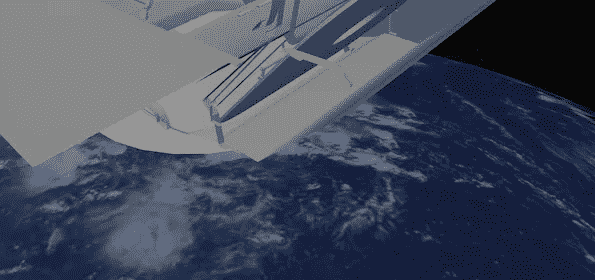
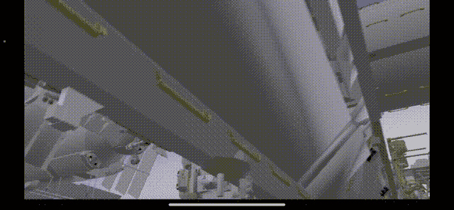

# 创建一个 iOS AR 应用程序，绕着国际空间站(ISS)行走

> 原文：<https://levelup.gitconnected.com/creating-an-ios-ar-app-to-walk-around-the-international-space-station-iss-5a1346633ca3>

使用 iOS SDK - ARKit 和 RealityKit，只需几行代码，就可以使用增强现实(AR)来提供在封闭空间中的建筑物周围行走的体验。本文解释了如何创建一个允许用户在国际空间站(ISS)自由走动的应用程序。

# 机制

准备了 ISS(单元的一部分)的现实比例 3D 模型，并且通过将启动 AR 体验的用户设备的位置与 ISS 模型的走廊对准来创建虚拟空间。通过这种方式，不同身高的成人和儿童可以以自然的姿势在走廊中行走，这要归功于根据启动 AR 体验的设备的位置创建的虚拟空间。

国际空间站被一个球体包围，球体的内表面贴有外层空间的图像，这样就可以从国际空间站的窗口看到它。地球模型是通过将地球表面的图像粘贴到另一个球形模型上而创建的。在 AR 体验中，用户可以在虚拟空间中自由移动，从而可以在走出 ISS 时查看太空和地球。

# 创建 3D 场景

国际空间站的 3D 模型数据由美国宇航局提供。太空和地球的纹理图像由太阳系观测仪提供。其他等效图像也是可以接受的。

*   NASA - ISS 内部:[https://nasa3d.arc.nasa.gov/detail/iss-internal](https://nasa3d.arc.nasa.gov/detail/iss-internal)
*   太阳系范围:【https://www.solarsystemscope.com/textures/ 

使用数字内容创建(DCC)工具(如 Blender)创建 3D 场景，将一些 ISS 单元调整为真实比例(约 30 x 30 x 12 米)，并将走道的中心与原点对齐，以便用户可以从适当的位置开始 AR 体验。
地球是在半径约为 50 米的球体上拉伸地球表面纹理而生成的，放置在(0.0，0.0，-60.0)[米]。你会看到你脚下的土地。
在半径约 110 m 的球体内表面拉伸空间纹理，放置在(0.0，0.0，0.0)[米]处，创建空间。国际空间站和地球将被包围。

导出创建的 3D 模型，并使用 Reality Converter 将其转换为 USDZ。在 Blender 的情况下，将其导出为 glTF 格式并转换为 USDZ。

# 创建 AR iOS 应用程序

创建一个 AR 应用程序，使用您创建的 3D 模型提供 AR 体验。

*   iOS 部署目标:14.0
*   Xcode 13.2

将 USDZ 文件添加到您的 Xcode 项目中，对 SwiftUI 使用*uivierepresentable*。在原点创建一个 AR 锚点，从 USDZ 文件加载模型数据以创建一个虚拟场景，并将其添加到锚点。运行 AR 会话以开始 AR 体验。

# 结论

本文中描述的 Swift 代码可以在 GitHub 上获得，包括 USDZ 文件，所以可以马上试用。

 [## GitHub - ynagatomo/ARInsideISS:一个最小的 iOS AR 应用程序，可以让你走在国际…

### 一款可以让你在国际空间站漫步的 iOS AR 应用。Xcode 13.2.1 目标:iOS / iPadOS 14.0+本…

github.com](https://github.com/ynagatomo/ARInsideISS) 

添加月球、太阳、宇宙飞船等 USDZ 模型会很有趣。，并添加声音和动画，让它成为你自己的 AR 应用。

GitHub 上还提供了一个 AR 应用程序的 Swift 代码，可以从外面以真实比例查看国际空间站的外部。如果你想试试，请参考页面。

 [## GitHub-ynagatomo/ARSpaceStation:一个最小的 AR iOS 应用程序，显示国际空间站…

### 这是一个最小的 AR iOS 应用程序，以真实比例显示国际空间站(ISS)。Xcode 13.2.1 目标:iOS /…

github.com](https://github.com/ynagatomo/ARSpaceStation) 